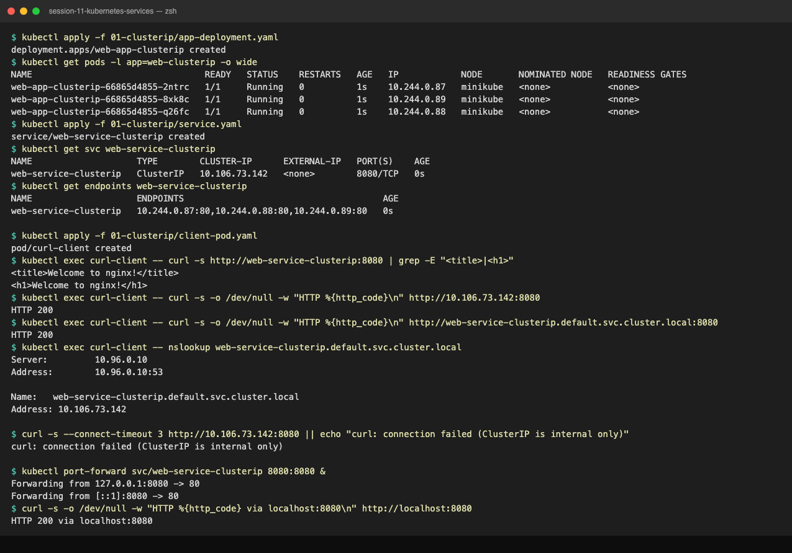

# ClusterIP Service — Internal Microservice Communication

## 1. What is a ClusterIP Service?
`ClusterIP` is the **default service type** in Kubernetes. When you create a `ClusterIP` service, Kubernetes allocates a private, stable, virtual IP address (VIP) from an internal cluster subnet (e.g., `10.96.0.0/12`). 

This virtual IP is accessible **only from within the Kubernetes cluster**. Outside users on the public internet cannot directly ping or curl this IP.

---

## 2. Why Do We Need ClusterIP? (The Problem It Solves)

### The Problem: Ephemeral Pod IPs
In Kubernetes, Pods are mortal. They crash, scale out, or get rescheduled across worker nodes. Every time a Pod restarts, it is assigned a brand-new IP address:
```text
Old Pod IP: 10.244.1.25 (Terminated)
New Pod IP: 10.244.2.80 (Started)
```
If your frontend application is configured with `http://10.244.1.25:80`, the moment that pod dies, the frontend starts throwing `Connection Refused` or `502 Bad Gateway` errors.

### The Solution: Stable Virtual IP & DNS
`ClusterIP` gives you a permanent name and IP that sits in front of all matching Pods. The frontend talks to `http://web-service-clusterip:8080`, and Kubernetes handles routing to healthy pods automatically.

```text
               +--------------------------------------+
               |          Frontend Pod / Client       |
               +--------------------------------------+
                                  |
               Requests: http://web-service-clusterip:8080
                                  |
                                  v
               +--------------------------------------+
               |         ClusterIP Service            |
               |       VIP: 10.96.150.45:8080         |
               +--------------------------------------+
                                  |
            [kube-proxy / iptables Layer 4 Load Balancing]
                                  |
       +--------------------------+--------------------------+
       |                          |                          |
       v                          v                          v
+--------------+           +--------------+           +--------------+
| Backend Pod 1|           | Backend Pod 2|           | Backend Pod 3|
| 10.244.0.12  |           | 10.244.1.18  |           | 10.244.2.33  |
|  (Port: 80)  |           |  (Port: 80)  |           |  (Port: 80)  |
+--------------+           +--------------+           +--------------+
```

---

## 3. Think of It Like This: The Office Extension Number
* Think of an office where 5 customer support agents handle billing inquiries.
* Agents rotate shifts, take lunch breaks, and switch desks.
* You do not dial an agent's personal cellphone.
* You dial the main internal billing extension `*200` (`ClusterIP`).
* The PBX phone switchboard (`kube-proxy` + `Endpoints`) routes your call to whichever agent is currently logged into their desk (`Running` + `Ready` Pod).

---

## 4. Where is ClusterIP Used in Production?
* **Microservice-to-Microservice Communication:** E.g., Payment service calling Order service.
* **Internal Databases and Caching:** PostgreSQL, MySQL, Redis, MongoDB instances running inside the cluster that should never be exposed to the public internet.
* **Internal Dashboards and Admin APIs:** Backend telemetry processors, internal metrics collectors, and logging aggregators.
* **Behind Ingress Controllers:** Ingress Controllers (like NGINX Ingress or Traefik) route external traffic into the cluster by pointing to internal `ClusterIP` services.

---

## 5. Code Manifests & Field-by-Field Breakdown

### File: `app-deployment.yaml`
```yaml
apiVersion: apps/v1
kind: Deployment
metadata:
  name: web-app-clusterip
  labels:
    app: web-clusterip
spec:
  replicas: 3
  selector:
    matchLabels:
      app: web-clusterip
  template:
    metadata:
      labels:
        app: web-clusterip
    spec:
      containers:
        - name: nginx-web
          image: nginx:1.25-alpine
          ports:
            - containerPort: 80
          resources:
            requests:
              cpu: "50m"
              memory: "64Mi"
            limits:
              cpu: "100m"
              memory: "128Mi"
```

### File: `service.yaml`
```yaml
apiVersion: v1
kind: Service
metadata:
  name: web-service-clusterip
  labels:
    app: web-clusterip
spec:
  type: ClusterIP
  selector:
    app: web-clusterip
  ports:
    - name: http
      port: 8080
      targetPort: 80
      protocol: TCP
```

### Detailed Field Explanation:
* `spec.type: ClusterIP`: Sets the service type to internal virtual IP (default if omitted).
* `spec.selector.app: web-clusterip`: Matches all pods with the label `app: web-clusterip`.
* `spec.ports[0].port: 8080`: The port exposed by the service inside the cluster (the Front Door).
* `spec.ports[0].targetPort: 80`: The port where the Nginx container is listening (the Back Door).
* `spec.ports[0].protocol: TCP`: The Layer 4 protocol (default is TCP).

---

## 6. How to Run and Deploy

### Step 1: Deploy the Backend Web Application
```bash
kubectl apply -f 01-clusterip/app-deployment.yaml
```

Verify the 3 pods are running and note their private IPs:
```bash
kubectl get pods -l app=web-clusterip -o wide
```

Expected Output:
```text
NAME                                  READY   STATUS    RESTARTS   AGE   IP            NODE
web-app-clusterip-6c679b9456-4d9vz    1/1     Running   0          18s   10.244.0.12   minikube
web-app-clusterip-6c679b9456-9k2lw    1/1     Running   0          18s   10.244.0.13   minikube
web-app-clusterip-6c679b9456-r8f5q    1/1     Running   0          18s   10.244.0.14   minikube
```

### Step 2: Deploy the ClusterIP Service
```bash
kubectl apply -f 01-clusterip/service.yaml
```

Verify the service and its allocated ClusterIP:
```bash
kubectl get svc web-service-clusterip
```

Expected Output:
```text
NAME                    TYPE        CLUSTER-IP      EXTERNAL-IP   PORT(S)    AGE
web-service-clusterip   ClusterIP   10.96.150.45    <none>        8080/TCP   10s
```

### Step 3: Inspect the Endpoints List
Verify that the Service has bound to all 3 pod IP addresses:
```bash
kubectl get endpoints web-service-clusterip
```

Expected Output:
```text
NAME                    ENDPOINTS                                           AGE
web-service-clusterip   10.244.0.12:80,10.244.0.13:80,10.244.0.14:80       25s
```

---

## 7. How to Check Website Traffic on ClusterIP

Since `ClusterIP` is only reachable from inside the cluster, there are **two ways** to test it:

### Method 1: Internal Test Pod (Production-Style Verification)
Deploy the companion test pod:
```bash
kubectl apply -f 01-clusterip/client-pod.yaml
```

Wait until running:
```bash
kubectl get pod curl-client
```

Test 1: Query by Service Name (CoreDNS resolution):
```bash
kubectl exec -it curl-client -- curl -s http://web-service-clusterip:8080
```

Test 2: Query by Service IP:
```bash
kubectl exec -it curl-client -- curl -s http://10.96.150.45:8080
```

Test 3: Query by Fully Qualified Domain Name (FQDN):
```bash
kubectl exec -it curl-client -- curl -s http://web-service-clusterip.default.svc.cluster.local:8080
```

Expected Output (Nginx HTML):
```html
<!DOCTYPE html>
<html>
<head>
<title>Welcome to nginx!</title>
...
<h1>Welcome to nginx!</h1>
<p>If you see this page, the nginx web server is successfully installed and working.</p>
...
</html>
```

### Method 2: Port-Forward to Local Browser (Developer Debugging)
To view the web page directly in your laptop's browser:
```bash
kubectl port-forward svc/web-service-clusterip 8080:8080
```

Open your browser and navigate to:
```text
http://localhost:8080
```
You will see the default NGINX welcome page running directly through your ClusterIP service.

---

## 8. Troubleshooting & Common Pitfalls

* **Empty Endpoints (`<none>`):** If `kubectl get endpoints web-service-clusterip` returns `<none>`, verify that the selector in `service.yaml` (`app: web-clusterip`) matches the pod labels in `app-deployment.yaml` (`template.metadata.labels.app: web-clusterip`).
* **Connection Refused:** Ensure `targetPort: 80` matches the port the container process is actually listening on.
* **DNS lookup fails:** Verify CoreDNS is running (`kubectl get pods -n kube-system -l k8s-app=kube-dns`).

---

## Lab Run Output (minikube v1.39.0, Kubernetes v1.37.0, docker driver on macOS)




### Step 1-3: Deployment, Service, Endpoints
```bash
kubectl apply -f 01-clusterip/app-deployment.yaml
kubectl get pods -l app=web-clusterip -o wide
kubectl apply -f 01-clusterip/service.yaml
kubectl get svc web-service-clusterip
kubectl get endpoints web-service-clusterip
```
```text
deployment.apps/web-app-clusterip created
NAME                                 READY   STATUS    RESTARTS   AGE   IP            NODE       NOMINATED NODE   READINESS GATES
web-app-clusterip-66865d4855-2ntrc   1/1     Running   0          1s    10.244.0.87   minikube   <none>           <none>
web-app-clusterip-66865d4855-8xk8c   1/1     Running   0          1s    10.244.0.89   minikube   <none>           <none>
web-app-clusterip-66865d4855-q26fc   1/1     Running   0          1s    10.244.0.88   minikube   <none>           <none>
service/web-service-clusterip created
NAME                    TYPE        CLUSTER-IP      EXTERNAL-IP   PORT(S)    AGE
web-service-clusterip   ClusterIP   10.106.73.142   <none>        8080/TCP   0s
NAME                    ENDPOINTS                                      AGE
web-service-clusterip   10.244.0.87:80,10.244.0.88:80,10.244.0.89:80   0s
```
The three ENDPOINTS are exactly the three pod IPs from `get pods -o wide`. The Service port is `8080`, the endpoint port is `80` (`targetPort`).

### Method 1: Internal test pod
```bash
kubectl apply -f 01-clusterip/client-pod.yaml
kubectl get pod curl-client
kubectl exec curl-client -- curl -s http://web-service-clusterip:8080 | grep -E "<title>|<h1>"
kubectl exec curl-client -- curl -s -o /dev/null -w "HTTP %{http_code}\n" http://10.106.73.142:8080
kubectl exec curl-client -- curl -s -o /dev/null -w "HTTP %{http_code}\n" http://web-service-clusterip.default.svc.cluster.local:8080
kubectl exec curl-client -- nslookup web-service-clusterip.default.svc.cluster.local
```
```text
pod/curl-client created
NAME          READY   STATUS    RESTARTS   AGE
curl-client   1/1     Running   0          8s
<title>Welcome to nginx!</title>
<h1>Welcome to nginx!</h1>
HTTP 200
HTTP 200
Server:		10.96.0.10
Address:	10.96.0.10:53

Name:	web-service-clusterip.default.svc.cluster.local
Address: 10.106.73.142
```
All three addressing forms (short name, ClusterIP, FQDN) reach the same VIP. `10.96.0.10` is CoreDNS (`kube-dns` service).

### ClusterIP is NOT reachable from the laptop
```bash
curl -s --connect-timeout 3 http://10.106.73.142:8080 || echo "curl: connection failed (ClusterIP is internal only)"
```
```text
curl: connection failed (ClusterIP is internal only)
```

### Method 2: Port-forward
```bash
kubectl port-forward svc/web-service-clusterip 8080:8080 &
curl -s -o /dev/null -w "HTTP %{http_code} via localhost:8080\n" http://localhost:8080
```
```text
Forwarding from 127.0.0.1:8080 -> 80
Forwarding from [::1]:8080 -> 80
HTTP 200 via localhost:8080
```
Note the forward target says `-> 80`, not `8080`: port-forward on a Service picks one backing pod and forwards straight to its `targetPort`.

### Cleanup
```text
deployment.apps "web-app-clusterip" deleted from default namespace
pod "curl-client" deleted from default namespace
service "web-service-clusterip" deleted from default namespace
```

---

## 9. Cleanup
```bash
kubectl delete -f 01-clusterip/client-pod.yaml
kubectl delete -f 01-clusterip/service.yaml
kubectl delete -f 01-clusterip/app-deployment.yaml
```
