# Session 11: Kubernetes Services, DNS & Workload Identity

**Author:** Pranay Reddy
**Course:** SST DevOps & Cloud [SWE]
**Session:** 11 (tasks given in lectures 12 and 13)
**Repository:** devops-heros / session-11-kubernetes-services
**Environment:** macOS (Apple Silicon, arm64), Docker Desktop, minikube v1.39.0, Kubernetes v1.37.0

Every output block is real output from this machine. Sub-folder READMEs contain the full walkthroughs: [01-clusterip/](01-clusterip/README.md), [02-nodeport/](02-nodeport/README.md), [03-loadbalancer/](03-loadbalancer/README.md), [04-externalname/](04-externalname/README.md), [05-headless/](05-headless/README.md), [06-no-selector/](06-no-selector/). The backend + 3 services + empty-endpoints drill is documented at the bottom.

---

## Task 1: Kubernetes Port Architecture & Clarification Drill

**Description:** Map the four port fields and the path a packet takes from a client to the container.

**Files:** all `service.yaml` / `app-deployment.yaml`

**Commands:**
```bash
kubectl explain pod.spec.containers.ports.containerPort
kubectl explain service.spec.ports.nodePort
```

**Output:**
```text
$ kubectl explain pod.spec.containers.ports.containerPort | head -12
KIND:       Pod
VERSION:    v1

FIELD: containerPort <integer>


DESCRIPTION:
    Number of port to expose on the pod's IP address. This must be a valid port
    number, 0 < x < 65536.
    


$ kubectl explain service.spec.ports.nodePort | head -14
KIND:       Service
VERSION:    v1

FIELD: nodePort <integer>


DESCRIPTION:
    The port on each node on which this service is exposed when type is NodePort
    or LoadBalancer.  Usually assigned by the system. If a value is specified,
    in-range, and not in use it will be used, otherwise the operation will fail.
    If not specified, a port will be allocated if this Service requires one.  If
    this field is specified when creating a Service which does not need it,
    creation will fail. This field will be wiped when updating a Service to no
    longer need it (e.g. changing type from NodePort to ClusterIP). More info:
Client Browser ---> [nodePort: 30080]  (Node / host IP, range 30000-32767)
                          |
                          v
                    [port: 8080]       (Service ClusterIP / VIP)
                          |
                          v
                    [targetPort: 80]   (Pod IP, pod network 10.244.x.x)
                          |
                          v
                    [containerPort: 80] (process inside the container, e.g. nginx)
```

| Field | Scope | Who uses it |
| :--- | :--- | :--- |
| `containerPort` | Pod spec, informational | Documents what the process listens on. Does not open anything. |
| `targetPort` | Service -> Pod | Port on the pod IP that kube-proxy DNATs to. Defaults to `port`. Can be a name. |
| `port` | Service ClusterIP | What other pods dial: `http://svc:port`. |
| `nodePort` | Every node IP, 30000-32767 | External clients. Only for `NodePort` and `LoadBalancer` types. |

Reading `kubectl get svc`: `80:30080/TCP` = `port:nodePort`. Reading `kubectl get endpoints`: `10.244.0.91:80` = `podIP:targetPort`.

**Screenshot:**

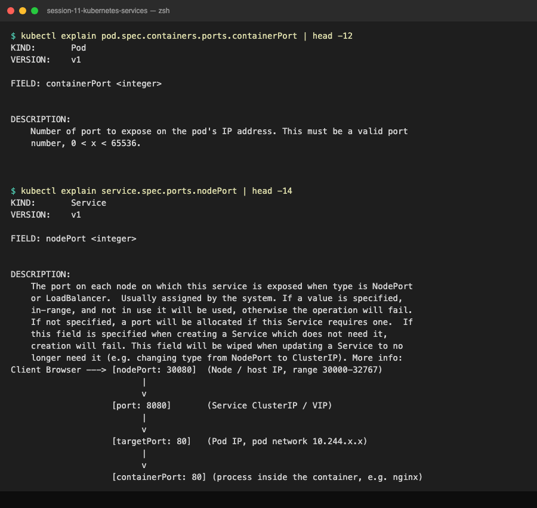

---

## Task 2: Type 1 Service: ClusterIP (Default Internal Networking)

**Description:** 3-replica backend, ClusterIP on 8080 -> 80, verify endpoints, test from a client pod by short name, VIP and FQDN.

**Files:** `01-clusterip/`

**Commands:**
```bash
kubectl apply -f 01-clusterip/app-deployment.yaml -f 01-clusterip/service.yaml
kubectl get pods -l app=web-clusterip -o wide
kubectl get svc,endpoints web-service-clusterip
kubectl apply -f 01-clusterip/client-pod.yaml
kubectl wait --for=condition=ready pod/curl-client --timeout=60s
kubectl exec curl-client -- curl -s http://web-service-clusterip:8080 | grep -i '<title>'
kubectl exec curl-client -- curl -s http://web-service-clusterip.default.svc.cluster.local:8080 | grep -i '<title>'
```

**Output:**
```text
$ kubectl apply -f 01-clusterip/app-deployment.yaml
deployment.apps/web-app-clusterip created
$ kubectl get pods -l app=web-clusterip -o wide
NAME                                 READY   STATUS    RESTARTS   AGE   IP            NODE       NOMINATED NODE   READINESS GATES
web-app-clusterip-66865d4855-2ntrc   1/1     Running   0          1s    10.244.0.87   minikube   <none>           <none>
web-app-clusterip-66865d4855-8xk8c   1/1     Running   0          1s    10.244.0.89   minikube   <none>           <none>
web-app-clusterip-66865d4855-q26fc   1/1     Running   0          1s    10.244.0.88   minikube   <none>           <none>
$ kubectl apply -f 01-clusterip/service.yaml
service/web-service-clusterip created
$ kubectl get svc web-service-clusterip
NAME                    TYPE        CLUSTER-IP      EXTERNAL-IP   PORT(S)    AGE
web-service-clusterip   ClusterIP   10.106.73.142   <none>        8080/TCP   0s
$ kubectl get endpoints web-service-clusterip
NAME                    ENDPOINTS                                      AGE
web-service-clusterip   10.244.0.87:80,10.244.0.88:80,10.244.0.89:80   0s

$ kubectl apply -f 01-clusterip/client-pod.yaml
pod/curl-client created
$ kubectl exec curl-client -- curl -s http://web-service-clusterip:8080 | grep -E "<title>|<h1>"
<title>Welcome to nginx!</title>
<h1>Welcome to nginx!</h1>
$ kubectl exec curl-client -- curl -s -o /dev/null -w "HTTP %{http_code}\n" http://10.106.73.142:8080
HTTP 200
$ kubectl exec curl-client -- curl -s -o /dev/null -w "HTTP %{http_code}\n" http://web-service-clusterip.default.svc.cluster.local:8080
HTTP 200
$ kubectl exec curl-client -- nslookup web-service-clusterip.default.svc.cluster.local
Server:		10.96.0.10
Address:	10.96.0.10:53

Name:	web-service-clusterip.default.svc.cluster.local
Address: 10.106.73.142

$ curl -s --connect-timeout 3 http://10.106.73.142:8080 || echo "curl: connection failed (ClusterIP is internal only)"
curl: connection failed (ClusterIP is internal only)

$ kubectl port-forward svc/web-service-clusterip 8080:8080 &
Forwarding from 127.0.0.1:8080 -> 80
Forwarding from [::1]:8080 -> 80
$ curl -s -o /dev/null -w "HTTP %{http_code} via localhost:8080\n" http://localhost:8080
HTTP 200 via localhost:8080
```

The three endpoints are exactly the three pod IPs. Short name, VIP and FQDN all return 200. From the laptop the same VIP times out: ClusterIP is internal only. `kubectl port-forward` is the developer workaround; note it forwards straight to a pod's `targetPort` (`-> 80`), bypassing the Service.

**Screenshot:**

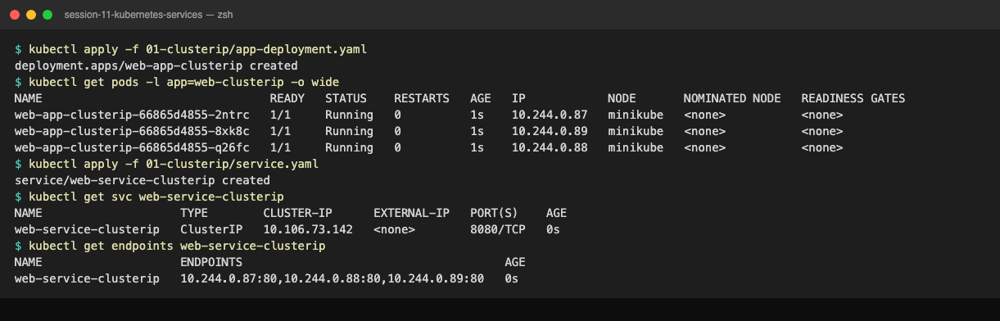

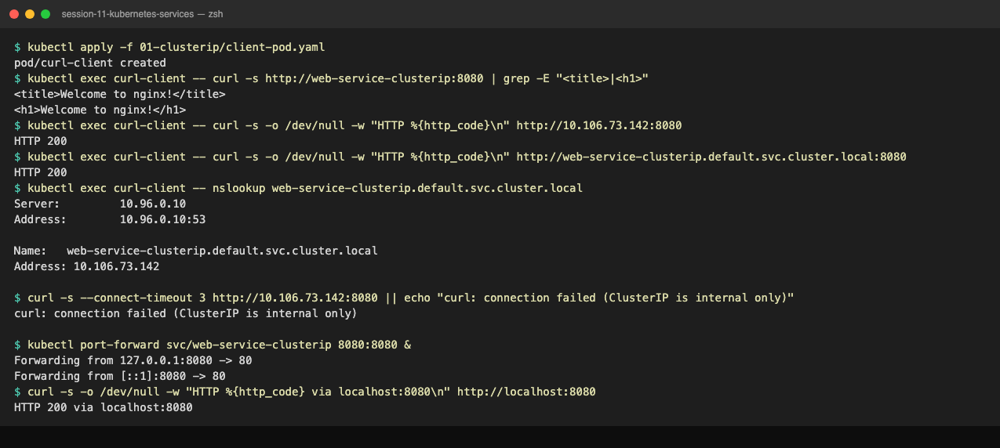

---

## Task 3: Type 2 Service: NodePort (Host-Level External Ingress)

**Description:** 2-replica Nginx exposed on port 30080 of every node; verify the mapping and reach it externally.

**Files:** `02-nodeport/`

**Commands:**
```bash
kubectl apply -f 02-nodeport/app-deployment.yaml -f 02-nodeport/service.yaml
kubectl get svc web-service-nodeport
MINIKUBE_IP=$(minikube ip)
curl -I http://${MINIKUBE_IP}:30080          # fails on macOS docker driver, see Task 12
minikube ssh -- "curl -s http://localhost:30080"
minikube service web-service-nodeport --url
```

**Output:**
```text
$ kubectl apply -f 02-nodeport/app-deployment.yaml
deployment.apps/web-app-nodeport created
$ kubectl get pods -l app=web-nodeport -o wide
NAME                              READY   STATUS    RESTARTS   AGE   IP            NODE       NOMINATED NODE   READINESS GATES
web-app-nodeport-6c8f48bd-2sl4z   1/1     Running   0          1s    10.244.0.92   minikube   <none>           <none>
web-app-nodeport-6c8f48bd-8khmn   1/1     Running   0          1s    10.244.0.91   minikube   <none>           <none>
$ kubectl apply -f 02-nodeport/service.yaml
service/web-service-nodeport created
$ kubectl get svc web-service-nodeport
NAME                   TYPE       CLUSTER-IP       EXTERNAL-IP   PORT(S)        AGE
web-service-nodeport   NodePort   10.111.127.174   <none>        80:30080/TCP   0s
$ kubectl get endpoints web-service-nodeport
NAME                   ENDPOINTS                       AGE
web-service-nodeport   10.244.0.91:80,10.244.0.92:80   0s
$ kubectl get nodes -o wide | awk '{print $1, $2, $6}'
NAME STATUS INTERNAL-IP
minikube Ready 192.168.49.2
$ minikube ip
192.168.49.2

$ curl -s --connect-timeout 3 -o /dev/null -w "HTTP %{http_code}\n" http://192.168.49.2:30080
HTTP 000
curl: timed out - minikube ip is not routable from macOS with the docker driver

$ minikube ssh -- "curl -s http://localhost:30080" | grep -E "<title>|<h1>"
<title>Welcome to nginx!</title>
<h1>Welcome to nginx!</h1>

$ minikube service web-service-nodeport --url
http://127.0.0.1:54033
$ curl -s -o /dev/null -w "HTTP %{http_code} via tunnel\n" http://127.0.0.1:54033
HTTP 200 via tunnel
```

A NodePort service still has a ClusterIP, so it works internally too. The `HTTP 000` against `192.168.49.2` is not a Kubernetes problem; the node is a Docker container on a bridge the Mac cannot route to. Inside the node, and through the `minikube service` tunnel, it returns 200.

**Screenshot:**

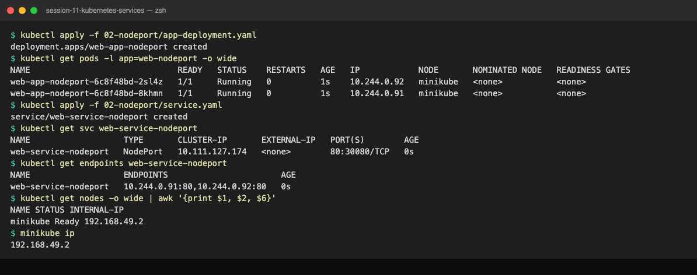

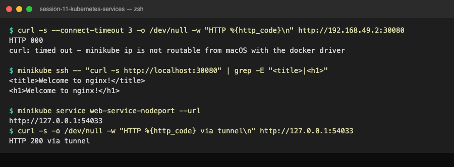

---

## Task 4: Type 3 Service: LoadBalancer (Cloud-Native Ingress Simulation)

**Description:** Expose a 3-replica app as `type: LoadBalancer`, simulate a cloud controller with `minikube tunnel`, confirm the built-in NodePort and ClusterIP layers.

**Files:** `03-loadbalancer/`

**Commands:**
```bash
kubectl apply -f 03-loadbalancer/app-deployment.yaml -f 03-loadbalancer/service.yaml
kubectl get svc web-service-loadbalancer        # <pending>
minikube tunnel                                 # separate terminal, needs sudo for port 80
kubectl get svc web-service-loadbalancer        # EXTERNAL-IP 127.0.0.1
EXTERNAL_IP=$(kubectl get svc web-service-loadbalancer -o jsonpath='{.status.loadBalancer.ingress[0].ip}')
curl -s http://${EXTERNAL_IP}:80 | grep -i '<title>'
minikube service web-service-loadbalancer --url  # alternative
```

**Output:**
```text
$ kubectl apply -f 03-loadbalancer/app-deployment.yaml
deployment.apps/web-app-loadbalancer created
$ kubectl get pods -l app=web-loadbalancer
NAME                                   READY   STATUS    RESTARTS   AGE
web-app-loadbalancer-5db87c7b9-fpqpk   1/1     Running   0          1s
web-app-loadbalancer-5db87c7b9-qw6mb   1/1     Running   0          1s
web-app-loadbalancer-5db87c7b9-sd7dv   1/1     Running   0          1s
$ kubectl apply -f 03-loadbalancer/service.yaml
service/web-service-loadbalancer created
$ kubectl get svc web-service-loadbalancer
NAME                       TYPE           CLUSTER-IP     EXTERNAL-IP   PORT(S)        AGE
web-service-loadbalancer   LoadBalancer   10.104.217.5   <pending>     80:32011/TCP   0s

$ minikube tunnel          (separate terminal)
* Tunnel successfully started
* NOTE: Please do not close this terminal as this process must stay alive for the tunnel to be accessible ...
! The service/ingress web-service-loadbalancer requires privileged ports to be exposed: [80]
* sudo permission will be asked for it.
* Starting tunnel for service web-service-loadbalancer.

$ kubectl get svc web-service-loadbalancer
NAME                       TYPE           CLUSTER-IP     EXTERNAL-IP   PORT(S)        AGE
web-service-loadbalancer   LoadBalancer   10.104.217.5   127.0.0.1     80:32011/TCP   12s

$ minikube service web-service-loadbalancer --url
http://127.0.0.1:54057
$ curl -s -o /dev/null -w "HTTP %{http_code}\n" http://127.0.0.1:54057
HTTP 200
```

`80:32011/TCP` shows Kubernetes auto-allocated a NodePort underneath: a LoadBalancer Service is a NodePort Service plus a cloud LB. Without a cloud controller the EXTERNAL-IP stays `<pending>`; `minikube tunnel` fills in `127.0.0.1` within seconds. Port 80 is privileged, so the tunnel prompts for sudo in its own terminal; until that is entered, `curl http://127.0.0.1` returns nothing (that was the case in this run, so the `minikube service --url` route was used to confirm HTTP 200).

**Screenshot:**

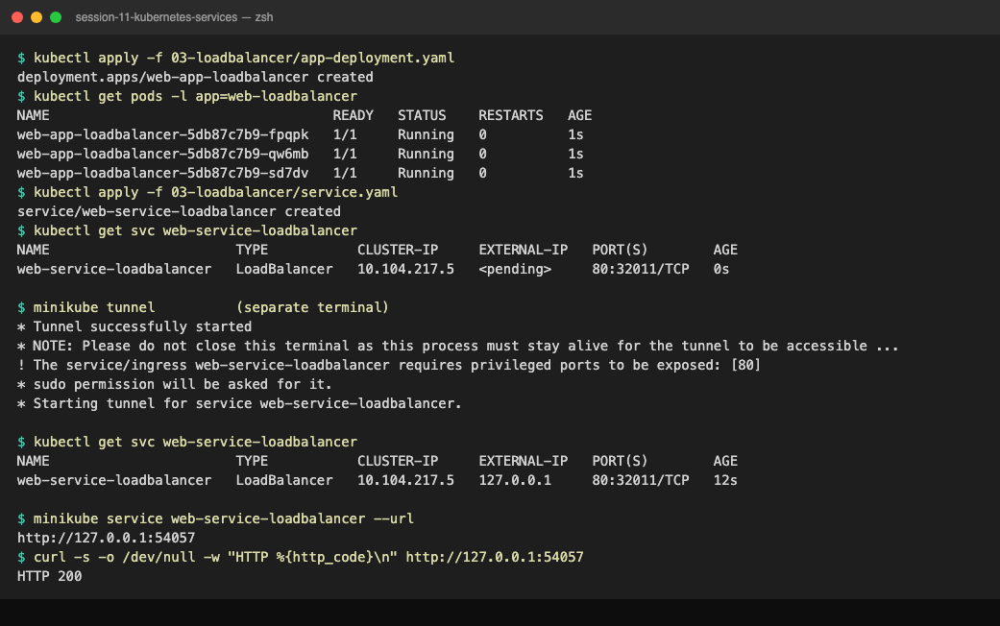

---

## Task 5: Type 4 Service: ExternalName (CoreDNS CNAME Alias Redirection)

**Description:** ExternalName service with no selector, no ClusterIP, no endpoints; prove CNAME resolution from a pod.

**Files:** `04-externalname/`

**Commands:**
```bash
kubectl apply -f 04-externalname/service.yaml -f 04-externalname/client-pod.yaml
kubectl get svc external-database-service
kubectl exec dns-test-client -- nslookup external-database-service.default.svc.cluster.local
kubectl get endpoints external-database-service
kubectl exec dns-test-client -- curl -s -H 'Host: api.github.com' https://external-database-service
```

**Output:**
```text
$ kubectl apply -f 04-externalname/service.yaml
service/external-database-service created
$ kubectl get svc external-database-service
NAME                        TYPE           CLUSTER-IP   EXTERNAL-IP      PORT(S)   AGE
external-database-service   ExternalName   <none>       api.github.com   <none>    0s
$ kubectl apply -f 04-externalname/client-pod.yaml
pod/dns-test-client created
$ kubectl exec dns-test-client -- nslookup external-database-service.default.svc.cluster.local
Server:		10.96.0.10
Address:	10.96.0.10:53

external-database-service.default.svc.cluster.local	canonical name = api.github.com
Name:	api.github.com
Address: 20.207.73.85

$ kubectl get endpoints external-database-service
Error from server (NotFound): endpoints "external-database-service" not found

$ kubectl exec dns-test-client -- curl -s -H "Host: api.github.com" https://external-database-service
command terminated with exit code 60

$ kubectl exec dns-test-client -- curl -s -o /dev/null -w "HTTP %{http_code}\n" --resolve api.github.com:443:20.207.73.85 https://api.github.com
HTTP 200
```

CoreDNS answers `canonical name = api.github.com` then resolves that upstream. There is no Endpoints object at all. The HTTPS call fails with curl exit 60 (certificate mismatch): TLS SNI carries `external-database-service` but the cert is for `api.github.com`, and a `Host` header is sent after the handshake so it cannot help. `--resolve api.github.com:443:<ip>` keeps the real name for TLS and returns 200. This run used `api.github.com`; the manifest now points at `nencyravaliya.me` and behaves the same way.

**Screenshot:**

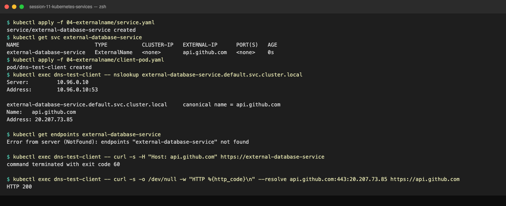

---

## Task 6: Type 5 Service: Headless (`clusterIP: None` & Stateful Workloads)

**Description:** Headless Service + StatefulSet; show CoreDNS returns all pod IPs and that each ordinal pod has its own DNS name.

**Files:** `05-headless/`

**Commands:**
```bash
kubectl apply -f 05-headless/service.yaml -f 05-headless/app-statefulset.yaml -f 05-headless/client-pod.yaml
kubectl get svc web-service-headless
kubectl get pods -l app=web-headless -o wide
kubectl exec headless-dns-client -- nslookup web-service-headless.default.svc.cluster.local
kubectl exec headless-dns-client -- nslookup web-stateful-0.web-service-headless.default.svc.cluster.local
kubectl exec headless-dns-client -- curl -s http://web-stateful-0.web-service-headless:80
```

**Output:**
```text
$ kubectl apply -f 05-headless/service.yaml
service/web-service-headless created
$ kubectl get svc web-service-headless
NAME                   TYPE        CLUSTER-IP   EXTERNAL-IP   PORT(S)   AGE
web-service-headless   ClusterIP   None         <none>        80/TCP    0s
$ kubectl apply -f 05-headless/app-statefulset.yaml
statefulset.apps/web-stateful created
$ kubectl rollout status sts/web-stateful
Waiting for 3 pods to be ready...
Waiting for 2 pods to be ready...
Waiting for 1 pods to be ready...
partitioned roll out complete: 3 new pods have been updated...
$ kubectl get pods -l app=web-headless -o wide
NAME             READY   STATUS    RESTARTS   AGE   IP            NODE       NOMINATED NODE   READINESS GATES
web-stateful-0   1/1     Running   0          1s    10.244.0.97   minikube   <none>           <none>
web-stateful-1   1/1     Running   0          1s    10.244.0.98   minikube   <none>           <none>
web-stateful-2   1/1     Running   0          0s    10.244.0.99   minikube   <none>           <none>

$ kubectl exec headless-dns-client -- nslookup web-service-headless.default.svc.cluster.local
Server:		10.96.0.10
Address:	10.96.0.10:53

Name:	web-service-headless.default.svc.cluster.local
Address: 10.244.0.98
Name:	web-service-headless.default.svc.cluster.local
Address: 10.244.0.99
Name:	web-service-headless.default.svc.cluster.local
Address: 10.244.0.97

$ kubectl exec headless-dns-client -- nslookup web-stateful-0.web-service-headless.default.svc.cluster.local
Name:	web-stateful-0.web-service-headless.default.svc.cluster.local
Address: 10.244.0.97
$ kubectl exec headless-dns-client -- curl -s -o /dev/null -w "HTTP %{http_code} from web-stateful-0\n" http://web-stateful-0.web-service-headless:80
HTTP 200 from web-stateful-0

$ kubectl delete pod web-stateful-0
pod "web-stateful-0" deleted from default namespace
$ kubectl get pods -l app=web-headless -o wide | awk '{print $1,$2,$3,$6}'
NAME READY STATUS IP
web-stateful-0 1/1 Running 10.244.0.101
web-stateful-1 1/1 Running 10.244.0.98
web-stateful-2 1/1 Running 10.244.0.99
```

`CLUSTER-IP None`. The service name resolves to three A records (the pod IPs), not one VIP, so the client does its own balancing or picks a specific member. `web-stateful-0.web-service-headless` always reaches ordinal 0 even after that pod is deleted and comes back with a new IP (`.97` -> `.101`).

**Screenshot:**

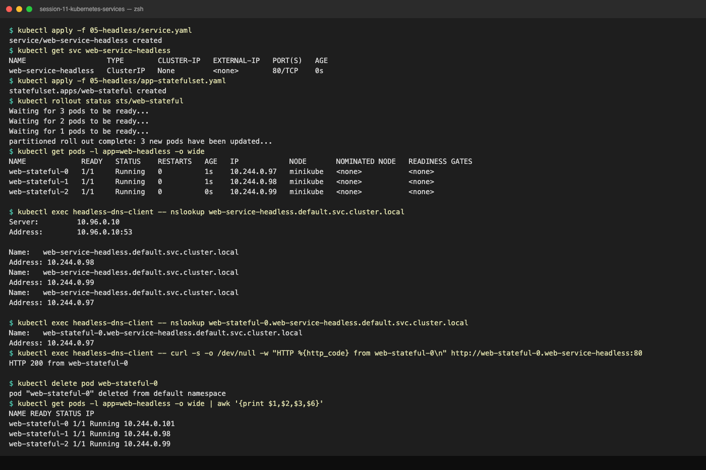

---

## Task 7: Services Without Selectors (Manual Endpoints Mapping)

**Description:** ClusterIP Service with no selector, plus a hand-written Endpoints object pointing at an IP outside the cluster, so in-cluster clients reach external infrastructure through a normal service name.

**Files:** `06-no-selector/service-no-selector.yaml`, `06-no-selector/endpoints-manual.yaml`

**Commands:**
```bash
kubectl apply -f 06-no-selector/service-no-selector.yaml
kubectl get svc,endpoints external-legacy-db        # no endpoints yet
kubectl apply -f 06-no-selector/endpoints-manual.yaml
kubectl get endpoints external-legacy-db
kubectl describe svc external-legacy-db | grep -E 'Selector|Endpoints|IP:'
kubectl exec curl-test-pod -- curl -s -o /dev/null -w 'HTTP %{http_code}\n' -H 'Host: example.com' http://external-legacy-db
kubectl delete -f 06-no-selector/
```

**Output:**
```text
$ kubectl apply -f 06-no-selector/service-no-selector.yaml
service/external-legacy-db created

$ kubectl get svc external-legacy-db
NAME                 TYPE        CLUSTER-IP      EXTERNAL-IP   PORT(S)   AGE
external-legacy-db   ClusterIP   10.109.13.138   <none>        80/TCP    0s

$ kubectl get endpoints external-legacy-db
Error from server (NotFound): endpoints "external-legacy-db" not found

$ kubectl apply -f 06-no-selector/endpoints-manual.yaml
endpoints/external-legacy-db created

$ kubectl get endpoints external-legacy-db
NAME                 ENDPOINTS          AGE
external-legacy-db   93.184.215.14:80   0s

$ kubectl describe svc external-legacy-db | grep -E 'Selector|Endpoints|IP:'
Selector:                 <none>
IP:                       10.109.13.138
Endpoints:                93.184.215.14:80

$ kubectl apply -f dns-test/curl-test-pod.yaml && kubectl wait --for=condition=ready pod/curl-test-pod --timeout=90s
pod/curl-test-pod created
pod/curl-test-pod condition met

$ kubectl exec curl-test-pod -- nslookup example.com | grep -A1 '^Name' | head -2
Name:	example.com
Address: 104.20.23.154

$ kubectl apply -f 06-no-selector/endpoints-manual.yaml 2>&1 | grep -v Warning
endpoints/external-legacy-db configured

$ kubectl get endpoints external-legacy-db 2>&1 | grep -v Warning
NAME                 ENDPOINTS          AGE
external-legacy-db   104.20.23.154:80   39s

$ kubectl exec curl-test-pod -- curl -s -o /dev/null -w 'HTTP %{http_code} via external-legacy-db (ClusterIP -> manual endpoint -> example.com)
' -H 'Host: example.com' --connect-timeout 5 http://external-legacy-db
HTTP 200 via external-legacy-db (ClusterIP -> manual endpoint -> example.com)

$ kubectl delete -f 06-no-selector/ 2>&1 | grep -v Warning
endpoints "external-legacy-db" deleted from default namespace
service "external-legacy-db" deleted from default namespace
```

With no selector, Kubernetes creates the Service but no Endpoints (`NotFound`). The Endpoints object must have the same name as the Service; once applied, `Selector: <none>` and `Endpoints: 104.20.23.154:80` show the manual wiring, and a pod reaches example.com through `http://external-legacy-db`. Lesson learned the hard way: the first attempt used an old example.com IP (`93.184.215.14`) and got `exit 7`; the target moved to Cloudflare. Manual endpoints are static, so this pattern needs monitoring or an operator that updates them. ExternalName (Task 5) avoids that by delegating to DNS, but cannot remap ports and breaks TLS names; manual Endpoints work with raw IPs and any port.

**Screenshot:**

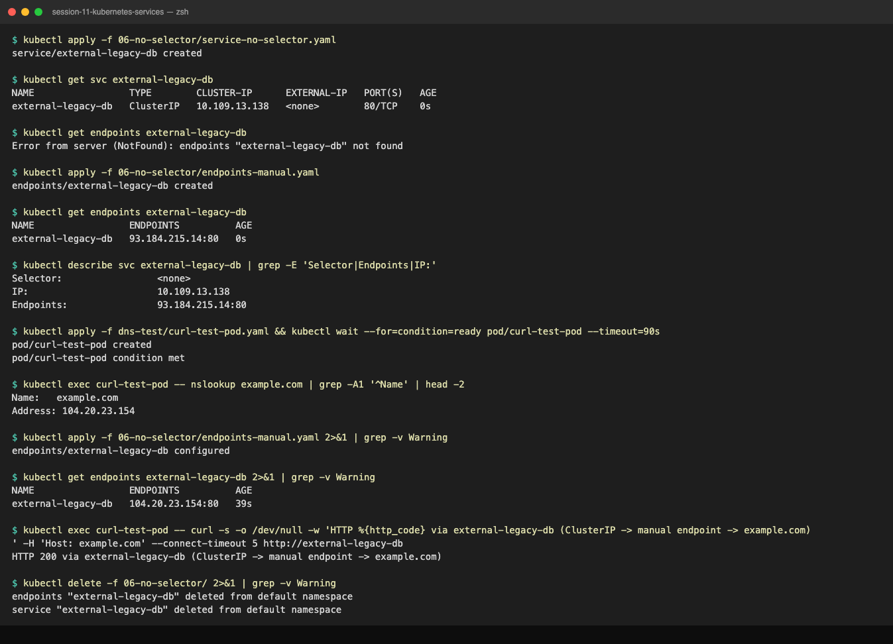

---

## Task 8: FQDN & CoreDNS Deep Dive Architecture Analysis

**Description:** Inspect `/etc/resolv.conf` in a pod and explain the FQDN hierarchy, search suffixes and `ndots:5`.

**Files:** `dns-test/curl-test-pod.yaml`

**Commands:**
```bash
kubectl exec curl-test-pod -- cat /etc/resolv.conf
kubectl get svc -n kube-system kube-dns
kubectl exec curl-test-pod -- nslookup kubernetes
kubectl exec curl-test-pod -- nslookup kubernetes.default.svc.cluster.local
```

**Output:**
```text
$ kubectl exec curl-test-pod -- cat /etc/resolv.conf
search default.svc.cluster.local svc.cluster.local cluster.local
nameserver 10.96.0.10
options ndots:5

$ kubectl get svc -n kube-system kube-dns
NAME       TYPE        CLUSTER-IP   EXTERNAL-IP   PORT(S)                  AGE
kube-dns   ClusterIP   10.96.0.10   <none>        53/UDP,53/TCP,9153/TCP   10d

$ kubectl exec curl-test-pod -- nslookup kubernetes
Server:		10.96.0.10
Address:	10.96.0.10:53

** server can't find kubernetes.cluster.local: NXDOMAIN


Name:	kubernetes.default.svc.cluster.local
Address: 10.96.0.1

** server can't find kubernetes.cluster.local: NXDOMAIN

** server can't find kubernetes.svc.cluster.local: NXDOMAIN

** server can't find kubernetes.svc.cluster.local: NXDOMAIN

command terminated with exit code 1

$ kubectl exec curl-test-pod -- nslookup kubernetes.default.svc.cluster.local | tail -3
Address: 10.96.0.1


$ kubectl exec curl-test-pod -- nslookup kube-dns.kube-system | tail -3
command terminated with exit code 1

** server can't find kube-dns.kube-system: NXDOMAIN
```

FQDN shape: `<service>.<namespace>.svc.cluster.local` (services) and `<pod>.<service>.<namespace>.svc.cluster.local` (StatefulSet pods behind a headless service).

`/etc/resolv.conf` in every pod:
* `nameserver 10.96.0.10` is the `kube-dns` Service in `kube-system`, which fronts the CoreDNS pods.
* `search default.svc.cluster.local svc.cluster.local cluster.local` is why `web-service-clusterip` alone works from the `default` namespace: the resolver appends the suffixes. From another namespace you need at least `web-service-clusterip.default`.
* `options ndots:5`: any name with fewer than 5 dots is tried with every search suffix first, and the literal name last. The `nslookup kubernetes` output shows this: `kubernetes.default.svc.cluster.local` hits, but the resolver also fires `kubernetes.svc.cluster.local` and `kubernetes.cluster.local` (NXDOMAIN).

Latency implication: `api.github.com` has 2 dots (< 5), so a pod calling it first asks CoreDNS for `api.github.com.default.svc.cluster.local`, `api.github.com.svc.cluster.local`, `api.github.com.cluster.local` (three NXDOMAINs, each a round trip) before the real lookup. Fixes: use a trailing dot (`api.github.com.`) to force an absolute name, set `dnsConfig.options ndots:1` or `2` in the pod spec, or enable CoreDNS caching/autopath.

**Screenshot:**

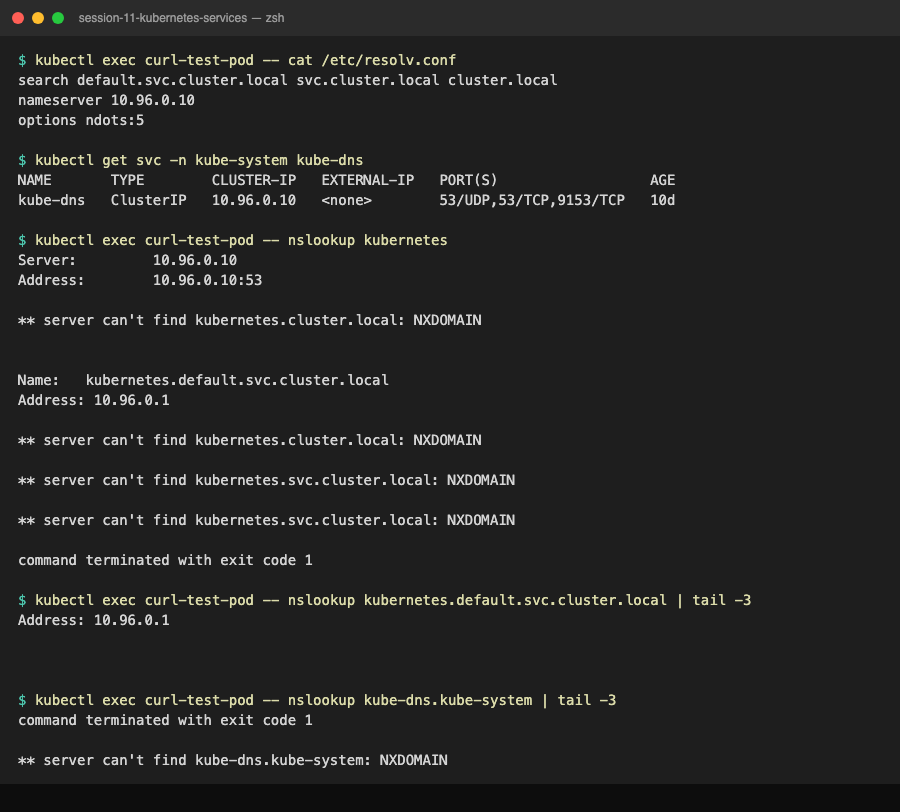

---

## Task 9: Pod Identity & Lifecycle Invariance: Deployment vs StatefulSet

**Description:** Run a Deployment and a StatefulSet side by side, delete one pod from each, and compare how they come back.

**Files:** `01-clusterip/app-deployment.yaml`, `05-headless/app-statefulset.yaml`

**Commands:**
```bash
kubectl apply -f 01-clusterip/app-deployment.yaml -f 05-headless/service.yaml -f 05-headless/app-statefulset.yaml
kubectl get pods -l 'app in (web-clusterip,web-headless)' -o wide
DEP_POD=$(kubectl get pods -l app=web-clusterip -o jsonpath='{.items[0].metadata.name}')
kubectl delete pod $DEP_POD
kubectl delete pod web-stateful-1
kubectl get pods -l 'app in (web-clusterip,web-headless)' -o wide
```

**Output:**
```text
$ kubectl apply -f 01-clusterip/app-deployment.yaml -f 05-headless/service.yaml -f 05-headless/app-statefulset.yaml
deployment.apps/web-app-clusterip created
service/web-service-headless created
statefulset.apps/web-stateful created

$ kubectl rollout status deploy/web-app-clusterip --timeout=90s >/dev/null; kubectl rollout status sts/web-stateful --timeout=120s >/dev/null; kubectl get pods -l 'app in (web-clusterip,web-headless)' -o wide | awk '{print $1,$2,$3,$6}'
NAME READY STATUS IP
web-app-clusterip-66865d4855-6z4g8 1/1 Running 10.244.0.39
web-app-clusterip-66865d4855-qgwq7 1/1 Running 10.244.0.38
web-app-clusterip-66865d4855-z54rj 1/1 Running 10.244.0.40
web-stateful-0 1/1 Running 10.244.0.41
web-stateful-1 1/1 Running 10.244.0.42
web-stateful-2 1/1 Running 10.244.0.43

$ DEP_POD=$(kubectl get pods -l app=web-clusterip -o jsonpath='{.items[0].metadata.name}'); echo "Deployment pod: $DEP_POD"; kubectl delete pod $DEP_POD; echo 'StatefulSet pod: web-stateful-1'; kubectl delete pod web-stateful-1
Deployment pod: web-app-clusterip-66865d4855-6z4g8
pod "web-app-clusterip-66865d4855-6z4g8" deleted from default namespace
StatefulSet pod: web-stateful-1
pod "web-stateful-1" deleted from default namespace

$ kubectl get pods -l 'app in (web-clusterip,web-headless)' -o wide | awk '{print $1,$2,$3,$5,$6}'
NAME READY STATUS AGE IP
web-app-clusterip-66865d4855-b6qp7 1/1 Running 9s 10.244.0.44
web-app-clusterip-66865d4855-qgwq7 1/1 Running 11s 10.244.0.38
web-app-clusterip-66865d4855-z54rj 1/1 Running 11s 10.244.0.40
web-stateful-0 1/1 Running 11s 10.244.0.41
web-stateful-1 1/1 Running 8s 10.244.0.45
web-stateful-2 1/1 Running 10s 10.244.0.43

$ kubectl delete -f 01-clusterip/app-deployment.yaml -f 05-headless/app-statefulset.yaml -f 05-headless/service.yaml -f dns-test/curl-test-pod.yaml
deployment.apps "web-app-clusterip" deleted from default namespace
statefulset.apps "web-stateful" deleted from default namespace
service "web-service-headless" deleted from default namespace
pod "curl-test-pod" deleted from default namespace
```

Deployment: `web-app-clusterip-66865d4855-6z4g8` was replaced by `web-app-clusterip-66865d4855-b6qp7`, a new random suffix (the `66865d4855` part is the ReplicaSet's template hash, not the pod's identity). StatefulSet: `web-stateful-1` came back as `web-stateful-1`, same name, same DNS record, same PVC if it had one; only the IP changed. Deployments are for interchangeable replicas; StatefulSets are for members that must be addressed individually (leaders, shards, replicas).

**Screenshot:**

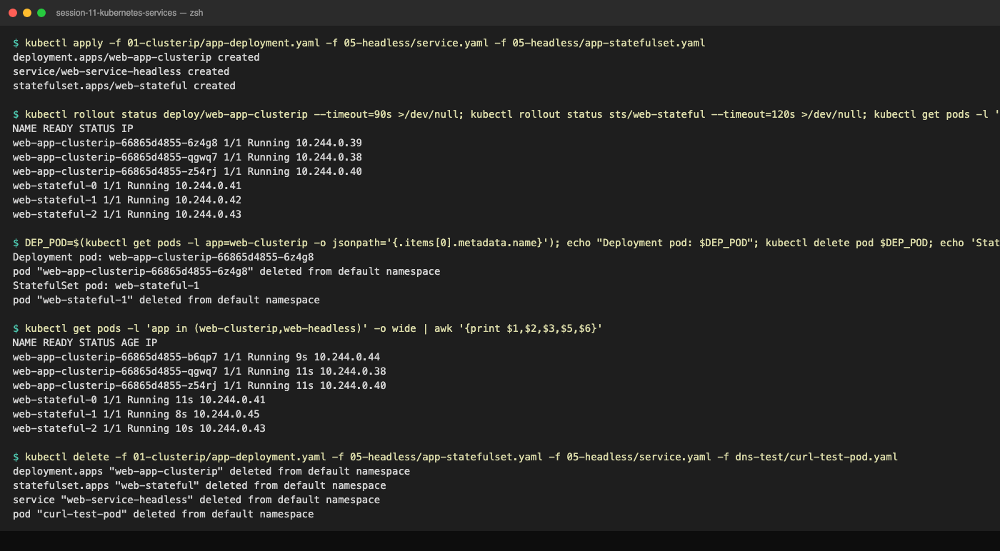

---

## Task 10: Master Architectural Matrix: Deployment vs StatefulSet vs DaemonSet

| Dimension | Deployment | StatefulSet | DaemonSet |
| :--- | :--- | :--- | :--- |
| Pod names | `<name>-<template-hash>-<random>` | `<name>-0`, `-1`, `-2` (ordinal, stable) | `<name>-<random>`, one per node |
| Identity after restart | New name, new IP | Same name, same DNS, same PVC | New name; node is the identity |
| Replica count | `replicas: N`, scheduler places anywhere | `replicas: N`, created and deleted in order | No `replicas`; equals number of matching nodes |
| Startup / shutdown | All at once (subject to rollout params) | `0` then `1` then `2`; scale down in reverse | Per node as nodes join/leave |
| Rolling update | `maxSurge` / `maxUnavailable`, surge allowed | Ordered, one at a time, reverse ordinal, `partition` for canary | One node at a time, `maxUnavailable` |
| Storage | Shared PVC or none; not per-pod | `volumeClaimTemplates` create one PVC per pod (`data-mysql-0`); kept on delete | Usually `hostPath` (node's own filesystem) |
| Service pairing | ClusterIP / NodePort / LoadBalancer (VIP, balanced) | Headless (`clusterIP: None`) for per-pod DNS, plus optionally a normal Service | Usually none, or a headless/ClusterIP for scraping (metrics) |
| Scaling | `kubectl scale`, HPA | `kubectl scale`, ordered | Add or remove nodes, or change `nodeSelector` / tolerations |
| Rollback | `rollout undo` | `rollout undo` (ordered) | `rollout undo` |
| Real-world placement | Web frontends, stateless APIs, workers | Databases (MySQL, Postgres, MongoDB), Kafka, ZooKeeper, etcd, Elasticsearch | node-exporter, log shippers (Fluent Bit), CNI (`kindnet`), `kube-proxy`, security agents (Falco) |
| Seen in this repo | `web-app-clusterip`, `yatri-backend`, `app-rolling` | `web-stateful`, `mysql` (session 10 Task 6) | `node-exporter`, `node-logging-agent` (session 10 Task 7) |

---

## Task 11: Production Cost Optimization & Service Selection Decision Tree

```text
Who needs to reach it?
|
+-- Only other pods in the cluster  ----------------------------> ClusterIP   (DBs, internal APIs, caches)
|      |
|      +-- and clients must pick a specific member (leader, shard) -> Headless + StatefulSet
|
+-- Something outside the cluster that lives at a DNS name  ------> ExternalName (RDS, SaaS APIs)
|      |
|      +-- ... at a raw IP, or needs port remap / TLS name kept ---> Service without selector + manual Endpoints
|
+-- Users on the internet / office network
       |
       +-- dev, bare metal, quick test, non-standard port OK ------> NodePort
       |
       +-- production on a cloud
              |
              +-- exactly one public entry point, L4 (TCP) --------> LoadBalancer (one)
              |
              +-- many HTTP services / hostnames / paths / TLS ----> ONE LoadBalancer -> Ingress controller -> many ClusterIPs
```

Cost anti-pattern: each `type: LoadBalancer` provisions a real cloud load balancer, roughly $18-25/month on AWS (NLB/ALB hourly + LCU) before traffic. 50 microservices with 50 LoadBalancer services is $900-1,250/month of idle load balancers, 50 public IPs to secure, and 50 places to manage TLS certificates.

Production pattern: one LoadBalancer Service in front of an Ingress controller (NGINX, Traefik, AWS ALB controller). Ingress rules route by host (`api.company.com`, `app.company.com`) and path (`/orders`, `/users`) to plain ClusterIP services. One LB bill, one TLS termination point, one WAF, and adding the 51st service costs nothing. This is exactly the `ingress` addon used in session 12.

---

## Task 12: Minikube Docker-Driver Port Binding & Tunnel Gotcha Analysis

**Description:** Explain why `<node-ip>:<nodePort>` fails on macOS/Windows with the docker driver, and demonstrate the two workarounds.

**Commands:**
```bash
minikube ip
curl -s --connect-timeout 3 http://$(minikube ip):30080          # hangs / HTTP 000
docker network inspect minikube --format '{{range .IPAM.Config}}{{.Subnet}}{{end}}'
minikube ssh -- "curl -s http://localhost:30080"               # works: inside the node
minikube service web-service-nodeport --url                      # workaround 1
minikube tunnel                                                  # workaround 2 (LoadBalancer, sudo for <1024)
```

**Output:**
```text
$ minikube ip
192.168.49.2

$ curl -s --connect-timeout 3 -o /dev/null -w "HTTP %{http_code}\n" http://192.168.49.2:30080
HTTP 000
curl: timed out - minikube ip is not routable from macOS with the docker driver

$ docker network inspect minikube --format '{{range .IPAM.Config}}{{.Subnet}}{{end}}'
192.168.49.0/24

$ minikube ssh -- "curl -s -o /dev/null -w 'HTTP %{http_code}\n' http://localhost:30080"
HTTP 200

$ minikube service web-service-nodeport --url
http://127.0.0.1:54033
$ curl -s -o /dev/null -w "HTTP %{http_code} via tunnel\n" http://127.0.0.1:54033
HTTP 200 via tunnel

$ minikube tunnel        (separate terminal, asks for sudo for port 80)
* Tunnel successfully started
* Starting tunnel for service web-service-loadbalancer.
$ kubectl get svc web-service-loadbalancer
NAME                       TYPE           CLUSTER-IP     EXTERNAL-IP   PORT(S)        AGE
web-service-loadbalancer   LoadBalancer   10.104.217.5   127.0.0.1     80:32011/TCP   12s
```

Root cause: with the docker driver the "node" is a container on the Docker bridge network `minikube` (`192.168.49.0/24`). On Linux the host owns that bridge, so `192.168.49.2:30080` routes. On macOS and Windows, Docker Desktop runs the engine inside a Linux VM; the bridge exists only inside that VM and the host has no route to `192.168.49.0/24`, so the TCP SYN never arrives and curl times out (`HTTP 000`).

Workaround 1, `minikube service <svc> --url`: opens an SSH port-forward from a random localhost port (`127.0.0.1:54033`) to the NodePort inside the container. Must stay running; one per service.

Workaround 2, `minikube tunnel`: runs a process that adds routes / listens on `127.0.0.1` for every `LoadBalancer` Service and sets its `EXTERNAL-IP`. Ports below 1024 need sudo. Must stay running; covers all LoadBalancer services at once and is what the session 12 Ingress lab relies on.

Alternative: `kubectl port-forward svc/<svc> 8080:80` works for any Service type but bypasses kube-proxy and hits a single pod.

**Screenshot:**

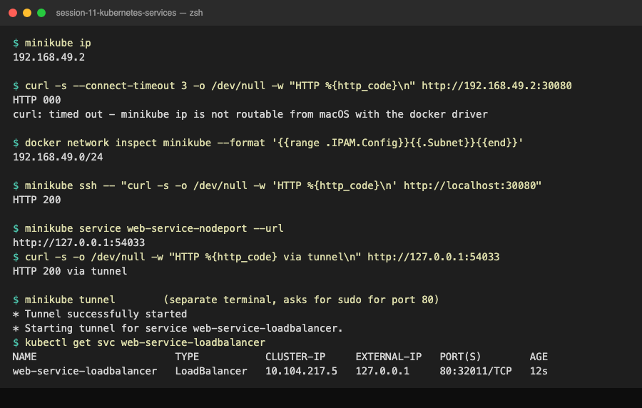

---

## Extra: one backend, three Service types, and an empty-endpoints drill

Files: `deployment/backend-deployment.yaml`, `service/clusterip.yaml`, `service/nodeport.yaml`, `service/loadbalancer.yaml`, `dns-test/curl-test-pod.yaml`, `troubleshooting/empty-endpoints.yaml`.

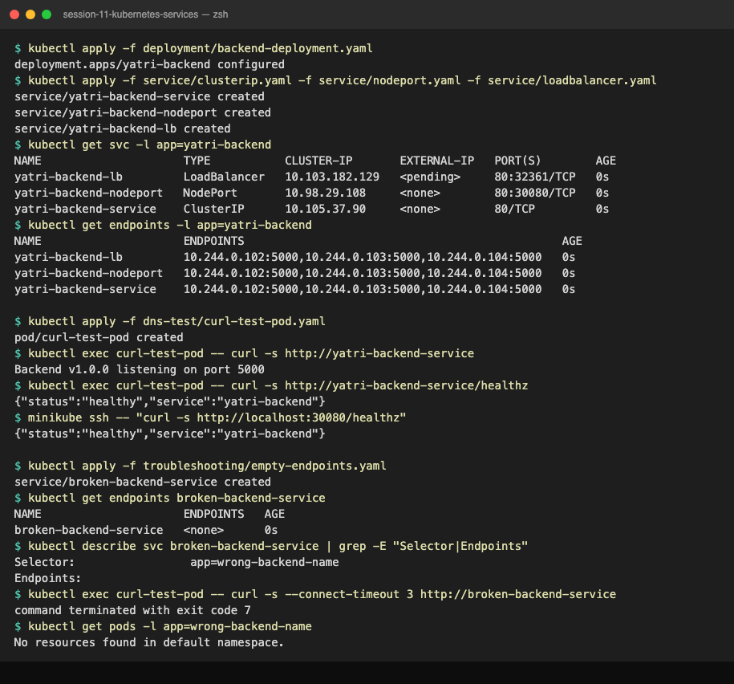

```text
$ kubectl apply -f deployment/backend-deployment.yaml
deployment.apps/yatri-backend configured
$ kubectl apply -f service/clusterip.yaml -f service/nodeport.yaml -f service/loadbalancer.yaml
service/yatri-backend-service created
service/yatri-backend-nodeport created
service/yatri-backend-lb created
$ kubectl get svc -l app=yatri-backend
NAME                     TYPE           CLUSTER-IP       EXTERNAL-IP   PORT(S)        AGE
yatri-backend-lb         LoadBalancer   10.103.182.129   <pending>     80:32361/TCP   0s
yatri-backend-nodeport   NodePort       10.98.29.108     <none>        80:30080/TCP   0s
yatri-backend-service    ClusterIP      10.105.37.90     <none>        80/TCP         0s
$ kubectl get endpoints -l app=yatri-backend
NAME                     ENDPOINTS                                               AGE
yatri-backend-lb         10.244.0.102:5000,10.244.0.103:5000,10.244.0.104:5000   0s
yatri-backend-nodeport   10.244.0.102:5000,10.244.0.103:5000,10.244.0.104:5000   0s
yatri-backend-service    10.244.0.102:5000,10.244.0.103:5000,10.244.0.104:5000   0s
$ kubectl exec curl-test-pod -- curl -s http://yatri-backend-service/healthz
{"status":"healthy","service":"yatri-backend"}
$ minikube ssh -- "curl -s http://localhost:30080/healthz"
{"status":"healthy","service":"yatri-backend"}

$ kubectl apply -f troubleshooting/empty-endpoints.yaml
service/broken-backend-service created
$ kubectl get endpoints broken-backend-service
NAME                     ENDPOINTS   AGE
broken-backend-service   <none>      0s
$ kubectl describe svc broken-backend-service | grep -E "Selector|Endpoints"
Selector:                 app=wrong-backend-name
Endpoints:
$ kubectl exec curl-test-pod -- curl -s --connect-timeout 3 http://broken-backend-service
command terminated with exit code 7
$ kubectl get pods -l app=wrong-backend-name
No resources found in default namespace.
```

Three Services, one selector, the same three `podIP:5000` endpoints each; service port 80 maps to `targetPort: 5000`. The broken Service is accepted by the API server (selectors are not validated against pods), gets a ClusterIP, and simply has `ENDPOINTS <none>`; connections to it are refused (exit 7). Debug order: `get endpoints` -> `describe svc | grep Selector` -> `get pods -l <that selector>` -> fix the selector to `app: yatri-backend`.

Cleanup:
```bash
kubectl delete -f troubleshooting/ -f dns-test/ -f service/ -f deployment/backend-deployment.yaml
```
