# Session 14: Kubernetes Troubleshooting

**Author:** Pranay Reddy
**Course:** SST DevOps & Cloud [SWE]
**Session:** 14
**Repository:** devops-heros / session-14-kubernetes-troubleshooting
**Environment:** macOS (Apple Silicon, arm64), Docker Desktop 29.7, minikube v1.39.0, Kubernetes v1.37.0 (containerd), metrics-server

Every output block is real output from this machine; screenshots in [screenshots/](screenshots/) are rendered from the same captured output. The instructor's original overview is kept in [instructor-notes.md](instructor-notes.md).

| Task | What | Where |
| :--- | :--- | :--- |
| 1 | `get`, `describe`, `logs`, `exec`, `events`, `explain`, `top`, `get -o wide` | [Task 1](#task-1-kubernetes-commands) |
| 2 | CrashLoopBackOff, ImagePullBackOff, ErrImagePull, Pending, ContainerCreating, Service, DNS, Pod networking, Configuration | [Task 2](#task-2-troubleshoot-common-issues) |
| Bonus | Instructor's 5-pod "triage gauntlet" in `scenarios/` | [Gauntlet](#bonus-triage-gauntlet-scenarios) |
| 3 | Mini project + questions + troubleshooting table | [Task 3](#task-3-mini-project) |

Files added by me: `10-containercreating/`, `11-pod-networking/`, `12-configuration-issues/`, `09-service-dns-troubleshooting/dns-test-pod-fixed.yaml`, `scenarios/*/fixed.yaml`, `scenarios/scenario-4-dns-failure/postgres-db.yaml`, `screenshots/`.

## The process I followed every time

```text
get  ──►  describe  ──►  events  ──►  logs  ──►  exec / test  ──►  root cause  ──►  fix  ──►  verify
"what?"   "details"     "why?"     "app says"   "from inside"
```

Where the pod is stuck tells you which component to suspect:

| Symptom | Who is complaining | Look at |
| :--- | :--- | :--- |
| `Pending`, no node | scheduler | `describe` → `FailedScheduling` event |
| `ContainerCreating` / `CreateContainerConfigError` | kubelet, before the process starts | events: `FailedMount`, `couldn't find key` |
| `ErrImagePull` / `ImagePullBackOff` | kubelet / container runtime | events: `Failed to pull image` |
| `Error` / `CrashLoopBackOff` / `OOMKilled` | the application process | `logs`, exit code, `lastState` |
| `Running` but not reachable | Service / DNS / networking | endpoints, `nslookup`, `curl` from another pod |

---

## Task 1: Kubernetes Commands

### `kubectl get`: "what is happening?"

One line per object: status, readiness, restarts, age. Labels (`--show-labels`, `-l`), `jsonpath`, `-o yaml` and `get all` give more detail without leaving `get`.

```text
$ kubectl get pods
NAME            READY   STATUS    RESTARTS   AGE
describe-demo   1/1     Running   0          13s
events-demo     1/1     Running   0          13s
exec-demo       1/1     Running   0          13s
get-demo        1/1     Running   0          13s
logs-demo       1/1     Running   0          13s
$ kubectl get pod get-demo --show-labels
NAME       READY   STATUS    RESTARTS   AGE   LABELS
get-demo   1/1     Running   0          13s   app=get-demo
$ kubectl get pods -l app=get-demo
NAME       READY   STATUS    RESTARTS   AGE
get-demo   1/1     Running   0          13s
$ kubectl get pod get-demo -o jsonpath='{.status.phase} {.status.podIP} {.spec.nodeName}{"\n"}'
Running 10.244.0.58 minikube
$ kubectl get pod get-demo -o yaml | grep -A6 '^status:' | head -7
status:
  conditions:
  - lastProbeTime: null
    lastTransitionTime: "2026-10-07T15:27:02Z"
    observedGeneration: 1
    status: "True"
    type: PodReadyToStartContainers
$ kubectl get all -n kube-system | head -12
NAME                                   READY   STATUS    RESTARTS   AGE
pod/coredns-559f6c778d-75pgb           1/1     Running   0          39m
pod/etcd-minikube                      1/1     Running   0          39m
pod/kindnet-2w2gb                      1/1     Running   0          39m
pod/kube-apiserver-minikube            1/1     Running   0          39m
pod/kube-controller-manager-minikube   1/1     Running   0          39m
pod/kube-proxy-s4zgd                   1/1     Running   0          39m
pod/kube-scheduler-minikube            1/1     Running   0          39m
pod/metrics-server-768f9f6999-274gg    1/1     Running   0          39m
pod/storage-provisioner                1/1     Running   0          39m

NAME                     TYPE        CLUSTER-IP       EXTERNAL-IP   PORT(S)                  AGE
```

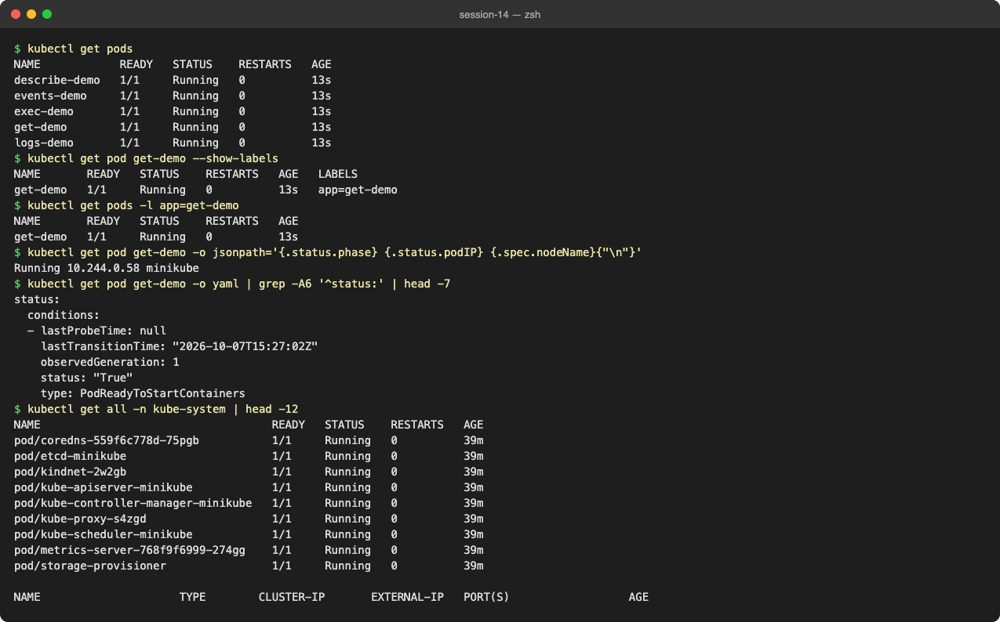

### `kubectl describe`: "what details explain it?"

Spec + status + conditions + **events** in human-readable form. This is the first stop for anything stuck before the app runs (Pending, image pulls, mounts).

```text
$ kubectl describe pod describe-demo | grep -vE '^\s+/var/run|kube-api-access|ConfigMapName|ConfigMapOptional|DownwardAPI|TokenExpiration' 
Name:             describe-demo
Namespace:        default
Priority:         0
Service Account:  default
Node:             minikube/192.168.49.2
Start Time:       Wed, 07 Oct 2026 20:57:02 +0530
Labels:           app=describe-demo
Annotations:      <none>
Status:           Running
IP:               10.244.0.59
IPs:
  IP:  10.244.0.59
Containers:
  nginx:
    Container ID:   containerd://688822917e47f6b611df8605150da49a85871676764eff1ddc7dcb22979867b1
    Image:          nginx:1.27
    Image ID:       docker.io/library/nginx@sha256:6784fb0834aa7dbbe12e3d7471e69c290df3e6ba810dc38b34ae33d3c1c05f7d
    Port:           80/TCP
    Host Port:      0/TCP
    State:          Running
      Started:      Wed, 07 Oct 2026 20:57:02 +0530
    Ready:          True
    Restart Count:  0
    Environment:    <none>
    Mounts:
Conditions:
  Type                        Status
  PodReadyToStartContainers   True 
  Initialized                 True 
  Ready                       True 
  ContainersReady             True 
  PodScheduled                True 
Volumes:
    Type:                    Projected (a volume that contains injected data from multiple sources)
    Optional:                false
QoS Class:                   BestEffort
Node-Selectors:              <none>
Tolerations:                 node.kubernetes.io/not-ready:NoExecute op=Exists for 300s
                             node.kubernetes.io/unreachable:NoExecute op=Exists for 300s
Events:
  Type    Reason     Age   From               Message
  ----    ------     ----  ----               -------
  Normal  Scheduled  14s   default-scheduler  Successfully assigned default/describe-demo to minikube
  Normal  Pulled     14s   kubelet            spec.containers{nginx}: Container image "nginx:1.27" already present on machine and can be accessed by the pod
  Normal  Created    14s   kubelet            spec.containers{nginx}: Container created
  Normal  Started    14s   kubelet            spec.containers{nginx}: Container started
```

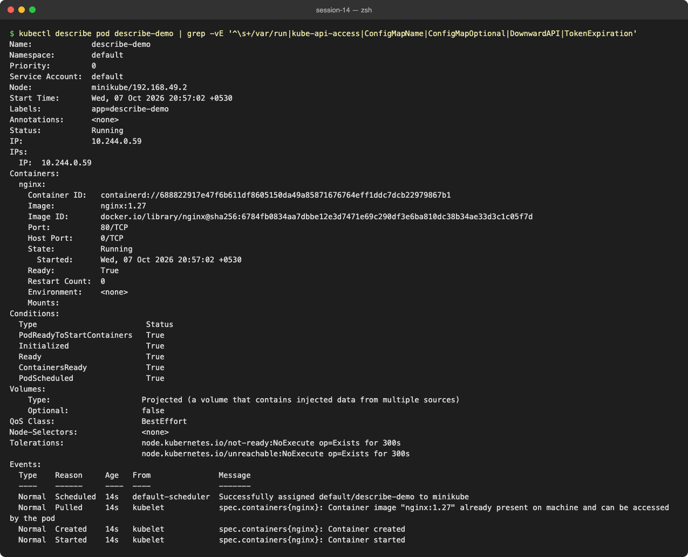

### `kubectl logs`: "what does the app say?"

stdout/stderr of the container. Useful flags: `--tail`, `--since`, `--timestamps`, `-f`, `-c <container>`, `-l <selector> --prefix`, `--previous` (the last terminated instance).

```text
$ kubectl logs logs-demo
Application started
Connecting to database...
Database connection successful
Application is running
Application is healthy
Application is healthy
Application is healthy
$ kubectl logs logs-demo --tail=2
Application is healthy
Application is healthy
$ kubectl logs logs-demo --timestamps --since=10s
2026-10-07T15:27:07.615289176Z Application is healthy
2026-10-07T15:27:12.617384137Z Application is healthy
$ kubectl logs -l app=get-demo --tail=3 --prefix
[pod/get-demo/nginx] 2026/10/07 15:27:02 [notice] 1#1: start worker process 36
[pod/get-demo/nginx] 2026/10/07 15:27:02 [notice] 1#1: start worker process 37
[pod/get-demo/nginx] 2026/10/07 15:27:02 [notice] 1#1: start worker process 38
```

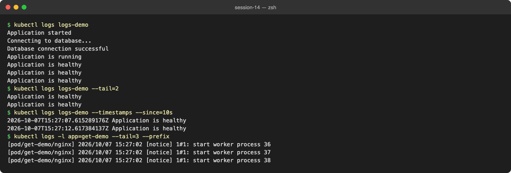

### `kubectl exec`: "what does it look like from inside?"

Run a command in the running container: check config files, DNS (`/etc/resolv.conf`), env vars, and test `localhost` vs the network.

```text
$ kubectl exec exec-demo -- nginx -v
nginx version: nginx/1.27.5
$ kubectl exec exec-demo -- curl -s localhost | grep -i '<h1>'
<h1>Welcome to nginx!</h1>
$ kubectl exec exec-demo -- cat /etc/resolv.conf
search default.svc.cluster.local svc.cluster.local cluster.local
nameserver 10.96.0.10
options ndots:5
$ kubectl exec exec-demo -- sh -c 'hostname; env | grep -E "KUBERNETES_SERVICE_HOST|HOSTNAME"'
exec-demo
HOSTNAME=exec-demo
KUBERNETES_SERVICE_HOST=10.96.0.1
$ kubectl exec exec-demo -- ls /usr/share/nginx/html
50x.html
index.html
# interactive shell: kubectl exec -it exec-demo -- bash
```

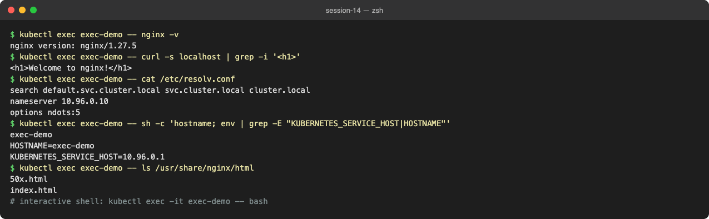

### `kubectl events`: "what happened, in order?"

Events are short-lived (1 h by default) records from the scheduler, kubelet and controllers. `kubectl events --for <obj>` filters to one object; `--field-selector type=Warning` shows only problems.

```text
$ kubectl events --for pod/events-demo
LAST SEEN   TYPE     REASON      OBJECT            MESSAGE
26s         Normal   Scheduled   Pod/events-demo   Successfully assigned default/events-demo to minikube
26s         Normal   Pulled      Pod/events-demo   Container image "nginx:1.27" already present on machine and can be accessed by the pod
26s         Normal   Created     Pod/events-demo   Container created
26s         Normal   Started     Pod/events-demo   Container started
$ kubectl get events --sort-by=.lastTimestamp | tail -6
26s         Normal    Scheduled                      pod/describe-demo                              Successfully assigned default/describe-demo to minikube
26s         Normal    Started                        pod/exec-demo                                  Container started
26s         Normal    Created                        pod/exec-demo                                  Container created
26s         Normal    Scheduled                      pod/exec-demo                                  Successfully assigned default/exec-demo to minikube
26s         Normal    Started                        pod/events-demo                                Container started
26s         Normal    Created                        pod/events-demo                                Container created
$ kubectl get events --field-selector type=Warning -A | head -6
NAMESPACE       LAST SEEN   TYPE      REASON                         OBJECT                                         MESSAGE
default         3m57s       Warning   Unhealthy                      pod/hpa-chart-demo-chart-759b5f8c5b-zmjcr      Readiness probe failed: Get "http://10.244.0.57:80/": dial tcp 10.244.0.57:80: connect: connection refused
default         3m42s       Warning   FailedGetResourceMetric        horizontalpodautoscaler/hpa-chart-demo-chart   failed to get cpu utilization: unable to get metrics for resource cpu: no metrics returned from resource metrics API
default         3m42s       Warning   FailedComputeMetricsReplicas   horizontalpodautoscaler/hpa-chart-demo-chart   invalid metrics (1 invalid out of 1), first error is: failed to get cpu resource metric value: failed to get cpu utilization: unable to get metrics for resource cpu: no metrics returned from resource metrics API
default         36m         Warning   FailedGetResourceMetric        horizontalpodautoscaler/hpa-demo               failed to get cpu utilization: unable to get metrics for resource cpu: no metrics returned from resource metrics API
default         36m         Warning   FailedComputeMetricsReplicas   horizontalpodautoscaler/hpa-demo               invalid metrics (1 invalid out of 1), first error is: failed to get cpu resource metric value: failed to get cpu utilization: unable to get metrics for resource cpu: no metrics returned from resource metrics API
$ kubectl get events --field-selector involvedObject.name=events-demo -o custom-columns=TIME:.lastTimestamp,REASON:.reason,FROM:.source.component
TIME                   REASON      FROM
2026-10-07T15:27:02Z   Scheduled   default-scheduler
2026-10-07T15:27:02Z   Pulled      kubelet
2026-10-07T15:27:02Z   Created     kubelet
2026-10-07T15:27:02Z   Started     kubelet
```

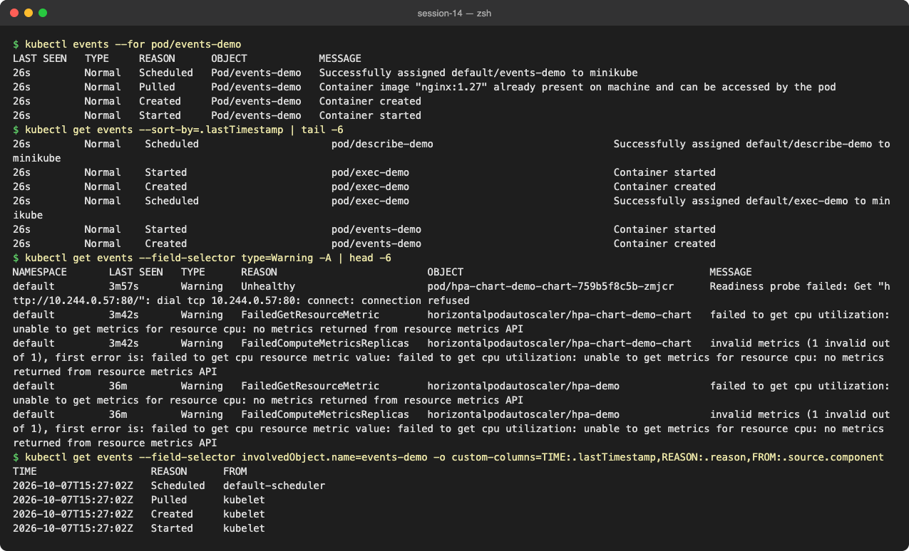

### `kubectl explain`: "what does this field mean?"

The API documentation built into the cluster, exact for its version. Good for checking whether a field exists and what its default is (e.g. `imagePullPolicy` defaults to `Always` only for `:latest`).

```text
$ kubectl explain pod.spec.containers.imagePullPolicy
KIND:       Pod
VERSION:    v1

FIELD: imagePullPolicy <string>
ENUM:
    Always
    IfNotPresent
    Never

DESCRIPTION:
    Image pull policy. One of Always, Never, IfNotPresent. Defaults to Always if
    :latest tag is specified, or IfNotPresent otherwise. Cannot be updated. More
    info: https://kubernetes.io/docs/concepts/containers/images#updating-images
    
    Possible enum values:
     - `"Always"` means that kubelet always attempts to pull the latest image.
    Container will fail If the pull fails.
     - `"IfNotPresent"` means that kubelet pulls if the image isn't present on
    disk. Container will fail if the image isn't present and the pull fails.
     - `"Never"` means that kubelet never pulls an image, but only uses a local
    image. Container will fail if the image isn't present
    

$ kubectl explain deployment.spec.strategy.rollingUpdate | head -20
GROUP:      apps
KIND:       Deployment
VERSION:    v1

FIELD: rollingUpdate <RollingUpdateDeployment>


DESCRIPTION:
    Rolling update config params. Present only if DeploymentStrategyType =
    RollingUpdate.
    Spec to control the desired behavior of rolling update.
    
FIELDS:
  maxSurge	<IntOrString>
    The maximum number of pods that can be scheduled above the desired number of
    pods. Value can be an absolute number (ex: 5) or a percentage of desired
    pods (ex: 10%). This can not be 0 if MaxUnavailable is 0. Absolute number is
    calculated from percentage by rounding up. Defaults to 25%. Example: when
    this is set to 30%, the new ReplicaSet can be scaled up immediately when the
    rolling update starts, such that the total number of old and new pods do not
$ kubectl explain service.spec --recursive | head -15
KIND:       Service
VERSION:    v1

FIELD: spec <ServiceSpec>


DESCRIPTION:
    Spec defines the behavior of a service.
    https://git.k8s.io/community/contributors/devel/sig-architecture/api-conventions.md#spec-and-status
    ServiceSpec describes the attributes that a user creates on a service.
    
FIELDS:
  allocateLoadBalancerNodePorts	<boolean>
  clusterIP	<string>
  clusterIPs	<[]string>
```

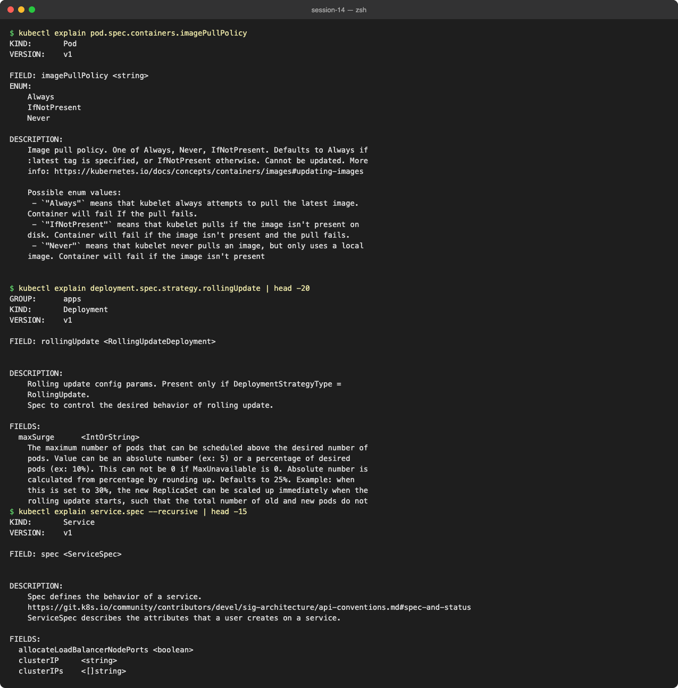

### `kubectl top`: "how much CPU/memory?"

Live usage from metrics-server (needs the addon). Used to size requests/limits and to spot OOM or CPU-throttling candidates.

```text
$ kubectl top nodes
NAME       CPU(cores)   CPU(%)   MEMORY(bytes)   MEMORY(%)   
minikube   193m         1%       1073Mi          13%         
$ kubectl top pods
NAME        CPU(cores)   MEMORY(bytes)   
exec-demo   2m           8Mi             
get-demo    2m           8Mi             
logs-demo   1m           0Mi             
$ kubectl top pods -A --sort-by=memory | head -6
NAMESPACE       NAME                                       CPU(cores)   MEMORY(bytes)   
kube-system     kube-apiserver-minikube                    49m          276Mi           
ingress-nginx   ingress-nginx-controller-d7cd8c989-29kgl   4m           128Mi           
kube-system     kube-controller-manager-minikube           14m          74Mi            
kube-system     etcd-minikube                              23m          58Mi            
kube-system     kube-scheduler-minikube                    9m           29Mi            
$ kubectl top pod exec-demo --containers
POD         NAME    CPU(cores)   MEMORY(bytes)   
exec-demo   nginx   2m           8Mi             
# If you see 'metrics not available yet' the pod is younger than the first metrics-server scrape (~15-60s).
```

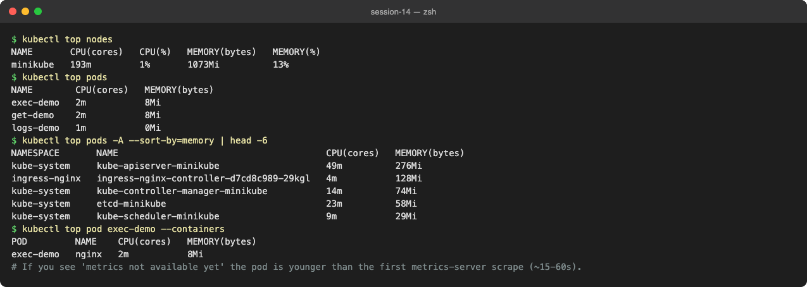

### `kubectl get -o wide`: "where is it running?"

Adds Pod IP, node, nominated node, readiness gates (and node IPs / OS / runtime for nodes, selectors for Services), which are the facts you need for networking problems.

```text
$ kubectl get pods -o wide
NAME            READY   STATUS    RESTARTS   AGE   IP            NODE       NOMINATED NODE   READINESS GATES
describe-demo   1/1     Running   0          29s   10.244.0.59   minikube   <none>           <none>
events-demo     1/1     Running   0          29s   10.244.0.62   minikube   <none>           <none>
exec-demo       1/1     Running   0          29s   10.244.0.61   minikube   <none>           <none>
get-demo        1/1     Running   0          29s   10.244.0.58   minikube   <none>           <none>
logs-demo       1/1     Running   0          29s   10.244.0.60   minikube   <none>           <none>
$ kubectl get nodes -o wide
NAME       STATUS   ROLES           AGE   VERSION   INTERNAL-IP    EXTERNAL-IP   OS-IMAGE                         KERNEL-VERSION            CONTAINER-RUNTIME
minikube   Ready    control-plane   40m   v1.37.0   192.168.49.2   <none>        Debian GNU/Linux 12 (bookworm)   7.0.12-linuxkit (arm64)   containerd://2.3.4
$ kubectl get svc -A -o wide
NAMESPACE       NAME                                 TYPE        CLUSTER-IP       EXTERNAL-IP   PORT(S)                      AGE   SELECTOR
default         kubernetes                           ClusterIP   10.96.0.1        <none>        443/TCP                      40m   <none>
ingress-nginx   ingress-nginx-controller             NodePort    10.104.70.17     <none>        80:30893/TCP,443:30791/TCP   40m   app.kubernetes.io/component=controller,app.kubernetes.io/instance=ingress-nginx,app.kubernetes.io/name=ingress-nginx
ingress-nginx   ingress-nginx-controller-admission   ClusterIP   10.103.3.202     <none>        443/TCP                      40m   app.kubernetes.io/component=controller,app.kubernetes.io/instance=ingress-nginx,app.kubernetes.io/name=ingress-nginx
kube-system     kube-dns                             ClusterIP   10.96.0.10       <none>        53/UDP,53/TCP,9153/TCP       40m   k8s-app=kube-dns
kube-system     metrics-server                       ClusterIP   10.100.182.215   <none>        443/TCP                      40m   k8s-app=metrics-server
```

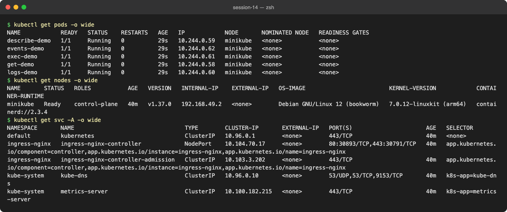

---

## Task 2: Troubleshoot Common Issues

Each issue: **problem → investigation → root cause → fix → verification**, all in one transcript.

### 2.1 CrashLoopBackOff

**Problem:** `crash-demo` keeps restarting. **Files:** [06-crashloopbackoff/](06-crashloopbackoff/)

```text
# 1. Identify (pod applied ~70s earlier from 06-crashloopbackoff/broken-pod.yaml)
$ kubectl get pod crash-demo
NAME         READY   STATUS   RESTARTS      AGE
crash-demo   0/1     Error    3 (62s ago)   76s
$ kubectl get pod crash-demo -w --request-timeout=1s 2>/dev/null; kubectl events --for pod/crash-demo | grep -E 'BackOff|Started'
NAME         READY   STATUS   RESTARTS      AGE
crash-demo   0/1     Error    3 (62s ago)   76s
4m26s (x4 over 5m)      Normal    Started     Pod/crash-demo   Container started
4m25s (x3 over 4m59s)   Warning   BackOff     Pod/crash-demo   Back-off restarting failed container app in pod crash-demo_default(4035b867-9a99-4b60-a336-545442c18614)
4m14s                   Normal    Started     Pod/crash-demo   Container started
2m47s (x4 over 3m27s)   Normal    Started     Pod/crash-demo   Container started
2m47s (x3 over 3m25s)   Warning   BackOff     Pod/crash-demo   Back-off restarting failed container app in pod crash-demo_default(1fbbcec5-6841-4c56-820c-5e9bf4ffefbd)
2m3s                    Normal    Started     Pod/crash-demo   Container started
41s (x4 over 76s)       Normal    Started     Pod/crash-demo   Container started
40s (x3 over 75s)       Warning   BackOff     Pod/crash-demo   Back-off restarting failed container app in pod crash-demo_default(ec48ae4e-6398-43f9-bd6a-9a2e51477e91)
# 2. Investigate
$ kubectl describe pod crash-demo | sed -n '/State:/,/Restart Count/p'
    State:          Terminated
      Reason:       Error
      Exit Code:    1
      Started:      Wed, 07 Oct 2026 21:02:25 +0530
      Finished:     Wed, 07 Oct 2026 21:02:25 +0530
    Last State:     Terminated
      Reason:       Error
      Exit Code:    1
      Started:      Wed, 07 Oct 2026 21:02:03 +0530
      Finished:     Wed, 07 Oct 2026 21:02:03 +0530
    Ready:          False
    Restart Count:  3
$ kubectl logs crash-demo
Application starting...
Something went wrong!
$ minikube ssh -- sudo crictl ps -a --name app
CONTAINER           IMAGE               CREATED             STATE               NAME                ATTEMPT             POD ID              POD                 NAMESPACE
484293f350006       b7c873bd97bdc       41 seconds ago      Exited              app                 3                   88ce2da984e9f       crash-demo          default
# 3. Root cause: the container command ends with 'exit 1'. The process exits, kubelet restarts it (restartPolicy Always) with growing back-off.
# 4. Fix: run a long-lived process instead of exiting (fixed-pod.yaml). Pod spec containers are immutable -> recreate.
$ kubectl delete pod crash-demo --wait && kubectl apply -f 06-crashloopbackoff/fixed-pod.yaml
pod "crash-demo" deleted from default namespace
pod/crash-demo created
# 5. Verify
$ kubectl get pod crash-demo
NAME         READY   STATUS    RESTARTS   AGE
crash-demo   1/1     Running   0          20s
$ kubectl logs crash-demo
Application starting...
Application is healthy
```

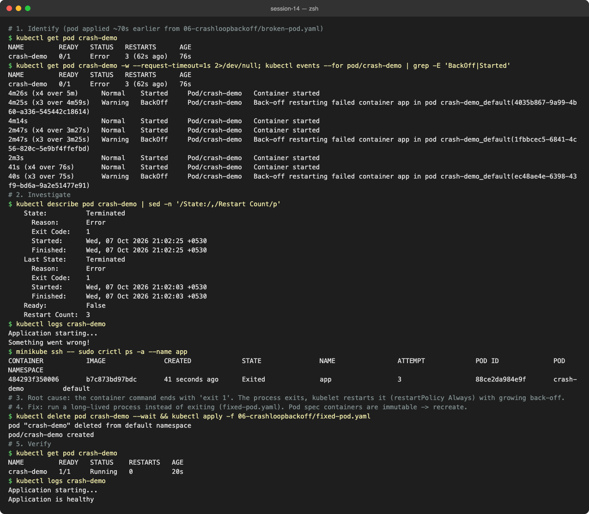

| | |
| :--- | :--- |
| Root cause | the command ends with `exit 1`; with `restartPolicy: Always` the kubelet restarts it with exponential back-off (10 s, 20 s, 40 s … 5 min) |
| Fix | `fixed-pod.yaml` keeps a long-running process (`sleep 3600`); recreated the Pod (container spec is immutable) |
| Verified | `Running`, 0 restarts, healthy log line |

**Observed on Kubernetes v1.37:** during the back-off the STATUS column showed **`Error`** (the container stays `terminated`, exit code 1) instead of the familiar `CrashLoopBackOff` text. The crash loop is still clearly identified by the climbing restart count and the `BackOff … Back-off restarting failed container` events. Also, only the most recent exited container is kept (`crictl ps -a` shows a single `Exited` attempt), so `kubectl logs` (no `--previous`) is what shows the failing run's output here.

### 2.2 ImagePullBackOff and ErrImagePull

**Problem:** `image-demo` never starts. **Files:** [07-imagepullbackoff/](07-imagepullbackoff/)

```text
# 1. Identify
$ kubectl apply -f 07-imagepullbackoff/broken-pod.yaml
pod/image-demo created
$ kubectl get pod image-demo -w
NAME         READY   STATUS              RESTARTS   AGE
image-demo   0/1   ContainerCreating   0     0s
image-demo   0/1   ErrImagePull   0     4s
image-demo   0/1   ImagePullBackOff   0     17s
# ErrImagePull = the pull just failed. ImagePullBackOff = kubelet is waiting (back-off) before retrying.
# 2. Investigate
$ kubectl describe pod image-demo | grep -E 'Image:|Reason|Message' | head -4
    Image:          nginx:this-image-does-not-exist
      Reason:       ImagePullBackOff
  Type     Reason     Age               From               Message
$ kubectl events --for pod/image-demo | grep -E 'Failed|BackOff' | cut -c1-220
13s                Warning   Failed      Pod/image-demo   Failed to pull image "nginx:this-image-does-not-exist": failed to pull and unpack image "docker.io/library/nginx:this-image-does-not-exist": failed to resolve ref
13s                Warning   Failed      Pod/image-demo   Error: ErrImagePull
13s                Normal    BackOff     Pod/image-demo   Back-off pulling image "nginx:this-image-does-not-exist"
13s                Warning   Failed      Pod/image-demo   Error: ImagePullBackOff
# 3. Root cause: tag 'this-image-does-not-exist' is not in docker.io/library/nginx (registry answers 'not found').
# 4. Fix: use an existing tag. image is one of the few mutable Pod fields, so patch in place:
$ kubectl set image pod/image-demo app=nginx:1.27
pod/image-demo image updated
# 5. Verify
$ kubectl get pod image-demo
NAME         READY   STATUS    RESTARTS   AGE
image-demo   1/1     Running   0          20s
$ kubectl get pod image-demo -o jsonpath='{.spec.containers[0].image}  restarts={.status.containerStatuses[0].restartCount}{"\n"}'
nginx:1.27  restarts=0
```

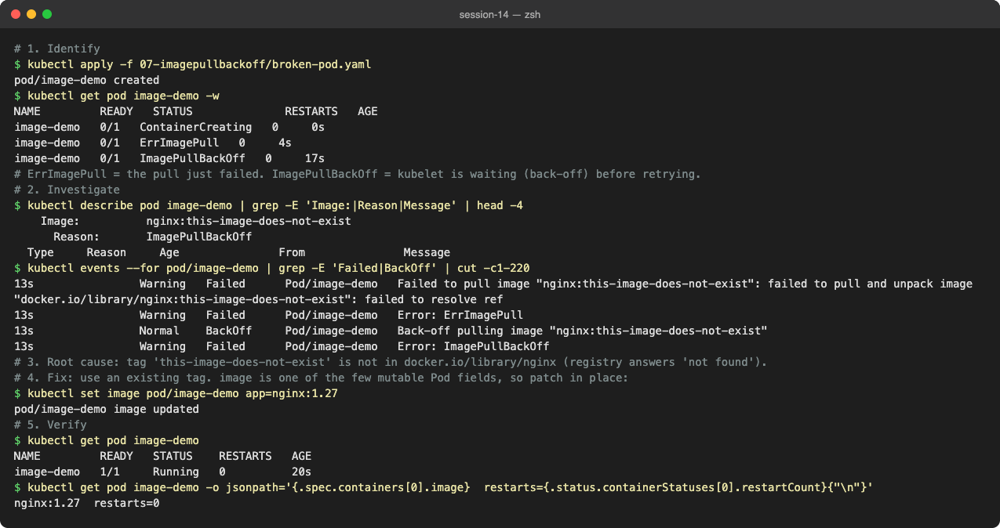

| | |
| :--- | :--- |
| `ErrImagePull` | the pull attempt just failed |
| `ImagePullBackOff` | the kubelet is waiting (back-off) before the next pull attempt; same root cause |
| Root cause | tag `this-image-does-not-exist` does not exist in `docker.io/library/nginx` |
| Fix | `kubectl set image pod/image-demo app=nginx:1.27` (`image` is one of the few mutable Pod fields, so no recreate) |
| Other causes to check | typo in repo name, private registry without `imagePullSecrets`, wrong architecture, and Docker Hub rate limiting (`429 Too Many Requests`), which I actually hit later in this session |

### 2.3 Pending

**Problem:** `pending-demo` has no node and no IP. **Files:** [08-pending-pods/](08-pending-pods/)

```text
# 1. Identify
$ kubectl apply -f 08-pending-pods/broken-pod.yaml
pod/pending-demo created
$ kubectl get pod pending-demo -o wide
NAME           READY   STATUS    RESTARTS   AGE   IP       NODE     NOMINATED NODE   READINESS GATES
pending-demo   0/1     Pending   0          8s    <none>   <none>   <none>           <none>
# 2. Investigate: no node, no container -> it is the scheduler, so look at describe/events
$ kubectl describe pod pending-demo | sed -n '/Node-Selectors/p;/Events:/,$p'
Node-Selectors:              kubernetes.io/hostname=node-that-does-not-exist
Events:
  Type     Reason            Age   From               Message
  ----     ------            ----  ----               -------
  Warning  FailedScheduling  8s    default-scheduler  0/1 nodes are available: 1 node(s) didn't match Pod's node affinity/selector. preemption: 0/1 nodes are available: 1 Preemption is not helpful for scheduling.
$ kubectl get nodes --show-labels | tr ',' '\n' | grep hostname
kubernetes.io/hostname=minikube
# 3. Root cause: nodeSelector kubernetes.io/hostname=node-that-does-not-exist matches 0 of 1 nodes.
# 4. Fix: remove the nodeSelector (nodeSelector is immutable on a Pod -> recreate)
$ kubectl delete pod pending-demo --wait && kubectl apply -f 08-pending-pods/fixed-pod.yaml
pod "pending-demo" deleted from default namespace
pod/pending-demo created
# 5. Verify
$ kubectl get pod pending-demo -o wide
NAME           READY   STATUS    RESTARTS   AGE   IP            NODE       NOMINATED NODE   READINESS GATES
pending-demo   1/1     Running   0          1s    10.244.0.72   minikube   <none>           <none>
```

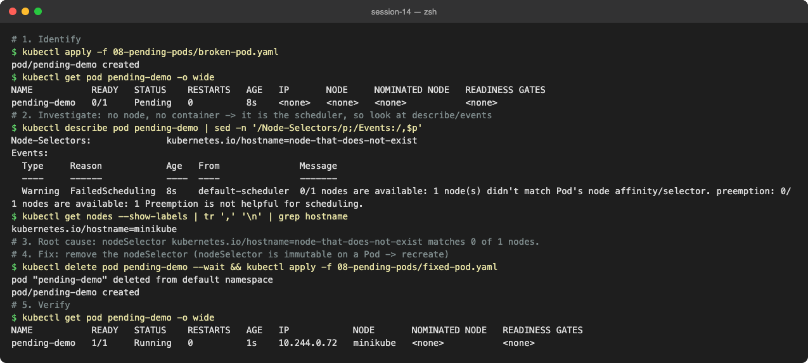

| | |
| :--- | :--- |
| Root cause | `nodeSelector: kubernetes.io/hostname=node-that-does-not-exist` matches 0 of 1 nodes (scheduler event `FailedScheduling`) |
| Fix | remove the selector (`fixed-pod.yaml`) and recreate |
| Other causes | requests larger than any node (see gauntlet scenario 3: `Insufficient cpu, Insufficient memory`), taints without tolerations, unbound PVC, quota |

### 2.4 ContainerCreating

**Problem:** `creating-demo` is scheduled but stays `ContainerCreating`. **Files:** [10-containercreating/](10-containercreating/)

```text
# 1. Identify
$ kubectl apply -f 10-containercreating/broken-pod.yaml
pod/creating-demo created
$ kubectl get pod creating-demo
NAME            READY   STATUS              RESTARTS   AGE
creating-demo   0/1     ContainerCreating   0          20s
# 2. Investigate: scheduled (has a node) but the container never starts -> kubelet side; events say why
$ kubectl events --for pod/creating-demo | grep -E 'Scheduled|FailedMount'
20s                Normal    Scheduled     Pod/creating-demo   Successfully assigned default/creating-demo to minikube
4s (x6 over 20s)   Warning   FailedMount   Pod/creating-demo   MountVolume.SetUp failed for volume "site" : configmap "site-content" not found
$ kubectl get configmap site-content
Error from server (NotFound): configmaps "site-content" not found
# 3. Root cause: volume 'site' references ConfigMap 'site-content' which does not exist, so the mount fails.
# 4. Fix: create the ConfigMap. No need to recreate the Pod: kubelet retries the mount.
$ kubectl apply -f 10-containercreating/fix-configmap.yaml
configmap/site-content created
# 5. Verify
$ kubectl get pod creating-demo
NAME            READY   STATUS    RESTARTS   AGE
creating-demo   1/1     Running   0          32s
$ kubectl exec creating-demo -- curl -s localhost
<h1>creating-demo fixed: ConfigMap mounted</h1>
```

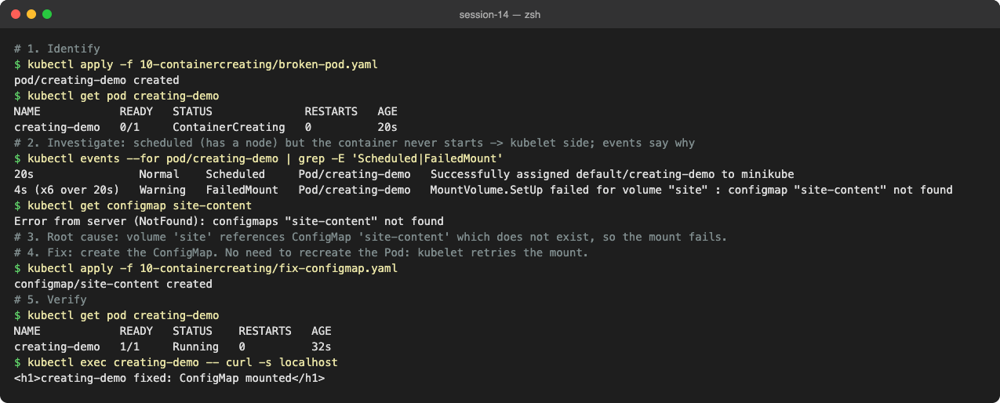

| | |
| :--- | :--- |
| Root cause | the `site` volume references ConfigMap `site-content`, which does not exist → `FailedMount` every few seconds |
| Fix | create the ConfigMap ([fix-configmap.yaml](10-containercreating/fix-configmap.yaml)); the kubelet retried the mount and the **same** Pod started, no recreate needed |
| Other causes | missing Secret, PVC not bound / volume attach timeout, CNI not ready, slow image pull of a big image |

### 2.5 Service connectivity

**Problem:** pods are healthy but `http://web-service` fails. **Files:** [09-service-dns-troubleshooting/](09-service-dns-troubleshooting/) (`deployment.yaml`, `service.yaml`)

```text
# 1. Identify
$ kubectl apply -f 09-service-dns-troubleshooting/service.yaml
service/web-service created
$ kubectl exec curl-client -- curl -s -m 3 http://web-service || echo "curl exit code $?"
command terminated with exit code 7
curl exit code 7
# 2. Investigate: pods fine? DNS fine? service has endpoints?
$ kubectl get pods -l app=web -o wide
NAME                   READY   STATUS    RESTARTS   AGE   IP            NODE       NOMINATED NODE   READINESS GATES
web-557577df75-bdtf2   1/1     Running   0          10m   10.244.0.74   minikube   <none>           <none>
web-557577df75-h6rc8   1/1     Running   0          10m   10.244.0.75   minikube   <none>           <none>
$ kubectl exec dns-test -- nslookup web-service | tail -2
Address: 10.97.23.241

$ kubectl get endpointslices -l kubernetes.io/service-name=web-service
NAME                ADDRESSTYPE   PORTS     ENDPOINTS   AGE
web-service-697f9   IPv4          <unset>   <unset>     1s
$ kubectl describe service web-service | grep -E 'Selector|TargetPort|Endpoints'
Selector:                 app=web-ahsgdf
TargetPort:               80/TCP
Endpoints:                
$ kubectl get pods --show-labels -l app=web
NAME                   READY   STATUS    RESTARTS   AGE   LABELS
web-557577df75-bdtf2   1/1     Running   0          10m   app=web,pod-template-hash=557577df75
web-557577df75-h6rc8   1/1     Running   0          10m   app=web,pod-template-hash=557577df75
# 3. Root cause: Service selector app=web-ahsgdf, Pod label app=web -> selector matches nothing -> no endpoints.
#    DNS resolves (the Service exists) but nothing is behind the ClusterIP, so the connection is refused.
# 4. Fix: make the selector match the Pod label
$ kubectl patch service web-service -p '{"spec":{"selector":{"app":"web"}}}'
service/web-service patched
# 5. Verify
$ kubectl get endpointslices -l kubernetes.io/service-name=web-service
NAME                ADDRESSTYPE   PORTS   ENDPOINTS                 AGE
web-service-697f9   IPv4          80      10.244.0.75,10.244.0.74   1s
$ kubectl exec curl-client -- curl -s -m 3 -o /dev/null -w 'HTTP %{http_code}\n' http://web-service
HTTP 000
command terminated with exit code 7
# The curl 1s after the patch raced kube-proxy (rules not programmed yet). A few seconds later:
$ kubectl exec curl-client -- curl -s -m 3 -o /dev/null -w 'HTTP %{http_code}\n' http://web-service
HTTP 200
$ kubectl exec curl-client -- curl -s -m 3 http://web-service | grep '<h1>'
<h1>Welcome to nginx!</h1>
```

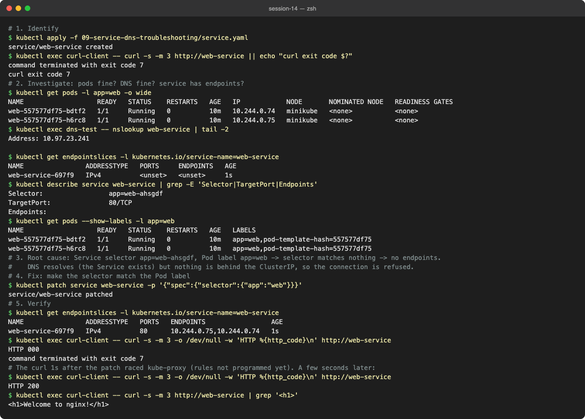

| | |
| :--- | :--- |
| Root cause | Service selector `app=web-ahsgdf` vs Pod label `app=web` → no endpoints. DNS still resolves (the Service object exists), so it fails at the TCP connect (curl exit 7, connection refused) |
| Fix | `kubectl patch service web-service -p '{"spec":{"selector":{"app":"web"}}}'` |
| Note | the first curl right after the patch still failed: kube-proxy had not programmed the new endpoints yet (~1–2 s). The retry returned `HTTP 200` |

### 2.6 DNS issues

Before I could do the DNS task, the instructor's debug pod itself failed:

```text
# Real issue hit while doing the DNS task: the instructor's debug pod never started
$ kubectl get pod dns-test
NAME       READY   STATUS             RESTARTS   AGE
dns-test   0/1     ImagePullBackOff   0          4m54s
$ kubectl events --for pod/dns-test | grep 'Failed to pull' | tail -1 | cut -c1-330
107s (x5 over 4m53s)   Warning   Failed      Pod/dns-test   Failed to pull image "registry.k8s.io/e2e-test-images/dnsutils:1.3": rpc error: code = NotFound desc = failed to pull and unpack image "registry.k8s.io/e2e-test-images/dnsutils:1.3": failed to resolve reference "registry.k8s.io/e2e-test-images/dnsutils:1.3": registry.k8
$ docker manifest inspect registry.k8s.io/e2e-test-images/jessie-dnsutils:1.3 | grep architecture
            "architecture": "amd64",
            "architecture": "arm",
            "architecture": "arm64",
            "architecture": "ppc64le",
            "architecture": "s390x",
# Root cause: wrong image name (dnsutils:1.3 does not exist). Fix: jessie-dnsutils:1.3 -> dns-test-pod-fixed.yaml
$ kubectl delete pod dns-test --wait && kubectl apply -f 09-service-dns-troubleshooting/dns-test-pod-fixed.yaml
pod "dns-test" deleted from default namespace
pod/dns-test created
$ kubectl get pod dns-test
NAME       READY   STATUS    RESTARTS   AGE
dns-test   1/1     Running   0          49s
$ kubectl exec dns-test -- sh -c 'which nslookup dig curl wget'
/usr/bin/nslookup
/usr/bin/dig
command terminated with exit code 1
```

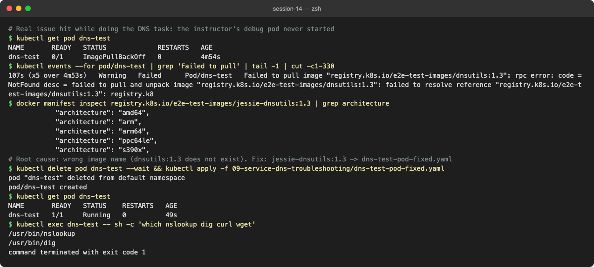

`registry.k8s.io/e2e-test-images/dnsutils:1.3` does not exist; the Kubernetes DNS-debugging image is `jessie-dnsutils:1.3`. Fixed in [dns-test-pod-fixed.yaml](09-service-dns-troubleshooting/dns-test-pod-fixed.yaml). It has `nslookup` and `dig` but no curl, so HTTP tests use a `curlimages/curl` pod (`curl-client`).

**Problem:** a client in `default` cannot reach Service `api`.

```text
# 1. Identify: client in namespace 'default' cannot reach the 'api' service by name
$ kubectl create namespace backend && kubectl create deployment api --image=nginx:1.27 -n backend && kubectl expose deployment api --port 80 -n backend
namespace/backend created
deployment.apps/api created
service/api exposed
$ kubectl exec curl-client -- curl -s -m 3 http://api || echo "curl exit code $?"
command terminated with exit code 6
curl exit code 6
# 2. Investigate DNS from inside the cluster
$ kubectl exec dns-test -- nslookup api
Server:		10.96.0.10
Address:	10.96.0.10#53

** server can't find api: NXDOMAIN

command terminated with exit code 1
$ kubectl exec dns-test -- cat /etc/resolv.conf
search default.svc.cluster.local svc.cluster.local cluster.local
nameserver 10.96.0.10
options ndots:5
$ kubectl get svc -A | grep -E 'NAMESPACE| api '
NAMESPACE       NAME                                 TYPE        CLUSTER-IP       EXTERNAL-IP   PORT(S)                      AGE
backend         api                                  ClusterIP   10.100.248.25    <none>        80/TCP                       1s
$ kubectl get pods -n kube-system -l k8s-app=kube-dns
NAME                       READY   STATUS    RESTARTS   AGE
coredns-559f6c778d-75pgb   1/1     Running   0          58m
$ kubectl exec dns-test -- nslookup kubernetes.default | tail -2
Address: 10.96.0.1

# 3. Root cause: 'api' is expanded with the search list to api.default.svc.cluster.local, but the Service is in
#    namespace 'backend'. CoreDNS itself is healthy (kubernetes.default resolves).
# 4. Fix: call it as <service>.<namespace> or by its full FQDN
$ kubectl exec dns-test -- nslookup api.backend.svc.cluster.local | tail -2
Address: 10.100.248.25

# 5. Verify
$ kubectl exec curl-client -- curl -s -m 3 -o /dev/null -w 'HTTP %{http_code} via api.backend\n' http://api.backend
HTTP 000 via api.backend
command terminated with exit code 7
$ kubectl exec dns-test -- dig +short api.backend.svc.cluster.local web-service.default.svc.cluster.local
10.100.248.25
10.97.23.241
# Same kube-proxy timing as above (the api Service was 1s old). Retry:
$ kubectl exec curl-client -- curl -s -m 3 -o /dev/null -w 'HTTP %{http_code} via api.backend\n' http://api.backend
HTTP 200 via api.backend
$ kubectl exec curl-client -- curl -s -m 3 -o /dev/null -w 'HTTP %{http_code} via FQDN\n' http://api.backend.svc.cluster.local
HTTP 200 via FQDN
```

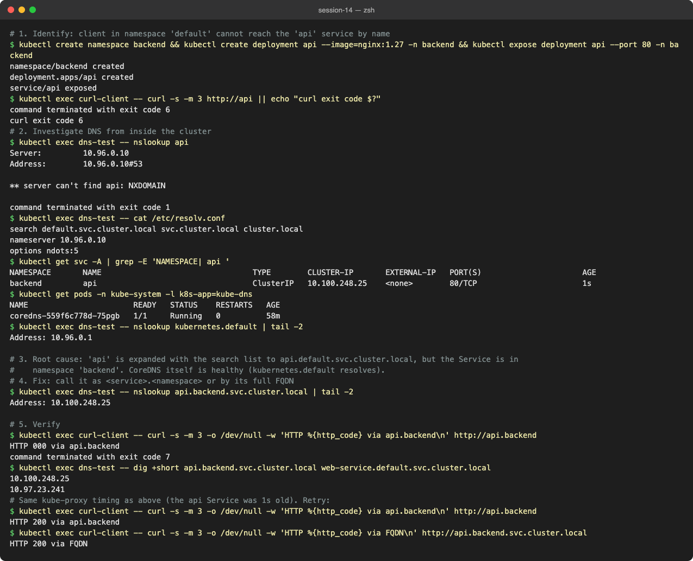

| | |
| :--- | :--- |
| Root cause | short name `api` is expanded using the pod's search list (`default.svc.cluster.local` first) → `api.default.svc.cluster.local` → NXDOMAIN, because the Service lives in namespace `backend`. CoreDNS is healthy: `kubernetes.default` resolves |
| Fix | call `api.backend` or the FQDN `api.backend.svc.cluster.local` |
| Checklist | `nslookup` from a pod → `/etc/resolv.conf` (nameserver 10.96.0.10, search, ndots:5) → CoreDNS pods Running → `nslookup kubernetes.default` → Service exists in the expected namespace |

### 2.7 Pod networking issues

**Problem:** `net-app` is `Running` and has endpoints, but neither the Service nor the Pod IP answers. **Files:** [11-pod-networking/](11-pod-networking/)

```text
# 1. Identify
$ kubectl apply -f 11-pod-networking/broken-app.yaml
deployment.apps/net-app created
service/net-app created
$ kubectl get pods -l app=net-app -o wide
NAME                       READY   STATUS    RESTARTS   AGE   IP            NODE       NOMINATED NODE   READINESS GATES
net-app-66c4979cb9-vtnv7   1/1     Running   0          6s    10.244.0.82   minikube   <none>           <none>
$ kubectl exec curl-client -- curl -s -m 3 http://net-app || echo "via Service: curl exit code $?"
command terminated with exit code 7
via Service: curl exit code 7
$ kubectl exec curl-client -- curl -s -m 3 http://10.244.0.82:8000 || echo "via Pod IP: curl exit code $?"
command terminated with exit code 7
via Pod IP: curl exit code 7
# 2. Investigate: is the Service wired correctly? Then look from inside the Pod.
$ kubectl get endpointslices -l kubernetes.io/service-name=net-app
NAME            ADDRESSTYPE   PORTS   ENDPOINTS     AGE
net-app-twjq5   IPv4          8000    10.244.0.82   6s
$ kubectl exec net-app-66c4979cb9-vtnv7 -- wget -qO- -T 3 http://127.0.0.1:8000 | head -3
<!DOCTYPE HTML>
<html lang="en">
<head>
$ kubectl exec net-app-66c4979cb9-vtnv7 -- netstat -tln
Active Internet connections (only servers)
Proto Recv-Q Send-Q Local Address           Foreign Address         State       
tcp        0      0 127.0.0.1:8000          0.0.0.0:*               LISTEN      
# 3. Root cause: endpoints are correct and the app answers on localhost, but it listens on 127.0.0.1:8000,
#    not 0.0.0.0. Traffic arriving on the Pod IP (from other Pods / the Service) is refused.
# 4. Fix: bind to all interfaces (fixed-app.yaml: --bind 0.0.0.0)
$ kubectl apply -f 11-pod-networking/fixed-app.yaml && kubectl rollout status deploy/net-app --timeout=120s
deployment.apps/net-app configured
service/net-app unchanged
Waiting for deployment "net-app" rollout to finish: 1 old replicas are pending termination...
Waiting for deployment "net-app" rollout to finish: 1 old replicas are pending termination...
deployment "net-app" successfully rolled out
# 5. Verify
$ kubectl exec net-app-66c4979cb9-vtnv7 -- netstat -tln
Active Internet connections (only servers)
Proto Recv-Q Send-Q Local Address           Foreign Address         State       
tcp        0      0 127.0.0.1:8000          0.0.0.0:*               LISTEN      
$ kubectl exec curl-client -- curl -s -m 3 -o /dev/null -w 'via Service: HTTP %{http_code}\n' http://net-app
via Service: HTTP 200
# (the netstat above hit the old pod while it was still terminating; the new pod:)
$ kubectl get pods -l app=net-app
NAME                       READY   STATUS        RESTARTS   AGE
net-app-7b66b4ff44-446dw   1/1     Running       0          3s
net-app-7b66b4ff44-5zq9h   1/1     Terminating   0          32s
$ kubectl exec net-app-7b66b4ff44-446dw -- netstat -tln | grep 8000
tcp        0      0 0.0.0.0:8000            0.0.0.0:*               LISTEN
```

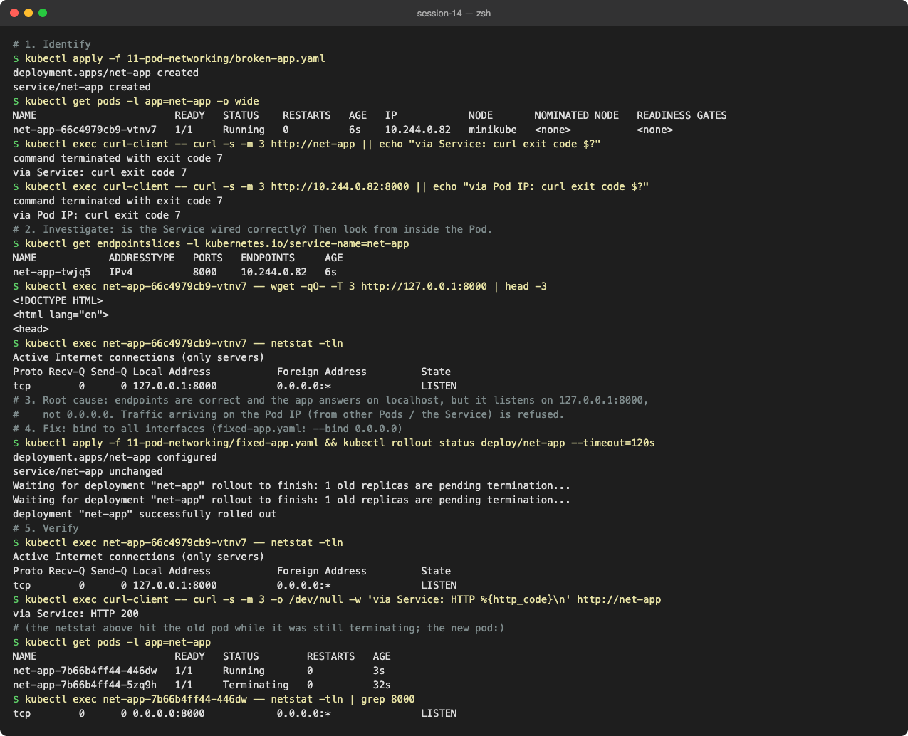

| | |
| :--- | :--- |
| Root cause | the app listens on `127.0.0.1:8000`. Inside its own container `localhost` works, but traffic arriving on the Pod IP (`10.244.x.x`) from other pods or kube-proxy is refused |
| Fix | `--bind 0.0.0.0` ([fixed-app.yaml](11-pod-networking/fixed-app.yaml)) |
| How it was found | Service → endpoints OK → curl Pod IP directly (fails) → `exec` + `wget 127.0.0.1` (works) → `netstat -tln` shows the bind address |

### 2.8 Configuration issues

**Problem:** `config-demo` shows `CreateContainerConfigError`. **Files:** [12-configuration-issues/](12-configuration-issues/)

```text
# 1. Identify
$ kubectl apply -f 12-configuration-issues/broken-pod.yaml
configmap/app-config created
pod/config-demo created
$ kubectl get pod config-demo
NAME          READY   STATUS                       RESTARTS   AGE
config-demo   0/1     CreateContainerConfigError   0          10s
# 2. Investigate
$ kubectl events --for pod/config-demo | grep -E 'Failed' | tail -1
9s (x2 over 9s)   Warning   Failed      Pod/config-demo   Error: couldn't find key LOG_LEVEL in ConfigMap default/app-config
$ kubectl get configmap app-config -o jsonpath='{.data}{"\n"}'
{"APP_MODE":"production","log_level":"debug"}
# 3. Root cause: env LOG_LEVEL reads key 'LOG_LEVEL' but the ConfigMap key is 'log_level' (keys are case-sensitive).
#    kubelet refuses to start a container whose required env source is missing -> CreateContainerConfigError.
# 4. Fix: reference the existing key (env is immutable on a Pod -> recreate)
$ kubectl delete pod config-demo --wait && kubectl apply -f 12-configuration-issues/fixed-pod.yaml
pod "config-demo" deleted from default namespace
configmap/app-config unchanged
pod/config-demo created
# 5. Verify
$ kubectl get pod config-demo
NAME          READY   STATUS    RESTARTS   AGE
config-demo   1/1     Running   0          0s
$ kubectl logs config-demo
APP_MODE=production LOG_LEVEL=debug
```

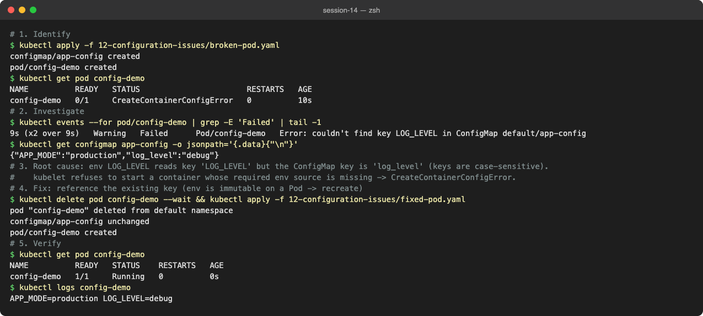

| | |
| :--- | :--- |
| Root cause | `configMapKeyRef.key: LOG_LEVEL`, but the ConfigMap key is `log_level`. Keys are case-sensitive; a required env source that is missing blocks container creation |
| Fix | reference `log_level` ([fixed-pod.yaml](12-configuration-issues/fixed-pod.yaml)) and recreate |
| Related | missing Secret key behaves the same; `optional: true` would start the container with the variable unset instead |

### Task 2 summary

| Issue | Status seen | Key command | Root cause | Fix |
| :--- | :--- | :--- | :--- | :--- |
| CrashLoopBackOff | `Error`, restarts climbing | `logs`, `describe` (Exit Code 1), events `BackOff` | process exits 1 | long-running command |
| ImagePullBackOff / ErrImagePull | `ErrImagePull` → `ImagePullBackOff` | events `Failed to pull image` | tag does not exist | `kubectl set image` |
| Pending | `Pending`, node `<none>` | `describe` → `FailedScheduling` | nodeSelector matches no node | remove selector |
| ContainerCreating | `ContainerCreating` | events `FailedMount` | ConfigMap missing | create ConfigMap |
| Service connectivity | pods Running, curl exit 7 | `get endpointslices`, `describe svc` | selector ≠ labels | fix selector |
| DNS | curl exit 6, NXDOMAIN | `nslookup`, `resolv.conf` | wrong namespace in short name | `svc.namespace` / FQDN |
| Pod networking | Running, endpoints OK, refused | curl Pod IP, `netstat -tln` | bound to 127.0.0.1 | bind 0.0.0.0 |
| Configuration | `CreateContainerConfigError` | events `couldn't find key` | wrong ConfigMap key | correct key |
| Debug image | `ImagePullBackOff` | events `not found` | `dnsutils:1.3` does not exist | `jessie-dnsutils:1.3` |

---

## Bonus: Triage Gauntlet (`scenarios/`)

The instructor's [scenarios/triage_all.sh](scenarios/triage_all.sh) deploys five broken pods. I wrote a `fixed.yaml` for each.

```text
$ bash scenarios/triage_all.sh
==================================================
      KUBERNETES INCIDENT TRIAGE GAUNTLET         
==================================================
Deploying 5 intentionally broken production workloads...

pod/fail-1-crashloop-pod created
pod/fail-2-imagepull-pod created
pod/fail-3-pending-pod created
pod/fail-4-dns-failure-pod created
pod/fail-5-oomkilled-pod created

Workloads deployed! Sleeping 5s to allow states to settle...

=== CURRENT CLUSTER CARNAGE ===
NAME                     READY   STATUS         RESTARTS     AGE
fail-1-crashloop-pod     0/1     Error          1 (5s ago)   5s
fail-2-imagepull-pod     0/1     ErrImagePull   0            5s
fail-3-pending-pod       0/1     Pending        0            5s
fail-4-dns-failure-pod   1/1     Running        0            5s
fail-5-oomkilled-pod     0/1     OOMKilled      1 (4s ago)   5s

==================================================
Your mission: Diagnose and fix each of the 5 pods!
Follow the diagnostic guide in README.md!
==================================================
$ kubectl get pods -l tier=triage-gauntlet
NAME                     READY   STATUS         RESTARTS      AGE
fail-1-crashloop-pod     0/1     Error          2 (34s ago)   35s
fail-2-imagepull-pod     0/1     ErrImagePull   0             35s
fail-3-pending-pod       0/1     Pending        0             35s
fail-4-dns-failure-pod   1/1     Running        0             35s
fail-5-oomkilled-pod     0/1     OOMKilled      2 (34s ago)   35s
```

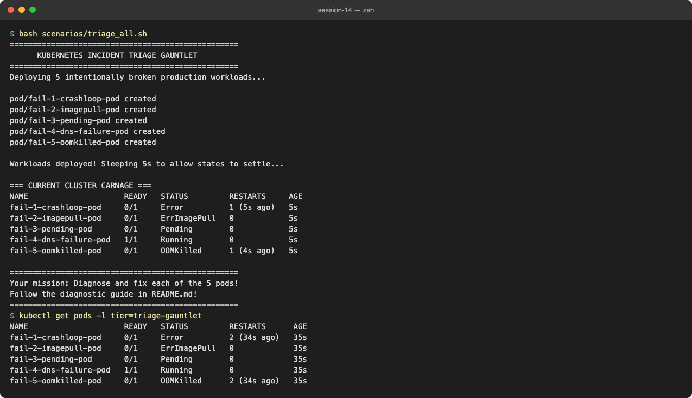

**Diagnosis:**

```text
# Scenario 1 - crashloop
$ kubectl logs fail-1-crashloop-pod
[FATAL ERROR]: DATABASE_URL environment variable is MISSING!
# Scenario 2 - imagepull
$ kubectl events --for pod/fail-2-imagepull-pod | grep 'Failed to pull' | tail -1 | cut -c1-300
21s (x2 over 35s)   Warning   Failed      Pod/fail-2-imagepull-pod   Failed to pull image "yatri-api-service:v999-invalid-tag-does-not-exist": failed to pull and unpack image "docker.io/library/yatri-api-service:v999-invalid-tag-does-not-exist": failed to resolve reference "docker.io/library/yatri-a
# Scenario 3 - pending
$ kubectl events --for pod/fail-3-pending-pod | grep FailedScheduling | tail -1
37s         Warning   FailedScheduling   Pod/fail-3-pending-pod   0/1 nodes are available: 1 Insufficient cpu, 1 Insufficient memory. preemption: 0/1 nodes are available: 1 Preemption is not helpful for scheduling.
# Scenario 4 - dns-failure (pod is Running, the bug is in its output)
$ kubectl logs fail-4-dns-failure-pod
Attempting connection to internal database...
Process sleeping...
$ kubectl exec fail-4-dns-failure-pod -- nslookup postgres-db-wrong-name.production.svc.cluster.local 2>&1 | tail -3
** server can't find postgres-db-wrong-name.production.svc.cluster.local: NXDOMAIN

command terminated with exit code 1
# Scenario 5 - oomkilled
$ kubectl get pod fail-5-oomkilled-pod -o jsonpath='{.status.containerStatuses[0].lastState.terminated}{"\n"}'
{"containerID":"containerd://d4842ed67f858f4f0e8cad057045860402bc8eeb64ad421a96c6128ae935a32c","exitCode":137,"finishedAt":"2026-10-07T15:48:32Z","reason":"OOMKilled","startedAt":"2026-10-07T15:48:32Z"}
$ kubectl describe pod fail-5-oomkilled-pod | grep -E 'Reason|Exit Code|Limits|memory' | head -6
  memory-leaker:
      print("Allocating memory rapidly...")
      Reason:       OOMKilled
      Exit Code:    137
      Reason:       OOMKilled
      Exit Code:    137
```

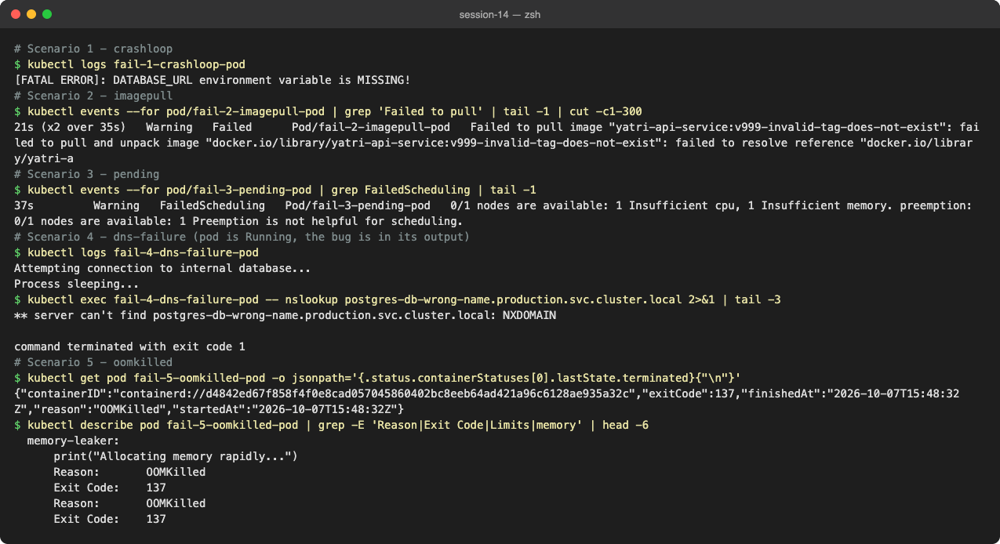

**Fix and verify:**

```text
# Containers/env/resources are immutable on a running Pod -> delete and re-apply the fixed manifests
$ kubectl delete pods -l tier=triage-gauntlet --wait
pod "fail-1-crashloop-pod" deleted from default namespace
pod "fail-2-imagepull-pod" deleted from default namespace
pod "fail-3-pending-pod" deleted from default namespace
pod "fail-4-dns-failure-pod" deleted from default namespace
pod "fail-5-oomkilled-pod" deleted from default namespace
$ kubectl apply -f scenarios/scenario-4-dns-failure/postgres-db.yaml && kubectl rollout status deploy/postgres-db -n production --timeout=120s
namespace/production created
deployment.apps/postgres-db created
service/postgres-db created
Waiting for deployment "postgres-db" rollout to finish: 0 of 1 updated replicas are available...
deployment "postgres-db" successfully rolled out
$ for s in scenarios/scenario-*/fixed.yaml; do kubectl apply -f $s; done
secret/app-db created
pod/fail-1-crashloop-pod created
pod/fail-2-imagepull-pod created
pod/fail-3-pending-pod created
pod/fail-4-dns-failure-pod created
pod/fail-5-oomkilled-pod created
$ kubectl get pods -l tier=triage-gauntlet
NAME                     READY   STATUS    RESTARTS   AGE
fail-1-crashloop-pod     1/1     Running   0          21s
fail-2-imagepull-pod     1/1     Running   0          21s
fail-3-pending-pod       1/1     Running   0          21s
fail-4-dns-failure-pod   1/1     Running   0          21s
fail-5-oomkilled-pod     1/1     Running   0          21s
$ kubectl logs fail-1-crashloop-pod
$ kubectl logs fail-4-dns-failure-pod
Attempting connection to internal database...
Connected to postgres-db.production.svc.cluster.local:5432
Process sleeping...
$ kubectl logs fail-5-oomkilled-pod
$ kubectl top pod fail-5-oomkilled-pod 2>/dev/null || kubectl get pod fail-5-oomkilled-pod -o jsonpath='restarts={.status.containerStatuses[0].restartCount}{"\n"}'
restarts=0
$ kubectl get pod fail-3-pending-pod -o jsonpath='node={.spec.nodeName} cpu={.spec.containers[0].resources.requests.cpu} mem={.spec.containers[0].resources.requests.memory}{"\n"}'
node=minikube cpu=100m mem=64Mi
# fail-1 and fail-5 logs were empty: python buffers stdout when it is not a TTY and the script then sleeps.
# Added PYTHONUNBUFFERED=1 to both fixed manifests and recreated them:
$ kubectl delete pod fail-1-crashloop-pod fail-5-oomkilled-pod --wait && kubectl apply -f scenarios/scenario-1-crashloop/fixed.yaml -f scenarios/scenario-5-oomkilled/fixed.yaml
pod "fail-1-crashloop-pod" deleted from default namespace
pod "fail-5-oomkilled-pod" deleted from default namespace
secret/app-db configured
pod/fail-1-crashloop-pod created
pod/fail-5-oomkilled-pod created
$ kubectl logs fail-1-crashloop-pod
Application started successfully!
$ kubectl logs fail-5-oomkilled-pod
Allocating a bounded 50 MB working set...
Allocated 50 MB - running
$ kubectl top pod fail-5-oomkilled-pod
NAME                   CPU(cores)   MEMORY(bytes)   
fail-5-oomkilled-pod   1m           53Mi            
$ kubectl get pods -l tier=triage-gauntlet
NAME                     READY   STATUS    RESTARTS   AGE
fail-1-crashloop-pod     1/1     Running   0          1s
fail-2-imagepull-pod     1/1     Running   0          70s
fail-3-pending-pod       1/1     Running   0          70s
fail-4-dns-failure-pod   1/1     Running   0          70s
fail-5-oomkilled-pod     1/1     Running   0          1s
```

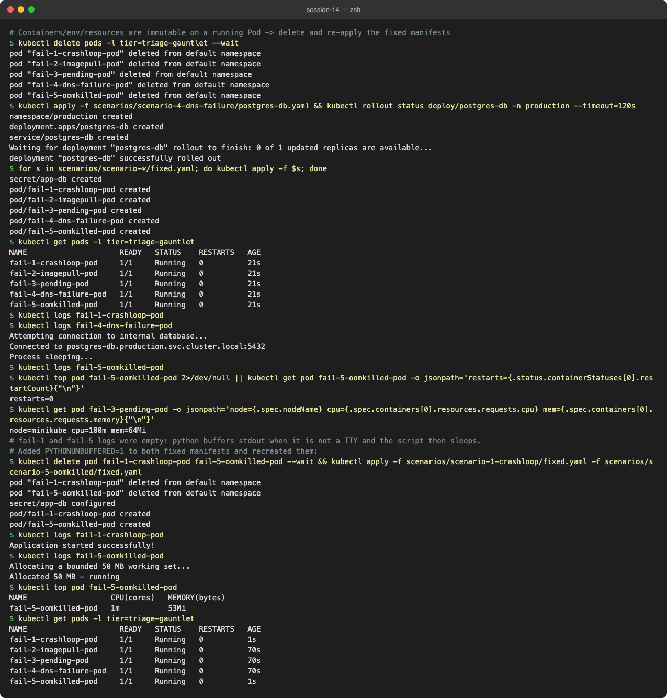

| # | Status | Root cause | Fix ([scenarios/](scenarios/)) |
| :--- | :--- | :--- | :--- |
| 1 crashloop | `Error`, restarts | `DATABASE_URL` env var missing → `sys.exit(1)` | Secret `app-db` + `secretKeyRef`; app keeps running after start |
| 2 imagepull | `ErrImagePull` | `yatri-api-service` has no registry prefix, so it resolves to `docker.io/library/yatri-api-service`, which does not exist: `pull access denied, repository does not exist or may require authorization` | real image reference |
| 3 pending | `Pending` | requests `cpu: 500`, `memory: 1000Gi` → `Insufficient cpu/memory` | requests 100m / 64Mi |
| 4 dns-failure | **`Running`** (silent failure) | wrong hostname `postgres-db-wrong-name` → NXDOMAIN, hidden by `curl -s ... \|\| true` | correct `postgres-db.production.svc.cluster.local` + a real Postgres to connect to ([postgres-db.yaml](scenarios/scenario-4-dns-failure/postgres-db.yaml)) |
| 5 oomkilled | `OOMKilled`, exit 137 | allocates ~1000 MB (100 × 10 MB, not 200 MB as the comment says) under a 20Mi limit | bounded allocation (50 MB) + 64Mi request / 128Mi limit; `kubectl top` shows 53Mi |

Two lessons from the gauntlet: scenario 4 is the dangerous kind, because `kubectl get pods` says everything is fine and only the logs show the failure. And Python `print()` output did not appear in `kubectl logs` until I set `PYTHONUNBUFFERED=1` (stdout is block-buffered when it is not a terminal).

---

## Task 3: Mini Project

**Files:** [mini-project/](mini-project/) (Deployment `troubleshooting-app` ×2, Service `troubleshooting-service`, `broken-pod.yaml`)

### Steps 1–4: Deploy, check the application, check the Service and endpoints

```text
$ kubectl apply -f deployment.yaml && kubectl apply -f service.yaml
deployment.apps/troubleshooting-app created
service/troubleshooting-service created
$ kubectl get pods -l app=troubleshooting-app -o wide
NAME                                   READY   STATUS    RESTARTS   AGE   IP             NODE       NOMINATED NODE   READINESS GATES
troubleshooting-app-59d4957864-jqlhp   1/1     Running   0          1s    10.244.0.99    minikube   <none>           <none>
troubleshooting-app-59d4957864-n74xn   1/1     Running   0          1s    10.244.0.100   minikube   <none>           <none>
$ kubectl get service troubleshooting-service
NAME                      TYPE        CLUSTER-IP      EXTERNAL-IP   PORT(S)   AGE
troubleshooting-service   ClusterIP   10.96.152.187   <none>        80/TCP    1s
$ kubectl describe pod troubleshooting-app-59d4957864-jqlhp | grep -E '^Name:|^Status:|^IP:|Image:|Ready:|Restart Count'
Name:             troubleshooting-app-59d4957864-jqlhp
Status:           Running
IP:               10.244.0.99
    Image:          nginx:1.27
    Ready:          True
    Restart Count:  0
$ kubectl logs troubleshooting-app-59d4957864-jqlhp | tail -3
2026/10/07 15:51:22 [notice] 1#1: start worker process 36
2026/10/07 15:51:22 [notice] 1#1: start worker process 37
2026/10/07 15:51:22 [notice] 1#1: start worker process 38
$ kubectl exec troubleshooting-app-59d4957864-jqlhp -- curl -s localhost | grep -E '<title>|<h1>'
<title>Welcome to nginx!</title>
<h1>Welcome to nginx!</h1>
$ kubectl describe service troubleshooting-service | grep -E 'Selector|TargetPort|Endpoints'
Selector:                 app=troubleshooting-app
TargetPort:               80/TCP
Endpoints:                10.244.0.100:80,10.244.0.99:80
$ kubectl get endpointslices -l kubernetes.io/service-name=troubleshooting-service
NAME                            ADDRESSTYPE   PORTS   ENDPOINTS                  AGE
troubleshooting-service-hzdbs   IPv4          80      10.244.0.100,10.244.0.99   1s
$ kubectl exec curl-client -- curl -s -o /dev/null -w 'via Service: HTTP %{http_code}\n' http://troubleshooting-service
via Service: HTTP 000
command terminated with exit code 7
# (Service was 1s old - kube-proxy had not programmed it yet; retry:)
$ kubectl exec curl-client -- curl -s -o /dev/null -w 'via Service: HTTP %{http_code}\n' http://troubleshooting-service
via Service: HTTP 200
```

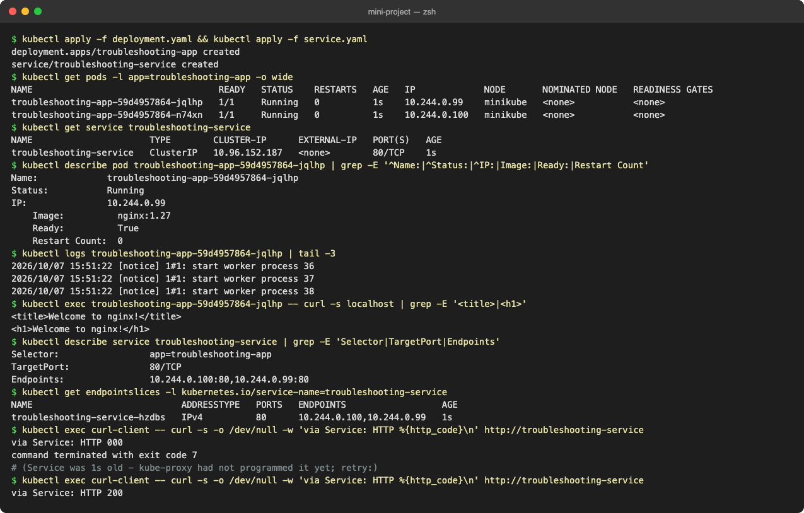

### Steps 5–7: Broken Pod

```text
$ kubectl apply -f broken-pod.yaml
pod/project-broken-pod created
$ kubectl get pod project-broken-pod
NAME                 READY   STATUS             RESTARTS   AGE
project-broken-pod   0/1     ImagePullBackOff   0          19s
$ kubectl describe pod project-broken-pod | sed -n '/Events:/,$p' | cut -c1-260
Events:
  Type     Reason     Age               From               Message
  ----     ------     ----              ----               -------
  Normal   Scheduled  19s               default-scheduler  Successfully assigned default/project-broken-pod to minikube
  Warning  Failed     16s               kubelet            spec.containers{app}: Failed to pull image "nginx:this-tag-does-not-exist": failed to pull and unpack image "docker.io/library/nginx:this-tag-does-not-exist": failed to resolve reference "docker.io/lib
  Warning  Failed     16s               kubelet            spec.containers{app}: Error: ErrImagePull
  Normal   BackOff    15s               kubelet            spec.containers{app}: Back-off pulling image "nginx:this-tag-does-not-exist"
  Warning  Failed     15s               kubelet            spec.containers{app}: Error: ImagePullBackOff
  Normal   Pulling    1s (x2 over 18s)  kubelet            spec.containers{app}: Pulling image "nginx:this-tag-does-not-exist"
# Fix: nginx has no tag 'this-tag-does-not-exist' -> use a real tag
$ kubectl set image pod/project-broken-pod app=nginx:1.27
pod/project-broken-pod image updated
$ kubectl get pod project-broken-pod
NAME                 READY   STATUS    RESTARTS   AGE
project-broken-pod   1/1     Running   0          21s
```

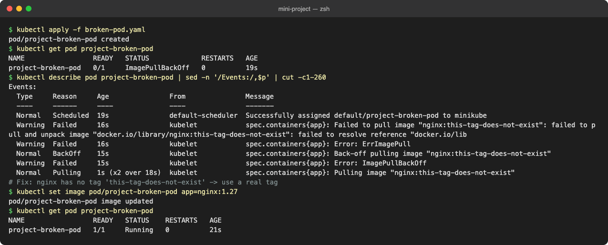

**Question 1: What is the Pod status?**
`ImagePullBackOff` (first `ErrImagePull`), `READY 0/1`, 0 restarts because the container never started.

**Question 2: What is the actual error?**
`Failed to pull image "nginx:this-tag-does-not-exist": failed to resolve reference "docker.io/library/nginx:this-tag-does-not-exist": not found`

**Question 3: Which command helped you find the reason?**
`kubectl describe pod project-broken-pod`, specifically its **Events** section (`kubectl events --for pod/project-broken-pod` shows the same).

**Question 4: What is wrong with the image?**
The repository `nginx` is fine, but the tag `this-tag-does-not-exist` does not exist in it, so the registry cannot resolve the reference.

**Question 5: How would you fix it?**
Use a real tag: `kubectl set image pod/project-broken-pod app=nginx:1.27`, and fix `broken-pod.yaml` to `image: nginx:1.27` so it does not come back on the next apply. Pin explicit versions instead of `latest`.

### Steps 8–9: Service selector challenge

```text
# Step 8: break the selector (app: troubleshooting-app -> app: wrong-app)
$ sed 's/app: troubleshooting-app/app: wrong-app/' service.yaml | kubectl apply -f -
service/troubleshooting-service configured
$ kubectl get service troubleshooting-service
NAME                      TYPE        CLUSTER-IP      EXTERNAL-IP   PORT(S)   AGE
troubleshooting-service   ClusterIP   10.96.152.187   <none>        80/TCP    37s
$ kubectl get endpoints troubleshooting-service 2>/dev/null
NAME                      ENDPOINTS   AGE
troubleshooting-service   <none>      37s
$ kubectl exec curl-client -- curl -s -m 3 http://troubleshooting-service || echo "curl exit code $?"
command terminated with exit code 7
curl exit code 7
# Step 9: find the root cause
$ kubectl get pods --show-labels -l app=troubleshooting-app
NAME                                   READY   STATUS    RESTARTS   AGE   LABELS
troubleshooting-app-59d4957864-jqlhp   1/1     Running   0          37s   app=troubleshooting-app,pod-template-hash=59d4957864
troubleshooting-app-59d4957864-n74xn   1/1     Running   0          37s   app=troubleshooting-app,pod-template-hash=59d4957864
$ kubectl describe service troubleshooting-service | grep -E 'Selector|Endpoints'
Selector:                 app=wrong-app
Endpoints:                
# Pod label app=troubleshooting-app vs Service selector app=wrong-app -> mismatch. Fix: re-apply the correct service.yaml
$ kubectl apply -f service.yaml
service/troubleshooting-service configured
$ kubectl get endpoints troubleshooting-service 2>/dev/null
NAME                      ENDPOINTS                        AGE
troubleshooting-service   10.244.0.100:80,10.244.0.99:80   41s
$ kubectl exec curl-client -- curl -s -o /dev/null -w 'via Service: HTTP %{http_code}\n' http://troubleshooting-service
via Service: HTTP 200
$ kubectl exec dns-test -- nslookup troubleshooting-service | tail -3
Name:	troubleshooting-service.default.svc.cluster.local
Address: 10.96.152.187
```

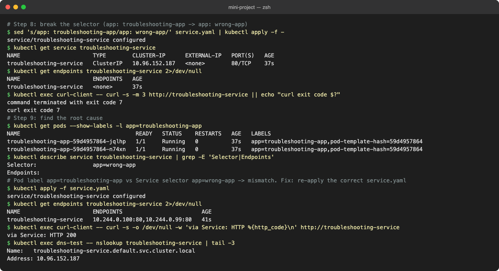

### Troubleshooting table

| Problem | What I Saw | Command I Used | Root Cause | Fix |
| :--- | :--- | :--- | :--- | :--- |
| **Broken Pod** | `project-broken-pod 0/1 ImagePullBackOff`, never started | `kubectl get pod`, `kubectl describe pod` (Events) | image reference cannot be pulled | `kubectl set image ... app=nginx:1.27` → `1/1 Running` |
| **Service Problem** | Service exists, `ENDPOINTS <none>`, curl exit 7 | `kubectl get endpoints`, `kubectl get pods --show-labels`, `kubectl describe service` | selector `app=wrong-app` ≠ pod label `app=troubleshooting-app` | re-apply `service.yaml` with the correct selector → 2 endpoints, HTTP 200 |
| **Image Problem** | `Failed to pull image ... not found` | `kubectl describe pod` / `kubectl events --for pod/...` | tag `this-tag-does-not-exist` is not in `docker.io/library/nginx` | use an existing pinned tag (`1.27`) |

### README questions

1. **What does `kubectl get` tell us?** The current state of objects at a glance: for pods the ready count, status, restarts and age; with `-o wide` also IP and node. It answers "what is happening?" but not "why".
2. **Difference between `get` and `describe`?** `get` is a one-line summary (or raw YAML/JSON with `-o`). `describe` is a human-readable report of one object: spec, status, conditions, related objects and, most importantly, its recent **events**, which usually contain the reason for a failure.
3. **Why do we use `kubectl logs`?** To read what the application itself printed to stdout/stderr, e.g. a missing env var, a stack trace, or a connection error. It is the main tool once the container has started at least once (`--previous` for the last crashed run).
4. **When would you use `kubectl exec`?** When the container runs but behaves wrongly and you need to look from inside: check config files, env vars, `/etc/resolv.conf`, `localhost` vs network access, listening ports (`netstat`), or test DNS/HTTP to other services.
5. **What does `CrashLoopBackOff` mean?** The container starts and then exits (crash or normal exit) repeatedly; the kubelet keeps restarting it with an increasing delay (back-off, up to 5 minutes). The cause is almost always in the app: logs and exit code tell you why.
6. **What does `ImagePullBackOff` mean?** The kubelet could not pull the image (`ErrImagePull`) and is now waiting before retrying. Causes: wrong name/tag, private registry without credentials, rate limiting, wrong platform.
7. **Why can a Pod remain `Pending`?** The scheduler cannot find a node that satisfies it: not enough CPU/memory for the requests, nodeSelector/affinity that matches no node, taints without tolerations, a PVC that is not bound, or resource quota. `describe` → `FailedScheduling` says which.
8. **Why can a Service have no endpoints?** Its selector matches no pods (label typo / wrong selector), the matching pods are not Ready (readiness probe failing), the pods are in a different namespace, or there are simply no pods running.
9. **Relationship between a Service selector and Pod labels?** The Service selects pods by labels. The EndpointSlice controller continuously finds Ready pods whose labels match the selector and puts their IP:targetPort into the Service's endpoints. If they do not match exactly, the Service has a ClusterIP and DNS name but no backends.
10. **What is Kubernetes DNS?** CoreDNS running in `kube-system` behind the `kube-dns` Service (10.96.0.10 here). Every pod's `/etc/resolv.conf` points to it, and it answers `<service>.<namespace>.svc.cluster.local` with the Service's ClusterIP (or pod IPs for headless Services). The search list lets pods use short names inside their own namespace.

---

## Problems I hit while doing this session (not planned by the instructor)

| Problem | Cause | What I did |
| :--- | :--- | :--- |
| minikube start hung (kubelet `bootstrap-kubelet.conf` missing) | old cluster state corrupted | `minikube delete` + fresh `minikube start --addons=metrics-server,ingress` |
| `curlimages/curl` pull `429 Too Many Requests` | Docker Hub anonymous rate limit | used the copy already in minikube (`--image-pull-policy=IfNotPresent`); other images via `mirror.gcr.io` + `minikube image load` |
| curl right after creating/patching a Service failed | kube-proxy needs 1–2 s to program new endpoints | retried after a few seconds → HTTP 200 |
| `dns-test` pod ImagePullBackOff | wrong image name in the instructor's YAML | `jessie-dnsutils:1.3` |
| Empty logs from fixed Python pods | stdout block-buffered without a TTY | `PYTHONUNBUFFERED=1` |

## Cleanup

```bash
kubectl delete -f mini-project/ ; kubectl delete -f 09-service-dns-troubleshooting/deployment.yaml
kubectl delete pod dns-test curl-client --ignore-not-found
kubectl delete ns production backend --ignore-not-found
```
