# Session 15: Helm

**Author:** Pranay Reddy
**Course:** SST DevOps & Cloud [SWE]
**Session:** 15
**Repository:** devops-heros / session-15-helm
**Environment:** macOS (Apple Silicon, arm64), minikube v1.39.0, Kubernetes v1.37.0, **Helm v4.3.0**

Every output block is real output from this machine; screenshots in [screenshots/](screenshots/) are rendered from the same captured output. The instructor's topic index is kept in [instructor-notes.md](instructor-notes.md).

| Task | What | Where |
| :--- | :--- | :--- |
| 1 | `create, install, list, status, get, upgrade, history, rollback, uninstall, repo, search` | [Task 1](#task-1-helm-commands), chart in [10-helm-commands/demo-app/](10-helm-commands/demo-app/) |
| 2 | Install → Upgrade → Verify → Upgrade again → Verify → Rollback → Verify | [Task 2](#task-2-helm-rollback-workflow), chart [07-install-upgrade/app-chart/](07-install-upgrade/app-chart/) |
| 3 | Notes App mini project | [Task 3](#task-3-mini-project-notes-app), chart [mini-project/notes-chart/](mini-project/notes-chart/) |

**Helm 4 differences I ran into** (Homebrew installs Helm 4; the session material is written for Helm 3):

| Helm 3 | Helm 4.3 |
| :--- | :--- |
| `helm list -a` / `--all` | removed; use state filters `--uninstalled`, `--failed`, `--pending`, `--superseded` |
| `helm upgrade --atomic` | `--rollback-on-failure` (implies `--wait`) |
| client-side three-way merge | server-side apply by default (`APPLY_METHOD: server-side apply` in `helm get metadata`) |
| `--wait` boolean | `--wait=watcher\|hookOnly\|legacy`; default without the flag is `hookOnly` (does not wait for pods) |

---

## Task 1: Helm Commands

### `helm create`: scaffold a chart

Generates a working chart: `Chart.yaml` (chart metadata, `version` = chart version, `appVersion` = app version), `values.yaml` (defaults), `templates/` (Deployment, Service, ServiceAccount, optional Ingress/HTTPRoute/HPA, a test hook, `_helpers.tpl` with naming/label helpers, `NOTES.txt`) and `.helmignore`.

```text
$ helm version --short
v4.3.0+gbec5b06
$ helm create demo-app
Creating demo-app
$ find demo-app -type f | sort
demo-app/.helmignore
demo-app/Chart.yaml
demo-app/templates/NOTES.txt
demo-app/templates/_helpers.tpl
demo-app/templates/deployment.yaml
demo-app/templates/hpa.yaml
demo-app/templates/httproute.yaml
demo-app/templates/ingress.yaml
demo-app/templates/service.yaml
demo-app/templates/serviceaccount.yaml
demo-app/templates/tests/test-connection.yaml
demo-app/values.yaml
$ grep -A3 '^image:' demo-app/values.yaml; grep -E '^(version|appVersion)' demo-app/Chart.yaml
image:
  repository: nginx
  # This sets the pull policy for images.
  pullPolicy: IfNotPresent
version: 0.1.0
appVersion: "1.16.0"
$ helm lint demo-app
==> Linting demo-app
[INFO] Chart.yaml: icon is recommended

1 chart(s) linted, 0 chart(s) failed
```

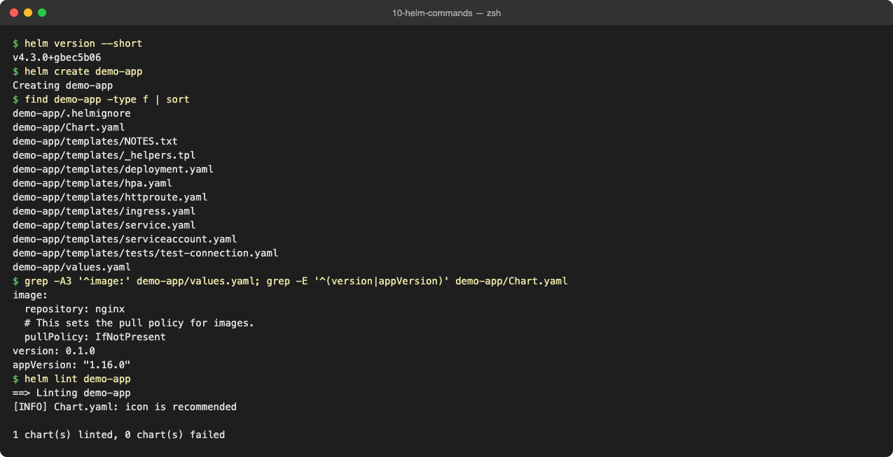

### `helm install`: render the templates with values and create a release

`helm install <release> <chart>`; `--set` / `-f` override values, `--wait` waits for resources to be ready. I set `image.tag=1.25` because the scaffold's default (`appVersion 1.16.0` → `nginx:1.16.0`) is a very old image.

```text
$ helm install demo demo-app --set image.tag=1.25 --wait --timeout 2m
NAME: demo
LAST DEPLOYED: Wed Oct  7 21:26:13 2026
NAMESPACE: default
STATUS: deployed
REVISION: 1
DESCRIPTION: Install complete
NOTES:
1. Get the application URL by running these commands:
  export POD_NAME=$(kubectl get pods --namespace default -l "app.kubernetes.io/name=demo-app,app.kubernetes.io/instance=demo" -o jsonpath="{.items[0].metadata.name}")
  export CONTAINER_PORT=$(kubectl get pod --namespace default $POD_NAME -o jsonpath="{.spec.containers[0].ports[0].containerPort}")
  echo "Visit http://127.0.0.1:8080 to use your application"
  kubectl --namespace default port-forward $POD_NAME 8080:$CONTAINER_PORT
$ kubectl get deploy,svc,pods -l app.kubernetes.io/instance=demo
NAME                            READY   UP-TO-DATE   AVAILABLE   AGE
deployment.apps/demo-demo-app   1/1     1            1           1s

NAME                    TYPE        CLUSTER-IP       EXTERNAL-IP   PORT(S)   AGE
service/demo-demo-app   ClusterIP   10.111.119.227   <none>        80/TCP    1s

NAME                                 READY   STATUS    RESTARTS   AGE
pod/demo-demo-app-788c54469c-28hck   1/1     Running   0          1s
```

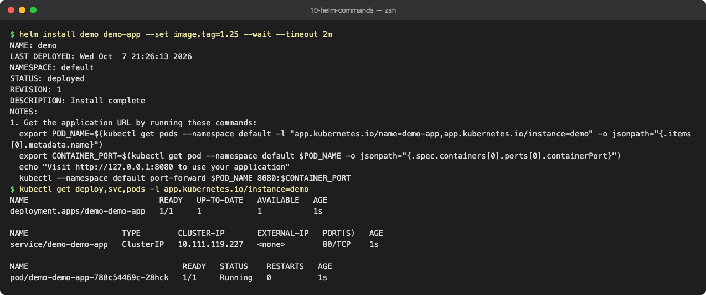

### `helm list` and `helm status`

`list` shows releases (per namespace, `-A` for all); `status` shows one release's state, its resources and the rendered NOTES.

```text
$ helm list
NAME	NAMESPACE	REVISION	UPDATED                             	STATUS  	CHART         	APP VERSION
demo	default  	1       	2026-10-07 21:26:13.452499 +0530 IST	deployed	demo-app-0.1.0	1.16.0     
$ helm list -A
NAME	NAMESPACE	REVISION	UPDATED                             	STATUS  	CHART         	APP VERSION
demo	default  	1       	2026-10-07 21:26:13.452499 +0530 IST	deployed	demo-app-0.1.0	1.16.0     
$ helm status demo
NAME: demo
LAST DEPLOYED: Wed Oct  7 21:26:13 2026
NAMESPACE: default
STATUS: deployed
REVISION: 1
DESCRIPTION: Install complete
RESOURCES:
==> v1/ServiceAccount
NAME            AGE
demo-demo-app   2s

==> v1/Service
NAME            TYPE        CLUSTER-IP       EXTERNAL-IP   PORT(S)   AGE
demo-demo-app   ClusterIP   10.111.119.227   <none>        80/TCP    2s

==> v1/Deployment
NAME            READY   UP-TO-DATE   AVAILABLE   AGE
demo-demo-app   1/1     1            1           2s

==> v1/Pod(related)
NAME                             READY   STATUS    RESTARTS   AGE
demo-demo-app-788c54469c-28hck   1/1     Running   0          2s


NOTES:
1. Get the application URL by running these commands:
  export POD_NAME=$(kubectl get pods --namespace default -l "app.kubernetes.io/name=demo-app,app.kubernetes.io/instance=demo" -o jsonpath="{.items[0].metadata.name}")
  export CONTAINER_PORT=$(kubectl get pod --namespace default $POD_NAME -o jsonpath="{.spec.containers[0].ports[0].containerPort}")
  echo "Visit http://127.0.0.1:8080 to use your application"
  kubectl --namespace default port-forward $POD_NAME 8080:$CONTAINER_PORT
```

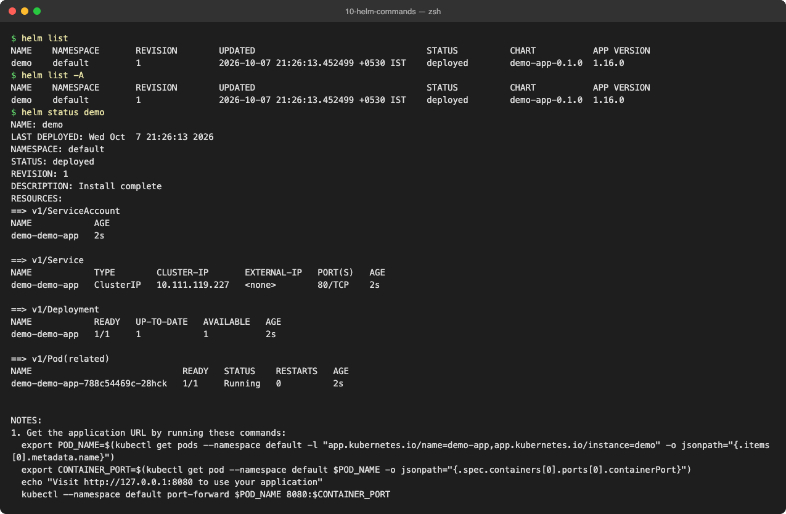

### `helm get`: what exactly was deployed

`get values` (user-supplied; `--all` = merged with defaults), `get manifest` (the rendered YAML Helm applied), `get notes`, `get metadata`, `get hooks`, `get all`.

```text
$ helm get values demo
USER-SUPPLIED VALUES:
image:
  tag: "1.25"
$ helm get values demo --all | head -12
COMPUTED VALUES:
affinity: {}
autoscaling:
  enabled: false
  maxReplicas: 100
  minReplicas: 1
  targetCPUUtilizationPercentage: 80
fullnameOverride: ""
httpRoute:
  annotations: {}
  enabled: false
  hostnames:
$ helm get manifest demo | grep -E '^# Source|kind:|image:'
# Source: demo-app/templates/serviceaccount.yaml
kind: ServiceAccount
# Source: demo-app/templates/service.yaml
kind: Service
# Source: demo-app/templates/deployment.yaml
kind: Deployment
          image: "nginx:1.25"
$ helm get notes demo | head -6
NOTES:
1. Get the application URL by running these commands:
  export POD_NAME=$(kubectl get pods --namespace default -l "app.kubernetes.io/name=demo-app,app.kubernetes.io/instance=demo" -o jsonpath="{.items[0].metadata.name}")
  export CONTAINER_PORT=$(kubectl get pod --namespace default $POD_NAME -o jsonpath="{.spec.containers[0].ports[0].containerPort}")
  echo "Visit http://127.0.0.1:8080 to use your application"
  kubectl --namespace default port-forward $POD_NAME 8080:$CONTAINER_PORT
$ helm get metadata demo
NAME: demo
CHART: demo-app
VERSION: 0.1.0
APP_VERSION: 1.16.0
ANNOTATIONS: 
LABELS: modifiedAt=1791388574,name=demo,owner=helm,status=deployed,version=1
DEPENDENCIES: 
NAMESPACE: default
REVISION: 1
STATUS: deployed
DEPLOYED_AT: 2026-10-07T21:26:13+05:30
APPLY_METHOD: server-side apply
```

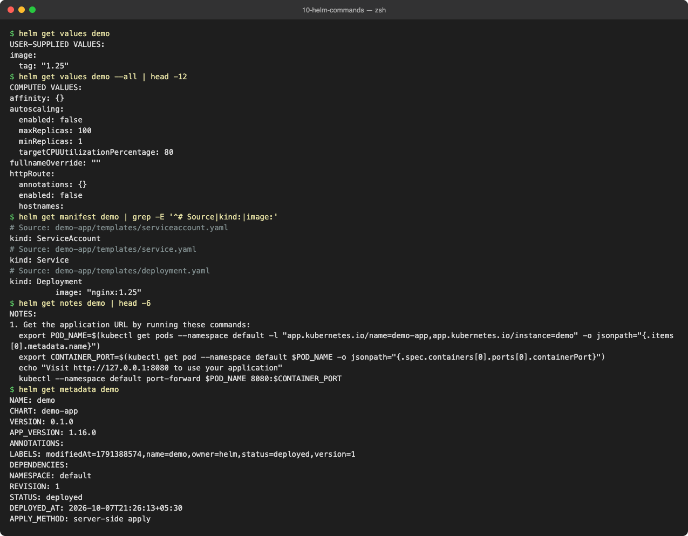

### `helm upgrade`: new revision with new values or a new chart version

```text
$ helm upgrade demo demo-app --set image.tag=1.26 --set replicaCount=2 --wait --timeout 2m | head -6
Release "demo" has been upgraded. Happy Helming!
NAME: demo
LAST DEPLOYED: Wed Oct  7 21:26:28 2026
NAMESPACE: default
STATUS: deployed
REVISION: 2
$ kubectl get deploy demo-demo-app -o jsonpath='replicas={.spec.replicas} image={.spec.template.spec.containers[0].image}{"\n"}'
replicas=2 image=nginx:1.26
$ helm get values demo
USER-SUPPLIED VALUES:
image:
  tag: "1.26"
replicaCount: 2
# --reuse-values keeps earlier --set values; without it a new upgrade starts from the chart defaults
$ helm upgrade demo demo-app --reuse-values --set service.type=NodePort --wait | grep -E 'REVISION|STATUS'
STATUS: deployed
REVISION: 3
$ kubectl get svc demo-demo-app
NAME            TYPE       CLUSTER-IP       EXTERNAL-IP   PORT(S)        AGE
demo-demo-app   NodePort   10.111.119.227   <none>        80:32091/TCP   18s
```

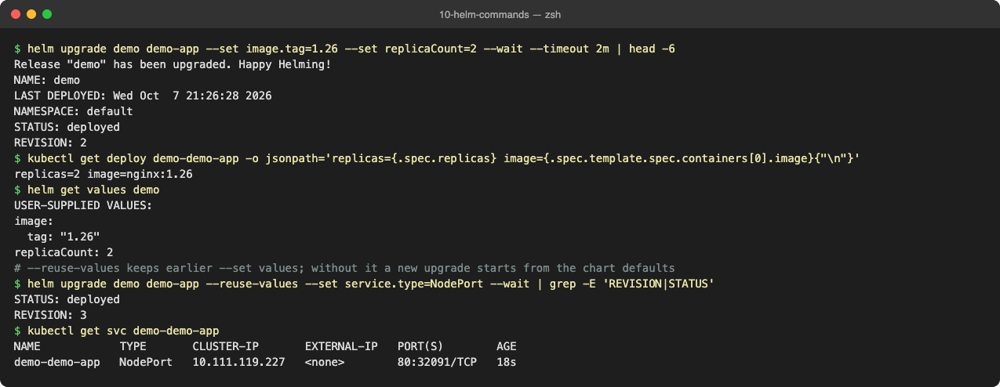

### `helm history` and `helm rollback`

Every install/upgrade/rollback is a numbered revision stored as a Secret (`sh.helm.release.v1.<name>.v<N>`). A rollback does not delete history; it creates a **new** revision with the old content ("Rollback to 1").

```text
$ helm history demo
REVISION	UPDATED                 	STATUS    	CHART         	APP VERSION	DESCRIPTION     
1       	Wed Oct  7 21:26:13 2026	superseded	demo-app-0.1.0	1.16.0     	Install complete
2       	Wed Oct  7 21:26:28 2026	superseded	demo-app-0.1.0	1.16.0     	Upgrade complete
3       	Wed Oct  7 21:26:31 2026	deployed  	demo-app-0.1.0	1.16.0     	Upgrade complete
$ helm rollback demo 1 --wait
Rollback was a success! Happy Helming!
$ helm history demo
REVISION	UPDATED                 	STATUS    	CHART         	APP VERSION	DESCRIPTION     
1       	Wed Oct  7 21:26:13 2026	superseded	demo-app-0.1.0	1.16.0     	Install complete
2       	Wed Oct  7 21:26:28 2026	superseded	demo-app-0.1.0	1.16.0     	Upgrade complete
3       	Wed Oct  7 21:26:31 2026	superseded	demo-app-0.1.0	1.16.0     	Upgrade complete
4       	Wed Oct  7 21:26:32 2026	deployed  	demo-app-0.1.0	1.16.0     	Rollback to 1   
$ kubectl get deploy demo-demo-app -o jsonpath='replicas={.spec.replicas} image={.spec.template.spec.containers[0].image}{"\n"}'; kubectl get svc demo-demo-app
replicas=1 image=nginx:1.25
NAME            TYPE        CLUSTER-IP       EXTERNAL-IP   PORT(S)   AGE
demo-demo-app   ClusterIP   10.111.119.227   <none>        80/TCP    20s
```

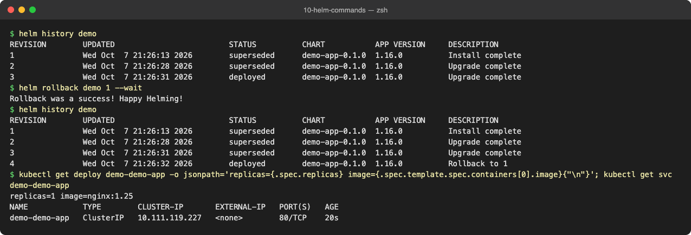

### `helm uninstall`

Removes all resources of the release and, by default, its history. `--keep-history` keeps the release record.

```text
$ helm uninstall demo --keep-history --wait
release "demo" uninstalled
$ helm list --uninstalled
NAME	NAMESPACE	REVISION	UPDATED                             	STATUS     	CHART         	APP VERSION
demo	default  	1       	2026-10-07 21:26:54.104111 +0530 IST	uninstalled	demo-app-0.1.0	1.16.0     
$ helm history demo
REVISION	UPDATED                 	STATUS     	CHART         	APP VERSION	DESCRIPTION            
1       	Wed Oct  7 21:26:54 2026	uninstalled	demo-app-0.1.0	1.16.0     	Uninstallation complete
# --keep-history leaves the release record (a Secret) so it can still be inspected or rolled back
$ kubectl get secrets -l owner=helm,name=demo
NAME                         TYPE                 DATA   AGE
sh.helm.release.v1.demo.v1   helm.sh/release.v1   1      1s
$ helm uninstall demo
release "demo" uninstalled
$ helm list --uninstalled; kubectl get secrets -l owner=helm,name=demo
NAME	NAMESPACE	REVISION	UPDATED	STATUS	CHART	APP VERSION
No resources found in default namespace.
$ kubectl get all -l app.kubernetes.io/instance=demo
NAME                                 READY   STATUS        RESTARTS   AGE
pod/demo-demo-app-788c54469c-zs9dm   1/1     Terminating   0          1s
# Helm 4 note: 'helm list -a/--all' from Helm 3 no longer exists; use the state filters (--uninstalled, --failed, --pending ...)
```

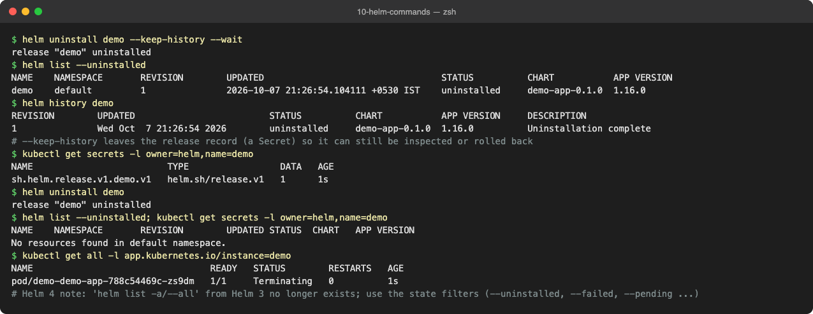

### `helm repo` and `helm search`

`repo add/list/update/remove` manage chart repositories (an `index.yaml` over HTTP); `search repo` searches added repos, `search hub` searches Artifact Hub; `show chart/values/readme` inspects a chart before installing.

```text
$ helm repo add prometheus-community https://prometheus-community.github.io/helm-charts
"prometheus-community" has been added to your repositories
$ helm repo add ingress-nginx https://kubernetes.github.io/ingress-nginx
"ingress-nginx" has been added to your repositories
$ helm repo list
NAME                	URL                                               
prometheus-community	https://prometheus-community.github.io/helm-charts
ingress-nginx       	https://kubernetes.github.io/ingress-nginx        
$ helm repo update
Hang tight while we grab the latest from your chart repositories...
...Successfully got an update from the "ingress-nginx" chart repository
...Successfully got an update from the "prometheus-community" chart repository
Update Complete. ⎈Happy Helming!⎈
$ helm search repo prometheus-community/kube-prometheus | head -3
NAME                                      	CHART VERSION	APP VERSION	DESCRIPTION                                       
prometheus-community/kube-prometheus-stack	92.1.0       	v0.94.1    	kube-prometheus-stack collects Kubernetes manif...
$ helm search repo ingress-nginx --versions | head -4
NAME                       	CHART VERSION	APP VERSION	DESCRIPTION                                       
ingress-nginx/ingress-nginx	4.15.1       	1.15.1     	Ingress controller for Kubernetes using NGINX a...
ingress-nginx/ingress-nginx	4.15.0       	1.15.0     	Ingress controller for Kubernetes using NGINX a...
ingress-nginx/ingress-nginx	4.14.5       	1.14.5     	Ingress controller for Kubernetes using NGINX a...
$ helm search hub grafana --max-col-width 60 | head -5
URL                                                         	CHART VERSION   	APP VERSION                             	DESCRIPTION                                                 
https://artifacthub.io/packages/helm/grafana-community/gr...	13.3.1          	13.2.3                                  	The leading tool for querying and visualizing time series...
https://artifacthub.io/packages/helm/surajwarbhe-grafana/...	0.1.0           	0.1.0                                   	A Helm chart to setup Grafana tool                          
https://artifacthub.io/packages/helm/saurabh6-grafana/gra...	0.2.0           	1.1                                     	This is a Helm Chart for Grafana Setup.                     
https://artifacthub.io/packages/helm/quench-grafana/grafana 	0.0.14          	13.1.6                                  	Dashboards and visualization for metrics, logs, and trace...
$ helm show chart ingress-nginx/ingress-nginx | grep -E '^(name|version|appVersion|description)'
appVersion: 1.15.1
description: Ingress controller for Kubernetes using NGINX as a reverse proxy and
name: ingress-nginx
version: 4.15.1
$ helm repo remove ingress-nginx && helm repo list
"ingress-nginx" has been removed from your repositories
NAME                	URL                                               
prometheus-community	https://prometheus-community.github.io/helm-charts
```

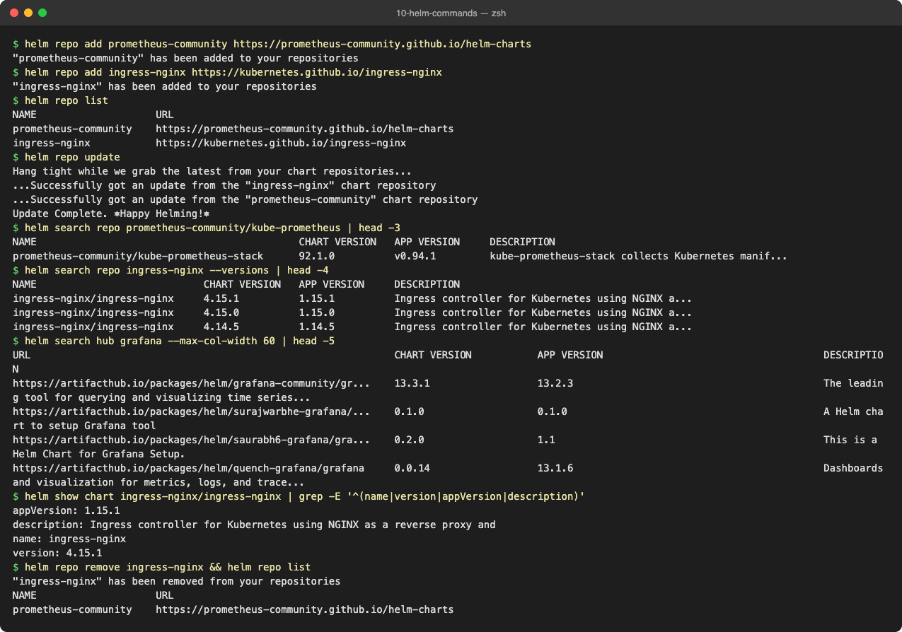

| Command | What it does |
| :--- | :--- |
| `helm create <name>` | scaffold a new chart directory |
| `helm install <rel> <chart>` | render + apply, creates revision 1 |
| `helm list` | releases in the namespace (`-A` all namespaces) |
| `helm status <rel>` | state, resources and notes of a release |
| `helm get values\|manifest\|notes\|metadata <rel>` | what was deployed and with which values |
| `helm upgrade <rel> <chart>` | new revision; `--reuse-values` keeps earlier overrides; `--install` installs if missing |
| `helm history <rel>` | all revisions with status and description |
| `helm rollback <rel> [rev]` | new revision with the content of `rev` (previous by default) |
| `helm uninstall <rel>` | delete resources (+ history unless `--keep-history`) |
| `helm repo add\|list\|update\|remove` | manage chart repositories |
| `helm search repo\|hub <kw>` | find charts in added repos / Artifact Hub |

---

## Task 2: Helm Rollback Workflow

**Chart:** the instructor's [07-install-upgrade/app-chart](07-install-upgrade/app-chart/) (`nginx`, `replicaCount`, `image.tag`).

### Install → Verify → Upgrade → Verify

```text
# STEP 1  Install (revision 1: nginx:1.24, 1 replica)
$ helm install rollback-demo ./app-chart --wait | grep -E 'NAME|STATUS|REVISION'
NAME: rollback-demo
NAMESPACE: default
STATUS: deployed
REVISION: 1
# VERIFY
$ kubectl get deploy rollback-demo-app -o jsonpath='replicas={.spec.replicas} image={.spec.template.spec.containers[0].image} ready={.status.readyReplicas}{"\n"}'; kubectl get pods -l app=rollback-demo
replicas=1 image=nginx:1.24 ready=1
NAME                                 READY   STATUS    RESTARTS   AGE
rollback-demo-app-5666bb45b5-d4lcj   1/1     Running   0          1s
# STEP 2  Upgrade (revision 2: nginx:1.25, 3 replicas)
$ helm upgrade rollback-demo ./app-chart --set image.tag=1.25 --set replicaCount=3 --wait | grep -E 'STATUS|REVISION'
STATUS: deployed
REVISION: 2
# VERIFY
$ kubectl get deploy rollback-demo-app -o jsonpath='replicas={.spec.replicas} image={.spec.template.spec.containers[0].image} ready={.status.readyReplicas}{"\n"}'; kubectl get pods -l app=rollback-demo
replicas=3 image=nginx:1.25 ready=3
NAME                                 READY   STATUS      RESTARTS   AGE
rollback-demo-app-5666bb45b5-8nx2d   0/1     Completed   0          1s
rollback-demo-app-5666bb45b5-8sl68   0/1     Completed   0          1s
rollback-demo-app-5666bb45b5-d4lcj   0/1     Completed   0          2s
rollback-demo-app-fd544cb86-q7dgq    1/1     Running     0          0s
rollback-demo-app-fd544cb86-v56kg    1/1     Running     0          1s
rollback-demo-app-fd544cb86-zhpsr    1/1     Running     0          1s
```

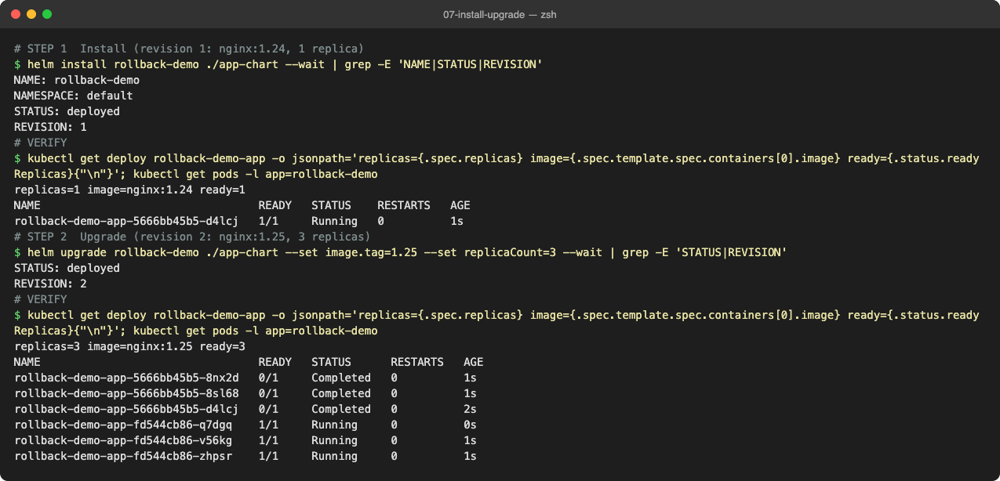

### Upgrade again (bad image) → Verify

```text
# STEP 3  Upgrade again (revision 3: a tag that does not exist)
$ helm upgrade rollback-demo ./app-chart --reuse-values --set image.tag=1.99-does-not-exist | grep -E 'STATUS|REVISION'
STATUS: deployed
REVISION: 3
# VERIFY: Helm says 'deployed' (it does not wait by default) but the new pod cannot pull its image
$ helm status rollback-demo | grep -E 'STATUS|REVISION'
STATUS: deployed
REVISION: 3
NAME                                 READY   STATUS             RESTARTS   AGE
$ kubectl get pods -l app=rollback-demo
NAME                                 READY   STATUS             RESTARTS   AGE
rollback-demo-app-66b6db6d6f-pz72p   0/1     ImagePullBackOff   0          26s
rollback-demo-app-fd544cb86-q7dgq    1/1     Running            0          27s
rollback-demo-app-fd544cb86-v56kg    1/1     Running            0          28s
rollback-demo-app-fd544cb86-zhpsr    1/1     Running            0          28s
$ kubectl get deploy rollback-demo-app
NAME                READY   UP-TO-DATE   AVAILABLE   AGE
rollback-demo-app   3/3     1            3           29s
# RollingUpdate kept the 3 old nginx:1.25 pods serving; the new ReplicaSet is stuck. Still a broken release.
```

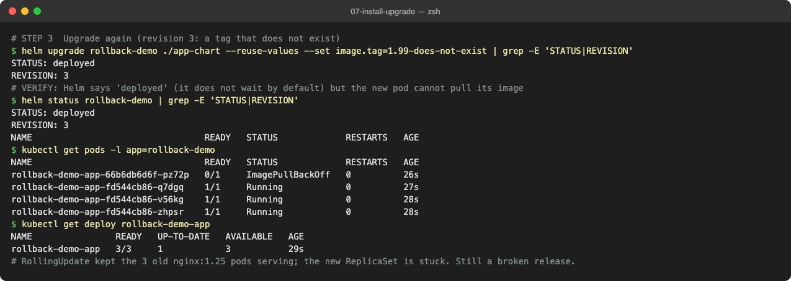

Two things worth noticing: Helm reported **`STATUS: deployed`** for a broken release, because without `--wait` Helm 4 only waits for hooks, not for pods. And the app stayed up because the Deployment's RollingUpdate never removes old pods until new ones are Ready (`READY 3/3, UP-TO-DATE 1`).

### Rollback → Verify

```text
# STEP 4  Rollback to the last good revision (2)
$ helm history rollback-demo
REVISION	UPDATED                 	STATUS    	CHART          	APP VERSION	DESCRIPTION     
1       	Wed Oct  7 21:27:27 2026	superseded	app-chart-0.1.0	1.0        	Install complete
2       	Wed Oct  7 21:27:28 2026	superseded	app-chart-0.1.0	1.0        	Upgrade complete
3       	Wed Oct  7 21:27:30 2026	deployed  	app-chart-0.1.0	1.0        	Upgrade complete
$ helm rollback rollback-demo 2 --wait
Rollback was a success! Happy Helming!
# VERIFY
$ kubectl get deploy rollback-demo-app -o jsonpath='replicas={.spec.replicas} image={.spec.template.spec.containers[0].image} ready={.status.readyReplicas}{"\n"}'; kubectl get pods -l app=rollback-demo
replicas=3 image=nginx:1.25 ready=3
NAME                                 READY   STATUS        RESTARTS   AGE
rollback-demo-app-66b6db6d6f-pz72p   0/1     Terminating   0          27s
rollback-demo-app-fd544cb86-q7dgq    1/1     Running       0          28s
rollback-demo-app-fd544cb86-v56kg    1/1     Running       0          29s
rollback-demo-app-fd544cb86-zhpsr    1/1     Running       0          29s
$ helm history rollback-demo
REVISION	UPDATED                 	STATUS    	CHART          	APP VERSION	DESCRIPTION     
1       	Wed Oct  7 21:27:27 2026	superseded	app-chart-0.1.0	1.0        	Install complete
2       	Wed Oct  7 21:27:28 2026	superseded	app-chart-0.1.0	1.0        	Upgrade complete
3       	Wed Oct  7 21:27:30 2026	superseded	app-chart-0.1.0	1.0        	Upgrade complete
4       	Wed Oct  7 21:27:57 2026	deployed  	app-chart-0.1.0	1.0        	Rollback to 2
```

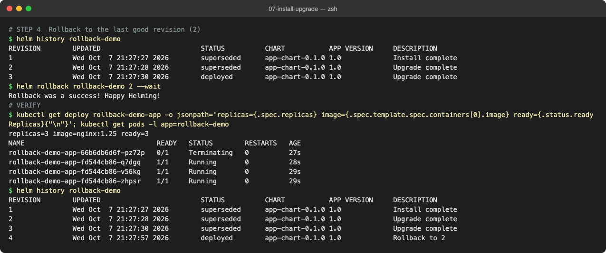

Revision 4 = "Rollback to 2": `nginx:1.25`, 3/3 ready, broken pod terminated.

### Extra: automatic rollback

```text
# Extra: let Helm roll back by itself. Helm 4 renamed --atomic to --rollback-on-failure (implies --wait).
$ helm upgrade rollback-demo ./app-chart --reuse-values --set image.tag=1.99-does-not-exist --rollback-on-failure --timeout 40s
level=WARN msg="upgrade failed" name=rollback-demo error="resource Deployment/default/rollback-demo-app not ready. status: InProgress, message: Updated: 1/3\ncontext deadline exceeded"
Error: UPGRADE FAILED: release rollback-demo failed, and has been rolled back due to rollback-on-failure being set: resource Deployment/default/rollback-demo-app not ready. status: InProgress, message: Updated: 1/3
context deadline exceeded
$ helm history rollback-demo
REVISION	UPDATED                 	STATUS    	CHART          	APP VERSION	DESCRIPTION                                                                                                                       
1       	Wed Oct  7 21:27:27 2026	superseded	app-chart-0.1.0	1.0        	Install complete                                                                                                                  
2       	Wed Oct  7 21:27:28 2026	superseded	app-chart-0.1.0	1.0        	Upgrade complete                                                                                                                  
3       	Wed Oct  7 21:27:30 2026	superseded	app-chart-0.1.0	1.0        	Upgrade complete                                                                                                                  
4       	Wed Oct  7 21:27:57 2026	superseded	app-chart-0.1.0	1.0        	Rollback to 2                                                                                                                     
5       	Wed Oct  7 21:28:08 2026	failed    	app-chart-0.1.0	1.0        	Upgrade "rollback-demo" failed: resource Deployment/default/rollback-demo-app not ready. status: InProgress, message: Updated: ...
6       	Wed Oct  7 21:28:48 2026	deployed  	app-chart-0.1.0	1.0        	Rollback to 4                                                                                                                     
$ kubectl get pods -l app=rollback-demo
NAME                                 READY   STATUS        RESTARTS   AGE
rollback-demo-app-66b6db6d6f-7q7mk   0/1     Terminating   0          40s
rollback-demo-app-fd544cb86-q7dgq    1/1     Running       0          79s
rollback-demo-app-fd544cb86-v56kg    1/1     Running       0          80s
rollback-demo-app-fd544cb86-zhpsr    1/1     Running       0          80s
```

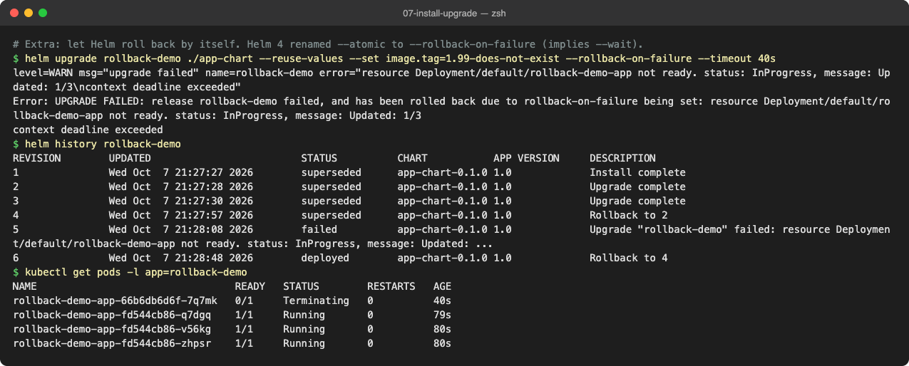

With `--rollback-on-failure` Helm waited, saw the Deployment not become ready within 40 s, marked revision 5 `failed` and created revision 6 "Rollback to 4" by itself. This is what a CD pipeline should use.

```text
rev1 install 1.24 ─► rev2 upgrade 1.25 x3 ─► rev3 upgrade bad tag ─► rev4 rollback to 2 ─► rev5 FAILED (auto) ─► rev6 rollback to 4
     verified ✔             verified ✔             ImagePullBackOff ✘         verified ✔            rolled back by Helm
```

---

## Task 3: Mini Project: Notes App

**Chart:** [mini-project/notes-chart/](mini-project/notes-chart/): `Chart.yaml`, `values.yaml` (dev: 1 replica, nginx 1.24, `development`), `values-prod.yaml` (3 replicas, nginx 1.25, `production`), templates for a ConfigMap (`APP_NAME`, `ENVIRONMENT`), a Deployment (`envFrom` the ConfigMap) and a NodePort Service (30090).

### Steps 8–9: Lint and render locally

```text
$ find notes-chart -type f | sort
notes-chart/Chart.yaml
notes-chart/templates/configmap.yaml
notes-chart/templates/deployment.yaml
notes-chart/templates/service.yaml
notes-chart/values-prod.yaml
notes-chart/values.yaml
$ helm lint notes-chart
==> Linting notes-chart
[INFO] Chart.yaml: icon is recommended

1 chart(s) linted, 0 chart(s) failed
$ helm template notes-dev notes-chart
---
# Source: notes-chart/templates/configmap.yaml
apiVersion: v1
kind: ConfigMap
metadata:
  name: notes-dev-config
data:
  APP_NAME: "notes-app"
  ENVIRONMENT: "development"

---
# Source: notes-chart/templates/service.yaml
apiVersion: v1
kind: Service
metadata:
  name: notes-dev-svc
spec:
  type: NodePort
  selector:
    app: notes-dev
  ports:
    - port: 80
      targetPort: 80
      nodePort: 30090

---
# Source: notes-chart/templates/deployment.yaml
apiVersion: apps/v1
kind: Deployment
metadata:
  name: notes-dev-deploy
  labels:
    app: notes-dev
    environment: development
spec:
  replicas: 1
  selector:
    matchLabels:
      app: notes-dev
  template:
    metadata:
      labels:
        app: notes-dev
    spec:
      containers:
        - name: notes
          image: "nginx:1.24"
          ports:
            - containerPort: 80
          envFrom:
            - configMapRef:
                name: notes-dev-config
$ helm template notes-dev notes-chart | grep -c '{{' || true
0
```

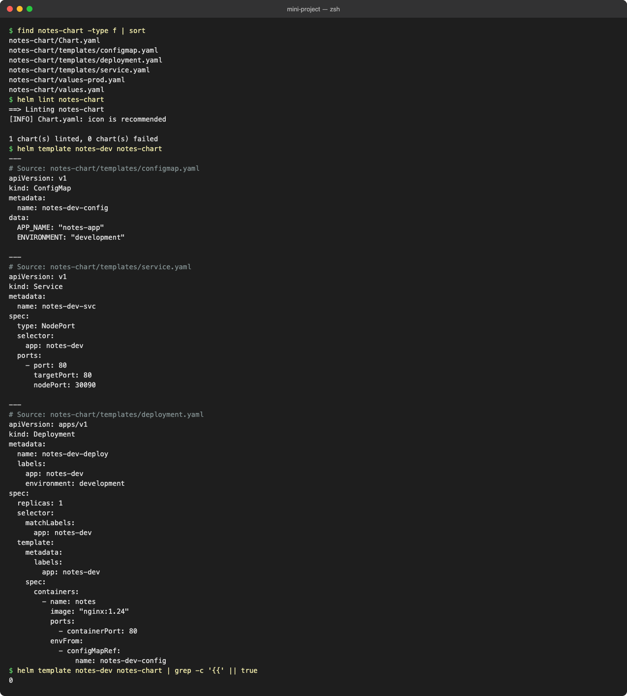

No `{{` left in the rendered output; every value resolved.

### Step 10: Install (development)

```text
$ helm install notes-dev notes-chart --wait | grep -E 'NAME|STATUS|REVISION'
NAME: notes-dev
NAMESPACE: default
STATUS: deployed
REVISION: 1
$ kubectl get pods -l app=notes-dev
NAME                                READY   STATUS    RESTARTS   AGE
notes-dev-deploy-74956bd987-8msmx   1/1     Running   0          0s
$ kubectl get services notes-dev-svc
NAME            TYPE       CLUSTER-IP       EXTERNAL-IP   PORT(S)        AGE
notes-dev-svc   NodePort   10.111.124.140   <none>        80:30090/TCP   0s
$ kubectl get configmaps notes-dev-config -o jsonpath='{.data}{"\n"}'
{"APP_NAME":"notes-app","ENVIRONMENT":"development"}
$ kubectl exec notes-dev-deploy-74956bd987-8msmx -- sh -c 'echo APP_NAME=$APP_NAME ENVIRONMENT=$ENVIRONMENT; nginx -v'
APP_NAME=notes-app ENVIRONMENT=development
nginx version: nginx/1.24.0
$ curl -s -o /dev/null -w 'NodePort 30090 via minikube IP: HTTP %{http_code}\n' http://$(minikube ip):30090 || kubectl exec curl-client -- curl -s -o /dev/null -w 'via Service: HTTP %{http_code}\n' http://notes-dev-svc
NodePort 30090 via minikube IP: HTTP 000
via Service: HTTP 200
# minikube docker driver on macOS: the node IP is not routable from the Mac (see session 11), so the NodePort check falls back to the Service from inside the cluster.
```

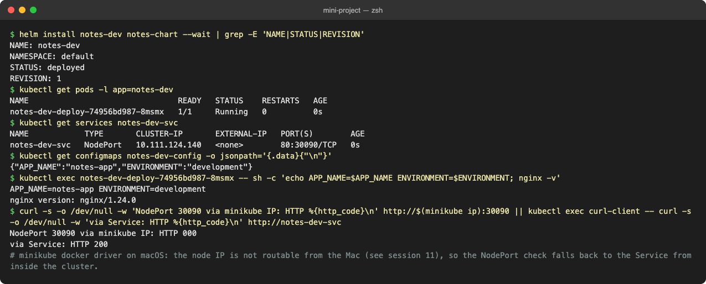

### Steps 11–12: Upgrade to production values, history

```text
$ helm upgrade notes-dev notes-chart -f notes-chart/values-prod.yaml --wait | grep -E 'has been upgraded|STATUS|REVISION'
Release "notes-dev" has been upgraded. Happy Helming!
STATUS: deployed
REVISION: 2
$ kubectl get pods -l app=notes-dev
NAME                                READY   STATUS      RESTARTS   AGE
notes-dev-deploy-74956bd987-8msmx   0/1     Completed   0          93s
notes-dev-deploy-74956bd987-srpsp   0/1     Completed   0          2s
notes-dev-deploy-74956bd987-vj969   0/1     Completed   0          2s
notes-dev-deploy-bbcc464b4-ct4js    1/1     Running     0          1s
notes-dev-deploy-bbcc464b4-gjzwd    1/1     Running     0          1s
notes-dev-deploy-bbcc464b4-rkgl8    1/1     Running     0          2s
$ kubectl get configmap notes-dev-config -o jsonpath='{.data}{"\n"}'
{"APP_NAME":"notes-app","ENVIRONMENT":"production"}
$ kubectl get deploy notes-dev-deploy --show-labels
NAME               READY   UP-TO-DATE   AVAILABLE   AGE   LABELS
notes-dev-deploy   3/3     3            3           93s   app.kubernetes.io/managed-by=Helm,app=notes-dev,environment=production
$ kubectl get deploy notes-dev-deploy -o jsonpath='image={.spec.template.spec.containers[0].image}{"\n"}'
image=nginx:1.25
$ helm history notes-dev
REVISION	UPDATED                 	STATUS    	CHART            	APP VERSION	DESCRIPTION     
1       	Wed Oct  7 21:28:58 2026	superseded	notes-chart-0.1.0	1.0        	Install complete
2       	Wed Oct  7 21:30:30 2026	deployed  	notes-chart-0.1.0	1.0        	Upgrade complete
```

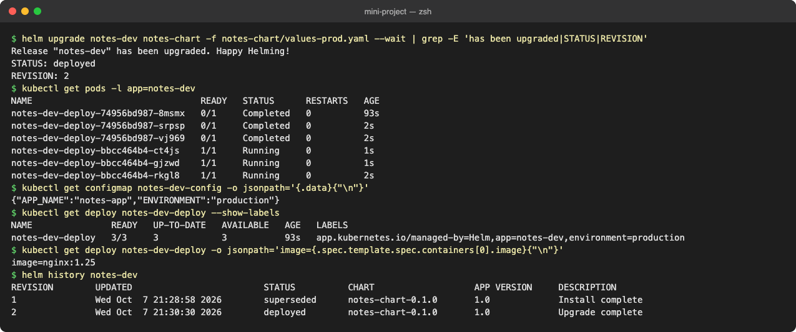

### Steps 13–14: Bad upgrade and rollback to revision 2

```text
# Step 13: simulate a bad upgrade
$ helm upgrade notes-dev notes-chart --set image.tag=broken-tag-does-not-exist | grep -E 'STATUS|REVISION'
STATUS: deployed
REVISION: 3
$ kubectl get pods -l app=notes-dev
NAME                                READY   STATUS             RESTARTS   AGE
notes-dev-deploy-79b4dbdffd-9frfr   0/1     ImagePullBackOff   0          26s
notes-dev-deploy-bbcc464b4-rkgl8    1/1     Running            0          28s
$ kubectl get deploy notes-dev-deploy -o jsonpath='replicas={.spec.replicas} image={.spec.template.spec.containers[0].image}{"\n"}'; kubectl get configmap notes-dev-config -o jsonpath='{.data}{"\n"}'
replicas=1 image=nginx:broken-tag-does-not-exist
{"APP_NAME":"notes-app","ENVIRONMENT":"development"}
# The bad upgrade used ONLY --set (no -f values-prod.yaml), so it also fell back to chart defaults:
# replicas 3 -> 1 and ENVIRONMENT production -> development. Upgrades do not remember earlier -f/--set values.
# Step 14: rollback to revision 2
$ helm rollback notes-dev 2 --wait
Rollback was a success! Happy Helming!
$ kubectl get pods -l app=notes-dev
NAME                                READY   STATUS        RESTARTS   AGE
notes-dev-deploy-79b4dbdffd-9frfr   0/1     Terminating   0          27s
notes-dev-deploy-79b4dbdffd-szz74   0/1     Terminating   0          1s
notes-dev-deploy-bbcc464b4-449jr    1/1     Running       0          1s
notes-dev-deploy-bbcc464b4-rkgl8    1/1     Running       0          29s
notes-dev-deploy-bbcc464b4-zpvp8    1/1     Running       0          1s
$ kubectl get deploy notes-dev-deploy -o jsonpath='replicas={.spec.replicas} image={.spec.template.spec.containers[0].image}{"\n"}'; kubectl get configmap notes-dev-config -o jsonpath='{.data}{"\n"}'
replicas=3 image=nginx:1.25
{"APP_NAME":"notes-app","ENVIRONMENT":"production"}
$ helm history notes-dev
REVISION	UPDATED                 	STATUS    	CHART            	APP VERSION	DESCRIPTION     
1       	Wed Oct  7 21:28:58 2026	superseded	notes-chart-0.1.0	1.0        	Install complete
2       	Wed Oct  7 21:30:30 2026	superseded	notes-chart-0.1.0	1.0        	Upgrade complete
3       	Wed Oct  7 21:30:32 2026	superseded	notes-chart-0.1.0	1.0        	Upgrade complete
4       	Wed Oct  7 21:30:58 2026	deployed  	notes-chart-0.1.0	1.0        	Rollback to 2
```

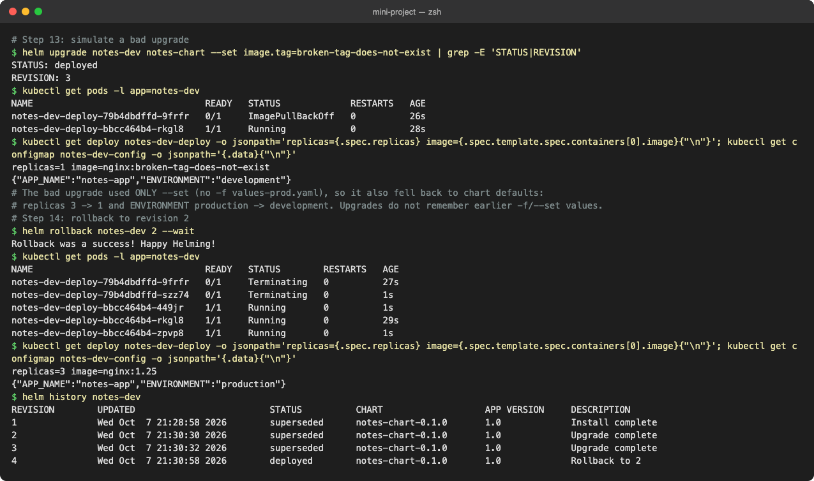

**Lesson:** step 13 (`--set image.tag=...` without `-f values-prod.yaml`) did more damage than the broken tag: Helm builds every upgrade from the chart's `values.yaml` + the flags of **that** command, so production silently went back to 1 replica and `ENVIRONMENT=development`. In real pipelines always pass the environment's values file on every upgrade (or use `--reuse-values` deliberately). The rollback restored all three: image, replica count and ConfigMap.

### Step 15: Clean up

```text
$ helm uninstall notes-dev --wait
release "notes-dev" uninstalled
$ kubectl get pods -l app=notes-dev
NAME                                READY   STATUS        RESTARTS   AGE
notes-dev-deploy-79b4dbdffd-szz74   0/1     Terminating   0          2s
notes-dev-deploy-bbcc464b4-449jr    0/1     Completed     0          2s
notes-dev-deploy-bbcc464b4-rkgl8    0/1     Completed     0          30s
notes-dev-deploy-bbcc464b4-zpvp8    0/1     Completed     0          2s
$ kubectl get services notes-dev-svc; kubectl get configmap notes-dev-config
Error from server (NotFound): services "notes-dev-svc" not found
Error from server (NotFound): configmaps "notes-dev-config" not found
$ helm list
NAME	NAMESPACE	REVISION	UPDATED	STATUS	CHART	APP VERSION
```

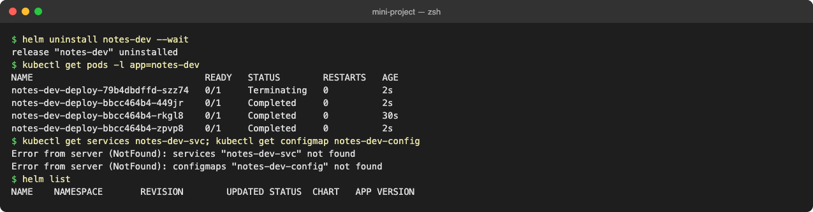

### What I practiced

```text
[PASS] Created / used a Helm chart (helm create + the notes-chart)
[PASS] values.yaml vs values-prod.yaml (-f) and --set overrides
[PASS] helm install, upgrade, history, rollback (manual and automatic), uninstall
[PASS] Simulated a bad upgrade and recovered
[PASS] helm repo / search / show
```

## Key takeaways

- A chart = templates + default values; a release = one installed instance; a revision = one version of that release.
- Values precedence: chart `values.yaml` < `-f file` (left to right) < `--set`.
- Rollback creates a new revision; history is the audit log of the release.
- Use `--wait` / `--rollback-on-failure` in automation, or Helm will happily call a broken release "deployed".
