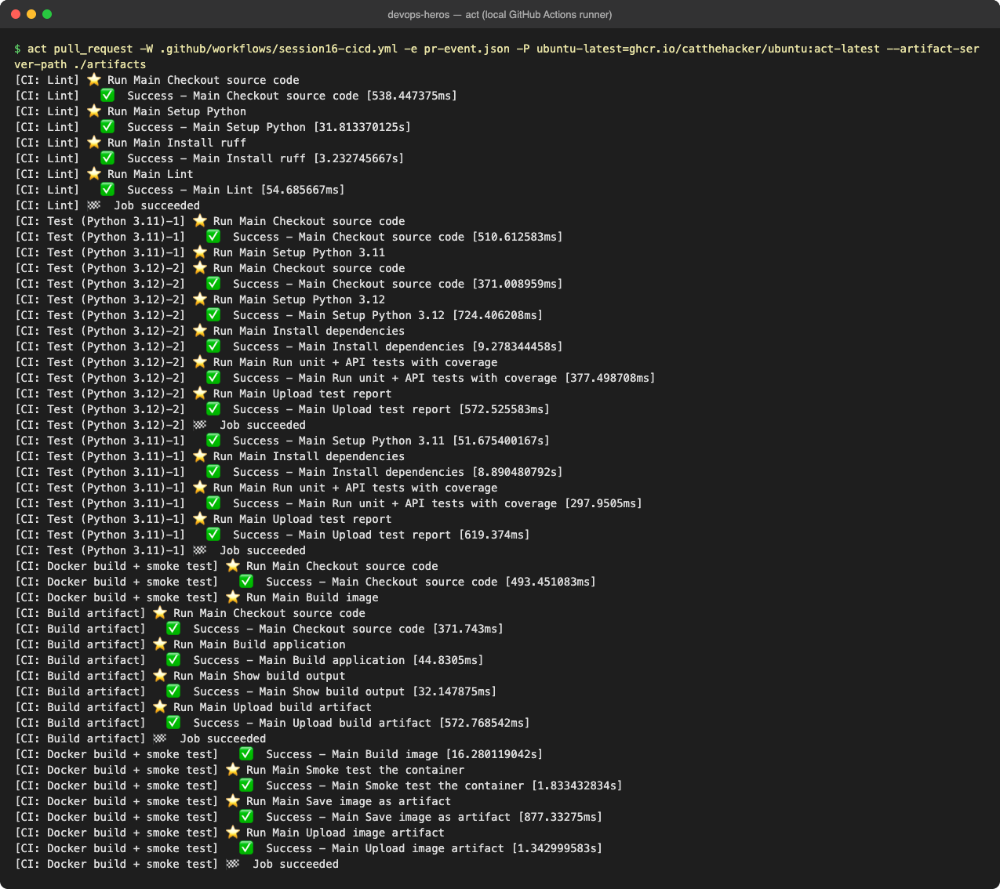
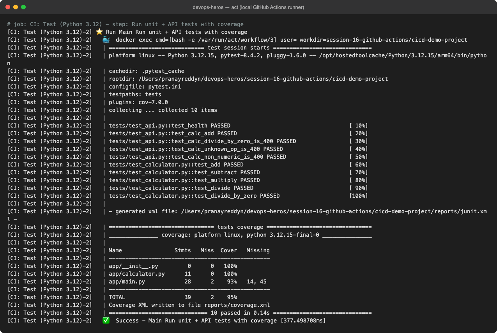
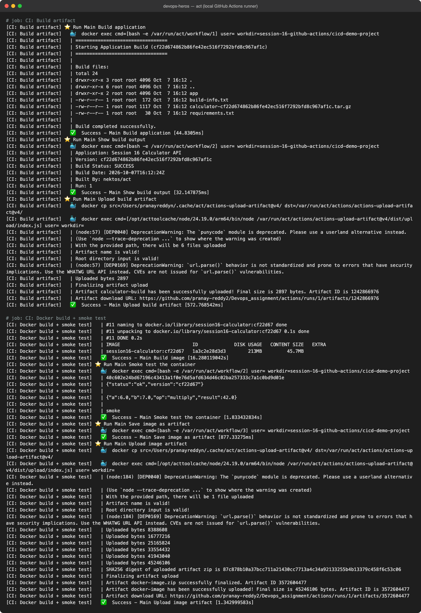
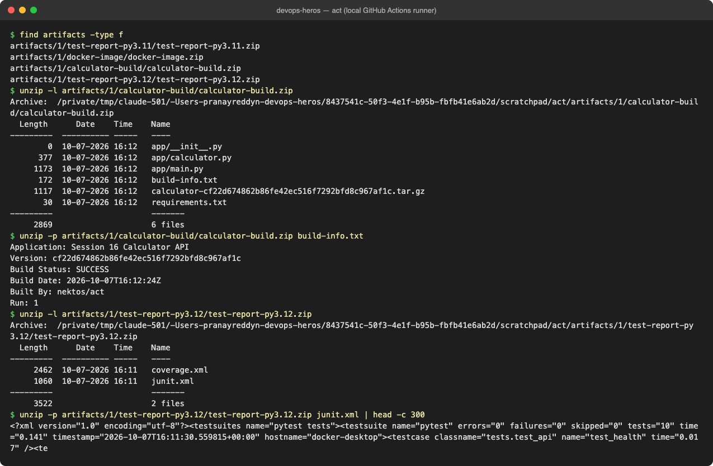
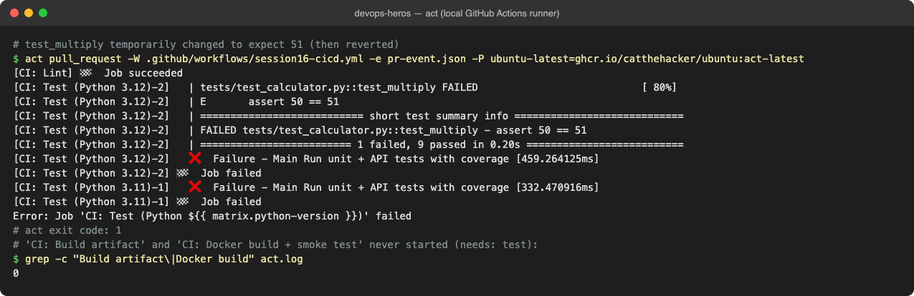
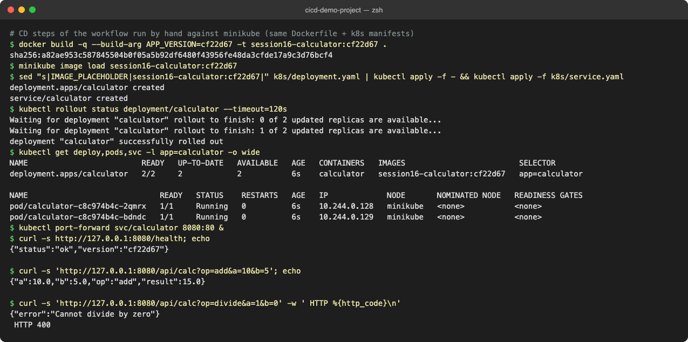

# Session 16 – CI/CD Demo Project (GitHub Actions)

**Author:** Pranay Reddy
**Course:** SST DevOps & Cloud [SWE]
**Session:** 16, Task: Demo Project (reference: [10-final-cicd-pipeline](../10-final-cicd-pipeline/))

A small calculator API taken from `10-final-cicd-pipeline` and extended into a full pipeline: lint → test (matrix) → build artifact → Docker image + smoke test → publish to GHCR → deploy to Kubernetes.

| Deliverable | File |
| :--- | :--- |
| Application source | [app/calculator.py](app/calculator.py) (logic), [app/main.py](app/main.py) (Flask API) |
| Tests | [tests/test_calculator.py](tests/test_calculator.py), [tests/test_api.py](tests/test_api.py) |
| Dockerfile | [Dockerfile](Dockerfile) (python:3.12-slim, non-root user, gunicorn, HEALTHCHECK) |
| Build script | [build.sh](build.sh) |
| Kubernetes manifests (CD target) | [k8s/deployment.yaml](k8s/deployment.yaml), [k8s/service.yaml](k8s/service.yaml) |
| GitHub Actions workflow (CI + CD) | [/.github/workflows/session16-cicd.yml](../../.github/workflows/session16-cicd.yml) |
| Screenshots | [../screenshots/](../screenshots/) |

> GitHub only runs workflows stored in the **repository root** `.github/workflows/`. The instructor's per-topic folders (`03-github-actions/.github/workflows/...`) are examples and never run, so this project's pipeline lives at the repo root and uses `paths:` filters and `working-directory` to target this folder.

---

## CI vs CD

| | Continuous Integration | Continuous Delivery / Deployment |
| :--- | :--- | :--- |
| Question | "Is this change correct and buildable?" | "Can we release it, and did we?" |
| Runs on | every push and pull request | changes merged to `main` |
| Here | `lint`, `test`, `build`, `docker` jobs | `publish` (image → registry) and `deploy` (→ Kubernetes) jobs |
| Output | test reports, build artifact, tested image | versioned image in GHCR, running Deployment |

Continuous **Delivery** stops at "ready to release" (often with a manual approval); continuous **Deployment** pushes every green change to an environment automatically. The `deploy` job uses a GitHub **environment** (`staging`), where required reviewers can be added to turn it into a manual gate.

## The pipeline

```text
                       pull_request / push to main
                                  │
                              ┌───▼───┐
                              │ lint  │  ruff
                              └───┬───┘
                    ┌─────────────┴─────────────┐   needs: lint
              ┌─────▼─────┐               ┌─────▼─────┐
              │ test 3.11 │               │ test 3.12 │   matrix, junit + coverage artifacts
              └─────┬─────┘               └─────┬─────┘
                    └─────────────┬─────────────┘   needs: test
                 ┌────────────────┴───────────────┐
           ┌─────▼─────┐                    ┌─────▼──────┐
           │  build    │ calculator-build   │  docker    │ build, smoke test, docker-image artifact
           └─────┬─────┘                    └─────┬──────┘
 ─ ─ ─ ─ ─ ─ ─ ─ ┼ ─ ─ ─ CI ends here for PRs ─ ─ ┼ ─ ─ ─ ─ ─ ─ ─ ─
                 └────────────────┬───────────────┘   needs: [build, docker], push to main only
                            ┌─────▼─────┐
                            │  publish  │  docker push ghcr.io/<owner>/session16-calculator:<sha>, :latest
                            └─────┬─────┘
                            ┌─────▼─────┐
                            │  deploy   │  kind cluster → kubectl apply → rollout status → curl
                            └───────────┘  environment: staging
```

## GitHub Actions building blocks used

| Concept | Where in the workflow | Notes |
| :--- | :--- | :--- |
| **Workflow** | `session16-cicd.yml` | YAML file in `.github/workflows/`; one file = one workflow |
| **Triggers** | `on: push / pull_request / workflow_dispatch` | `paths:` filter so only changes to this project run it; `workflow_dispatch` has a `deploy` boolean input |
| **Jobs** | `lint, test, build, docker, publish, deploy` | each job gets a fresh runner; run in parallel unless linked with `needs:` |
| **Steps** | `uses:` (an action) or `run:` (shell) | run in order inside one job, share the filesystem |
| **Runners** | `runs-on: ubuntu-latest` | GitHub-hosted VM; self-hosted is `runs-on: [self-hosted, linux]` |
| **Matrix** | `test` job, Python 3.11 + 3.12 | one job definition → N parallel jobs; `fail-fast: false` keeps the others running |
| **Secrets** | `secrets.GITHUB_TOKEN` (GHCR login), `secrets.DEMO_API_KEY` (optional) | masked as `***` in logs; never echoed, never committed |
| **Permissions** | top-level `contents: read`, `packages: write` only on `publish` | least privilege for the automatic `GITHUB_TOKEN` |
| **Artifacts** | `test-report-py*`, `calculator-build`, `docker-image` | `upload-artifact` / `download-artifact` pass files between jobs and keep them after the run |
| **Outputs** | `publish.outputs.image` → `deploy` | `$GITHUB_OUTPUT` passes values between jobs |
| **Environments** | `deploy` → `staging` | deployment history, environment secrets, optional required reviewers |
| **Concurrency** | `session16-${{ github.ref }}` | a new push cancels the older run on the same branch |
| **Conditions** | `if:` on `publish` | CD only for push to `main` or a manual run with `deploy: true` |

## Build and Test

```bash
python3 -m venv .venv && . .venv/bin/activate
pip install -r requirements-dev.txt
ruff check .
pytest -v --cov=app
./build.sh                      # -> build/ (app, requirements, build-info.txt, tarball)
docker build -t session16-calculator .
docker run -p 8000:8000 session16-calculator
curl "localhost:8000/api/calc?op=add&a=10&b=5"
```

---

## Pipeline execution

The repository is not pushed yet, so I executed this exact workflow file locally with **[act](https://github.com/nektos/act)** (runs GitHub Actions jobs in Docker containers using the `catthehacker/ubuntu:act-latest` runner image, with a local artifact server). A `pull_request` event runs the CI half; `publish`/`deploy` are skipped by their `if:` exactly as they would be on GitHub for a PR.

### Successful run: all CI jobs green

```text
$ act pull_request -W .github/workflows/session16-cicd.yml -e pr-event.json -P ubuntu-latest=ghcr.io/catthehacker/ubuntu:act-latest --artifact-server-path ./artifacts
[CI: Lint] ⭐ Run Main Checkout source code
[CI: Lint]   ✅  Success - Main Checkout source code [538.447375ms]
[CI: Lint] ⭐ Run Main Setup Python
[CI: Lint]   ✅  Success - Main Setup Python [31.813370125s]
[CI: Lint] ⭐ Run Main Install ruff
[CI: Lint]   ✅  Success - Main Install ruff [3.232745667s]
[CI: Lint] ⭐ Run Main Lint
[CI: Lint]   ✅  Success - Main Lint [54.685667ms]
[CI: Lint] 🏁  Job succeeded
[CI: Test (Python 3.11)-1] ⭐ Run Main Checkout source code
[CI: Test (Python 3.11)-1]   ✅  Success - Main Checkout source code [510.612583ms]
[CI: Test (Python 3.11)-1] ⭐ Run Main Setup Python 3.11
[CI: Test (Python 3.12)-2] ⭐ Run Main Checkout source code
[CI: Test (Python 3.12)-2]   ✅  Success - Main Checkout source code [371.008959ms]
[CI: Test (Python 3.12)-2] ⭐ Run Main Setup Python 3.12
[CI: Test (Python 3.12)-2]   ✅  Success - Main Setup Python 3.12 [724.406208ms]
[CI: Test (Python 3.12)-2] ⭐ Run Main Install dependencies
[CI: Test (Python 3.12)-2]   ✅  Success - Main Install dependencies [9.278344458s]
[CI: Test (Python 3.12)-2] ⭐ Run Main Run unit + API tests with coverage
[CI: Test (Python 3.12)-2]   ✅  Success - Main Run unit + API tests with coverage [377.498708ms]
[CI: Test (Python 3.12)-2] ⭐ Run Main Upload test report
[CI: Test (Python 3.12)-2]   ✅  Success - Main Upload test report [572.525583ms]
[CI: Test (Python 3.12)-2] 🏁  Job succeeded
[CI: Test (Python 3.11)-1]   ✅  Success - Main Setup Python 3.11 [51.675400167s]
[CI: Test (Python 3.11)-1] ⭐ Run Main Install dependencies
[CI: Test (Python 3.11)-1]   ✅  Success - Main Install dependencies [8.890480792s]
[CI: Test (Python 3.11)-1] ⭐ Run Main Run unit + API tests with coverage
[CI: Test (Python 3.11)-1]   ✅  Success - Main Run unit + API tests with coverage [297.9505ms]
[CI: Test (Python 3.11)-1] ⭐ Run Main Upload test report
[CI: Test (Python 3.11)-1]   ✅  Success - Main Upload test report [619.374ms]
[CI: Test (Python 3.11)-1] 🏁  Job succeeded
[CI: Docker build + smoke test] ⭐ Run Main Checkout source code
[CI: Docker build + smoke test]   ✅  Success - Main Checkout source code [493.451083ms]
[CI: Docker build + smoke test] ⭐ Run Main Build image
[CI: Build artifact] ⭐ Run Main Checkout source code
[CI: Build artifact]   ✅  Success - Main Checkout source code [371.743ms]
[CI: Build artifact] ⭐ Run Main Build application
[CI: Build artifact]   ✅  Success - Main Build application [44.8305ms]
[CI: Build artifact] ⭐ Run Main Show build output
[CI: Build artifact]   ✅  Success - Main Show build output [32.147875ms]
[CI: Build artifact] ⭐ Run Main Upload build artifact
[CI: Build artifact]   ✅  Success - Main Upload build artifact [572.768542ms]
[CI: Build artifact] 🏁  Job succeeded
[CI: Docker build + smoke test]   ✅  Success - Main Build image [16.280119042s]
[CI: Docker build + smoke test] ⭐ Run Main Smoke test the container
[CI: Docker build + smoke test]   ✅  Success - Main Smoke test the container [1.833432834s]
[CI: Docker build + smoke test] ⭐ Run Main Save image as artifact
[CI: Docker build + smoke test]   ✅  Success - Main Save image as artifact [877.33275ms]
[CI: Docker build + smoke test] ⭐ Run Main Upload image artifact
[CI: Docker build + smoke test]   ✅  Success - Main Upload image artifact [1.342999583s]
[CI: Docker build + smoke test] 🏁  Job succeeded
```



### Test job (matrix leg 3.12): 10 tests, 95% coverage

```text
# job: CI: Test (Python 3.12) - step: Run unit + API tests with coverage
[CI: Test (Python 3.12)-2] ⭐ Run Main Run unit + API tests with coverage
[CI: Test (Python 3.12)-2]   🐳  docker exec cmd=[bash -e /var/run/act/workflow/3] user= workdir=session-16-github-actions/cicd-demo-project
[CI: Test (Python 3.12)-2]   | ============================= test session starts ==============================
[CI: Test (Python 3.12)-2]   | platform linux -- Python 3.12.15, pytest-8.4.2, pluggy-1.6.0 -- /opt/hostedtoolcache/Python/3.12.15/arm64/bin/python
[CI: Test (Python 3.12)-2]   | cachedir: .pytest_cache
[CI: Test (Python 3.12)-2]   | rootdir: /Users/pranayreddyn/devops-heros/session-16-github-actions/cicd-demo-project
[CI: Test (Python 3.12)-2]   | configfile: pytest.ini
[CI: Test (Python 3.12)-2]   | testpaths: tests
[CI: Test (Python 3.12)-2]   | plugins: cov-7.0.0
[CI: Test (Python 3.12)-2]   | collecting ... collected 10 items
[CI: Test (Python 3.12)-2]   | 
[CI: Test (Python 3.12)-2]   | tests/test_api.py::test_health PASSED                                    [ 10%]
[CI: Test (Python 3.12)-2]   | tests/test_api.py::test_calc_add PASSED                                  [ 20%]
[CI: Test (Python 3.12)-2]   | tests/test_api.py::test_calc_divide_by_zero_is_400 PASSED                [ 30%]
[CI: Test (Python 3.12)-2]   | tests/test_api.py::test_calc_unknown_op_is_400 PASSED                    [ 40%]
[CI: Test (Python 3.12)-2]   | tests/test_api.py::test_calc_non_numeric_is_400 PASSED                   [ 50%]
[CI: Test (Python 3.12)-2]   | tests/test_calculator.py::test_add PASSED                                [ 60%]
[CI: Test (Python 3.12)-2]   | tests/test_calculator.py::test_subtract PASSED                           [ 70%]
[CI: Test (Python 3.12)-2]   | tests/test_calculator.py::test_multiply PASSED                           [ 80%]
[CI: Test (Python 3.12)-2]   | tests/test_calculator.py::test_divide PASSED                             [ 90%]
[CI: Test (Python 3.12)-2]   | tests/test_calculator.py::test_divide_by_zero PASSED                     [100%]
[CI: Test (Python 3.12)-2]   | 
[CI: Test (Python 3.12)-2]   | - generated xml file: /Users/pranayreddyn/devops-heros/session-16-github-actions/cicd-demo-project/reports/junit.xml -
[CI: Test (Python 3.12)-2]   | ================================ tests coverage ================================
[CI: Test (Python 3.12)-2]   | _______________ coverage: platform linux, python 3.12.15-final-0 _______________
[CI: Test (Python 3.12)-2]   | 
[CI: Test (Python 3.12)-2]   | Name                Stmts   Miss  Cover   Missing
[CI: Test (Python 3.12)-2]   | -------------------------------------------------
[CI: Test (Python 3.12)-2]   | app/__init__.py         0      0   100%
[CI: Test (Python 3.12)-2]   | app/calculator.py      11      0   100%
[CI: Test (Python 3.12)-2]   | app/main.py            28      2    93%   14, 45
[CI: Test (Python 3.12)-2]   | -------------------------------------------------
[CI: Test (Python 3.12)-2]   | TOTAL                  39      2    95%
[CI: Test (Python 3.12)-2]   | Coverage XML written to file reports/coverage.xml
[CI: Test (Python 3.12)-2]   | ============================== 10 passed in 0.14s ==============================
[CI: Test (Python 3.12)-2]   ✅  Success - Main Run unit + API tests with coverage [377.498708ms]
```



### Build and Docker jobs: artifact, image, smoke test



The full text of this step output is in the screenshot; key lines: `build-info.txt` with the commit SHA as version, a 45.7 MB image, `{"status":"ok","version":"cf22d67"}` and `{"a":6.0,"b":7.0,"op":"multiply","result":42.0}` from inside the running container, and both artifacts uploaded.

### Artifacts produced by the run

```text
$ find artifacts -type f
artifacts/1/test-report-py3.11/test-report-py3.11.zip
artifacts/1/docker-image/docker-image.zip
artifacts/1/calculator-build/calculator-build.zip
artifacts/1/test-report-py3.12/test-report-py3.12.zip
$ unzip -l artifacts/1/calculator-build/calculator-build.zip
Archive:  /private/tmp/claude-501/-Users-pranayreddyn-devops-heros/8437541c-50f3-4e1f-b95b-fbfb41e6ab2d/scratchpad/act/artifacts/1/calculator-build/calculator-build.zip
  Length      Date    Time    Name
---------  ---------- -----   ----
        0  10-07-2026 16:12   app/__init__.py
      377  10-07-2026 16:12   app/calculator.py
     1173  10-07-2026 16:12   app/main.py
      172  10-07-2026 16:12   build-info.txt
     1117  10-07-2026 16:12   calculator-cf22d674862b86fe42ec516f7292bfd8c967af1c.tar.gz
       30  10-07-2026 16:12   requirements.txt
---------                     -------
     2869                     6 files
$ unzip -p artifacts/1/calculator-build/calculator-build.zip build-info.txt
Application: Session 16 Calculator API
Version: cf22d674862b86fe42ec516f7292bfd8c967af1c
Build Status: SUCCESS
Build Date: 2026-10-07T16:12:24Z
Built By: nektos/act
Run: 1
$ unzip -l artifacts/1/test-report-py3.12/test-report-py3.12.zip
Archive:  /private/tmp/claude-501/-Users-pranayreddyn-devops-heros/8437541c-50f3-4e1f-b95b-fbfb41e6ab2d/scratchpad/act/artifacts/1/test-report-py3.12/test-report-py3.12.zip
  Length      Date    Time    Name
---------  ---------- -----   ----
     2462  10-07-2026 16:11   coverage.xml
     1060  10-07-2026 16:11   junit.xml
---------                     -------
     3522                     2 files
$ unzip -p artifacts/1/test-report-py3.12/test-report-py3.12.zip junit.xml | head -c 300
<?xml version="1.0" encoding="utf-8"?><testsuites name="pytest tests"><testsuite name="pytest" errors="0" failures="0" skipped="0" tests="10" time="0.141" timestamp="2026-10-07T16:11:30.559815+00:00" hostname="docker-desktop"><testcase classname="tests.test_api" name="test_health" time="0.017" /><te
```



### A failing run: tests gate the build

I changed one assertion to a wrong value, ran the pipeline, then reverted it:

```text
# test_multiply temporarily changed to expect 51 (then reverted)
$ act pull_request -W .github/workflows/session16-cicd.yml -e pr-event.json -P ubuntu-latest=ghcr.io/catthehacker/ubuntu:act-latest
[CI: Lint] 🏁  Job succeeded
[CI: Test (Python 3.12)-2]   | tests/test_calculator.py::test_multiply FAILED                           [ 80%]
[CI: Test (Python 3.12)-2]   | E       assert 50 == 51
[CI: Test (Python 3.12)-2]   | =========================== short test summary info ============================
[CI: Test (Python 3.12)-2]   | FAILED tests/test_calculator.py::test_multiply - assert 50 == 51
[CI: Test (Python 3.12)-2]   | ========================= 1 failed, 9 passed in 0.20s ==========================
[CI: Test (Python 3.12)-2]   ❌  Failure - Main Run unit + API tests with coverage [459.264125ms]
[CI: Test (Python 3.12)-2] 🏁  Job failed
[CI: Test (Python 3.11)-1]   ❌  Failure - Main Run unit + API tests with coverage [332.470916ms]
[CI: Test (Python 3.11)-1] 🏁  Job failed
Error: Job 'CI: Test (Python ${{ matrix.python-version }})' failed
# act exit code: 1
# 'CI: Build artifact' and 'CI: Docker build + smoke test' never started (needs: test):
$ grep -c "Build artifact\|Docker build" act.log
0
```



Both matrix legs failed, act exited 1, and `build`/`docker` never started because of `needs: test`. Nothing untested gets packaged or deployed.

### CD stage

On GitHub, `publish` pushes `ghcr.io/<owner>/session16-calculator:<sha>` using the automatic `GITHUB_TOKEN` and `deploy` creates a throwaway **kind** cluster on the runner, loads the tested image, applies `k8s/`, waits for the rollout and curls the Service. Those two jobs need GitHub (token + registry), so locally I ran the same deploy steps against minikube:

```text
# CD steps of the workflow run by hand against minikube (same Dockerfile + k8s manifests)
$ docker build -q --build-arg APP_VERSION=cf22d67 -t session16-calculator:cf22d67 .
sha256:a82ae953c587845504b0f05a5b92df6480f43956fe48da3cfde17a9c3d76bcf4
$ minikube image load session16-calculator:cf22d67
$ sed "s|IMAGE_PLACEHOLDER|session16-calculator:cf22d67|" k8s/deployment.yaml | kubectl apply -f - && kubectl apply -f k8s/service.yaml
deployment.apps/calculator created
service/calculator created
$ kubectl rollout status deployment/calculator --timeout=120s
Waiting for deployment "calculator" rollout to finish: 0 of 2 updated replicas are available...
Waiting for deployment "calculator" rollout to finish: 1 of 2 updated replicas are available...
deployment "calculator" successfully rolled out
$ kubectl get deploy,pods,svc -l app=calculator -o wide
NAME                         READY   UP-TO-DATE   AVAILABLE   AGE   CONTAINERS   IMAGES                         SELECTOR
deployment.apps/calculator   2/2     2            2           6s    calculator   session16-calculator:cf22d67   app=calculator

NAME                             READY   STATUS    RESTARTS   AGE   IP             NODE       NOMINATED NODE   READINESS GATES
pod/calculator-c8c974b4c-2qmrx   1/1     Running   0          6s    10.244.0.128   minikube   <none>           <none>
pod/calculator-c8c974b4c-bdndc   1/1     Running   0          6s    10.244.0.129   minikube   <none>           <none>
$ kubectl port-forward svc/calculator 8080:80 &
$ curl -s http://127.0.0.1:8080/health; echo
{"status":"ok","version":"cf22d67"}

$ curl -s 'http://127.0.0.1:8080/api/calc?op=add&a=10&b=5'; echo
{"a":10.0,"b":5.0,"op":"add","result":15.0}

$ curl -s 'http://127.0.0.1:8080/api/calc?op=divide&a=1&b=0' -w ' HTTP %{http_code}\n'
{"error":"Cannot divide by zero"}
 HTTP 400
```



### After pushing

The workflow runs automatically on the first push that touches this folder (or **Actions → Session 16 - CI/CD Demo → Run workflow**). Screenshot the run graph and the `deploy` job log from the Actions tab and add them to `../screenshots/` as `github-run.png` / `github-deploy.png`. The image appears under the account's **Packages** (private by default).

## Lessons

- Put shared settings at the top (`env`, `defaults.run.working-directory`, `permissions`, `concurrency`) and keep jobs small and single-purpose.
- Use `needs:` to express the pipeline order; independent jobs (`build` and `docker`) run in parallel.
- Deploy the artifact you tested: the image built and smoke-tested in CI is passed as an artifact and loaded as-is in CD, not rebuilt.
- Give the `GITHUB_TOKEN` only the permissions a job needs (`packages: write` only where the image is pushed).
