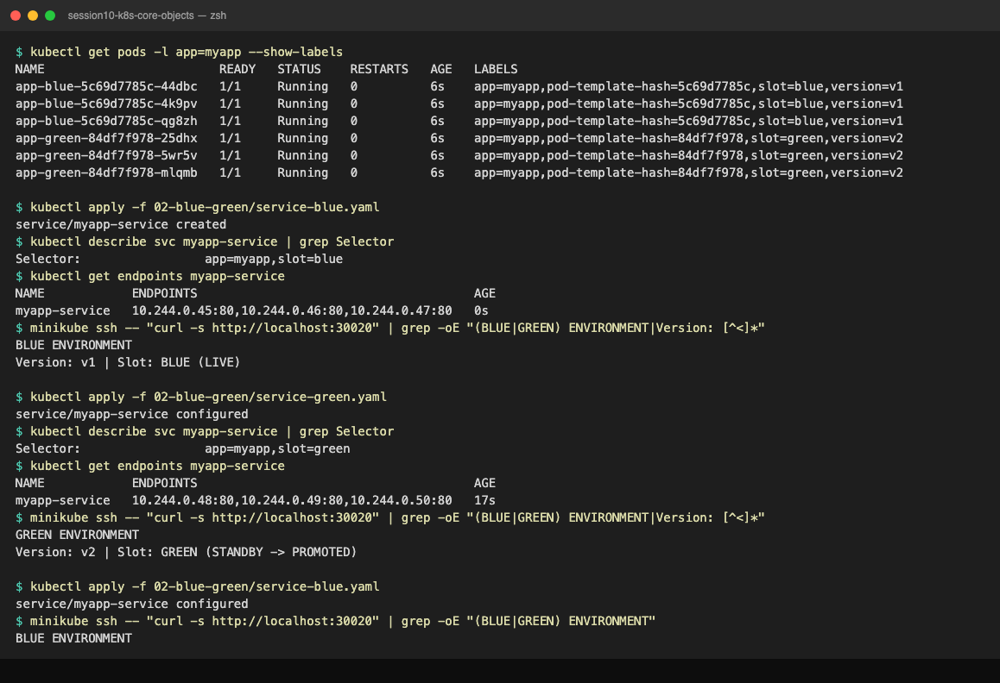

# Blue-Green Deployment Strategy

## What is Blue-Green Deployment?

**Blue-Green Deployment** is a release strategy where you maintain **two identical production environments** running side-by-side at all times — called **Blue** (current live version) and **Green** (new version being prepared).

* **Blue** = Current production environment. Serving 100% of live user traffic.
* **Green** = New version environment. Fully deployed and tested, but receiving zero user traffic.

When you are confident the Green environment is healthy and tested, you flip a **single switch** (a Kubernetes Service selector change) to redirect 100% of traffic from Blue to Green — **instantaneously**.

```text
PHASE 1: Normal Operation
  Users ------> [Service] ------> [BLUE: v1] [BLUE: v1] [BLUE: v1]  (LIVE)
                                  [GREEN: v2] [GREEN: v2] [GREEN: v2] (IDLE - warming up)

PHASE 2: Flip the Switch (kubectl apply service-green.yaml)
  Users ------> [Service] ------> [GREEN: v2] [GREEN: v2] [GREEN: v2] (NOW LIVE)
                                  [BLUE: v1]  [BLUE: v1]  [BLUE: v1]  (STANDBY - instant rollback)

PHASE 3: Rollback (if needed) — just flip back
  Users ------> [Service] ------> [BLUE: v1]  (Back to v1 in under 5 seconds)
```

---

## Why Do We Need Blue-Green?

### Problems with Rolling Update:
* During a rolling update, **both v1 and v2 pods are simultaneously serving traffic**. If v2 has a database schema migration incompatible with v1, mixed traffic causes data corruption.
* You cannot do pre-production load testing on the new version with zero user impact.

### Benefits of Blue-Green:
* **Instant cutover:** The switch from v1 to v2 takes under 5 seconds.
* **Instant rollback:** If v2 has a bug, flip the selector back. Rollback takes under 5 seconds.
* **Pre-production testing under production conditions:** Green runs full load tests in the real cluster before receiving user traffic.
* **No mixed traffic:** At any point, 100% of users are on v1 OR 100% are on v2. Never both.

---

## Important Points

* Blue-Green requires **2x the compute resources** (double the pods running simultaneously). This is the trade-off for instant switchover and rollback.
* The **only thing that changes** between Blue and Green is the `selector` field in the Service manifest.
* Keep the Blue environment running for **at least 24 hours** after switching to Green — as your instant rollback safety net.
* Blue-Green is the preferred strategy for **database schema changes** because you can run the migration against the Green pods before switching traffic.
* After a successful Green deployment, recycle Blue pods to save resource costs.

---

## Production Use Cases

* Swiggy, Zomato, Flipkart releasing major application versions during off-peak hours.
* Applications with database migrations requiring a specific version to run first.
* Compliance-regulated applications (banking, healthcare) where rollback SLA must be under 60 seconds.
* Any service with a firm SLA (e.g. 99.99% uptime) that cannot tolerate even 1 request failure during update.

---

## Code Files

| File | Purpose |
| :--- | :--- |
| `deployment-blue.yaml` | 3 pods of v1 (blue background) — initially LIVE |
| `deployment-green.yaml` | 3 pods of v2 (green background) — initially STANDBY |
| `service-blue.yaml` | Service with `selector: slot: blue` — routes to v1 |
| `service-green.yaml` | Service with `selector: slot: green` — routes to v2 |

---

## Step-by-Step Commands

### Step 1: Deploy Both Environments Simultaneously
```bash
kubectl apply -f 02-blue-green/deployment-blue.yaml
kubectl apply -f 02-blue-green/deployment-green.yaml
```

Wait for all 6 pods to be Ready:
```bash
kubectl get pods -l app=myapp --show-labels
```

Expected output (6 pods total — 3 blue, 3 green):
```text
NAME                         READY   STATUS    RESTARTS   AGE   LABELS
app-blue-6c8d9b5f4-5k9tz    1/1     Running   0          30s   app=myapp,slot=blue,version=v1
app-blue-6c8d9b5f4-8qmzj    1/1     Running   0          30s   app=myapp,slot=blue,version=v1
app-blue-6c8d9b5f4-r2lxp    1/1     Running   0          30s   app=myapp,slot=blue,version=v1
app-green-7d4f8c6b9-4hqnw   1/1     Running   0          28s   app=myapp,slot=green,version=v2
app-green-7d4f8c6b9-6kpzt   1/1     Running   0          28s   app=myapp,slot=green,version=v2
app-green-7d4f8c6b9-9trmq   1/1     Running   0          28s   app=myapp,slot=green,version=v2
```

### Step 2: Point Service to BLUE (v1 goes LIVE)
```bash
kubectl apply -f 02-blue-green/service-blue.yaml
```

Test Blue is serving traffic:
```bash
curl http://$(minikube ip):30020
# OR
minikube service myapp-service --url
```

Expected output (visible in browser or terminal):
```text
BLUE ENVIRONMENT
Version: v1 | Slot: BLUE (LIVE)
```

### Step 3: Confirm Service Selector Before the Switch
```bash
kubectl describe svc myapp-service | grep Selector
```

Expected output:
```text
Selector:   app=myapp,slot=blue
```

```bash
kubectl get endpoints myapp-service
```

Expected output (3 blue pod IPs):
```text
NAME             ENDPOINTS                                         AGE
myapp-service    10.244.0.10:80,10.244.0.11:80,10.244.0.12:80    45s
```

### Step 4: THE SWITCH — Flip 100% Traffic to GREEN (v2) Instantly
```bash
kubectl apply -f 02-blue-green/service-green.yaml
```

Expected output:
```text
service/myapp-service configured
```

Test Green is now live:
```bash
curl http://$(minikube ip):30020
```

Expected output:
```text
GREEN ENVIRONMENT
Version: v2 | Slot: GREEN (STANDBY -> PROMOTED)
```

Verify the selector changed:
```bash
kubectl describe svc myapp-service | grep Selector
```

Expected output:
```text
Selector:   app=myapp,slot=green
```

The switch from Blue to Green happened in **milliseconds** — a single `kubectl apply` changed the routing.

### Step 5: Verify Endpoints Changed
```bash
kubectl get endpoints myapp-service
```

Expected output (now shows 3 green pod IPs):
```text
NAME             ENDPOINTS                                         AGE
myapp-service    10.244.0.20:80,10.244.0.21:80,10.244.0.22:80    10s
```

### Step 6: Rollback — Flip Back to Blue in Under 5 Seconds
```bash
kubectl apply -f 02-blue-green/service-blue.yaml
```

Confirm Blue is serving again:
```bash
curl http://$(minikube ip):30020
# Output: BLUE ENVIRONMENT
```

### Step 7: Decommission the Old Blue Environment (After Green is Confirmed Stable)
```bash
kubectl delete deployment app-blue
```

---

## Lab Run Output (minikube v1.39.0, Kubernetes v1.37.0, docker driver on macOS)




On macOS with the docker driver, `$(minikube ip)` is not routable from the host, so the curl tests below run inside the node with `minikube ssh -- "curl -s http://localhost:30020"`.

### Step 1: Both environments up
```text
deployment.apps/app-blue created
deployment.apps/app-green created
deployment "app-blue" successfully rolled out
deployment "app-green" successfully rolled out
NAME                        READY   STATUS    RESTARTS   AGE   LABELS
app-blue-5c69d7785c-44dbc   1/1     Running   0          6s    app=myapp,pod-template-hash=5c69d7785c,slot=blue,version=v1
app-blue-5c69d7785c-4k9pv   1/1     Running   0          6s    app=myapp,pod-template-hash=5c69d7785c,slot=blue,version=v1
app-blue-5c69d7785c-qg8zh   1/1     Running   0          6s    app=myapp,pod-template-hash=5c69d7785c,slot=blue,version=v1
app-green-84df7f978-25dhx   1/1     Running   0          6s    app=myapp,pod-template-hash=84df7f978,slot=green,version=v2
app-green-84df7f978-5wr5v   1/1     Running   0          6s    app=myapp,pod-template-hash=84df7f978,slot=green,version=v2
app-green-84df7f978-mlqmb   1/1     Running   0          6s    app=myapp,pod-template-hash=84df7f978,slot=green,version=v2
```

### Step 2-3: Service on BLUE
```text
service/myapp-service created
Selector:                 app=myapp,slot=blue
NAME            ENDPOINTS                                      AGE
myapp-service   10.244.0.45:80,10.244.0.46:80,10.244.0.47:80   0s
BLUE ENVIRONMENT Version: v1 | Slot: BLUE (LIVE)
BLUE ENVIRONMENT Version: v1 | Slot: BLUE (LIVE)
BLUE ENVIRONMENT Version: v1 | Slot: BLUE (LIVE)
```
The very first curl right after `service ... created` failed with `curl: (7)`; kube-proxy needs about a second to program the NodePort rules. Every curl after that hit blue.

### Step 4-5: THE SWITCH to GREEN
```text
service/myapp-service configured
Selector:                 app=myapp,slot=green
NAME            ENDPOINTS                                      AGE
myapp-service   10.244.0.48:80,10.244.0.49:80,10.244.0.50:80   17s
GREEN ENVIRONMENT Version: v2 | Slot: GREEN (STANDBY -> PROMOTED)
GREEN ENVIRONMENT Version: v2 | Slot: GREEN (STANDBY -> PROMOTED)
GREEN ENVIRONMENT Version: v2 | Slot: GREEN (STANDBY -> PROMOTED)
```
Same Service name and NodePort, completely different endpoint IPs (`.45-.47` became `.48-.50`). No pod was created or deleted; only the selector changed.

### Step 6: Rollback to BLUE
```text
service/myapp-service configured
Selector:                 app=myapp,slot=blue
GREEN ENVIRONMENT          <- curl fired within ~200ms of the apply
BLUE ENVIRONMENT           <- ~2s later
BLUE ENVIRONMENT
BLUE ENVIRONMENT
```
Worth showing students: the selector flip is atomic in the API, but kube-proxy on each node rewrites its rules asynchronously. There is a sub-second window where a request can still land on the old slot. "Instant" means about one second, not zero.

### Cleanup
```text
deployment.apps "app-blue" deleted from default namespace
deployment.apps "app-green" deleted from default namespace
service "myapp-service" deleted from default namespace
Error from server (NotFound): error when deleting "02-blue-green/service-green.yaml": services "myapp-service" not found
```
The `NotFound` is expected when deleting with `-f 02-blue-green/`: both `service-blue.yaml` and `service-green.yaml` describe the same Service, so the second delete finds nothing.

---

## Cleanup
```bash
kubectl delete -f 02-blue-green/service-blue.yaml
kubectl delete -f 02-blue-green/deployment-blue.yaml
kubectl delete -f 02-blue-green/deployment-green.yaml
```
