# Session 10: Kubernetes Core Objects & Deployment Strategies

**Author:** Pranay Reddy
**Course:** SST DevOps & Cloud [SWE]
**Session:** 10 (tasks also covered in lectures 11 and 12)
**Repository:** devops-heros / session10-k8s-core-objects
**Environment:** macOS (Apple Silicon, arm64), Docker Desktop, minikube v1.39.0, Kubernetes v1.37.0, containerd 2.3.4

References: https://github.com/Nency-Ravaliya/Kubernetes and https://github.com/Nency-Ravaliya/Kubernetes/blob/main/core-objects.md

Every output block below is real output from this machine. On macOS with the docker driver, `$(minikube ip):<nodePort>` is not reachable from the host, so curl tests against NodePorts are run inside the node with `minikube ssh -- "curl ..."` (see Task 12 in session 11 for why).

Sub-folder READMEs with the full step-by-step walkthroughs and more output: [pod-lifecycle/](pod-lifecycle/README.md), [01-rolling-update/](01-rolling-update/README.md), [02-blue-green/](02-blue-green/README.md), [03-canary/](03-canary/README.md), [04-recreate/](04-recreate/README.md).

---

## Task 1: Cluster Health Verification & Baseline Environment Checks

**Description:** Verify that the control plane, CoreDNS and the node are operational before deploying workloads.

**Commands:**
```bash
kubectl version
kubectl cluster-info
kubectl get nodes -o wide
```

**Output:**
```text
$ kubectl version
Client Version: v1.37.0
Kustomize Version: v5.8.1
Server Version: v1.37.0

$ kubectl cluster-info
Kubernetes control plane is running at https://127.0.0.1:61533
CoreDNS is running at https://127.0.0.1:61533/api/v1/namespaces/kube-system/services/kube-dns:dns/proxy

To further debug and diagnose cluster problems, use 'kubectl cluster-info dump'.

$ kubectl get nodes -o wide
NAME       STATUS   ROLES           AGE   VERSION   INTERNAL-IP    EXTERNAL-IP   OS-IMAGE                         KERNEL-VERSION            CONTAINER-RUNTIME
minikube   Ready    control-plane   10d   v1.37.0   192.168.49.2   <none>        Debian GNU/Linux 12 (bookworm)   7.0.12-linuxkit (arm64)   containerd://2.3.4
```

Client and server are both v1.37.0. The API server is reachable on `127.0.0.1:<port>` because the docker driver forwards that port into the minikube container. The node is `Ready` and runs containerd, not Docker.

**Screenshot:**

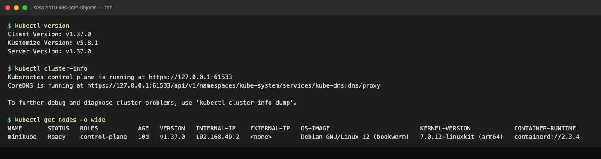

---

## Task 2: Standard Pod Deployment, Extended Inspection & Teardown (`pod.yml`)

**Description:** Create a standalone Nginx pod with the 4 mandatory fields (`apiVersion`, `kind`, `metadata`, `spec`), inspect readiness, IP, node placement and logs, then delete it.

**Files:** `pod.yml`

**Commands:**
```bash
kubectl apply -f pod.yml
kubectl get pods nginx-pod
kubectl get pods nginx-pod -o wide
kubectl logs nginx-pod
kubectl delete -f pod.yml
kubectl get pods nginx-pod
```

**Output:**
```text
$ kubectl apply -f pod.yml
pod/nginx-pod created

$ kubectl get pods nginx-pod
NAME        READY   STATUS    RESTARTS   AGE
nginx-pod   1/1     Running   0          10s

$ kubectl get pods nginx-pod -o wide
NAME        READY   STATUS    RESTARTS   AGE   IP            NODE       NOMINATED NODE   READINESS GATES
nginx-pod   1/1     Running   0          10s   10.244.0.12   minikube   <none>           <none>

$ kubectl logs nginx-pod | tail -4
2026/09/17 18:30:11 [notice] 1#1: start worker process 35
2026/09/17 18:30:11 [notice] 1#1: start worker process 36
2026/09/17 18:30:11 [notice] 1#1: start worker process 37
2026/09/17 18:30:11 [notice] 1#1: start worker process 38

$ kubectl delete -f pod.yml
pod "nginx-pod" deleted from default namespace

$ kubectl get pods nginx-pod
Error from server (NotFound): pods "nginx-pod" not found
```

`1/1 Running` = 1 of 1 containers ready. The pod got IP `10.244.0.12` from the pod CIDR and was placed on the only node. After delete, `get` returns `NotFound`: a bare pod has no controller, so nothing recreates it.

**Screenshot:**

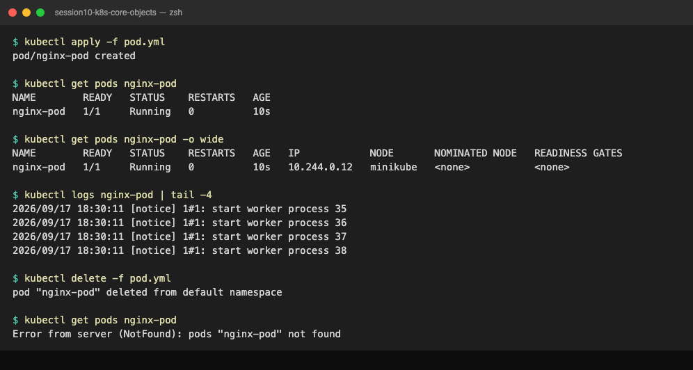

---

## Task 3: Error State Simulation: `ErrImagePull` & `ImagePullBackOff`

**Description:** Reference a non-existent image and watch the kubelet cycle between pull attempts and back-off.

**Files:** `pod-lifecycle/06-imagepullbackoff.yaml`

**Commands:**
```bash
kubectl apply -f pod-lifecycle/06-imagepullbackoff.yaml
kubectl get pod lifecycle-image-error
kubectl describe pod lifecycle-image-error | grep -A 10 Events:
kubectl delete -f pod-lifecycle/06-imagepullbackoff.yaml
```

**Output:**
```text
$ kubectl apply -f pod-lifecycle/06-imagepullbackoff.yaml
pod/lifecycle-image-error created

$ kubectl get pod lifecycle-image-error
NAME                    READY   STATUS             RESTARTS   AGE
lifecycle-image-error   0/1     ImagePullBackOff   0          20s

$ kubectl describe pod lifecycle-image-error | grep -A 10 Events:
Events:
  Type     Reason     Age               From               Message
  ----     ------     ----              ----               -------
  Normal   Scheduled  20s               default-scheduler  Successfully assigned default/lifecycle-image-error to minikube
  Normal   BackOff    18s               kubelet            spec.containers{broken-image}: Back-off pulling image "jakwehrgkaejw:kahsdfgkhj"
  Warning  Failed     18s               kubelet            spec.containers{broken-image}: Error: ImagePullBackOff
  Normal   Pulling    6s (x2 over 20s)  kubelet            spec.containers{broken-image}: Pulling image "jakwehrgkaejw:kahsdfgkhj"
  Warning  Failed     4s (x2 over 18s)  kubelet            spec.containers{broken-image}: Failed to pull image "jakwehrgkaejw:kahsdfgkhj": failed to pull and unpack image "docker.io/library/jakwehrgkaejw:kahsdfgkhj": failed to resolve reference "docker.io/library/jakwehrgkaejw:kahsdfgkhj": pull access denied, repository does not exist or may require authorization: server message: insufficient_scope: authorization failed
  Warning  Failed     4s (x2 over 18s)  kubelet            spec.containers{broken-image}: Error: ErrImagePull

$ kubectl get pod lifecycle-image-error
NAME                    READY   STATUS         RESTARTS   AGE
lifecycle-image-error   0/1     ErrImagePull   0          35s

$ kubectl delete -f pod-lifecycle/06-imagepullbackoff.yaml
pod "lifecycle-image-error" deleted from default namespace
```

Why the object exists but the container does not: `kubectl apply` only talks to the API server, which validates the YAML schema and writes it to etcd. Nothing checks that an image exists at that point. The pull happens later on the node, by the kubelet through containerd, and that is where it fails. The pod therefore shows up in `kubectl get pods` (it is a real API object) but never leaves phase `Pending`. `ErrImagePull` is the attempt, `ImagePullBackOff` is the exponentially growing wait (10s, 20s, 40s, up to 5m) between attempts, which is why the status flips between the two.

**Screenshot:**

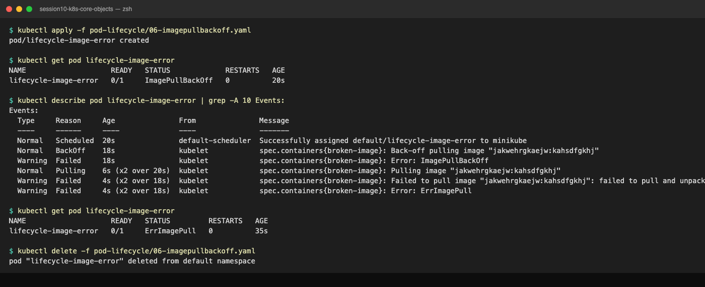

---

## Task 4: Capturing Transient Pod Lifecycle Stages (`hello.yml`)

**Description:** Deploy a short-lived busybox container with `restartPolicy: Never` and capture `ContainerCreating` -> `Running` -> `Completed`.

**Files:** `hello.yml`

**Commands:**
```bash
# Terminal 1
kubectl get pods -w
# Terminal 2
kubectl apply -f hello.yml
kubectl get pod hello-pod
kubectl logs hello-pod
kubectl delete -f hello.yml
```

**Output:**
```text
$ kubectl apply -f hello.yml
pod/hello-pod created

$ kubectl get pods -w      (Terminal 1)
hello-pod                        0/1     Pending   0             0s
hello-pod                        0/1     Pending   0             0s
hello-pod                        0/1     ContainerCreating   0             0s
hello-pod                        0/1     ContainerCreating   0             0s
hello-pod                        1/1     Running             0             2s
hello-pod                        0/1     Completed           0             3s
hello-pod                        0/1     Completed           0             4s

$ kubectl get pod hello-pod
NAME        READY   STATUS      RESTARTS   AGE
hello-pod   0/1     Completed   0          12s

$ kubectl logs hello-pod
Hello Kubernetes

$ kubectl delete -f hello.yml
pod "hello-pod" deleted from default namespace
```

The watch shows all three stages inside 3 seconds: `Pending` (scheduled), `ContainerCreating` (image already cached, network namespace set up), `Running` for about one second while `echo` runs, then `Completed`. `kubectl get` shows `Completed` but the real phase is `Succeeded` (exit code 0). With `restartPolicy: Never`, RESTARTS stays 0; the default `Always` would have turned this into a CrashLoopBackOff even though the exit code was 0.

**Screenshot:**

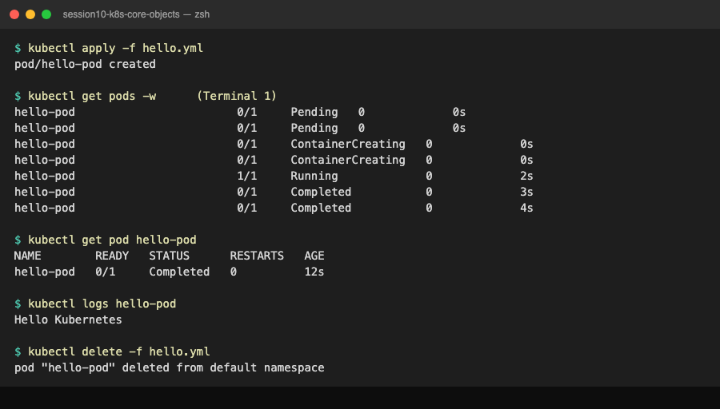

---

## Task 5: Exhaustive Pod Lifecycle States & Probes Lab (`pod-lifecycle/`)

**Description:** Apply all 12 manifests and document each state. Full per-manifest output and explanations are in [pod-lifecycle/README.md](pod-lifecycle/README.md).

**Files:** `pod-lifecycle/01-running.yaml` ... `12-termination.yaml`

**Commands:**
```bash
cd pod-lifecycle/
kubectl get pods -w                      # Terminal 1
for f in *.yaml; do kubectl apply -f $f; done
kubectl describe pod lifecycle-pending | grep -A 5 Events:
kubectl logs lifecycle-crashloop --previous
kubectl get pod lifecycle-liveness -w    # RESTARTS goes to 1 after ~30s
kubectl logs lifecycle-init -c setup
kubectl logs lifecycle-multi-container -c sidecar
kubectl logs -f lifecycle-termination &  # then: kubectl delete pod lifecycle-termination
kubectl delete -f .
```

**Output:**
```text
$ kubectl get pods
NAME                        READY   STATUS             RESTARTS      AGE
lifecycle-crashloop         0/1     Error              2 (34s ago)   41s
lifecycle-failed            0/1     Error              0             41s
lifecycle-image-error       0/1     ImagePullBackOff   0             41s
lifecycle-init              1/1     Running            0             41s
lifecycle-liveness          1/1     Running            0             41s
lifecycle-multi-container   2/2     Running            0             41s
lifecycle-pending           0/1     Pending            0             41s
lifecycle-readiness         1/1     Running            0             41s
lifecycle-running           1/1     Running            0             41s
lifecycle-startup           1/1     Running            0             41s
lifecycle-succeeded         0/1     Completed          0             41s
lifecycle-termination       1/1     Running            0             40s

$ kubectl get pods -w      (excerpt)
lifecycle-init              0/1     Init:0/1            0     0s
lifecycle-init              0/1     PodInitializing     0     11s
lifecycle-init              1/1     Running             0     23s
lifecycle-readiness         0/1     Running             0     20s
lifecycle-readiness         1/1     Running             0     25s
lifecycle-crashloop         0/1     Error               1 (4s ago)    8s
lifecycle-crashloop         0/1     CrashLoopBackOff    1 (12s ago)   19s
lifecycle-crashloop         1/1     Running             2 (12s ago)   19s
lifecycle-image-error       0/1     ErrImagePull        0     19s
lifecycle-image-error       0/1     ImagePullBackOff    0     31s
lifecycle-liveness          1/1     Running             1 (0s ago)    61s
lifecycle-startup           1/1     Running             0     36s
lifecycle-termination       1/1     Terminating         0     80s
lifecycle-termination       0/1     Completed           0     90s

$ kubectl describe pod lifecycle-pending | grep -A3 Events | tail -1
  Warning  FailedScheduling  default-scheduler  0/1 nodes are available: 1 Insufficient memory.

$ kubectl logs lifecycle-failed
Task started
Task failed

$ kubectl logs -f lifecycle-termination     (while: kubectl delete pod lifecycle-termination)
Application running
SIGTERM received; cleaning up...
Cleanup complete

$ kubectl apply -f 10-init-container.yaml
pod/lifecycle-init created
$ kubectl get pod lifecycle-init -w
NAME             READY   STATUS            RESTARTS   AGE
lifecycle-init   0/1     Init:0/1          0          0s
lifecycle-init   0/1     PodInitializing   0          11s
lifecycle-init   1/1     Running           0          23s
$ kubectl logs lifecycle-init -c setup
Init container running
Init complete
$ kubectl describe pod lifecycle-init | grep -E "Created|Started"
  Normal  Created    73s   kubelet  spec.initContainers{setup}: Container created
  Normal  Started    73s   kubelet  spec.initContainers{setup}: Container started
  Normal  Created    51s   kubelet  spec.containers{app}: Container created
  Normal  Started    51s   kubelet  spec.containers{app}: Container started

$ kubectl apply -f 11-multi-container.yaml
pod/lifecycle-multi-container created
$ kubectl get pod lifecycle-multi-container
NAME                        READY   STATUS    RESTARTS   AGE
lifecycle-multi-container   2/2     Running   0          74s
$ kubectl logs lifecycle-multi-container -c sidecar --tail=2
Sidecar is running
Sidecar is running
$ kubectl logs lifecycle-multi-container -c app --tail=2
2026/09/17 06:33:44 [notice] 1#1: start worker process 37
2026/09/17 06:33:44 [notice] 1#1: start worker process 38

$ kubectl apply -f 12-termination.yaml
pod/lifecycle-termination created
$ kubectl logs -f lifecycle-termination &
$ kubectl delete pod lifecycle-termination
Application running
SIGTERM received; cleaning up...
Cleanup complete
pod "lifecycle-termination" deleted from default namespace
delete returned after 10s
```

| # | Manifest | Observed | Why |
| :--- | :--- | :--- | :--- |
| 1 | 01-running | `1/1 Running` | Normal nginx pod. |
| 2 | 02-pending | `Pending`, event `Insufficient memory` | Requests 9Gi, node has ~7.7Gi allocatable. Never scheduled. |
| 3 | 03-succeeded | `Completed`, phase `Succeeded` | exit 0 with `restartPolicy: Never`. |
| 4 | 04-failed | `Error`, phase `Failed`, exitCode 1 | Same script, exit 1. |
| 5 | 05-crashloopbackoff | `Running` -> `Error` -> `CrashLoopBackOff` loop, RESTARTS 3 in 50s | exit 1 with default `restartPolicy: Always`; back-off doubles each time. |
| 6 | 06-imagepullbackoff | `ErrImagePull` <-> `ImagePullBackOff`, RESTARTS 0 | Image never pulled, container never started. |
| 7 | 07-readiness | `0/1 Running` for 5s, then `1/1` | Running is not Ready; pod is out of Service endpoints until the probe passes. |
| 8 | 08-liveness | RESTARTS 1 at ~30s, events `Unhealthy` x2, `Killing` | File removed at 20s, 2 failures x 5s period, container restarted (pod stays). |
| 9 | 09-startup | 6 `Startup probe failed` events, RESTARTS 0, Ready at 36s | Budget 10 x 5s = 50s, app needed 30s. A liveness probe would have killed it. |
| 10 | 10-init-container | `Init:0/1` -> `PodInitializing` -> `Running` at 23s | nginx container not created until init exited. |
| 11 | 11-multi-container | `2/2 Running`, `-c` needed for logs | Two containers, one pod, one IP. |
| 12 | 12-termination | `Terminating` for 10s, ends `Completed`, `SIGTERM received` in logs | Trap handler ran to completion inside the 20s grace period. |

**Screenshot:**

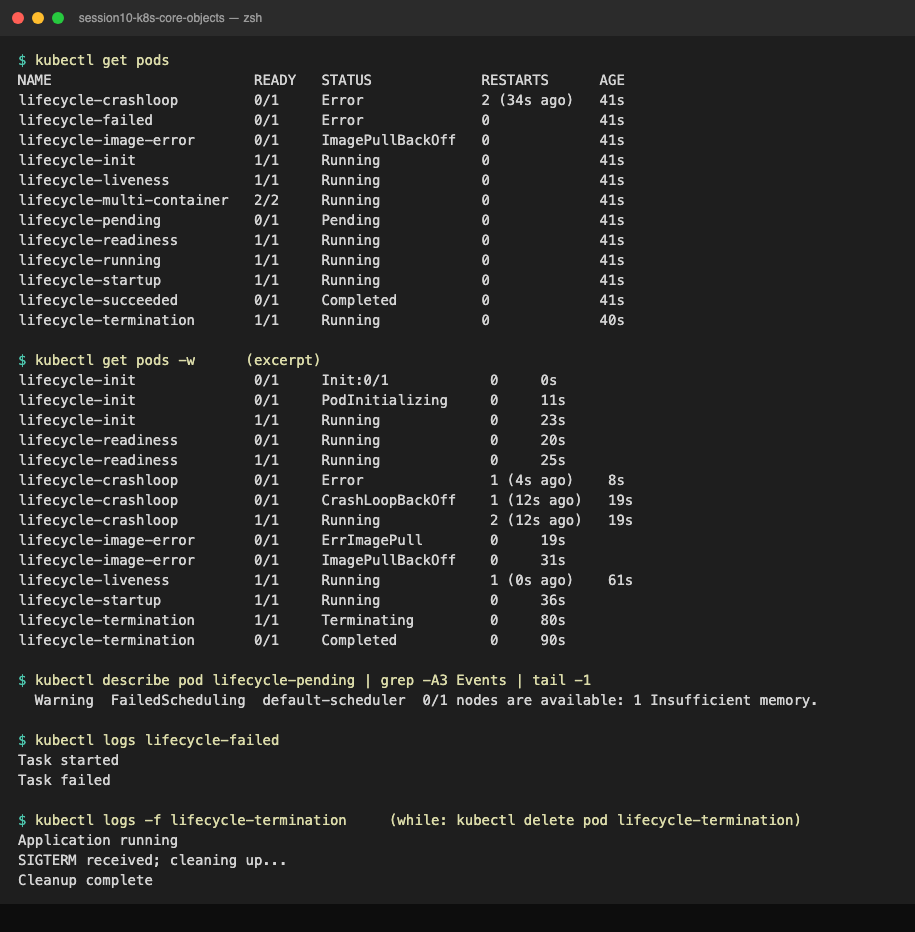

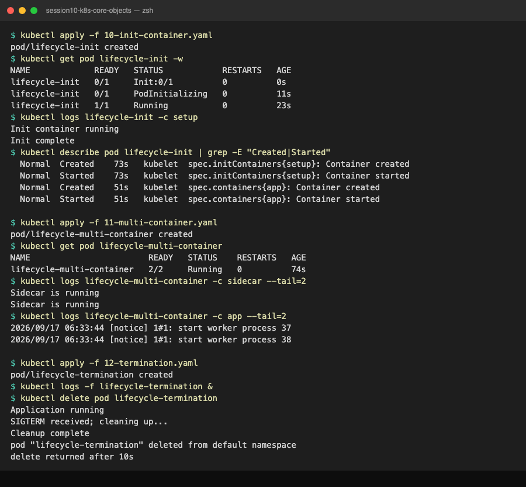

---

## Task 6: Core Controller Objects Exploration (ReplicaSet & StatefulSet)

**Description:** ReplicaSet: verify replica enforcement and self-healing by deleting a pod. StatefulSet: verify ordinal pod names and PVC bindings.

**Files:** `replicaset.yml`, `k8s-core-objects/statefulset.yml`

**Commands:**
```bash
# Part A: ReplicaSet
kubectl apply -f replicaset.yml
kubectl get rs nginx-rs
kubectl get pods -l app=nginx
POD_NAME=$(kubectl get pods -l app=nginx -o jsonpath='{.items[0].metadata.name}')
kubectl delete pod $POD_NAME
kubectl get pods -l app=nginx
kubectl delete -f replicaset.yml

# Part B: StatefulSet
kubectl apply -f k8s-core-objects/statefulset.yml
kubectl get statefulset mysql
kubectl get pods -l app=mysql
kubectl get pvc
kubectl delete -f k8s-core-objects/statefulset.yml
```

**Output:**
```text
$ kubectl apply -f replicaset.yml
replicaset.apps/nginx-rs created

$ kubectl get rs nginx-rs
NAME       DESIRED   CURRENT   READY   AGE
nginx-rs   3         3         3       12s

$ kubectl get pods -l app=nginx
NAME             READY   STATUS    RESTARTS   AGE
nginx-rs-l6ghf   1/1     Running   0          12s
nginx-rs-rm84p   1/1     Running   0          12s
nginx-rs-zthsg   1/1     Running   0          12s

$ POD_NAME=$(kubectl get pods -l app=nginx -o jsonpath='{.items[0].metadata.name}'); echo "deleting $POD_NAME"; kubectl delete pod $POD_NAME
deleting nginx-rs-l6ghf
pod "nginx-rs-l6ghf" deleted from default namespace

$ kubectl get pods -l app=nginx
NAME             READY   STATUS              RESTARTS   AGE
nginx-rs-jtdg4   0/1     ContainerCreating   0          0s
nginx-rs-rm84p   1/1     Running             0          12s
nginx-rs-zthsg   1/1     Running             0          12s

$ kubectl get pods -l app=nginx
NAME             READY   STATUS    RESTARTS   AGE
nginx-rs-jtdg4   1/1     Running   0          7s
nginx-rs-rm84p   1/1     Running   0          19s
nginx-rs-zthsg   1/1     Running   0          19s

$ kubectl delete -f replicaset.yml
replicaset.apps "nginx-rs" deleted from default namespace

$ kubectl apply -f k8s-core-objects/statefulset.yml
statefulset.apps/mysql created

$ kubectl get statefulset mysql
NAME    READY   AGE
mysql   0/3     25s

$ kubectl get pods -l app=mysql
NAME      READY   STATUS             RESTARTS   AGE
mysql-0   0/1     ImagePullBackOff   0          25s

$ kubectl get pvc
NAME                               STATUS   VOLUME                                     CAPACITY   ACCESS MODES   STORAGECLASS   VOLUMEATTRIBUTESCLASS   AGE
mysql-persistent-storage-mysql-0   Bound    pvc-99657db9-e58b-4d8a-b876-fe9d86411a5a   5Gi        RWO            standard       <unset>                 25s

$ kubectl describe pod mysql-0 | grep -E 'Failed to pull' | head -1 | cut -c1-200
  Warning  Failed            2s (x2 over 21s)   kubelet            spec.containers{mysql}: Failed to pull image "mysql:5.7": rpc error: code = NotFound desc = failed to pull and unpack image "docker.i

$ kubectl delete -f k8s-core-objects/statefulset.yml; kubectl delete pvc -l app=mysql --ignore-not-found; kubectl delete pvc mysql-persistent-storage-mysql-0 --ignore-not-found
statefulset.apps "mysql" deleted from default namespace
persistentvolumeclaim "mysql-persistent-storage-mysql-0" deleted from default namespace
```

ReplicaSet: the replacement pod `nginx-rs-jtdg4` was in `ContainerCreating` in the same second the old one was deleted. The controller loop saw 2 running vs 3 desired and acted immediately.

StatefulSet: with the manifest as written (`mysql:5.7`) only `mysql-0` appears and it sits in `ImagePullBackOff`, because `mysql:5.7` has no arm64 image (`no match for platform in manifest`). A StatefulSet creates pods strictly in order and will not create `mysql-1` until `mysql-0` is Ready, so one bad image blocks the whole set. Re-running with `mysql:8.0` (multi-arch) shows the expected behaviour: `mysql-0`, `mysql-1`, `mysql-2` created one after another (note the AGE gap: 75s vs 40s), and one PVC per pod named `<volumeClaimTemplate>-<pod>`. The PVCs survive `kubectl delete statefulset`; they must be deleted separately, which is deliberate so data is not lost by accident.

Also seen in this lab (see [Readme-lab-notes](#lab-notes-things-that-went-wrong-on-purpose-or-not) below): a bare pod with label `app: nginx` gets adopted by `nginx-rs`, and a standalone ReplicaSet with the same selector as a Deployment gets adopted by the Deployment and scaled to 0.

**Screenshot:**

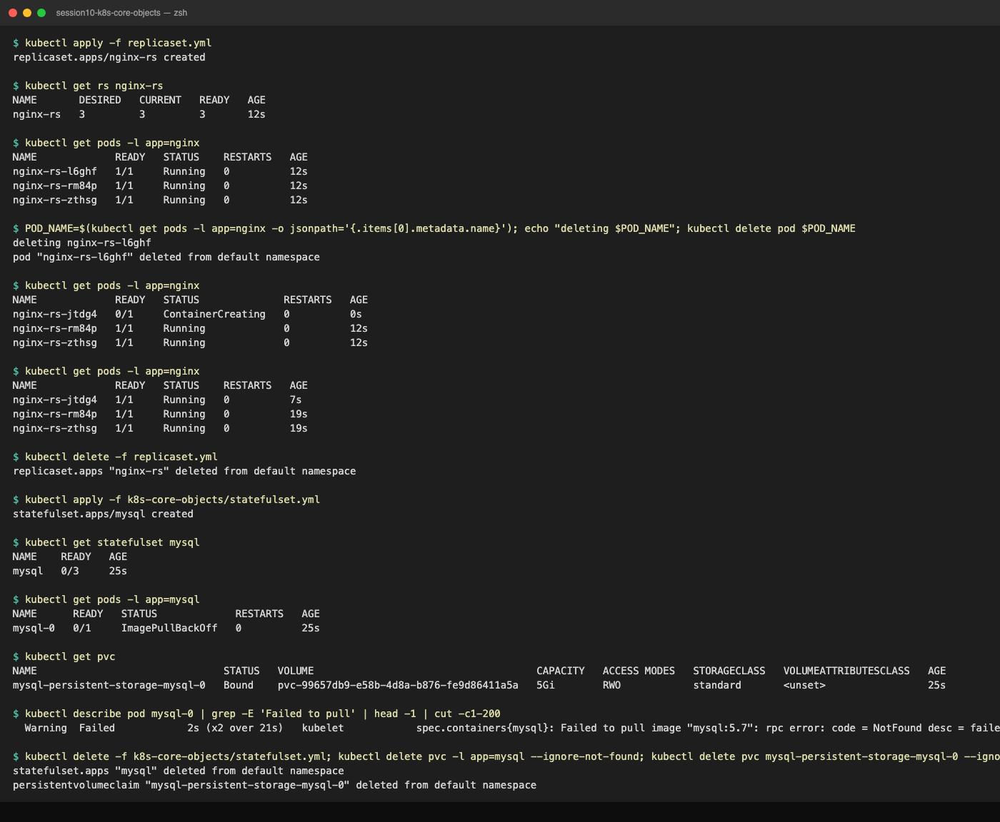

---

## Task 7: DaemonSet Architecture & Host Agent Deployment

**Description:** Deploy a node-exporter DaemonSet and verify exactly one pod per node.

**Files:** `k8s-core-objects/deamonset.yml` (also `daemonset/node-agent-ds.yaml`)

**Commands:**
```bash
kubectl apply -f k8s-core-objects/deamonset.yml
kubectl get ds node-exporter
kubectl get pods -l app=node-exporter -o wide
kubectl get nodes
kubectl delete -f k8s-core-objects/deamonset.yml
```

**Output:**
```text
$ kubectl apply -f k8s-core-objects/deamonset.yml
daemonset.apps/node-exporter created

$ kubectl get ds node-exporter
NAME            DESIRED   CURRENT   READY   UP-TO-DATE   AVAILABLE   NODE SELECTOR   AGE
node-exporter   1         1         1       1            1           <none>          15s

$ kubectl get pods -l app=node-exporter -o wide
NAME                  READY   STATUS    RESTARTS   AGE   IP            NODE       NOMINATED NODE   READINESS GATES
node-exporter-k4fgf   1/1     Running   0          15s   10.244.0.20   minikube   <none>           <none>

$ kubectl get nodes
NAME       STATUS   ROLES           AGE   VERSION
minikube   Ready    control-plane   10d   v1.37.0

$ kubectl delete -f k8s-core-objects/deamonset.yml
daemonset.apps "node-exporter" deleted from default namespace
```

DESIRED = 1 because there is 1 node; there is no `replicas` field on a DaemonSet. Adding a node would automatically add a pod. `kube-proxy` and `kindnet` in `kube-system` are DaemonSets for the same reason.

**Screenshot:**

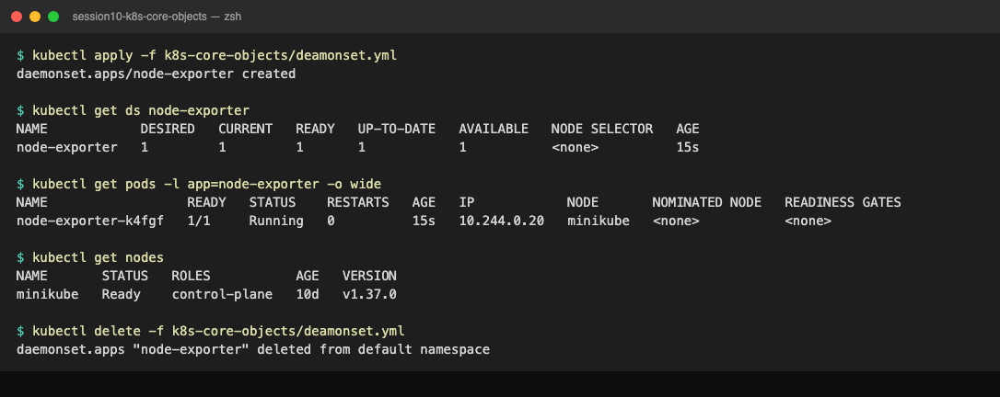

---

## Task 8: Deployment Upgrades, Rolling Updates & Instant Rollbacks

**Description:** Roll `app-rolling` from v1 to v2 with `maxSurge: 1`, `maxUnavailable: 0`, watch the rollout, then undo it.

**Files:** `01-rolling-update/deployment-v1.yaml`, `deployment-v2.yaml`, `service.yaml`

**Commands:**
```bash
cd 01-rolling-update/
kubectl apply -f deployment-v1.yaml
kubectl apply -f service.yaml
kubectl rollout status deployment/app-rolling
kubectl apply -f deployment-v2.yaml
kubectl rollout status deployment/app-rolling
kubectl get pods -l app=app-rolling --show-labels
kubectl rollout history deployment/app-rolling
kubectl rollout undo deployment/app-rolling
kubectl rollout status deployment/app-rolling
kubectl delete -f service.yaml -f deployment-v1.yaml
```

**Output:**
```text
$ kubectl apply -f deployment-v1.yaml
deployment.apps/app-rolling configured

$ kubectl apply -f service.yaml
service/app-rolling-service unchanged

$ kubectl rollout status deployment/app-rolling
Waiting for deployment "app-rolling" rollout to finish: 1 out of 4 new replicas have been updated...
Waiting for deployment "app-rolling" rollout to finish: 2 out of 4 new replicas have been updated...
Waiting for deployment "app-rolling" rollout to finish: 3 out of 4 new replicas have been updated...
Waiting for deployment "app-rolling" rollout to finish: 1 old replicas are pending termination...
deployment "app-rolling" successfully rolled out

$ kubectl apply -f deployment-v2.yaml
deployment.apps/app-rolling configured

$ kubectl rollout status deployment/app-rolling
Waiting for deployment "app-rolling" rollout to finish: 1 out of 4 new replicas have been updated...
Waiting for deployment "app-rolling" rollout to finish: 2 out of 4 new replicas have been updated...
Waiting for deployment "app-rolling" rollout to finish: 3 out of 4 new replicas have been updated...
Waiting for deployment "app-rolling" rollout to finish: 1 old replicas are pending termination...
deployment "app-rolling" successfully rolled out

$ kubectl get pods -l app=app-rolling --show-labels
NAME                           READY   STATUS      RESTARTS   AGE   LABELS
app-rolling-56bff6d88c-5rl76   1/1     Running     0          12s   app=app-rolling,pod-template-hash=56bff6d88c,version=v2
app-rolling-56bff6d88c-75nms   1/1     Running     0          6s    app=app-rolling,pod-template-hash=56bff6d88c,version=v2
app-rolling-56bff6d88c-hm8h7   1/1     Running     0          18s   app=app-rolling,pod-template-hash=56bff6d88c,version=v2
app-rolling-56bff6d88c-v9jtf   1/1     Running     0          24s   app=app-rolling,pod-template-hash=56bff6d88c,version=v2
app-rolling-86d7d44d5b-qvm7l   0/1     Completed   0          49s   app=app-rolling,pod-template-hash=86d7d44d5b,version=v1

$ kubectl rollout history deployment/app-rolling
deployment.apps/app-rolling 
REVISION  CHANGE-CAUSE
12        <none>
13        <none>
14        <none>
15        <none>
16        <none>


$ kubectl rollout undo deployment/app-rolling 2>&1 | grep -v Warning
deployment.apps/app-rolling rolled back

$ kubectl rollout status deployment/app-rolling
Waiting for deployment "app-rolling" rollout to finish: 1 out of 4 new replicas have been updated...
Waiting for deployment "app-rolling" rollout to finish: 2 out of 4 new replicas have been updated...
Waiting for deployment "app-rolling" rollout to finish: 3 out of 4 new replicas have been updated...
Waiting for deployment "app-rolling" rollout to finish: 1 old replicas are pending termination...
deployment "app-rolling" successfully rolled out

$ kubectl get pods -l app=app-rolling -L version
NAME                           READY   STATUS        RESTARTS   AGE   VERSION
app-rolling-56bff6d88c-v9jtf   1/1     Terminating   0          48s   v2
app-rolling-86d7d44d5b-7pg94   1/1     Running       0          24s   v1
app-rolling-86d7d44d5b-99dnv   1/1     Running       0          12s   v1
app-rolling-86d7d44d5b-mccbl   1/1     Running       0          6s    v1
app-rolling-86d7d44d5b-zpr9b   1/1     Running       0          18s   v1

$ kubectl delete -f service.yaml -f deployment-v1.yaml
service "app-rolling-service" deleted from default namespace
deployment.apps "app-rolling" deleted from default namespace
```

The counter goes 1, 2, 3 out of 4, then `1 old replicas are pending termination`: one surge pod at a time, and the last old pod is only removed once all 4 new ones are Ready. Pod AGEs after the rollout are staggered by ~6s, proof of sequential creation. Revision numbers in the history skip because this deployment has been rolled back before; Kubernetes reuses the old ReplicaSet and renumbers it instead of creating a new revision. Chained v3/v4/v5 rollouts are documented in [01-rolling-update/README.md](01-rolling-update/README.md).

**Screenshot:**

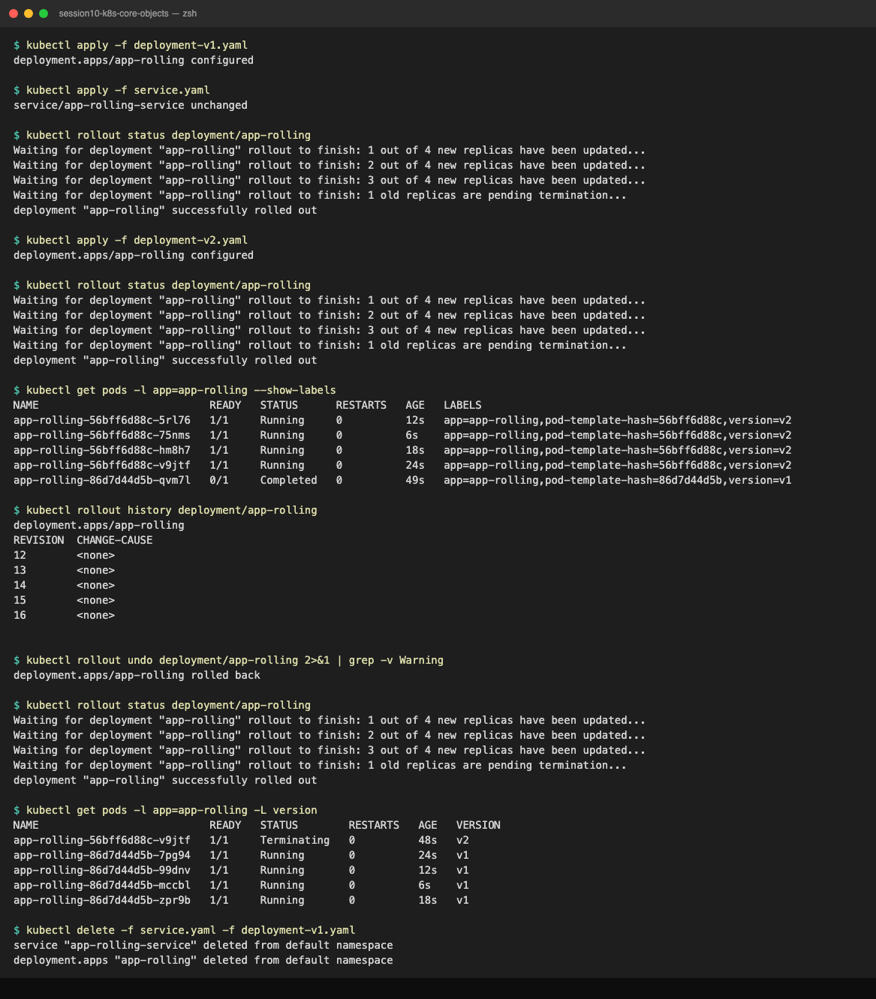

---

## Task 9: Real-World Troubleshooting Scenarios Lab (`troubleshooting/`)

**Description:** Drill 1: a rollout stalls on an unpullable image while old pods keep serving; recover with undo. Drill 2: the API server rejects a Deployment whose selector does not match its template; fix and re-apply.

**Files:** `troubleshooting/broken-image.yaml`, `troubleshooting/selector-mismatch.yaml`

**Commands:**
```bash
# Drill 1
kubectl apply -f troubleshooting/broken-image.yaml
kubectl rollout status deployment/yatri-backend --timeout=45s
kubectl get pods -l app=yatri-backend -L version
kubectl get deploy yatri-backend
kubectl rollout undo deployment/yatri-backend
kubectl rollout history deployment/yatri-backend

# Drill 2
kubectl apply -f troubleshooting/selector-mismatch.yaml
# fix: make template label match the selector, then re-apply
sed 's|app: wrong-app-name|app: correct-app-name|' troubleshooting/selector-mismatch.yaml | kubectl apply -f -
kubectl get deploy selector-error-demo
kubectl delete deploy selector-error-demo
```

**Output:**
```text
$ kubectl apply -f deployment/deployment-v2.yaml && kubectl rollout status deployment/yatri-backend
deployment.apps/yatri-backend configured
Waiting for deployment "yatri-backend" rollout to finish: 1 out of 3 new replicas have been updated...
Waiting for deployment "yatri-backend" rollout to finish: 2 out of 3 new replicas have been updated...
Waiting for deployment "yatri-backend" rollout to finish: 1 old replicas are pending termination...
deployment "yatri-backend" successfully rolled out

$ kubectl apply -f troubleshooting/broken-image.yaml && kubectl rollout status deployment/yatri-backend --timeout=45s
deployment.apps/yatri-backend configured
Waiting for deployment "yatri-backend" rollout to finish: 1 out of 3 new replicas have been updated...
error: timed out waiting for the condition

$ kubectl get pods -l app=yatri-backend -L version
NAME                             READY   STATUS             RESTARTS   AGE   VERSION
yatri-backend-77dbb657cd-krxpf   0/1     ImagePullBackOff   0          45s   broken-v3
yatri-backend-cbc55c649-jn5xp    1/1     Running            0          60s   2.0.0
yatri-backend-cbc55c649-mvss2    1/1     Running            0          61s   2.0.0
yatri-backend-cbc55c649-x6llx    1/1     Running            0          60s   2.0.0

$ kubectl get deploy yatri-backend
NAME            READY   UP-TO-DATE   AVAILABLE   AGE
yatri-backend   3/3     1            3           8d

$ kubectl rollout undo deployment/yatri-backend
deployment.apps/yatri-backend rolled back

$ kubectl rollout history deployment/yatri-backend
deployment.apps/yatri-backend
REVISION  CHANGE-CAUSE
0         <none>
1         <none>
3         <none>
4         <none>

$ kubectl apply -f troubleshooting/selector-mismatch.yaml
The Deployment "selector-error-demo" is invalid: spec.template.metadata.labels: Invalid value: {"app":"wrong-app-name"}: `selector` does not match template `labels`

$ sed 's|app: wrong-app-name|app: correct-app-name|' troubleshooting/selector-mismatch.yaml | kubectl apply -f -
deployment.apps/selector-error-demo created

$ kubectl get deploy selector-error-demo
NAME                  READY   UP-TO-DATE   AVAILABLE   AGE
selector-error-demo   0/1     1            0           8s

$ kubectl delete deploy selector-error-demo
deployment.apps "selector-error-demo" deleted from default namespace
```

Drill 1: read `READY 3/3, UP-TO-DATE 1, AVAILABLE 3`. Exactly one surge pod was created and is stuck in `ImagePullBackOff`; because `maxUnavailable: 0`, no healthy v2 pod may be removed until a v3 pod is Ready, which never happens. Users are unaffected. `rollout undo` deletes only the stuck pod. Drill 2: unlike a Service selector mismatch (accepted, silently no endpoints), a Deployment whose selector cannot match its own template is refused at admission and nothing is written to etcd. The selector is also immutable after creation, so the fix is on the template label side.

**Screenshot:**

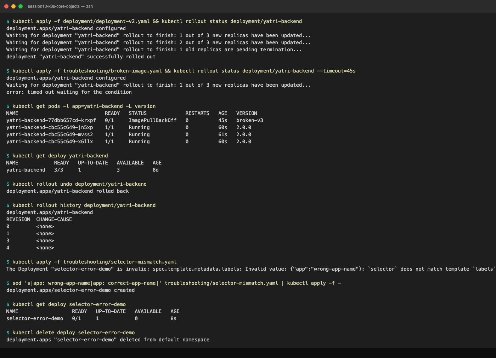

---

## Task 10: Theoretical & Architectural Conceptual Writeup

### 1. The four ports
```text
Client --> nodePort 30080 (on every node's IP) --> port 80 (Service ClusterIP) --> targetPort 80 (pod IP) --> containerPort 80 (process in container)
```
| Field | Lives in | Meaning | Example from this repo |
| :--- | :--- | :--- | :--- |
| `containerPort` | Pod spec | Port the process listens on. Informational only; it does not open or block anything. | `containerPort: 80` in `pod.yml` |
| `targetPort` | Service | Port on the pod that the Service forwards to. Defaults to `port`. Can be a name. | `targetPort: 5000` in session 11 `service/clusterip.yaml` (service 80 -> python 5000) |
| `port` | Service | Port the Service listens on at its ClusterIP. What other pods use. | `port: 8080` in session 11 ClusterIP lab |
| `nodePort` | Service (NodePort/LoadBalancer) | Port opened on every node, range 30000-32767. Auto-assigned if omitted. | `nodePort: 30010` in `01-rolling-update/service.yaml` |

`kubectl get svc` shows `80:30080/TCP` = `port:nodePort`. `kubectl get endpoints` shows `<podIP>:<targetPort>`.

### 2. Labels vs Selectors
* **Labels** are key/value metadata on any object: `app: nginx`, `version: v2`, `slot: blue`. They mean nothing by themselves.
* **Selectors** are queries over labels. A ReplicaSet's `spec.selector.matchLabels` decides which pods it owns; a Service's `spec.selector` decides which pods get traffic; `kubectl get pods -l app=nginx` is a selector too.
* Consequences seen in this lab: a bare `nginx-pod` with `app: nginx` was adopted by `nginx-rs` because the selector matched (Task 6 notes). Blue-green works by changing only the Service selector (Task 11). Canary works because one Service selector matches both stable and canary pods (Task 12).

### 3. The four deployment strategies
| Strategy | How | Downtime | Extra capacity | Rollback | Use when |
| :--- | :--- | :--- | :--- | :--- | :--- |
| **RollingUpdate** (default) | Replace pods a few at a time, gated by readiness | None | `maxSurge` pods | `rollout undo` (another rolling update) | Stateless services, most workloads |
| **Recreate** | Kill all old pods, then start new ones | Yes (measured 1.5s here, longer for real apps) | None | `rollout undo` (another outage) | DB schema breaks, RWO volumes, single-instance apps |
| **Blue-Green** | Two full environments, flip the Service selector | None | 2x | Flip selector back (~1s) | Atomic cutover, easy rollback, no mixed versions |
| **Canary** | Small number of new pods behind the same Service | None | Small | Scale canary to 0 | Validate with real traffic before full rollout |

### 4. maxSurge vs maxUnavailable
For `replicas: 4`, `maxSurge: 1`, `maxUnavailable: 0`:
* Max pods during rollout = 4 + 1 = **5**
* Min available pods = 4 - 0 = **4** (never below full capacity)

Percentages: `maxSurge: 25%` of 4 = 1 (rounded **up**), `maxUnavailable: 25%` of 4 = 1 (rounded **down**). Defaults are 25%/25%. With 10 replicas and 25%/25%: up to 13 pods, at least 8 available. For a production SLA set `maxUnavailable: 0`; the rollout is slower but capacity never drops. Task 9 showed the safety side: with `maxUnavailable: 0` a broken image cannot take any healthy pod down.

### 5. Requests vs Limits, GB vs GiB
* **Requests**: what the scheduler reserves. A pod only lands on a node with that much free. Guaranteed minimum. Task 5 `02-pending.yaml` requested 9Gi on a 7.7Gi node and stayed `Pending` forever.
* **Limits**: hard ceiling enforced by cgroups. CPU over the limit is throttled (slower, not killed). Memory over the limit is **OOMKilled** and the container restarts.
* Units: `1 GB = 10^9 bytes` (decimal, what disk vendors use). `1 GiB = 2^30 = 1,073,741,824 bytes` (binary). Kubernetes uses `Mi`/`Gi`. `9Gi` is about 9.66 GB. `cpu: 100m` = 0.1 core = 100 millicores.

---

## Task 11: Blue-Green Deployment Execution & Instant Selector Cutover

**Description:** Run Blue (v1) and Green (v2) side by side, send traffic to Blue, flip the Service selector to Green, verify endpoints and responses, then flip back.

**Files:** `02-blue-green/`

**Commands:**
```bash
cd 02-blue-green/
kubectl apply -f deployment-blue.yaml
kubectl apply -f deployment-green.yaml
kubectl get pods -l app=myapp --show-labels
kubectl apply -f service-blue.yaml
kubectl describe svc myapp-service | grep Selector
kubectl get endpoints myapp-service
minikube ssh -- "curl -s http://localhost:30020" | grep ENVIRONMENT
kubectl apply -f service-green.yaml           # THE SWITCH
kubectl describe svc myapp-service | grep Selector
kubectl get endpoints myapp-service
minikube ssh -- "curl -s http://localhost:30020" | grep ENVIRONMENT
kubectl apply -f service-blue.yaml            # rollback
kubectl delete -f service-blue.yaml -f deployment-blue.yaml -f deployment-green.yaml
```

**Output:**
```text
$ kubectl get pods -l app=myapp --show-labels
NAME                        READY   STATUS    RESTARTS   AGE   LABELS
app-blue-5c69d7785c-44dbc   1/1     Running   0          6s    app=myapp,pod-template-hash=5c69d7785c,slot=blue,version=v1
app-blue-5c69d7785c-4k9pv   1/1     Running   0          6s    app=myapp,pod-template-hash=5c69d7785c,slot=blue,version=v1
app-blue-5c69d7785c-qg8zh   1/1     Running   0          6s    app=myapp,pod-template-hash=5c69d7785c,slot=blue,version=v1
app-green-84df7f978-25dhx   1/1     Running   0          6s    app=myapp,pod-template-hash=84df7f978,slot=green,version=v2
app-green-84df7f978-5wr5v   1/1     Running   0          6s    app=myapp,pod-template-hash=84df7f978,slot=green,version=v2
app-green-84df7f978-mlqmb   1/1     Running   0          6s    app=myapp,pod-template-hash=84df7f978,slot=green,version=v2

$ kubectl apply -f 02-blue-green/service-blue.yaml
service/myapp-service created
$ kubectl describe svc myapp-service | grep Selector
Selector:                 app=myapp,slot=blue
$ kubectl get endpoints myapp-service
NAME            ENDPOINTS                                      AGE
myapp-service   10.244.0.45:80,10.244.0.46:80,10.244.0.47:80   0s
$ minikube ssh -- "curl -s http://localhost:30020" | grep -oE "(BLUE|GREEN) ENVIRONMENT|Version: [^<]*"
BLUE ENVIRONMENT
Version: v1 | Slot: BLUE (LIVE)

$ kubectl apply -f 02-blue-green/service-green.yaml
service/myapp-service configured
$ kubectl describe svc myapp-service | grep Selector
Selector:                 app=myapp,slot=green
$ kubectl get endpoints myapp-service
NAME            ENDPOINTS                                      AGE
myapp-service   10.244.0.48:80,10.244.0.49:80,10.244.0.50:80   17s
$ minikube ssh -- "curl -s http://localhost:30020" | grep -oE "(BLUE|GREEN) ENVIRONMENT|Version: [^<]*"
GREEN ENVIRONMENT
Version: v2 | Slot: GREEN (STANDBY -> PROMOTED)

$ kubectl apply -f 02-blue-green/service-blue.yaml
service/myapp-service configured
$ minikube ssh -- "curl -s http://localhost:30020" | grep -oE "(BLUE|GREEN) ENVIRONMENT"
BLUE ENVIRONMENT
```

No pod was created or deleted during the switch; only the selector changed and the endpoint list swapped from `.45-.47` to `.48-.50`. One honest detail: the very first curl after the rollback apply still returned GREEN, and the next one (about 1s later) returned BLUE. The API change is atomic but kube-proxy rewrites iptables asynchronously, so "instant" means about one second.

**Screenshot:**


---

## Task 12: Canary Deployment Execution & Pod-Ratio Traffic Splitting

**Description:** 9 stable pods + 1 canary pod behind one Service, measure the split with a curl loop, scale to 30%, promote, and roll back.

**Files:** `03-canary/`

**Commands:**
```bash
cd 03-canary/
kubectl apply -f deployment-stable.yaml -f service.yaml
kubectl rollout status deployment/app-stable
kubectl apply -f deployment-canary.yaml
kubectl get pods -l app=myapp-canary -L track,version
kubectl get endpoints myapp-canary-service
for i in $(seq 1 20); do minikube ssh -- "curl -s http://localhost:30030" | grep -o "STABLE v1\|CANARY v2"; done | sort | uniq -c
kubectl scale deployment app-canary --replicas=3; kubectl scale deployment app-stable --replicas=7
kubectl scale deployment app-canary --replicas=9; kubectl scale deployment app-stable --replicas=0   # promote
kubectl scale deployment app-canary --replicas=0; kubectl scale deployment app-stable --replicas=9   # rollback
kubectl delete -f service.yaml -f deployment-canary.yaml -f deployment-stable.yaml
```

**Output:**
```text
$ kubectl get pods -l app=myapp-canary -L track,version
NAME                          READY   STATUS    RESTARTS   AGE   TRACK    VERSION
app-canary-5849994497-42s72   1/1     Running   0          6s    canary   v2
app-stable-6ffb777f9d-26pnh   1/1     Running   0          22s   stable   v1
app-stable-6ffb777f9d-ck2x9   1/1     Running   0          22s   stable   v1
app-stable-6ffb777f9d-dcvkj   1/1     Running   0          22s   stable   v1
app-stable-6ffb777f9d-hhqwq   1/1     Running   0          22s   stable   v1
app-stable-6ffb777f9d-p9ppr   1/1     Running   0          22s   stable   v1
app-stable-6ffb777f9d-pkjwb   1/1     Running   0          22s   stable   v1
app-stable-6ffb777f9d-qbprv   1/1     Running   0          22s   stable   v1
app-stable-6ffb777f9d-vbh6b   1/1     Running   0          22s   stable   v1
app-stable-6ffb777f9d-znbfh   1/1     Running   0          22s   stable   v1

$ kubectl get endpoints myapp-canary-service
NAME                   ENDPOINTS                                                  AGE
myapp-canary-service   10.244.0.51:80,10.244.0.52:80,10.244.0.53:80 + 7 more...   15s

$ for i in $(seq 1 20); do minikube ssh -- "curl -s http://localhost:30030" | grep -o "STABLE v1\|CANARY v2"; done | sort | uniq -c
   3 CANARY v2
  17 STABLE v1

$ kubectl scale deployment app-canary --replicas=3 && kubectl scale deployment app-stable --replicas=7
deployment.apps/app-canary scaled
deployment.apps/app-stable scaled
$ for i in $(seq 1 20); do minikube ssh -- "curl -s http://localhost:30030" | grep -o "STABLE v1\|CANARY v2"; done | sort | uniq -c
   5 CANARY v2
  15 STABLE v1

$ kubectl scale deployment app-canary --replicas=9 && kubectl scale deployment app-stable --replicas=0
deployment.apps/app-canary scaled
deployment.apps/app-stable scaled
$ for i in $(seq 1 5); do minikube ssh -- "curl -s http://localhost:30030" | grep -o "STABLE v1\|CANARY v2"; done | sort | uniq -c
   5 CANARY v2
```

Sequence of the 20 requests at 9:1: `S S C S S S S S C S S S S S S S C S S S` (3 canary hits, 15%; expected 10%). kube-proxy picks a random endpoint per connection, so small samples drift; over hundreds of requests it converges to the pod ratio. The Service never changes; the whole strategy is `kubectl scale`. Precise weights need Argo Rollouts, Flagger, or Ingress annotations.

**Screenshot:**

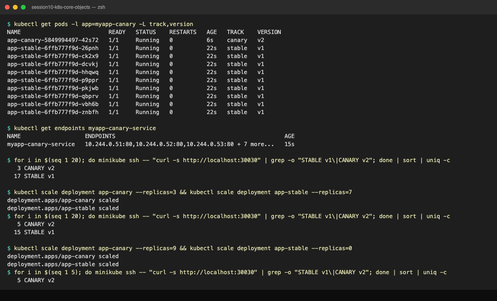

---

## Task 13: Recreate Deployment Execution & Downtime Outage Demonstration

**Description:** Update a `strategy.type: Recreate` deployment while a curl loop runs, capture the outage window, verify v2, roll back.

**Files:** `04-recreate/`

**Commands:**
```bash
cd 04-recreate/
kubectl apply -f deployment-v1.yaml -f service.yaml
kubectl rollout status deployment/app-recreate
kubectl get pods -l app=app-recreate -w                                   # Terminal 1
minikube ssh -- 'while true; do r=$(curl -s --connect-timeout 1 http://localhost:30040 | grep -o "VERSION: [^<]*"); echo "$(date +%T) ${r:-[OUTAGE] Connection failed}"; sleep 0.5; done'   # Terminal 2
kubectl apply -f deployment-v2.yaml                                       # Terminal 3
kubectl rollout history deployment/app-recreate
kubectl rollout undo deployment/app-recreate
kubectl rollout status deployment/app-recreate
kubectl delete -f service.yaml -f deployment-v2.yaml
```

**Output:**
```text
$ kubectl get pods -l app=app-recreate -w
NAME                            READY   STATUS    RESTARTS   AGE
app-recreate-6c78cb55bb-6l84n   1/1     Running   0          11s
app-recreate-6c78cb55bb-rxnpx   1/1     Running   0          11s
app-recreate-6c78cb55bb-vcm9j   1/1     Running   0          11s
app-recreate-6c78cb55bb-vcm9j   1/1     Terminating   0          14s
app-recreate-6c78cb55bb-rxnpx   1/1     Terminating   0          14s
app-recreate-6c78cb55bb-6l84n   1/1     Terminating   0          14s
app-recreate-6c78cb55bb-6l84n   0/1     Completed     0          14s
app-recreate-6c78cb55bb-vcm9j   0/1     Completed     0          14s
app-recreate-6c78cb55bb-rxnpx   0/1     Completed     0          14s
app-recreate-7bd8d89b8b-78bkg   0/1     Pending       0          0s
app-recreate-7bd8d89b8b-g6r8t   0/1     Pending       0          0s
app-recreate-7bd8d89b8b-s8vlk   0/1     Pending       0          0s
app-recreate-7bd8d89b8b-78bkg   0/1     ContainerCreating   0          0s
app-recreate-7bd8d89b8b-g6r8t   0/1     ContainerCreating   0          0s
app-recreate-7bd8d89b8b-s8vlk   0/1     ContainerCreating   0          0s
app-recreate-7bd8d89b8b-g6r8t   1/1     Running             0          1s
app-recreate-7bd8d89b8b-78bkg   1/1     Running             0          1s
app-recreate-7bd8d89b8b-s8vlk   1/1     Running             0          1s

$ while true; do r=$(curl -s --connect-timeout 1 http://localhost:30040 | grep -o "VERSION: [^<]*"); echo "$(date +%T) ${r:-[OUTAGE] Connection failed}"; sleep 0.5; done
06:38:06 VERSION: v1
06:38:06 VERSION: v1
06:38:07 VERSION: v1
06:38:07 VERSION: v1
06:38:09 [OUTAGE] Connection failed
06:38:09 VERSION: v2 (UPGRADED)
06:38:10 VERSION: v2 (UPGRADED)
06:38:10 VERSION: v2 (UPGRADED)
06:38:11 VERSION: v2 (UPGRADED)

$ kubectl rollout undo deployment/app-recreate
deployment.apps/app-recreate rolled back
$ kubectl rollout status deployment/app-recreate
deployment "app-recreate" successfully rolled out
```

All three v1 pods go `Terminating` in the same second and no v2 pod reaches even `Pending` until every v1 pod is gone; compare with Task 8 where old and new overlap. The curl loop shows the gap: last v1 at 06:38:07, a failed request at 06:38:09, first v2 at 06:38:09. About 1.5s of downtime with nginx-alpine; a JVM or database would make it tens of seconds. The rollback is itself a Recreate, so it causes a second outage.

**Screenshot:**

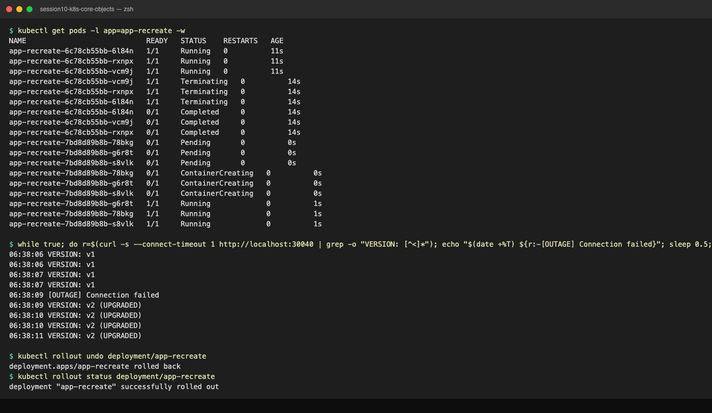

---

## Lab notes: things that went wrong (on purpose or not)

These came out of running every manifest in this folder and are worth knowing:

1. **A bare pod gets adopted.** `pod.yml` (label `app: nginx`) applied before `replicaset.yml` (selector `app: nginx`): the ReplicaSet adopted `nginx-pod` as one of its 3 replicas and created only 2. `kubectl get pod nginx-pod -o jsonpath='{.metadata.ownerReferences[0].name}'` printed `nginx-rs`. Deleting the RS later deleted the bare pod too.
2. **A standalone ReplicaSet with a Deployment's labels gets scaled to 0.** `replicaset/backend-rs.yaml` selects `app: yatri-backend`, the same as the `yatri-backend` Deployment. The Deployment controller adopted the RS, treated it as an old ReplicaSet and scaled it from 3 to 0 within one second (`OldReplicaSets: yatri-backend-rs (0/0 replicas created)`). Never share a selector between a Deployment and anything hand-managed.
3. **`mysql:5.7` has no arm64 image.** `no match for platform in manifest`. Use `mysql:8.0` on Apple Silicon (Task 6).
4. **`rollout undo` prints a warning about `last-applied-configuration`.** In a GitOps setup, re-apply the previous manifest instead of `undo` so git and cluster agree.
5. **`kubectl get endpoints` is deprecated in 1.33+.** It still works; `kubectl get endpointslices` is the replacement.

---

## Cleanup
```bash
kubectl delete -f service.yml -f deployment.yml -f replicaset.yml -f pod.yml -f hello.yml
kubectl delete -f k8s-core-objects/ -f daemonset/ -f pod/ -f replicaset/ -f pod-lifecycle/
kubectl delete pvc -l app=mysql
```
