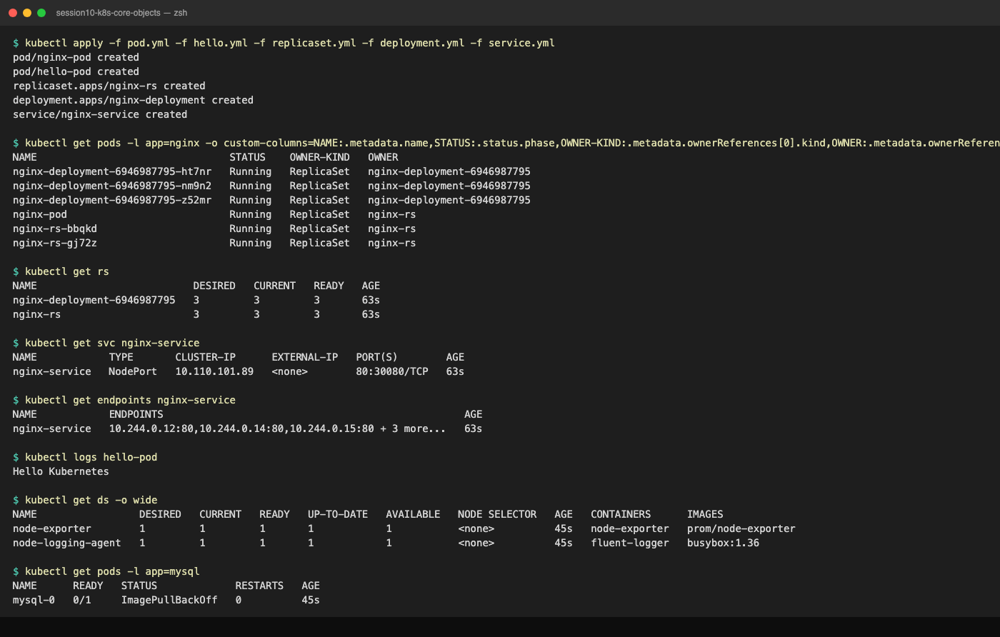
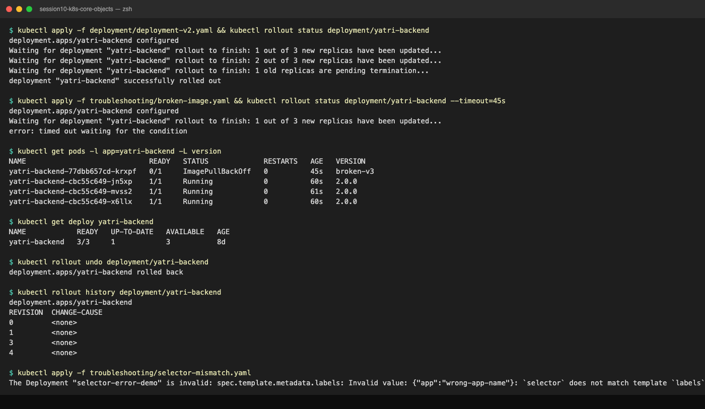

# Session 10: Kubernetes Core Objects

References:
- https://github.com/Nency-Ravaliya/Kubernetes
- k8s core objects: https://github.com/Nency-Ravaliya/Kubernetes/blob/main/core-objects.md

| Folder | Lab |
| :--- | :--- |
| root `*.yml` + `k8s-core-objects/` + `pod/` + `replicaset/` + `daemonset/` | Pod, ReplicaSet, Deployment, Service, DaemonSet, StatefulSet basics (below) |
| `deployment/` + `troubleshooting/` | Rolling update v1 to v2, broken image rollback, selector validation (below) |
| [pod-lifecycle/](pod-lifecycle/README.md) | 12 pod states and probes |
| [01-rolling-update/](01-rolling-update/README.md) | RollingUpdate strategy |
| [02-blue-green/](02-blue-green/README.md) | Blue-Green via Service selector |
| [03-canary/](03-canary/README.md) | Canary via pod ratio |
| [04-recreate/](04-recreate/README.md) | Recreate strategy and its outage |

Every README ends with a **Lab Run Output** section with real output from minikube v1.39.0 / Kubernetes v1.37.0 (docker driver, macOS, arm64).

---

## Lab 1: Pod, ReplicaSet, Deployment, Service (root manifests)




```bash
kubectl apply -f pod.yml -f hello.yml -f replicaset.yml -f deployment.yml -f service.yml
kubectl get pods -l app=nginx -o custom-columns=NAME:.metadata.name,STATUS:.status.phase,OWNER-KIND:.metadata.ownerReferences[0].kind,OWNER:.metadata.ownerReferences[0].name
kubectl get rs
kubectl get deploy nginx-deployment
kubectl get svc nginx-service
kubectl get endpoints nginx-service
kubectl logs hello-pod
```
```text
pod/nginx-pod created
pod/hello-pod created
replicaset.apps/nginx-rs created
deployment.apps/nginx-deployment created
service/nginx-service created

NAME                                STATUS    OWNER-KIND   OWNER
nginx-deployment-6946987795-ht7nr   Running   ReplicaSet   nginx-deployment-6946987795
nginx-deployment-6946987795-nm9n2   Running   ReplicaSet   nginx-deployment-6946987795
nginx-deployment-6946987795-z52mr   Running   ReplicaSet   nginx-deployment-6946987795
nginx-pod                           Running   ReplicaSet   nginx-rs          <-- !!
nginx-rs-bbqkd                      Running   ReplicaSet   nginx-rs
nginx-rs-gj72z                      Running   ReplicaSet   nginx-rs

NAME                          DESIRED   CURRENT   READY   AGE
nginx-deployment-6946987795   3         3         3       63s
nginx-rs                      3         3         3       63s

NAME               READY   UP-TO-DATE   AVAILABLE   AGE
nginx-deployment   3/3     3            3           63s

NAME            TYPE       CLUSTER-IP      EXTERNAL-IP   PORT(S)        AGE
nginx-service   NodePort   10.110.101.89   <none>        80:30080/TCP   63s

NAME            ENDPOINTS                                                  AGE
nginx-service   10.244.0.12:80,10.244.0.14:80,10.244.0.15:80 + 3 more...   63s

Hello Kubernetes
```

**What happened to `nginx-pod`?** It was created as a standalone Pod with label `app: nginx`. `nginx-rs` selects `app: nginx` and wants 3 replicas, so the ReplicaSet controller **adopted** the existing pod (its owner is now `nginx-rs`) and only created 2 more:
```text
$ kubectl describe rs nginx-rs   (events)
Normal  SuccessfulCreate  replicaset-controller  Created pod: nginx-rs-gj72z
Normal  SuccessfulCreate  replicaset-controller  Created pod: nginx-rs-bbqkd
```
Deleting `nginx-rs` later also deleted `nginx-pod`. Lesson: label selectors are the only thing that ties objects together; a bare pod that matches a controller's selector belongs to that controller.

The Service selects `app: nginx` too, so it has **6 endpoints**: 3 from the Deployment, 2 from the ReplicaSet, plus the adopted pod.

```bash
minikube ssh -- "curl -s -o /dev/null -w 'HTTP %{http_code}\n' http://localhost:30080"
```
```text
HTTP 200
<title>Welcome to nginx!</title>
```
(`localhost:30080` on the Mac does not reach the docker-driver node; test inside the node or with `minikube service nginx-service --url`.)

`hello-pod` ran `echo` and exited, so it shows `Completed` with `0/1` READY. That is normal for `restartPolicy: Never`.

---

## Lab 2: k8s-core-objects/, daemonset/, pod/, replicaset/

```bash
kubectl apply -f k8s-core-objects/
kubectl apply -f daemonset/node-agent-ds.yaml -f pod/nginx-pod.yaml -f replicaset/backend-rs.yaml
```
```text
daemonset.apps/node-exporter created
deployment.apps/myapp created
pod/mypod created
replicaset.apps/myapp-rs created
statefulset.apps/mysql created
daemonset.apps/node-logging-agent created
pod/yatri-demo-pod created
replicaset.apps/yatri-backend-rs created
```

### Multi-container pod
```text
$ kubectl get pod mypod
NAME    READY   STATUS    RESTARTS   AGE
mypod   2/2     Running   0          45s
$ kubectl logs mypod -c logger --tail=3
log
log
log
```

### ReplicaSet and Deployment
```text
NAME       DESIRED   CURRENT   READY   AGE
myapp-rs   3         3         3       45s
NAME             READY   STATUS    RESTARTS   AGE
myapp-rs-77ljf   1/1     Running   0          45s
myapp-rs-chblv   1/1     Running   0          45s
myapp-rs-s6vlb   1/1     Running   0          45s

NAME    READY   UP-TO-DATE   AVAILABLE   AGE
myapp   3/3     3            3           45s
NAME                     READY   STATUS    RESTARTS   AGE
myapp-5b9587f95d-gpvk2   1/1     Running   0          45s
myapp-5b9587f95d-hxrgl   1/1     Running   0          45s
myapp-5b9587f95d-ws5tr   1/1     Running   0          45s
```
Naming tells you the owner: `myapp-rs-<5 chars>` is a ReplicaSet pod; `myapp-<hash>-<5 chars>` is a Deployment pod (the hash is the pod-template-hash of the Deployment's ReplicaSet).

### DaemonSets: exactly one pod per node
```text
NAME                 DESIRED   CURRENT   READY   UP-TO-DATE   AVAILABLE   NODE SELECTOR   AGE   CONTAINERS      IMAGES
node-exporter        1         1         1       1            1           <none>          45s   node-exporter   prom/node-exporter
node-logging-agent   1         1         1       1            1           <none>          45s   fluent-logger   busybox:1.36
NAME                       READY   STATUS    RESTARTS   AGE   IP            NODE
node-exporter-6mzkf        1/1     Running   0          45s   10.244.0.21   minikube
node-logging-agent-2btbb   1/1     Running   0          45s   10.244.0.26   minikube
$ kubectl logs -l app=node-logging-agent --tail=2
[Thu Sep 17 06:30:34 UTC 2026] Collecting host system metrics on node-logging-agent-2btbb
[Thu Sep 17 06:30:44 UTC 2026] Collecting host system metrics on node-logging-agent-2btbb
```
DESIRED is 1 because minikube has 1 node. There is no `replicas` field on a DaemonSet; add a node and a pod appears on it.

### Pod with resource requests/limits
```text
NAME             READY   STATUS    RESTARTS   AGE   LABELS
yatri-demo-pod   1/1     Running   0          45s   app=yatri-demo,tier=frontend
```

### Gotcha 1: a standalone ReplicaSet with the same labels as a Deployment
`replicaset/backend-rs.yaml` selects `app: yatri-backend`. A Deployment called `yatri-backend` with the same selector already existed in the cluster (from `deployment/deployment-v1.yaml`). Result:
```text
$ kubectl get rs yatri-backend-rs
NAME               DESIRED   CURRENT   READY   AGE
yatri-backend-rs   0         0         0       45s
$ kubectl describe rs yatri-backend-rs   (events)
Normal  SuccessfulCreate  Created pod: yatri-backend-rs-4f4mc
Normal  SuccessfulCreate  Created pod: yatri-backend-rs-7477c
Normal  SuccessfulCreate  Created pod: yatri-backend-rs-pmhkb
Normal  SuccessfulDelete  Deleted pod: yatri-backend-rs-4f4mc
Normal  SuccessfulDelete  Deleted pod: yatri-backend-rs-pmhkb
Normal  SuccessfulDelete  Deleted pod: yatri-backend-rs-7477c
$ kubectl get rs yatri-backend-rs -o jsonpath='{.metadata.ownerReferences[0].kind}/{.metadata.ownerReferences[0].name}'
Deployment/yatri-backend
$ kubectl describe deploy yatri-backend | grep ReplicaSets
OldReplicaSets:  yatri-backend-rs (0/0 replicas created)
NewReplicaSet:   yatri-backend-7554bd5c75 (5/5 replicas created)
```
The manifest said `replicas: 3`, the RS created 3 pods, and within the same second the Deployment controller adopted the ReplicaSet, treated it as an "old" ReplicaSet (its template differs from the Deployment's) and scaled it to 0. Never share a selector between a Deployment and anything you manage by hand.

### Gotcha 2: StatefulSet with `mysql:5.7` on an arm64 Mac
```text
NAME    READY   AGE
mysql   0/3     45s
NAME      READY   STATUS             RESTARTS   AGE
mysql-0   0/1     ImagePullBackOff   0          45s
NAME                               STATUS   VOLUME                                     CAPACITY   ACCESS MODES   STORAGECLASS
mysql-persistent-storage-mysql-0   Bound    pvc-c9fd42cc-83d0-4e54-b1ee-389458e6ca81   5Gi        RWO            standard
$ kubectl describe pod mysql-0   (events)
Warning  FailedScheduling  0/1 nodes are available: pod has unbound immediate PersistentVolumeClaims.
Normal   Scheduled         Successfully assigned default/mysql-0 to minikube
Warning  Failed            Failed to pull image "mysql:5.7": ... no match for platform in manifest: not found
$ kubectl get node minikube -o jsonpath='{.status.nodeInfo.architecture}'
arm64
```
Three things visible at once:
1. `volumeClaimTemplates` created a PVC named `<template>-<pod>` (`mysql-persistent-storage-mysql-0`) and minikube's default StorageClass bound it. The first `FailedScheduling` is the scheduler waiting for that bind.
2. `mysql:5.7` only publishes amd64 images, so on Apple Silicon the pull fails with `no match for platform`. Use `mysql:8` (multi-arch) or `--platform` emulation.
3. Only `mysql-0` exists. A StatefulSet creates pods in order and will not create `mysql-1` until `mysql-0` is Running and Ready. One bad image blocks the whole set.

---

## Lab 3: deployment/ rolling update and troubleshooting/




### v1 to v2 rolling update (`maxSurge: 1`, `maxUnavailable: 0`)
```bash
kubectl apply -f deployment/deployment-v1.yaml
kubectl rollout status deployment/yatri-backend
kubectl apply -f deployment/deployment-v2.yaml
kubectl rollout status deployment/yatri-backend
kubectl get pods -l app=yatri-backend -L version
kubectl get rs -l app=yatri-backend
```
```text
deployment.apps/yatri-backend configured
deployment "yatri-backend" successfully rolled out
deployment.apps/yatri-backend configured
Waiting for deployment "yatri-backend" rollout to finish: 1 out of 3 new replicas have been updated...
Waiting for deployment "yatri-backend" rollout to finish: 2 out of 3 new replicas have been updated...
Waiting for deployment "yatri-backend" rollout to finish: 1 old replicas are pending termination...
deployment "yatri-backend" successfully rolled out
NAME                             READY   STATUS        RESTARTS   AGE   VERSION
yatri-backend-7554bd5c75-bzpdl   1/1     Terminating   0          8d    1.0.0
yatri-backend-7554bd5c75-db948   1/1     Terminating   0          8d    1.0.0
yatri-backend-7554bd5c75-ksvdh   1/1     Terminating   0          8d    1.0.0
yatri-backend-cbc55c649-jn5xp    1/1     Running       0          0s    2.0.0
yatri-backend-cbc55c649-mvss2    1/1     Running       0          1s    2.0.0
yatri-backend-cbc55c649-x6llx    1/1     Running       0          0s    2.0.0
NAME                       DESIRED   CURRENT   READY   AGE
yatri-backend-7554bd5c75   0         0         0       8d
yatri-backend-cbc55c649    3         3         3       1s
```
The old ReplicaSet is kept at 0 replicas; that is what `rollout undo` uses.

### Broken image: rollout stalls, old pods keep serving
```bash
kubectl apply -f troubleshooting/broken-image.yaml
kubectl rollout status deployment/yatri-backend --timeout=45s
kubectl get pods -l app=yatri-backend -L version
kubectl get deploy yatri-backend
```
```text
deployment.apps/yatri-backend configured
Waiting for deployment "yatri-backend" rollout to finish: 1 out of 3 new replicas have been updated...
(repeats)
error: timed out waiting for the condition
NAME                             READY   STATUS             RESTARTS   AGE   VERSION
yatri-backend-77dbb657cd-krxpf   0/1     ImagePullBackOff   0          45s   broken-v3
yatri-backend-cbc55c649-jn5xp    1/1     Running            0          60s   2.0.0
yatri-backend-cbc55c649-mvss2    1/1     Running            0          61s   2.0.0
yatri-backend-cbc55c649-x6llx    1/1     Running            0          60s   2.0.0
NAME            READY   UP-TO-DATE   AVAILABLE   AGE
yatri-backend   3/3     1            3           8d
$ kubectl describe pod -l version=broken-v3   (events)
Normal   BackOff   kubelet  Back-off pulling image "yatri-backend:non-existent-tag-v999"
Warning  Failed    kubelet  Error: ImagePullBackOff
```
Read the Deployment line carefully: `READY 3/3`, `AVAILABLE 3`, but `UP-TO-DATE 1`. Exactly one surge pod (maxSurge 1) was created and is stuck; because `maxUnavailable: 0`, no v2 pod may be removed until a v3 pod is Ready, which never happens. Users are unaffected. This is why you always set `maxUnavailable: 0` in production.

### Rollback
```bash
kubectl rollout undo deployment/yatri-backend
kubectl rollout status deployment/yatri-backend
kubectl rollout history deployment/yatri-backend
```
```text
deployment.apps/yatri-backend rolled back
deployment "yatri-backend" successfully rolled out
NAME                             READY   STATUS        RESTARTS   AGE   VERSION
yatri-backend-77dbb657cd-krxpf   0/1     Terminating   0          45s   broken-v3
yatri-backend-cbc55c649-jn5xp    1/1     Running       0          60s   2.0.0
yatri-backend-cbc55c649-mvss2    1/1     Running       0          61s   2.0.0
yatri-backend-cbc55c649-x6llx    1/1     Running       0          60s   2.0.0
deployment.apps/yatri-backend
REVISION  CHANGE-CAUSE
0         <none>
1         <none>
3         <none>
4         <none>
```
Only the stuck pod is terminated; the three v2 pods were never touched. Revision 2 (v2) was renumbered to 4 by the undo, which is why the history skips.

`kubectl` also printed this warning on undo:
```text
Warning: resource deployments/yatri-backend was previously managed with 'kubectl apply'. Rolling back will not update the kubectl.kubernetes.io/last-applied-configuration annotation, which may cause unexpected behavior on future 'kubectl apply' operations. Consider using 'kubectl apply' with your previous configuration file instead.
```
In a GitOps setup, prefer re-applying the previous manifest over `rollout undo` so git and the cluster stay in sync.

### Selector validation: rejected by the API server
```bash
kubectl apply -f troubleshooting/selector-mismatch.yaml
```
```text
The Deployment "selector-error-demo" is invalid: spec.template.metadata.labels: Invalid value: {"app":"wrong-app-name"}: `selector` does not match template `labels`
```
Nothing was created. Unlike the Service selector mismatch in session 11 (which is accepted and silently has no endpoints), a Deployment whose selector cannot match its own template is refused outright.

---

## Cleanup
```bash
kubectl delete -f service.yml -f deployment.yml -f replicaset.yml -f pod.yml -f hello.yml
kubectl delete -f k8s-core-objects/ -f daemonset/ -f pod/ -f replicaset/
kubectl delete pvc mysql-persistent-storage-mysql-0
```
