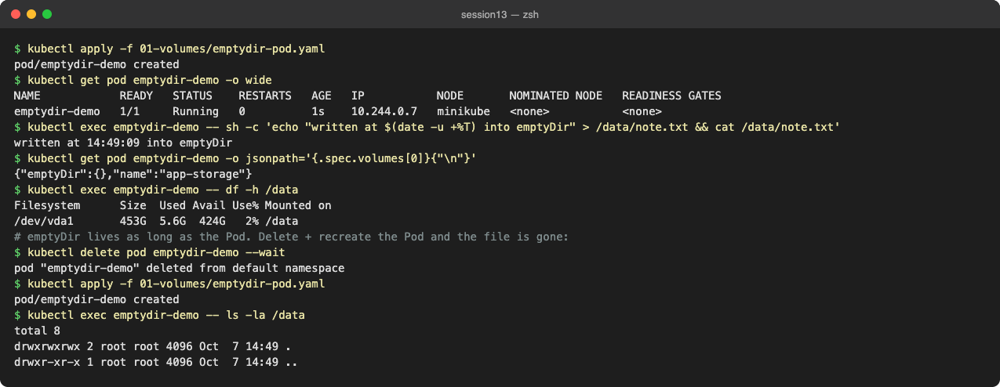
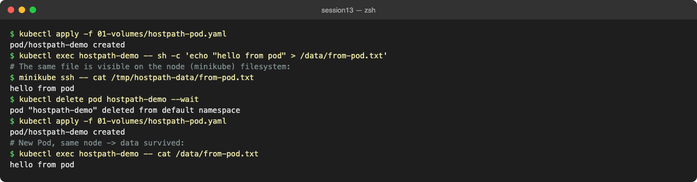
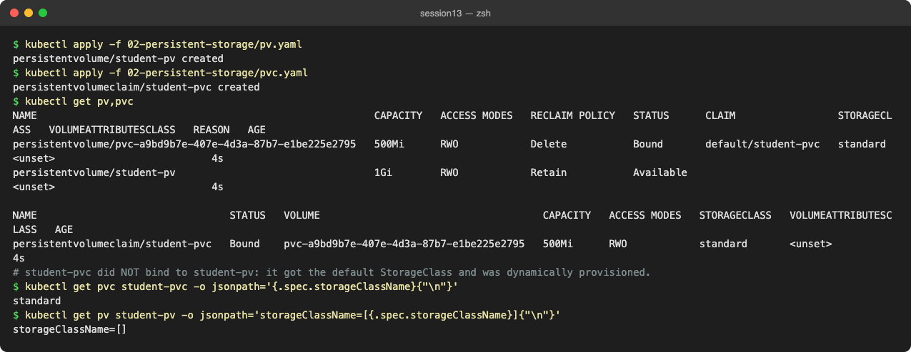
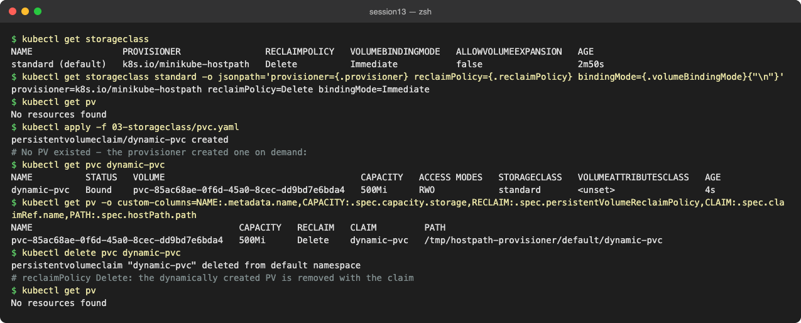

# Session 13 – Task 1: Kubernetes Volumes

**Author:** Pranay Reddy
**Course:** SST DevOps & Cloud [SWE]
**Session:** 13, Task 1 (Kubernetes Volumes)
**Environment:** macOS (Apple Silicon, arm64), Docker Desktop, minikube v1.39.0, Kubernetes v1.37.0

Every output block below is real output from this machine, captured while running the manifests in this repo. Screenshots are in [../screenshots/](../screenshots/).

---

## Why volumes exist

A container's filesystem is thrown away every time the container restarts. Anything written to it (uploads, a database file, a cache) is lost. A **volume** is storage that Kubernetes attaches to a Pod at a mount path, with a lifetime that is decided by the volume type, not by the container.

```text
                    lifetime of the data
 container fs   |---|  (restart = gone)
 emptyDir       |-----------|  (as long as the Pod exists on that node)
 hostPath       |-------------------------|  (as long as the node's disk)
 PV / PVC       |---------------------------------------->  (independent of Pods and nodes)
```

| Type | Data survives container restart | Data survives Pod delete | Survives node loss | Typical use |
| :--- | :---: | :---: | :---: | :--- |
| `emptyDir` | yes | no | no | scratch space, cache, sharing files between containers in one Pod |
| `hostPath` | yes | yes (same node only) | no | node agents (log collectors, CNI), local labs |
| PV + PVC | yes | yes | yes (with network storage) | databases, uploads, anything stateful |

---

## emptyDir

An `emptyDir` is created empty when the Pod is scheduled onto a node and deleted when the Pod is removed from that node. All containers in the Pod can mount it, which makes it the standard way for a sidecar to share files with the main container. `emptyDir.medium: Memory` backs it with tmpfs (RAM) instead of the node disk.

Manifest: [../01-volumes/emptydir-pod.yaml](../01-volumes/emptydir-pod.yaml)

```yaml
volumes:
  - name: app-storage
    emptyDir: {}
```

**Practical example:** write a file, delete the Pod, recreate it, and the file is gone.

```text
$ kubectl apply -f 01-volumes/emptydir-pod.yaml
pod/emptydir-demo created
$ kubectl get pod emptydir-demo -o wide
NAME            READY   STATUS    RESTARTS   AGE   IP           NODE       NOMINATED NODE   READINESS GATES
emptydir-demo   1/1     Running   0          1s    10.244.0.7   minikube   <none>           <none>
$ kubectl exec emptydir-demo -- sh -c 'echo "written at $(date -u +%T) into emptyDir" > /data/note.txt && cat /data/note.txt'
written at 14:49:09 into emptyDir
$ kubectl get pod emptydir-demo -o jsonpath='{.spec.volumes[0]}{"\n"}'
{"emptyDir":{},"name":"app-storage"}
$ kubectl exec emptydir-demo -- df -h /data
Filesystem      Size  Used Avail Use% Mounted on
/dev/vda1       453G  5.6G  424G   2% /data
# emptyDir lives as long as the Pod. Delete + recreate the Pod and the file is gone:
$ kubectl delete pod emptydir-demo --wait
pod "emptydir-demo" deleted from default namespace
$ kubectl apply -f 01-volumes/emptydir-pod.yaml
pod/emptydir-demo created
$ kubectl exec emptydir-demo -- ls -la /data
total 8
drwxrwxrwx 2 root root 4096 Oct  7 14:49 .
drwxr-xr-x 1 root root 4096 Oct  7 14:49 ..
```



**Observation:** the recreated Pod got a brand new, empty `/data`. `df` shows the emptyDir lives on the node's disk (`/dev/vda1`).

---

## hostPath

`hostPath` mounts a file or directory from the **node's** filesystem into the Pod. The data outlives the Pod, but only on that one node: if the Pod is rescheduled onto another node it sees a different (empty) directory. It also gives the Pod access to the host, so it is a security risk and is normally blocked by Pod Security admission (`baseline`/`restricted`) outside of system components.

Manifest: [../01-volumes/hostpath-pod.yaml](../01-volumes/hostpath-pod.yaml) (`type: DirectoryOrCreate` creates `/tmp/hostpath-data` if missing)

```text
$ kubectl apply -f 01-volumes/hostpath-pod.yaml
pod/hostpath-demo created
$ kubectl exec hostpath-demo -- sh -c 'echo "hello from pod" > /data/from-pod.txt'
# The same file is visible on the node (minikube) filesystem:
$ minikube ssh -- cat /tmp/hostpath-data/from-pod.txt
hello from pod
$ kubectl delete pod hostpath-demo --wait
pod "hostpath-demo" deleted from default namespace
$ kubectl apply -f 01-volumes/hostpath-pod.yaml
pod/hostpath-demo created
# New Pod, same node -> data survived:
$ kubectl exec hostpath-demo -- cat /data/from-pod.txt
hello from pod
```



**Observation:** the file written from inside the Pod is visible on the minikube node with `minikube ssh`, and a new Pod on the same node reads it back.

---

## PersistentVolume (PV)

A **PersistentVolume** is a piece of storage in the cluster, described as a cluster-scoped API object: capacity, access modes, reclaim policy and the backend (hostPath, NFS, AWS EBS via CSI, etc.). An admin can create it by hand (static provisioning) or a StorageClass can create it automatically (dynamic provisioning).

Important fields:

| Field | Meaning |
| :--- | :--- |
| `capacity.storage` | size, e.g. `1Gi` |
| `accessModes` | `ReadWriteOnce` (RWO, one node), `ReadOnlyMany` (ROX), `ReadWriteMany` (RWX, many nodes), `ReadWriteOncePod` (RWOP, one Pod) |
| `persistentVolumeReclaimPolicy` | what happens after the claim is deleted: `Retain` (keep data, PV becomes `Released`) or `Delete` (delete PV and backing storage) |
| `storageClassName` | which class the PV belongs to; `""` means "no class" |

PV phases: `Available` -> `Bound` -> `Released` (claim deleted, Retain) -> manually cleaned up / reused.

## PersistentVolumeClaim (PVC)

A **PersistentVolumeClaim** is a namespaced request for storage made by a user: "I need 500Mi, RWO". Kubernetes binds it to a PV that satisfies the request (size, access mode, storage class). Pods never reference a PV directly; they reference the claim:

```yaml
volumes:
  - name: persistent-storage
    persistentVolumeClaim:
      claimName: student-pvc
```

### Practical example 1: the instructor's PV/PVC did not bind together

[../02-persistent-storage/pv.yaml](../02-persistent-storage/pv.yaml) creates `student-pv` (1Gi, Retain, no storageClassName) and [../02-persistent-storage/pvc.yaml](../02-persistent-storage/pvc.yaml) creates `student-pvc` (500Mi, no storageClassName).

```text
$ kubectl apply -f 02-persistent-storage/pv.yaml
persistentvolume/student-pv created
$ kubectl apply -f 02-persistent-storage/pvc.yaml
persistentvolumeclaim/student-pvc created
$ kubectl get pv,pvc
NAME                                                        CAPACITY   ACCESS MODES   RECLAIM POLICY   STATUS      CLAIM                 STORAGECLASS   VOLUMEATTRIBUTESCLASS   REASON   AGE
persistentvolume/pvc-a9bd9b7e-407e-4d3a-87b7-e1be225e2795   500Mi      RWO            Delete           Bound       default/student-pvc   standard       <unset>                          4s
persistentvolume/student-pv                                 1Gi        RWO            Retain           Available                                        <unset>                          4s

NAME                                STATUS   VOLUME                                     CAPACITY   ACCESS MODES   STORAGECLASS   VOLUMEATTRIBUTESCLASS   AGE
persistentvolumeclaim/student-pvc   Bound    pvc-a9bd9b7e-407e-4d3a-87b7-e1be225e2795   500Mi      RWO            standard       <unset>                 4s
# student-pvc did NOT bind to student-pv: it got the default StorageClass and was dynamically provisioned.
$ kubectl get pvc student-pvc -o jsonpath='{.spec.storageClassName}{"\n"}'
standard
$ kubectl get pv student-pv -o jsonpath='storageClassName=[{.spec.storageClassName}]{"\n"}'
storageClassName=[]
```



**Root cause:** a PVC with *no* `storageClassName` field is mutated by the `DefaultStorageClass` admission plugin to use the default class (`standard` on minikube). The static PV has an empty class, so the classes do not match and the PVC is dynamically provisioned instead. `student-pv` stays `Available`, unused.

**Fix:** set `storageClassName: ""` on the claim (explicitly "no class") and optionally pin it with `volumeName`. See [pvc-static.yaml](pvc-static.yaml) and [pod-static.yaml](pod-static.yaml).

### Practical example 2: static binding, persistence across Pods, Retain

```text
$ kubectl apply -f 01-kubernetes-volumes/pvc-static.yaml
persistentvolumeclaim/student-pvc-static created
$ kubectl get pv student-pv; kubectl get pvc student-pvc-static
NAME         CAPACITY   ACCESS MODES   RECLAIM POLICY   STATUS   CLAIM                        STORAGECLASS   VOLUMEATTRIBUTESCLASS   REASON   AGE
student-pv   1Gi        RWO            Retain           Bound    default/student-pvc-static                  <unset>                          21s
NAME                 STATUS   VOLUME       CAPACITY   ACCESS MODES   STORAGECLASS   VOLUMEATTRIBUTESCLASS   AGE
student-pvc-static   Bound    student-pv   1Gi        RWO                           <unset>                 3s
$ kubectl apply -f 01-kubernetes-volumes/pod-static.yaml
pod/storage-demo-static created
$ kubectl exec storage-demo-static -- sh -c 'echo "Student: Pranay Reddy" > /data/student.txt; cat /data/student.txt'
Student: Pranay Reddy
$ kubectl delete pod storage-demo-static --wait
pod "storage-demo-static" deleted from default namespace
$ kubectl apply -f 01-kubernetes-volumes/pod-static.yaml
pod/storage-demo-static created
# Pod was deleted and recreated - data is still on the PersistentVolume:
$ kubectl exec storage-demo-static -- cat /data/student.txt
Student: Pranay Reddy
# Reclaim policy Retain: deleting the claim releases the PV but keeps the data
$ kubectl delete pod storage-demo-static --wait; kubectl delete pvc student-pvc-static
pod "storage-demo-static" deleted from default namespace
persistentvolumeclaim "student-pvc-static" deleted from default namespace
$ kubectl get pv student-pv
NAME         CAPACITY   ACCESS MODES   RECLAIM POLICY   STATUS     CLAIM                        STORAGECLASS   VOLUMEATTRIBUTESCLASS   REASON   AGE
student-pv   1Gi        RWO            Retain           Released   default/student-pvc-static                  <unset>                          26s
$ minikube ssh -- cat /tmp/student-data/student.txt
Student: Pranay Reddy
```


**Observations:**
- The claim bound to `student-pv` and shows the PV's full 1Gi (a claim gets the whole PV even if it asked for less).
- The file survived the Pod being deleted and recreated.
- With `Retain`, deleting the claim left the PV in `Released` and the data still on disk. A `Released` PV is not bound again automatically; an admin must clear `spec.claimRef` or recreate the PV. This protects data from accidental reuse.

---

## StorageClass

A **StorageClass** describes a "kind" of storage and **who creates it**:

```yaml
apiVersion: storage.k8s.io/v1
kind: StorageClass
metadata:
  name: standard
  annotations:
    storageclass.kubernetes.io/is-default-class: "true"
provisioner: k8s.io/minikube-hostpath   # on EKS: ebs.csi.aws.com
reclaimPolicy: Delete
volumeBindingMode: Immediate            # or WaitForFirstConsumer
allowVolumeExpansion: false
parameters: {}                          # e.g. type: gp3 for EBS
```

| Field | Meaning |
| :--- | :--- |
| `provisioner` | the plugin / CSI driver that creates the real disk |
| `reclaimPolicy` | applied to PVs it creates (default `Delete`) |
| `volumeBindingMode` | `Immediate` creates the volume as soon as the PVC exists; `WaitForFirstConsumer` waits until a Pod is scheduled so the disk is created in the same zone as the node (recommended on clouds) |
| `allowVolumeExpansion` | allows `kubectl edit pvc` to grow the size |
| `parameters` | provisioner-specific settings (disk type, IOPS, encryption) |

One class can be marked default; PVCs without a class use it (which is exactly what caused the gotcha above).

## Dynamic provisioning

With dynamic provisioning nobody creates PVs by hand. A PVC names a StorageClass, the provisioner creates a matching PV and the claim binds to it immediately.

```text
PVC (storageClassName: standard, 500Mi)
   │  watched by
   ▼
provisioner k8s.io/minikube-hostpath ──creates──► PV pvc-<uid> (500Mi, Delete)
   │                                                   │
   └──────────────────────── Bound ◄───────────────────┘
```

Manifest: [../03-storageclass/pvc.yaml](../03-storageclass/pvc.yaml)

```text
$ kubectl get storageclass
NAME                 PROVISIONER                RECLAIMPOLICY   VOLUMEBINDINGMODE   ALLOWVOLUMEEXPANSION   AGE
standard (default)   k8s.io/minikube-hostpath   Delete          Immediate           false                  2m50s
$ kubectl get storageclass standard -o jsonpath='provisioner={.provisioner} reclaimPolicy={.reclaimPolicy} bindingMode={.volumeBindingMode}{"\n"}'
provisioner=k8s.io/minikube-hostpath reclaimPolicy=Delete bindingMode=Immediate
$ kubectl get pv
No resources found
$ kubectl apply -f 03-storageclass/pvc.yaml
persistentvolumeclaim/dynamic-pvc created
# No PV existed - the provisioner created one on demand:
$ kubectl get pvc dynamic-pvc
NAME          STATUS   VOLUME                                     CAPACITY   ACCESS MODES   STORAGECLASS   VOLUMEATTRIBUTESCLASS   AGE
dynamic-pvc   Bound    pvc-85ac68ae-0f6d-45a0-8cec-dd9bd7e6bda4   500Mi      RWO            standard       <unset>                 4s
$ kubectl get pv -o custom-columns=NAME:.metadata.name,CAPACITY:.spec.capacity.storage,RECLAIM:.spec.persistentVolumeReclaimPolicy,CLAIM:.spec.claimRef.name,PATH:.spec.hostPath.path
NAME                                       CAPACITY   RECLAIM   CLAIM         PATH
pvc-85ac68ae-0f6d-45a0-8cec-dd9bd7e6bda4   500Mi      Delete    dynamic-pvc   /tmp/hostpath-provisioner/default/dynamic-pvc
$ kubectl delete pvc dynamic-pvc
persistentvolumeclaim "dynamic-pvc" deleted from default namespace
# reclaimPolicy Delete: the dynamically created PV is removed with the claim
$ kubectl get pv
No resources found
```



**Observations:** there were no PVs before the claim; the provisioner created `pvc-85ac68ae-...` under `/tmp/hostpath-provisioner/default/dynamic-pvc` on the node. Because the class's reclaim policy is `Delete`, deleting the claim also deleted the PV.

---

## Static vs dynamic provisioning

| | Static | Dynamic |
| :--- | :--- | :--- |
| Who creates the PV | cluster admin, by hand | provisioner, on demand |
| PVC `storageClassName` | `""` (or the PV's class) | a real StorageClass (or the default) |
| Scaling to many apps | slow, manual | automatic |
| Typical reclaim policy | `Retain` | `Delete` |
| Example | pre-existing NFS export | EBS gp3 volume per PVC on EKS |

## Key takeaways

- `emptyDir` lives and dies with the Pod; `hostPath` lives with the node; PV/PVC data is independent of both.
- Pods use **claims**, not volumes; the PVC is the contract between the app and the storage admin.
- A PVC with no `storageClassName` gets the default class. Use `storageClassName: ""` to bind to a static PV.
- `Retain` keeps data after the claim is gone (PV becomes `Released`); `Delete` removes it.
- A StorageClass + provisioner gives dynamic provisioning: create a PVC, get a disk.

## References

- https://kubernetes.io/docs/concepts/storage/volumes/
- https://kubernetes.io/docs/concepts/storage/persistent-volumes/
- https://kubernetes.io/docs/concepts/storage/storage-classes/
- https://kubernetes.io/docs/concepts/storage/dynamic-provisioning/
