# Session 13: Kubernetes Storage, HPA & Probes

**Author:** Pranay Reddy
**Course:** SST DevOps & Cloud [SWE]
**Session:** 13
**Repository:** devops-heros / session13
**Environment:** macOS (Apple Silicon, arm64), Docker Desktop 29.7, minikube v1.39.0 (4 CPU / 6 GB), Kubernetes v1.37.0, metrics-server addon, Helm v3

Every output block is real output from this machine. Screenshots are in [screenshots/](screenshots/) and are rendered from the same captured output.

| Task | What | Where |
| :--- | :--- | :--- |
| 1 | Kubernetes Volumes write-up with practical examples | [01-kubernetes-volumes/README.md](01-kubernetes-volumes/README.md) |
| 2 | HPA hands-on (deploy, HPA, load generator, scaling, scale-down) | this file, [04-hpa/](04-hpa/), [hpa/](hpa/) |
| 3 | Mini project: PVC + Probes + HPA | this file, [mini-project/](mini-project/) |

Files added by me: `01-kubernetes-volumes/` (README, `pvc-static.yaml`, `pod-static.yaml`), `04-hpa/load-generator.yaml`, `04-hpa/load-generator-burst.yaml`, `hpa/backend-deployment.yaml`, `hpa/load-generator-incluster.yaml`, `screenshots/`.

---

## Task 1: Kubernetes Volumes

Full write-up: **[01-kubernetes-volumes/README.md](01-kubernetes-volumes/README.md)** covering emptyDir, hostPath, PersistentVolume, PersistentVolumeClaim, StorageClass and dynamic provisioning, each with a run on minikube.

Short summary of what the runs showed:

| Demo | Result |
| :--- | :--- |
| emptyDir | file gone after the Pod is recreated |
| hostPath | file visible on the node via `minikube ssh`, survives Pod recreation |
| instructor PV + PVC | **did not bind together**: the PVC got the default `standard` class and was dynamically provisioned; `student-pv` stayed `Available` |
| fixed PVC (`storageClassName: ""`) | bound to `student-pv`, data survived Pod recreation, `Retain` kept data after the claim was deleted |
| StorageClass `standard` | PVC created a PV on demand; `Delete` policy removed it with the claim |

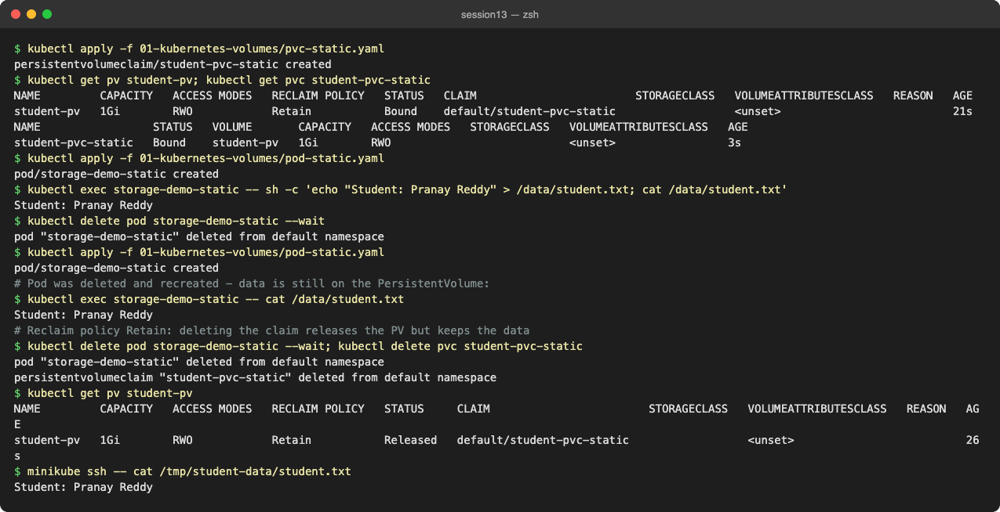

---

## Task 2: HPA Hands-on

**Files:** [04-hpa/deployment.yaml](04-hpa/deployment.yaml), [04-hpa/service.yaml](04-hpa/service.yaml), [04-hpa/hpa.yaml](04-hpa/hpa.yaml), [04-hpa/load-generator.yaml](04-hpa/load-generator.yaml), [04-hpa/load-generator-burst.yaml](04-hpa/load-generator-burst.yaml)

```yaml
# 04-hpa/hpa.yaml
apiVersion: autoscaling/v2
kind: HorizontalPodAutoscaler
metadata:
  name: hpa-demo
spec:
  scaleTargetRef:
    apiVersion: apps/v1
    kind: Deployment
    name: hpa-demo
  minReplicas: 1
  maxReplicas: 5
  metrics:
    - type: Resource
      resource:
        name: cpu
        target:
          type: Utilization
          averageUtilization: 50     # 50% of the 100m CPU request = 50m per pod
```

How the HPA decides: `desiredReplicas = ceil(currentReplicas × currentUtilization / targetUtilization)`. Utilization is measured against the container's **CPU request** (`100m`), which is why the request is mandatory.

### Steps 1–3: Deploy the application, configure HPA, verify HPA

```bash
kubectl get pods -n kube-system -l k8s-app=metrics-server
kubectl top nodes
kubectl apply -f 04-hpa/deployment.yaml -f 04-hpa/service.yaml
kubectl apply -f 04-hpa/hpa.yaml
kubectl get hpa
kubectl top pods -l app=hpa-demo
```

```text
$ kubectl get pods -n kube-system -l k8s-app=metrics-server
NAME                              READY   STATUS    RESTARTS   AGE
metrics-server-768f9f6999-274gg   1/1     Running   0          3m3s
$ kubectl top nodes
NAME       CPU(cores)   CPU(%)   MEMORY(bytes)   MEMORY(%)   
minikube   200m         2%       881Mi           11%         
$ kubectl apply -f 04-hpa/deployment.yaml -f 04-hpa/service.yaml
deployment.apps/hpa-demo created
service/hpa-demo-service created
$ kubectl get deployment hpa-demo; kubectl get svc hpa-demo-service
NAME       READY   UP-TO-DATE   AVAILABLE   AGE
hpa-demo   1/1     1            1           1s
NAME               TYPE        CLUSTER-IP      EXTERNAL-IP   PORT(S)   AGE
hpa-demo-service   ClusterIP   10.96.166.218   <none>        80/TCP    1s
$ kubectl apply -f 04-hpa/hpa.yaml
horizontalpodautoscaler.autoscaling/hpa-demo created
$ kubectl get hpa
NAME       REFERENCE             TARGETS       MINPODS   MAXPODS   REPLICAS   AGE
hpa-demo   Deployment/hpa-demo   cpu: 2%/50%   1         5         1          45s
$ kubectl top pods -l app=hpa-demo
NAME                        CPU(cores)   MEMORY(bytes)   
hpa-demo-5d6676989b-2lc7q   2m           8Mi
```

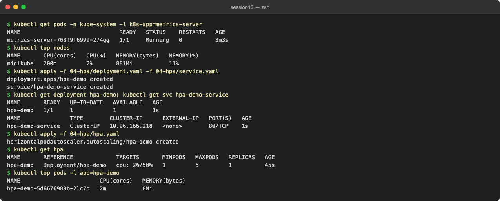

### Steps 4–7: Deploy a load generator, observe CPU and Pod scaling

```bash
kubectl apply -f 04-hpa/load-generator.yaml   # busybox: while true; do wget -q -O- http://hpa-demo-service; done
kubectl get hpa hpa-demo -w
```

```text
$ kubectl apply -f 04-hpa/load-generator.yaml
pod/load-generator created
# kubectl get hpa sampled every 20s while load runs:
$ kubectl get hpa hpa-demo -w
NAME       REFERENCE             TARGETS       MINPODS   MAXPODS   REPLICAS   AGE
hpa-demo   Deployment/hpa-demo   cpu: 2%/50%   1     5     1     78s   [t+20s]
hpa-demo   Deployment/hpa-demo   cpu: 28%/50%   1     5     1     98s   [t+40s]
hpa-demo   Deployment/hpa-demo   cpu: 28%/50%   1     5     1     119s   [t+60s]
hpa-demo   Deployment/hpa-demo   cpu: 28%/50%   1     5     1     2m19s   [t+80s]
hpa-demo   Deployment/hpa-demo   cpu: 51%/50%   1     5     1     2m39s   [t+100s]
hpa-demo   Deployment/hpa-demo   cpu: 51%/50%   1     5     1     2m59s   [t+120s]
hpa-demo   Deployment/hpa-demo   cpu: 51%/50%   1     5     1     3m19s   [t+140s]
hpa-demo   Deployment/hpa-demo   cpu: 57%/50%   1     5     1     3m39s   [t+160s]
hpa-demo   Deployment/hpa-demo   cpu: 57%/50%   1     5     2     3m59s   [t+180s]
hpa-demo   Deployment/hpa-demo   cpu: 57%/50%   1     5     2     4m20s   [t+200s]
hpa-demo   Deployment/hpa-demo   cpu: 29%/50%   1     5     2     4m40s   [t+220s]
hpa-demo   Deployment/hpa-demo   cpu: 29%/50%   1     5     2     5m   [t+240s]
hpa-demo   Deployment/hpa-demo   cpu: 29%/50%   1     5     2     5m20s   [t+260s]
hpa-demo   Deployment/hpa-demo   cpu: 26%/50%   1     5     2     5m40s   [t+280s]
$ kubectl top pods -l app=hpa-demo
NAME                        CPU(cores)   MEMORY(bytes)   
hpa-demo-5d6676989b-2lc7q   27m          9Mi             
hpa-demo-5d6676989b-llk87   26m          10Mi            
$ kubectl get pods -l app=hpa-demo -o wide
NAME                        READY   STATUS    RESTARTS   AGE     IP            NODE       NOMINATED NODE   READINESS GATES
hpa-demo-5d6676989b-2lc7q   1/1     Running   0          5m41s   10.244.0.13   minikube   <none>           <none>
hpa-demo-5d6676989b-llk87   1/1     Running   0          2m10s   10.244.0.15   minikube   <none>           <none>
```

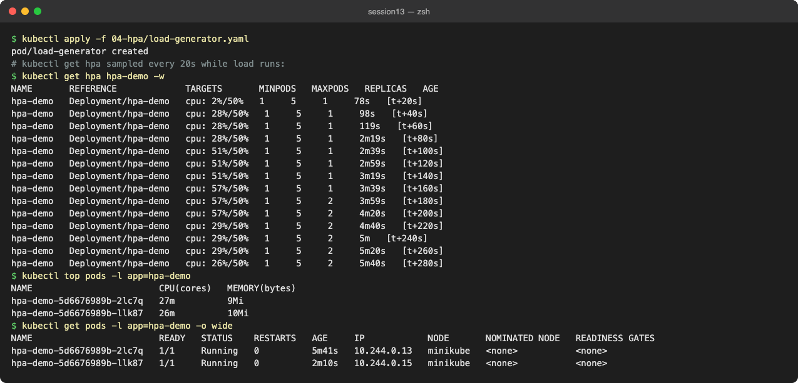

One busybox loop pushed CPU to 51–57% and the HPA went 1 → 2. Once two pods shared the load, utilization fell to ~28% and it stayed at 2.

### Step 5: Increase the application load

```bash
kubectl apply -f 04-hpa/load-generator-burst.yaml   # 4 more busybox workers
```

```text
$ kubectl apply -f 04-hpa/load-generator-burst.yaml
deployment.apps/load-generator-burst created
$ kubectl get hpa hpa-demo -w
NAME       REFERENCE             TARGETS        MINPODS   MAXPODS   REPLICAS   AGE
hpa-demo   Deployment/hpa-demo   cpu: 26%/50%   1     5     2     6m13s   [t+20s]
hpa-demo   Deployment/hpa-demo   cpu: 68%/50%   1     5     2     6m33s   [t+40s]
hpa-demo   Deployment/hpa-demo   cpu: 68%/50%   1     5     3     6m53s   [t+60s]
hpa-demo   Deployment/hpa-demo   cpu: 68%/50%   1     5     3     7m13s   [t+80s]
hpa-demo   Deployment/hpa-demo   cpu: 93%/50%   1     5     3     7m33s   [t+100s]
hpa-demo   Deployment/hpa-demo   cpu: 93%/50%   1     5     5     7m53s   [t+120s]
hpa-demo   Deployment/hpa-demo   cpu: 93%/50%   1     5     5     8m14s   [t+140s]
hpa-demo   Deployment/hpa-demo   cpu: 62%/50%   1     5     5     8m34s   [t+160s]
hpa-demo   Deployment/hpa-demo   cpu: 62%/50%   1     5     5     8m54s   [t+180s]
hpa-demo   Deployment/hpa-demo   cpu: 62%/50%   1     5     5     9m14s   [t+200s]
hpa-demo   Deployment/hpa-demo   cpu: 54%/50%   1     5     5     9m34s   [t+220s]
hpa-demo   Deployment/hpa-demo   cpu: 54%/50%   1     5     5     9m55s   [t+240s]
$ kubectl top pods -l app=hpa-demo
NAME                        CPU(cores)   MEMORY(bytes)   
hpa-demo-5d6676989b-2lc7q   55m          9Mi             
hpa-demo-5d6676989b-j4xsr   54m          9Mi             
hpa-demo-5d6676989b-llk87   55m          8Mi             
hpa-demo-5d6676989b-nhwnd   54m          9Mi             
hpa-demo-5d6676989b-p87p7   54m          9Mi             
$ kubectl get pods -l app=hpa-demo
NAME                        READY   STATUS    RESTARTS   AGE
hpa-demo-5d6676989b-2lc7q   1/1     Running   0          9m56s
hpa-demo-5d6676989b-j4xsr   1/1     Running   0          2m25s
hpa-demo-5d6676989b-llk87   1/1     Running   0          6m25s
hpa-demo-5d6676989b-nhwnd   1/1     Running   0          2m25s
hpa-demo-5d6676989b-p87p7   1/1     Running   0          3m25s
```

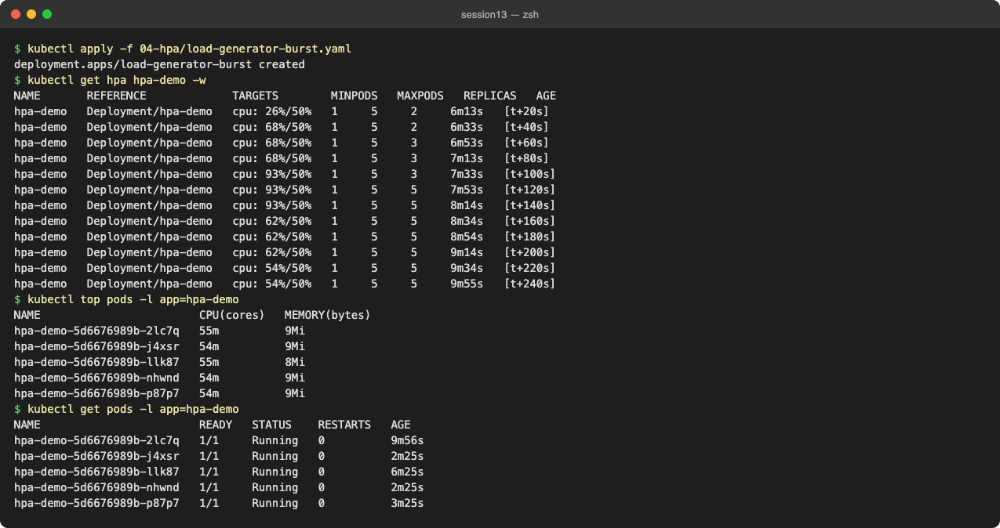

### `kubectl describe hpa`

```text
$ kubectl describe hpa hpa-demo
Name:                                                  hpa-demo
Namespace:                                             default
Labels:                                                <none>
Annotations:                                           <none>
CreationTimestamp:                                     Wed, 07 Oct 2026 20:20:29 +0530
Reference:                                             Deployment/hpa-demo
Metrics:                                               ( current / target )
  resource cpu on pods  (as a percentage of request):  54% (54m) / 50%
Min replicas:                                          1
Max replicas:                                          5
Deployment pods:                                       5 current / 5 desired
Conditions:
  Type            Status  Reason               Message
  ----            ------  ------               -------
  AbleToScale     True    ScaleDownStabilized  recent recommendations were higher than current one, applying the highest recent recommendation
  ScalingActive   True    ValidMetricFound     the HPA was able to successfully calculate a replica count from cpu resource utilization (percentage of request)
  ScalingLimited  True    TooManyReplicas      the desired replica count is more than the maximum replica count
  ScaledToZero    False   NotScaledToZero      the HPA controller did not scale the workload to zero
Events:
  Type     Reason                        Age                    From                       Message
  ----     ------                        ----                   ----                       -------
  Warning  FailedGetResourceMetric       9m41s (x2 over 9m56s)  horizontal-pod-autoscaler  failed to get cpu utilization: unable to get metrics for resource cpu: no metrics returned from resource metrics API
  Warning  FailedComputeMetricsReplicas  9m41s (x2 over 9m56s)  horizontal-pod-autoscaler  invalid metrics (1 invalid out of 1), first error is: failed to get cpu resource metric value: failed to get cpu utilization: unable to get metrics for resource cpu: no metrics returned from resource metrics API
  Normal   SuccessfulRescale             6m26s                  horizontal-pod-autoscaler  New size: 2; reason: cpu resource utilization (percentage of request) above target
  Normal   SuccessfulRescale             3m26s                  horizontal-pod-autoscaler  New size: 3; reason: cpu resource utilization (percentage of request) above target
  Normal   SuccessfulRescale             2m26s                  horizontal-pod-autoscaler  New size: 5; reason: cpu resource utilization (percentage of request) above target
```

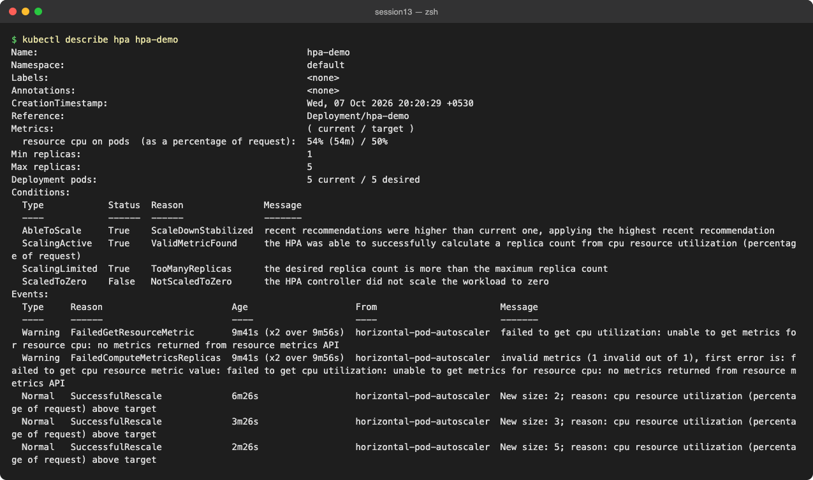

**What the describe output shows:**
- `ScalingLimited True TooManyReplicas`: the formula wanted more than 5 (93% × 3 / 50% ≈ 6), so it was capped at `maxReplicas`.
- `ScaleDownStabilized`: the HPA keeps the highest recommendation from the last 5 minutes before scaling down.
- The two early `FailedGetResourceMetric` warnings are from the first ~15 s, before metrics-server had a sample for the new pod. They are normal.

### Stop the load and observe scale-down

```bash
kubectl delete pod load-generator; kubectl delete deployment load-generator-burst
kubectl get hpa hpa-demo -w
```

```text
$ kubectl delete pod load-generator; kubectl delete deployment load-generator-burst
pod "load-generator" deleted from default namespace
deployment.apps "load-generator-burst" deleted from default namespace
$ kubectl get hpa hpa-demo -w
NAME       REFERENCE             TARGETS        MINPODS   MAXPODS   REPLICAS   AGE
hpa-demo   Deployment/hpa-demo   cpu: 54%/50%   1     5     5     11m   [t+30s]
hpa-demo   Deployment/hpa-demo   cpu: 48%/50%   1     5     5     11m   [t+60s]
hpa-demo   Deployment/hpa-demo   cpu: 48%/50%   1     5     5     12m   [t+90s]
hpa-demo   Deployment/hpa-demo   cpu: 0%/50%   1     5     5     12m   [t+120s]
hpa-demo   Deployment/hpa-demo   cpu: 0%/50%   1     5     5     13m   [t+150s]
hpa-demo   Deployment/hpa-demo   cpu: 0%/50%   1     5     5     13m   [t+180s]
hpa-demo   Deployment/hpa-demo   cpu: 0%/50%   1     5     5     14m   [t+210s]
hpa-demo   Deployment/hpa-demo   cpu: 0%/50%   1     5     5     14m   [t+240s]
hpa-demo   Deployment/hpa-demo   cpu: 0%/50%   1     5     5     15m   [t+270s]
hpa-demo   Deployment/hpa-demo   cpu: 0%/50%   1     5     5     15m   [t+300s]
hpa-demo   Deployment/hpa-demo   cpu: 0%/50%   1     5     5     16m   [t+330s]
hpa-demo   Deployment/hpa-demo   cpu: 0%/50%   1     5     5     16m   [t+360s]
hpa-demo   Deployment/hpa-demo   cpu: 0%/50%   1     5     5     17m   [t+390s]
hpa-demo   Deployment/hpa-demo   cpu: 0%/50%   1     5     1     17m   [t+420s]
hpa-demo   Deployment/hpa-demo   cpu: 0%/50%   1     5     1     18m   [t+450s]
hpa-demo   Deployment/hpa-demo   cpu: 0%/50%   1     5     1     18m   [t+480s]
$ kubectl get pods -l app=hpa-demo
NAME                        READY   STATUS    RESTARTS   AGE
hpa-demo-5d6676989b-llk87   1/1     Running   0          15m
$ kubectl get events --field-selector involvedObject.name=hpa-demo,reason=SuccessfulRescale --sort-by=.lastTimestamp
LAST SEEN   TYPE     REASON              OBJECT                             MESSAGE
15m         Normal   SuccessfulRescale   horizontalpodautoscaler/hpa-demo   New size: 2; reason: cpu resource utilization (percentage of request) above target
12m         Normal   SuccessfulRescale   horizontalpodautoscaler/hpa-demo   New size: 3; reason: cpu resource utilization (percentage of request) above target
11m         Normal   SuccessfulRescale   horizontalpodautoscaler/hpa-demo   New size: 5; reason: cpu resource utilization (percentage of request) above target
84s         Normal   SuccessfulRescale   horizontalpodautoscaler/hpa-demo   New size: 1; reason: All metrics below target
```

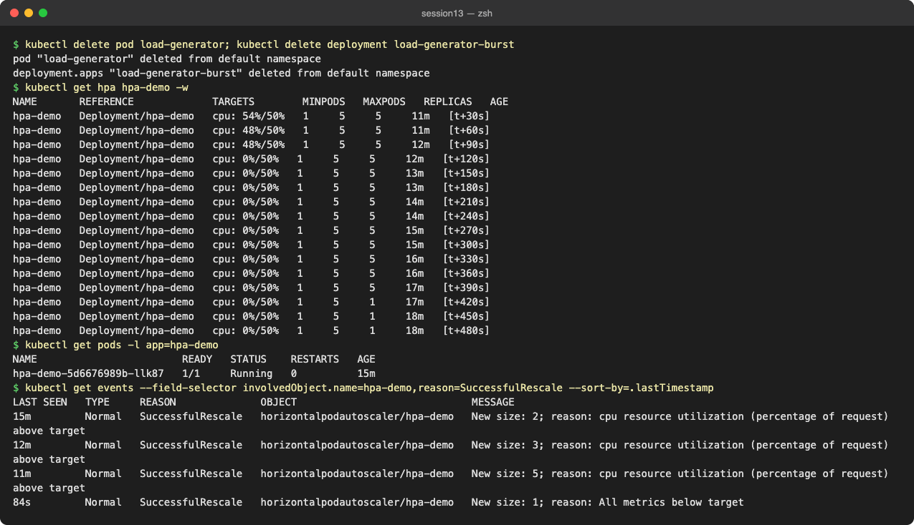

CPU dropped to 0% within about 2 minutes, but replicas stayed at 5 until the 300 s scale-down stabilization window passed, then went straight to `minReplicas` (1).

### Same exercise with the `hpa/` backend files and `load_generator.sh`

`hpa/hpa-backend.yaml` scales a Deployment called `yatri-backend` and `hpa/backend-service.yaml` targets port 5000, but the folder had no Deployment. I added [hpa/backend-deployment.yaml](hpa/backend-deployment.yaml): a small Python server on `:5000` whose `/healthz` does 2000 SHA-256 rounds per request, with a `100m` CPU request.

```text
$ kubectl apply -f hpa/backend-deployment.yaml -f hpa/backend-service.yaml -f hpa/hpa-backend.yaml
configmap/yatri-backend-code unchanged
deployment.apps/yatri-backend unchanged
service/yatri-backend-service unchanged
horizontalpodautoscaler.autoscaling/yatri-backend-hpa unchanged
$ kubectl get deploy,svc,hpa -l app=yatri-backend
NAME                            READY   UP-TO-DATE   AVAILABLE   AGE
deployment.apps/yatri-backend   2/2     2            2           87s

NAME                            TYPE        CLUSTER-IP      EXTERNAL-IP   PORT(S)   AGE
service/yatri-backend-service   ClusterIP   10.107.37.134   <none>        80/TCP    87s

NAME                                                    REFERENCE                  TARGETS              MINPODS   MAXPODS   REPLICAS   AGE
horizontalpodautoscaler.autoscaling/yatri-backend-hpa   Deployment/yatri-backend   cpu: <unknown>/50%   2         10        2          87s
$ kubectl top pods -l app=yatri-backend
NAME                             CPU(cores)   MEMORY(bytes)   
yatri-backend-574b5bf566-nq7n5   8m           11Mi            
yatri-backend-574b5bf566-rlwgh   9m           11Mi            
$ kubectl run curl-check --restart=Never --image=busybox:1.36 -- wget -qO- http://yatri-backend-service/healthz; kubectl logs curl-check
ok from yatri-backend-574b5bf566-nq7n5
# HPA showed <unknown> for the first ~2 min (pods inside the readiness/initialization window). Now:
$ kubectl get hpa yatri-backend-hpa
NAME                REFERENCE                  TARGETS       MINPODS   MAXPODS   REPLICAS   AGE
yatri-backend-hpa   Deployment/yatri-backend   cpu: 2%/50%   2         10        2          2m7s
```

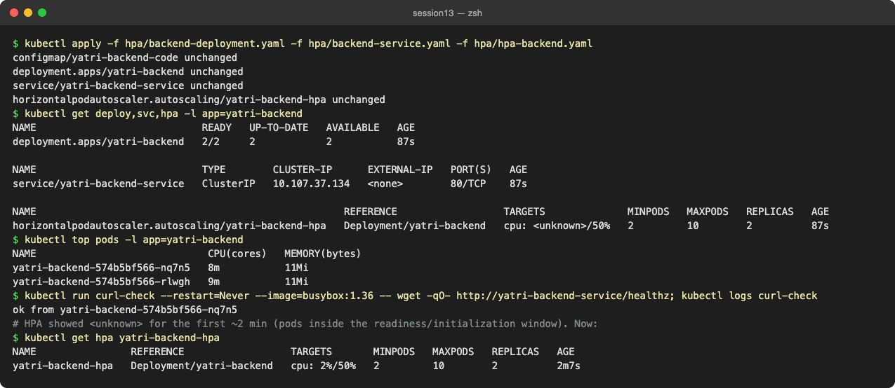

Running the instructor's script from the Mac:

```text
$ ./hpa/load_generator.sh   # in terminal 1 (stopped after 3 min)
==================================================
      KUBERNETES HPA TRAFFIC LOAD GENERATOR       
==================================================
Pounding target endpoint: http://localhost:5000/healthz
Simulating traffic spike. Press Ctrl+C to stop.

Starting port-forward to yatri-backend deployment on port 5000...
Traffic load active! In another terminal, run: kubectl get hpa -w

$ kubectl get hpa yatri-backend-hpa -w   # terminal 2
NAME                REFERENCE                  TARGETS       MINPODS   MAXPODS   REPLICAS   AGE
yatri-backend-hpa   Deployment/yatri-backend   cpu: 2%/50%   2     10    2     2m42s   [t+20s]
yatri-backend-hpa   Deployment/yatri-backend   cpu: 7%/50%   2     10    2     3m2s   [t+40s]
yatri-backend-hpa   Deployment/yatri-backend   cpu: 7%/50%   2     10    2     3m22s   [t+60s]
yatri-backend-hpa   Deployment/yatri-backend   cpu: 7%/50%   2     10    2     3m42s   [t+80s]
yatri-backend-hpa   Deployment/yatri-backend   cpu: 15%/50%   2     10    2     4m2s   [t+100s]
yatri-backend-hpa   Deployment/yatri-backend   cpu: 15%/50%   2     10    2     4m22s   [t+120s]
yatri-backend-hpa   Deployment/yatri-backend   cpu: 15%/50%   2     10    2     4m42s   [t+140s]
yatri-backend-hpa   Deployment/yatri-backend   cpu: 15%/50%   2     10    2     5m2s   [t+160s]
yatri-backend-hpa   Deployment/yatri-backend   cpu: 15%/50%   2     10    2     5m22s   [t+180s]
$ kubectl top pods -l app=yatri-backend
NAME                             CPU(cores)   MEMORY(bytes)   
yatri-backend-574b5bf566-nq7n5   1m           11Mi            
yatri-backend-574b5bf566-rlwgh   29m          12Mi            
$ kubectl get pods -l app=yatri-backend
NAME                             READY   STATUS    RESTARTS   AGE
yatri-backend-574b5bf566-nq7n5   1/1     Running   0          5m24s
yatri-backend-574b5bf566-rlwgh   1/1     Running   0          5m24s
$ kubectl describe hpa yatri-backend-hpa | sed -n '/^Events/,$p'
Events:
  Type     Reason                        Age                    From                       Message
  ----     ------                        ----                   ----                       -------
  Warning  FailedGetResourceMetric       4m39s (x4 over 5m24s)  horizontal-pod-autoscaler  failed to get cpu utilization: unable to get metrics for resource cpu: no metrics returned from resource metrics API
  Warning  FailedComputeMetricsReplicas  4m39s (x4 over 5m24s)  horizontal-pod-autoscaler  invalid metrics (1 invalid out of 1), first error is: failed to get cpu resource metric value: failed to get cpu utilization: unable to get metrics for resource cpu: no metrics returned from resource metrics API
  Warning  FailedGetResourceMetric       3m39s (x4 over 4m24s)  horizontal-pod-autoscaler  failed to get cpu utilization: did not receive metrics for targeted pods (pods might be unready)
  Warning  FailedComputeMetricsReplicas  3m39s (x4 over 4m24s)  horizontal-pod-autoscaler  invalid metrics (1 invalid out of 1), first error is: failed to get cpu resource metric value: failed to get cpu utilization: did not receive metrics for targeted pods (pods might be unready)
```

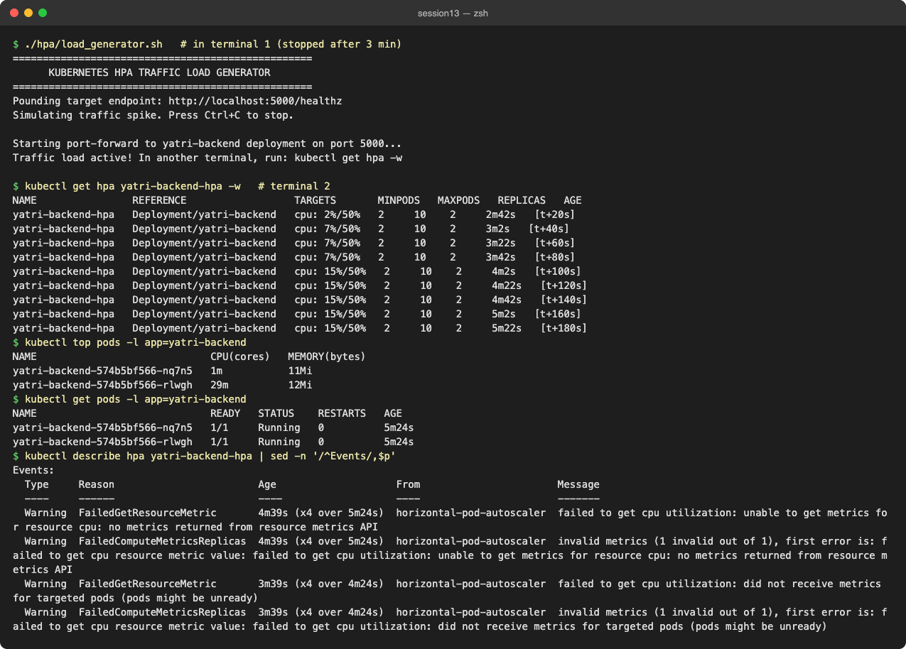

**Finding:** the HPA never scaled. CPU peaked at 15% because `kubectl port-forward svc/yatri-backend-service` does **not** load-balance. It picks one pod behind the Service and tunnels every request to it (29m on one pod, 1m on the other), and the port-forward tunnel itself caps the request rate. Load for an HPA test has to go through the Service's ClusterIP inside the cluster, so I added [hpa/load-generator-incluster.yaml](hpa/load-generator-incluster.yaml):

```text
# port-forward load pinned one pod (29m vs 1m above). Generate the load in-cluster instead:
$ kubectl apply -f hpa/load-generator-incluster.yaml
deployment.apps/yatri-load-generator created
$ kubectl get hpa yatri-backend-hpa -w
NAME                REFERENCE                  TARGETS        MINPODS   MAXPODS   REPLICAS   AGE
yatri-backend-hpa   Deployment/yatri-backend   cpu: 15%/50%   2     10    2     5m58s   [t+20s]
yatri-backend-hpa   Deployment/yatri-backend   cpu: 20%/50%   2     10    2     6m18s   [t+40s]
yatri-backend-hpa   Deployment/yatri-backend   cpu: 20%/50%   2     10    2     6m38s   [t+60s]
yatri-backend-hpa   Deployment/yatri-backend   cpu: 20%/50%   2     10    2     6m58s   [t+80s]
yatri-backend-hpa   Deployment/yatri-backend   cpu: 289%/50%   2     10    4     7m18s   [t+100s]
yatri-backend-hpa   Deployment/yatri-backend   cpu: 289%/50%   2     10    8     7m39s   [t+120s]
yatri-backend-hpa   Deployment/yatri-backend   cpu: 289%/50%   2     10    10    7m59s   [t+140s]
yatri-backend-hpa   Deployment/yatri-backend   cpu: 273%/50%   2     10    10    8m19s   [t+160s]
yatri-backend-hpa   Deployment/yatri-backend   cpu: 273%/50%   2     10    10    8m39s   [t+180s]
yatri-backend-hpa   Deployment/yatri-backend   cpu: 273%/50%   2     10    10    8m59s   [t+200s]
yatri-backend-hpa   Deployment/yatri-backend   cpu: 207%/50%   2     10    10    9m19s   [t+220s]
yatri-backend-hpa   Deployment/yatri-backend   cpu: 207%/50%   2     10    10    9m39s   [t+240s]
$ kubectl top pods -l app=yatri-backend
NAME                             CPU(cores)   MEMORY(bytes)   
yatri-backend-574b5bf566-22ck8   207m         12Mi            
yatri-backend-574b5bf566-5bkpk   211m         12Mi            
yatri-backend-574b5bf566-nq7n5   207m         12Mi            
yatri-backend-574b5bf566-r89qc   205m         12Mi            
yatri-backend-574b5bf566-rlwgh   209m         12Mi            
yatri-backend-574b5bf566-slz92   207m         12Mi            
yatri-backend-574b5bf566-wbw27   207m         12Mi            
yatri-backend-574b5bf566-wh242   206m         12Mi            
yatri-backend-574b5bf566-wklrn   207m         12Mi            
yatri-backend-574b5bf566-xsbh9   210m         11Mi            
$ kubectl get events --field-selector involvedObject.name=yatri-backend-hpa,reason=SuccessfulRescale
LAST SEEN   TYPE     REASON              OBJECT                                      MESSAGE
2m40s       Normal   SuccessfulRescale   horizontalpodautoscaler/yatri-backend-hpa   New size: 4; reason: cpu resource utilization (percentage of request) above target
2m25s       Normal   SuccessfulRescale   horizontalpodautoscaler/yatri-backend-hpa   New size: 8; reason: cpu resource utilization (percentage of request) above target
2m10s       Normal   SuccessfulRescale   horizontalpodautoscaler/yatri-backend-hpa   New size: 10; reason: cpu resource utilization (percentage of request) above target
```

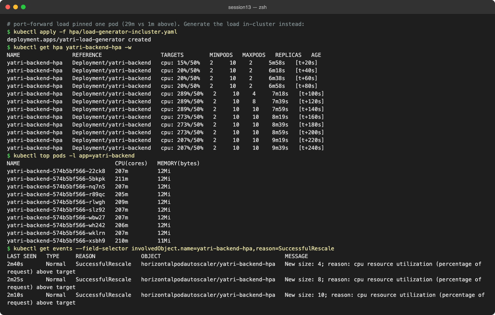

With in-cluster load every replica received traffic and the HPA went 2 → 4 → 8 → 10 (its max) in under a minute. It doubles quickly because the default scale-up policy allows +100% or +4 pods every 15 s.

### HPA through Helm (instructor's `04-hpa/demo-chart`)

The chart ships an `hpa.yaml` template that is off by default (`autoscaling.enabled: false`). Turning it on with values:

```text
$ helm install hpa-chart 04-hpa/demo-chart --set image.tag=1.27 --set autoscaling.enabled=true --set autoscaling.minReplicas=1 --set autoscaling.maxReplicas=4 --set autoscaling.targetCPUUtilizationPercentage=50 --set resources.requests.cpu=100m | head -6
NAME: hpa-chart
LAST DEPLOYED: Wed Oct  7 20:53:31 2026
NAMESPACE: default
STATUS: deployed
REVISION: 1
DESCRIPTION: Install complete
$ helm template hpa-chart 04-hpa/demo-chart --set autoscaling.enabled=true --set autoscaling.targetCPUUtilizationPercentage=50 --show-only templates/hpa.yaml
---
# Source: demo-chart/templates/hpa.yaml
apiVersion: autoscaling/v2
kind: HorizontalPodAutoscaler
metadata:
  name: hpa-chart-demo-chart
  labels:
    helm.sh/chart: demo-chart-0.1.0
    app.kubernetes.io/name: demo-chart
    app.kubernetes.io/instance: hpa-chart
    app.kubernetes.io/version: "1.16.0"
    app.kubernetes.io/managed-by: Helm
spec:
  scaleTargetRef:
    apiVersion: apps/v1
    kind: Deployment
    name: hpa-chart-demo-chart
  minReplicas: 1
  maxReplicas: 100
  metrics:
    - type: Resource
      resource:
        name: cpu
        target:
          type: Utilization
          averageUtilization: 50

$ kubectl get deploy,hpa -l app.kubernetes.io/instance=hpa-chart
NAME                                   READY   UP-TO-DATE   AVAILABLE   AGE
deployment.apps/hpa-chart-demo-chart   1/1     1            1           31s

NAME                                                       REFERENCE                         TARGETS       MINPODS   MAXPODS   REPLICAS   AGE
horizontalpodautoscaler.autoscaling/hpa-chart-demo-chart   Deployment/hpa-chart-demo-chart   cpu: 2%/50%   1         4         1          31s
$ helm uninstall hpa-chart
release "hpa-chart" uninstalled
```

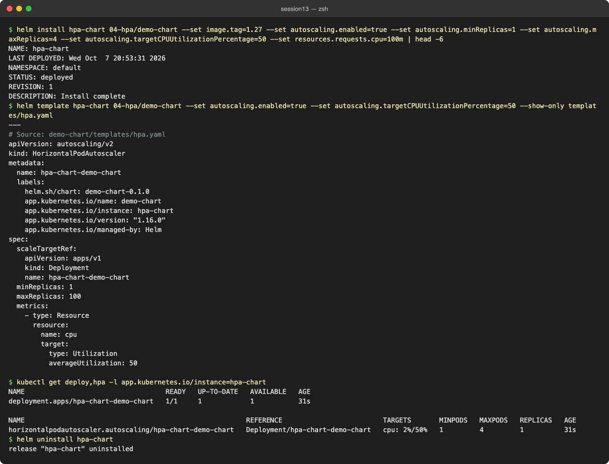

---

## Task 3: Mini Project – Production-Ready Kubernetes Web App

**Files:** [mini-project/](mini-project/) (namespace, 500Mi RWO PVC, Deployment with startup/readiness/liveness probes + CPU requests + `/data` mount, ClusterIP Service, HPA 2–5 @ 50%). Architecture is in [mini-project/README.md](mini-project/README.md).

### Deploy

```bash
cd mini-project
kubectl apply -f namespace.yaml
kubectl apply -f pvc.yaml
kubectl apply -f deployment.yaml -f service.yaml
kubectl apply -f hpa.yaml
```

```text
$ kubectl apply -f namespace.yaml
namespace/production-webapp created
$ kubectl apply -f pvc.yaml
persistentvolumeclaim/web-data created
$ kubectl get pvc -n production-webapp
NAME       STATUS   VOLUME                                     CAPACITY   ACCESS MODES   STORAGECLASS   VOLUMEATTRIBUTESCLASS   AGE
web-data   Bound    pvc-d732c7eb-f16a-47c8-93e2-e105e8220fcd   500Mi      RWO            standard       <unset>                 3s
$ kubectl apply -f deployment.yaml -f service.yaml
deployment.apps/web-app created
service/web-service created
$ kubectl get pods -n production-webapp -o wide
NAME                      READY   STATUS    RESTARTS   AGE   IP            NODE       NOMINATED NODE   READINESS GATES
web-app-d45775485-n7gdn   1/1     Running   0          9s    10.244.0.39   minikube   <none>           <none>
web-app-d45775485-q52w4   1/1     Running   0          9s    10.244.0.40   minikube   <none>           <none>
$ kubectl apply -f hpa.yaml
horizontalpodautoscaler.autoscaling/web-app-hpa created
$ kubectl get deploy,svc,hpa,pvc -n production-webapp
NAME                      READY   UP-TO-DATE   AVAILABLE   AGE
deployment.apps/web-app   2/2     2            2           116s

NAME                  TYPE        CLUSTER-IP      EXTERNAL-IP   PORT(S)   AGE
service/web-service   ClusterIP   10.104.99.155   <none>        80/TCP    116s

NAME                                              REFERENCE            TARGETS       MINPODS   MAXPODS   REPLICAS   AGE
horizontalpodautoscaler.autoscaling/web-app-hpa   Deployment/web-app   cpu: 1%/50%   2         5         2          106s

NAME                             STATUS   VOLUME                                     CAPACITY   ACCESS MODES   STORAGECLASS   VOLUMEATTRIBUTESCLASS   AGE
persistentvolumeclaim/web-data   Bound    pvc-d732c7eb-f16a-47c8-93e2-e105e8220fcd   500Mi      RWO            standard       <unset>                 119s
```

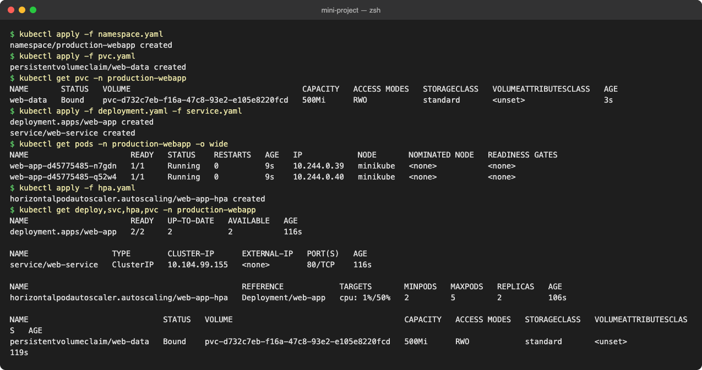

### Verification Task 1: Storage persistence

```text
$ POD_NAME=$(kubectl get pods -n production-webapp -l app=web-app -o jsonpath='{.items[0].metadata.name}'); echo $POD_NAME
web-app-d45775485-n7gdn
$ kubectl exec -n production-webapp web-app-d45775485-n7gdn -- sh -c 'echo "Student: Pranay Reddy" > /data/student.txt'
$ kubectl exec -n production-webapp web-app-d45775485-n7gdn -- cat /data/student.txt
Student: Pranay Reddy
$ kubectl delete pod -n production-webapp web-app-d45775485-n7gdn
pod "web-app-d45775485-n7gdn" deleted from production-webapp namespace
$ kubectl get pods -n production-webapp
NAME                      READY   STATUS    RESTARTS   AGE
web-app-d45775485-q52w4   1/1     Running   0          2m18s
web-app-d45775485-qct8k   1/1     Running   0          9s
# newest (replacement) pod: web-app-d45775485-qct8k
$ kubectl exec -n production-webapp web-app-d45775485-qct8k -- cat /data/student.txt
Student: Pranay Reddy

# After the HPA test and both bonus rollouts (Recreate strategy, all pods replaced):
$ kubectl exec -n production-webapp web-app-d45775485-mzgb8 -- cat /data/student.txt
Student: Pranay Reddy
```

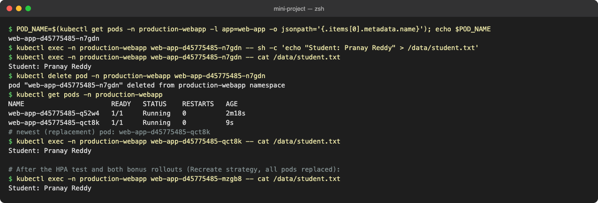

The file written through one pod is read back from the replacement pod and, at the end, from pods created by three later rollouts. Both replicas mount the same RWO volume because they run on the same (single) node; RWO limits a volume to one **node**, not one pod.

### Verification Task 2: Service

```text
$ kubectl port-forward -n production-webapp svc/web-service 8080:80 &
Forwarding from 127.0.0.1:8080 -> 80
$ curl -s http://localhost:8080 | head -8
<!DOCTYPE html>
<html>
<head>
<title>Welcome to nginx!</title>
<style>
html { color-scheme: light dark; }
body { width: 35em; margin: 0 auto;
font-family: Tahoma, Verdana, Arial, sans-serif; }
$ curl -s -o /dev/null -w 'HTTP %{http_code}\n' http://localhost:8080
HTTP 200
$ kubectl get endpoints web-service -n production-webapp
Warning: v1 Endpoints is deprecated in v1.33+; use discovery.k8s.io/v1 EndpointSlice
NAME          ENDPOINTS                       AGE
web-service   10.244.0.40:80,10.244.0.41:80   2m23s
```

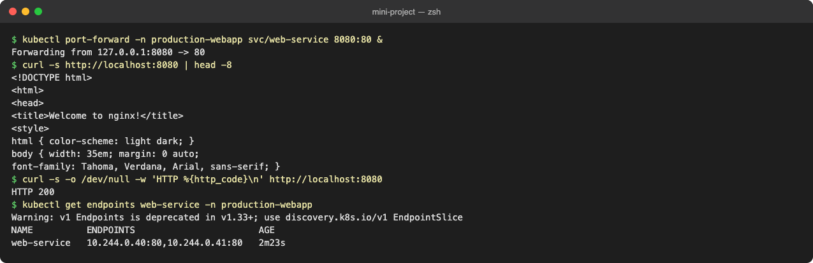

### Verification Task 3: HPA elastic scaling (+ Bonus challenge 1)

```text
$ kubectl run load-generator -n production-webapp --image=busybox:1.36 --restart=Never -- /bin/sh -c 'while true; do wget -q -O- http://web-service; done'
pod/load-generator created
$ kubectl get hpa -n production-webapp -w
NAME          REFERENCE            TARGETS       MINPODS   MAXPODS   REPLICAS   AGE
web-app-hpa   Deployment/web-app   cpu: 7%/50%   2     5     2     2m45s   [t+20s]
web-app-hpa   Deployment/web-app   cpu: 7%/50%   2     5     2     3m5s   [t+40s]
web-app-hpa   Deployment/web-app   cpu: 7%/50%   2     5     2     3m26s   [t+60s]
web-app-hpa   Deployment/web-app   cpu: 42%/50%   2     5     2     3m46s   [t+80s]
web-app-hpa   Deployment/web-app   cpu: 42%/50%   2     5     2     4m6s   [t+100s]
web-app-hpa   Deployment/web-app   cpu: 42%/50%   2     5     2     4m26s   [t+120s]
web-app-hpa   Deployment/web-app   cpu: 42%/50%   2     5     2     4m46s   [t+140s]
web-app-hpa   Deployment/web-app   cpu: 42%/50%   2     5     2     5m6s   [t+160s]
web-app-hpa   Deployment/web-app   cpu: 42%/50%   2     5     2     5m26s   [t+180s]
web-app-hpa   Deployment/web-app   cpu: 42%/50%   2     5     2     5m47s   [t+200s]

# Bonus challenge 1: lower the target from 50% to 30% while the same load is running
$ kubectl patch hpa web-app-hpa -n production-webapp --type=json -p '[{"op":"replace","path":"/spec/metrics/0/resource/target/averageUtilization","value":30}]'
horizontalpodautoscaler.autoscaling/web-app-hpa patched
web-app-hpa   Deployment/web-app   cpu: 42%/30%   2     5     3     6m7s   [t+220s]
web-app-hpa   Deployment/web-app   cpu: 42%/30%   2     5     3     6m27s   [t+240s]
web-app-hpa   Deployment/web-app   cpu: 34%/30%   2     5     3     6m47s   [t+260s]
web-app-hpa   Deployment/web-app   cpu: 34%/30%   2     5     3     7m7s   [t+280s]
web-app-hpa   Deployment/web-app   cpu: 34%/30%   2     5     3     7m27s   [t+300s]
web-app-hpa   Deployment/web-app   cpu: 28%/30%   2     5     3     7m47s   [t+320s]
$ kubectl top pods -n production-webapp
NAME                      CPU(cores)   MEMORY(bytes)   
load-generator            822m         7Mi             
web-app-d45775485-hlgms   28m          10Mi            
web-app-d45775485-q52w4   28m          9Mi             
web-app-d45775485-qct8k   28m          9Mi             
$ kubectl get events -n production-webapp --field-selector reason=SuccessfulRescale
LAST SEEN   TYPE     REASON              OBJECT                                MESSAGE
2m          Normal   SuccessfulRescale   horizontalpodautoscaler/web-app-hpa   New size: 3; reason: cpu resource utilization (percentage of request) above target
```

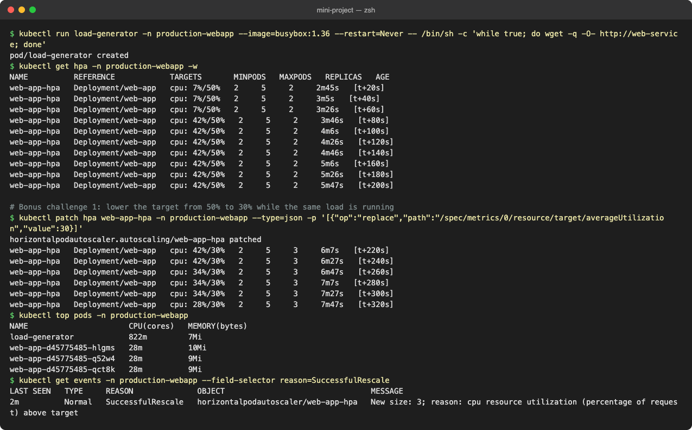

**Observation:** a single busybox generator spread across 2 pods held utilization at 42%, under the 50% target, so the HPA correctly did nothing. For Bonus challenge 1 I lowered the target to 30% while the load was still running. 42% > 30%, so it scaled to 3 at once, and 3 pods brought utilization to 28–34%, around the new target. The load generator itself used 822m CPU, which shows the client, not nginx, was the bottleneck. I re-applied `hpa.yaml` (back to 50%) afterwards.

### Probes

```text
$ kubectl apply -f 05-probes/startup.yaml -f 05-probes/readiness.yaml -f 05-probes/liveness.yaml
pod/startup-demo created
pod/readiness-demo created
pod/liveness-demo created
$ kubectl get pods startup-demo readiness-demo liveness-demo
NAME             READY   STATUS    RESTARTS   AGE
startup-demo     1/1     Running   0          6s
readiness-demo   1/1     Running   0          6s
liveness-demo    1/1     Running   0          6s
$ kubectl describe pod startup-demo | grep -E 'Liveness|Readiness|Startup'
    Liveness:       http-get http://:80/ delay=0s timeout=1s period=5s successThreshold=1 failureThreshold=3
    Readiness:      http-get http://:80/ delay=0s timeout=1s period=5s successThreshold=1 failureThreshold=3
    Startup:        http-get http://:80/ delay=0s timeout=1s period=2s successThreshold=1 failureThreshold=30
$ kubectl describe pod -n production-webapp web-app-d45775485-hlgms | grep -E 'Liveness|Readiness|Startup|Mounts|/data|ClaimName'
    Liveness:     http-get http://:80/ delay=5s timeout=2s period=5s successThreshold=1 failureThreshold=3
    Readiness:    http-get http://:80/ delay=5s timeout=2s period=5s successThreshold=1 failureThreshold=2
    Startup:      http-get http://:80/ delay=0s timeout=1s period=2s successThreshold=1 failureThreshold=30
    Mounts:
      /data from persistent-storage (rw)
    ClaimName:  web-data
```

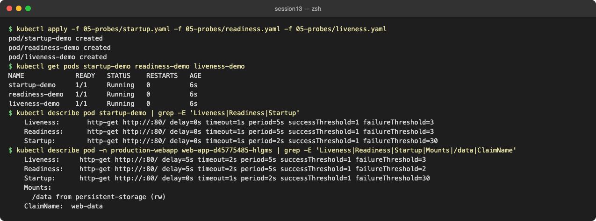

| Probe | Question | On failure | Mini project settings |
| :--- | :--- | :--- | :--- |
| Startup | has the app finished starting? | container restarted; liveness/readiness are paused until it passes | `GET /` every 2s, 30 failures allowed (60 s budget) |
| Readiness | can it take traffic now? | pod IP removed from Service endpoints, **no restart** | `GET /` every 5s after 5s, 2 failures |
| Liveness | is it still healthy? | kubelet kills and restarts the container | `GET /` every 5s after 5s, 3 failures |

### Bonus challenge 2: Readiness gating

```text
# Bonus challenge 2: readinessProbe path -> /does-not-exist
$ kubectl patch deployment web-app -n production-webapp --type=json -p '[{"op":"replace","path":"/spec/template/spec/containers/0/readinessProbe/httpGet/path","value":"/does-not-exist"}]'
deployment.apps/web-app patched
$ kubectl get pods -n production-webapp -l app=web-app
NAME                       READY   STATUS    RESTARTS   AGE
web-app-5945bfc776-76d6z   0/1     Running   0          53s
web-app-5945bfc776-k6hbq   0/1     Running   0          53s
web-app-5945bfc776-rfwk7   0/1     Running   0          53s
$ kubectl get endpoints web-service -n production-webapp 2>/dev/null
NAME          ENDPOINTS   AGE
web-service               9m44s
$ kubectl get endpointslices -n production-webapp -l kubernetes.io/service-name=web-service -o jsonpath='{range .items[*].endpoints[*]}{.addresses[0]}  ready={.conditions.ready}{"\n"}{end}'
10.244.0.49  ready=false
10.244.0.47  ready=false
10.244.0.48  ready=false
$ kubectl get events -n production-webapp --field-selector involvedObject.name=web-app-5945bfc776-76d6z,reason=Unhealthy | tail -2
LAST SEEN   TYPE      REASON      OBJECT                         MESSAGE
4s          Warning   Unhealthy   pod/web-app-5945bfc776-76d6z   Readiness probe failed: HTTP probe failed with statuscode: 404
$ kubectl run curl-test -n production-webapp --rm -i --restart=Never --image=busybox:1.36 -q -- wget -T 3 -qO- http://web-service 2>&1 | head -2
wget: can't connect to remote host (10.104.99.155): Connection refused
pod production-webapp/curl-test terminated (Error)
```

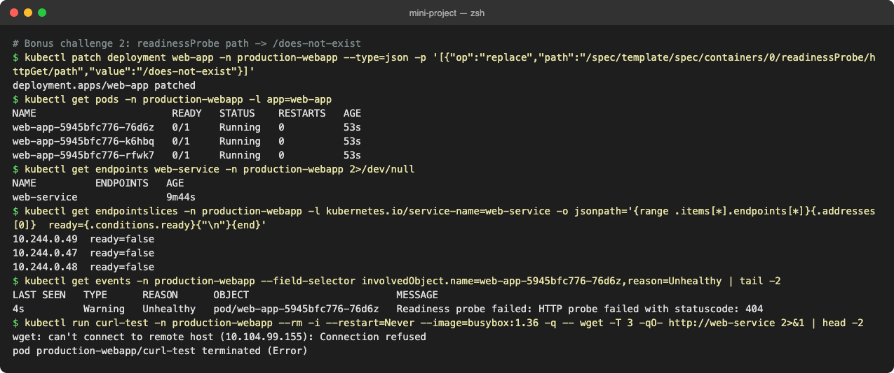

All pods are `Running` but `0/1` ready, the Service has no ready endpoints (the EndpointSlice keeps the IPs but marks them `ready=false`), and a request to the Service is refused. Nothing restarts, because readiness never kills a container.

### Bonus challenge 3: Liveness restart loop

```text
# Bonus challenge 3: livenessProbe path -> /crash (readiness restored to /)
$ kubectl patch deployment web-app -n production-webapp --type=json -p '[{"op":"replace","path":"/spec/template/spec/containers/0/livenessProbe/httpGet/path","value":"/crash"}]'
deployment.apps/web-app patched
$ kubectl get pods -n production-webapp -l app=web-app -w
NAME                      READY   STATUS        RESTARTS   AGE
web-app-85d86b65d-jdk4q   1/1   Running   0     15s   [t+15s]
web-app-85d86b65d-jdk4q   1/1   Running   1 (15s ago)   30s   [t+30s]
web-app-85d86b65d-jdk4q   0/1   Running   3 (0s ago)   45s   [t+45s]
web-app-85d86b65d-jdk4q   1/1   Running   3 (15s ago)   60s   [t+60s]
web-app-85d86b65d-jdk4q   0/1   CrashLoopBackOff   3 (16s ago)   76s   [t+75s]
web-app-85d86b65d-jdk4q   0/1   Running   4 (31s ago)   91s   [t+90s]
web-app-85d86b65d-jdk4q   0/1   Running   5 (6s ago)   106s   [t+105s]
$ kubectl get events -n production-webapp --field-selector involvedObject.name=web-app-85d86b65d-jdk4q --sort-by=.lastTimestamp | grep -E 'Unhealthy|Killing' | tail -3
6s          Normal    Killing     pod/web-app-85d86b65d-jdk4q   Container nginx failed liveness probe, will be restarted
1s          Warning   Unhealthy   pod/web-app-85d86b65d-jdk4q   Liveness probe failed: HTTP probe failed with statuscode: 404
# Restore the original manifest:
$ kubectl apply -f deployment.yaml && kubectl rollout status deploy/web-app -n production-webapp --timeout=180s
deployment.apps/web-app configured
Waiting for deployment "web-app" rollout to finish: 0 out of 2 new replicas have been updated...
Waiting for deployment "web-app" rollout to finish: 0 out of 2 new replicas have been updated...
Waiting for deployment "web-app" rollout to finish: 0 out of 2 new replicas have been updated...
Waiting for deployment "web-app" rollout to finish: 0 out of 2 new replicas have been updated...
Waiting for deployment "web-app" rollout to finish: 0 of 2 updated replicas are available...
Waiting for deployment "web-app" rollout to finish: 1 of 2 updated replicas are available...
deployment "web-app" successfully rolled out
$ kubectl get pods -n production-webapp -l app=web-app
NAME                      READY   STATUS    RESTARTS   AGE
web-app-d45775485-mzgb8   1/1     Running   0          9s
web-app-d45775485-z69mx   1/1     Running   0          9s
```

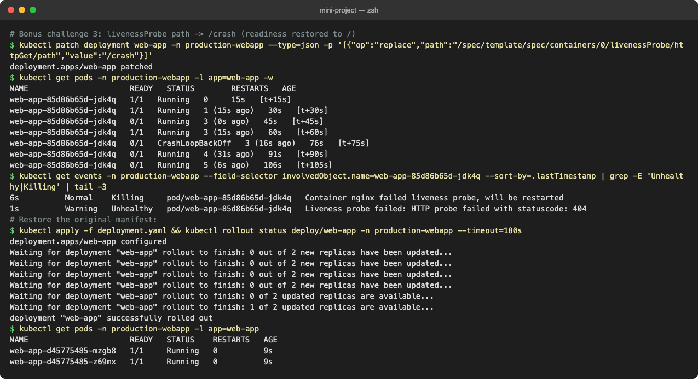

`/crash` returns 404, so after 3 failed checks (about 15 s) the kubelet restarts nginx. The restart count climbs and the pod enters `CrashLoopBackOff` (exponential back-off between restarts). Re-applying the original manifest fixed it.

### Troubleshooting notes from this session

| Symptom | Cause | Fix |
| :--- | :--- | :--- |
| PVC bound to a new `pvc-...` volume instead of `student-pv` | default StorageClass injected into the claim | `storageClassName: ""` on the PVC |
| HPA `TARGETS <unknown>` for ~1–2 min | metrics-server has no sample yet / pod inside the readiness initialization window | wait; check `kubectl top pods` and `kubectl describe hpa` |
| HPA never scales with `load_generator.sh` | `port-forward` pins one pod and throttles traffic | generate load in-cluster against the Service |
| Replicas stay high after load stops | 5-minute scale-down stabilization window | expected; tune `behavior.scaleDown.stabilizationWindowSeconds` |
| minikube would not start (`kubelet.conf` missing) | corrupted old cluster | `minikube delete && minikube start --addons=metrics-server` |

## Cleanup

```bash
kubectl delete namespace production-webapp
kubectl delete -f 04-hpa/ -f hpa/
```
