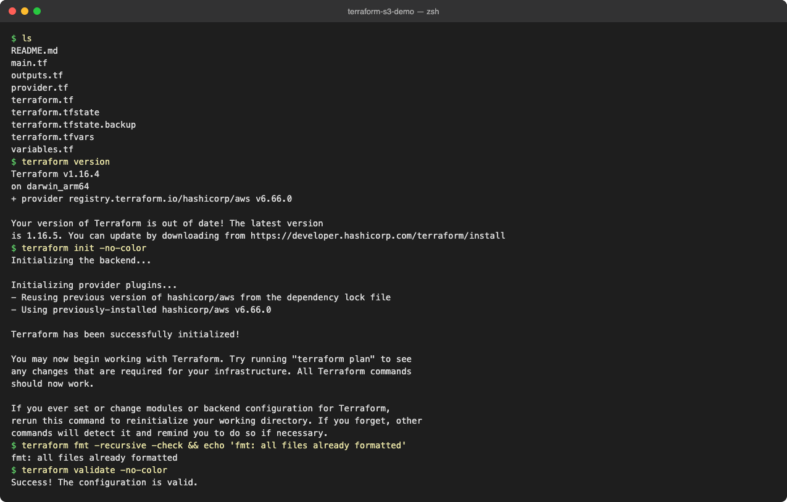
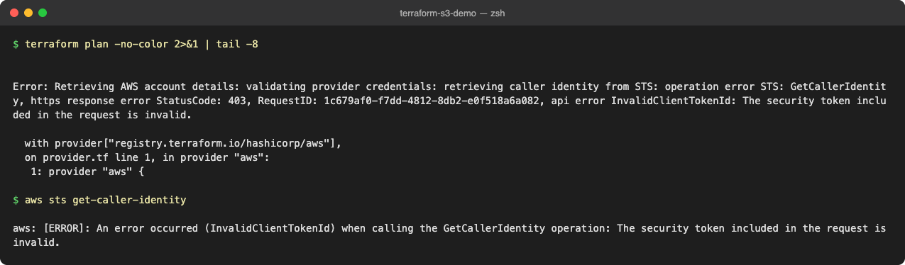
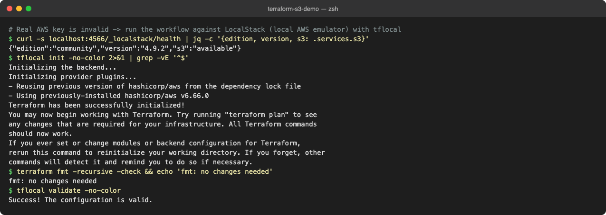
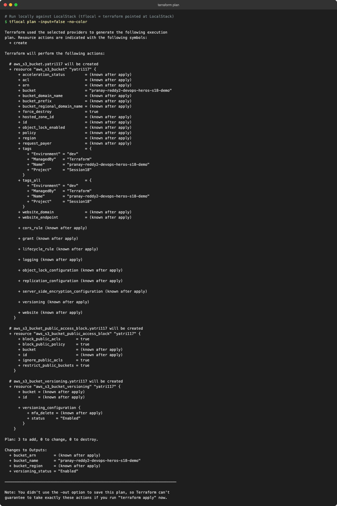
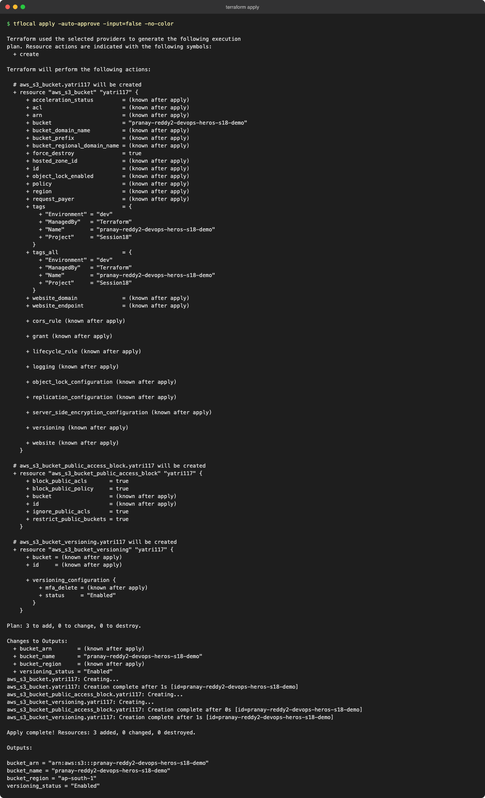
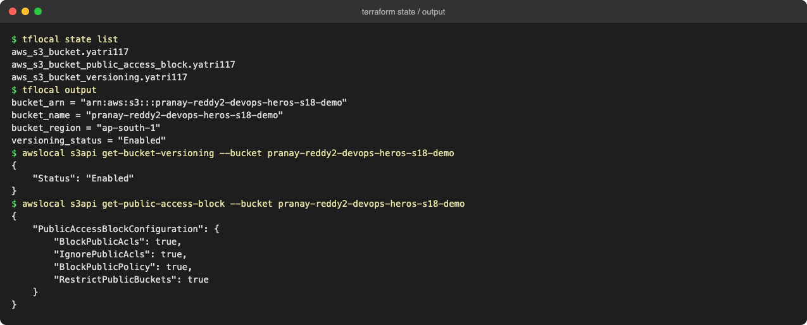
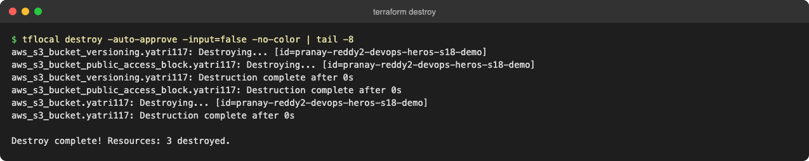

# Session 18 – Terraform & Infrastructure as Code

The instructor's notes are in [instructor-notes.md](instructor-notes.md). The concept folders `01`–`09` and the [AWS services notes](aws-services/README.md) (IAM, EC2, VPC, S3, DynamoDB/RDS) cover the theory.

## Hands-on: `terraform-s3-demo`

This demo creates an S3 bucket with versioning enabled and all public access blocked.

| File | Purpose |
|---|---|
| `terraform.tf` | Terraform and AWS provider version constraints |
| `provider.tf` | AWS provider (region from a variable) |
| `variables.tf` / `terraform.tfvars` | Region, bucket name and tags |
| `main.tf` | `aws_s3_bucket`, `aws_s3_bucket_versioning`, `aws_s3_bucket_public_access_block` |
| `outputs.tf` | Bucket name, ARN, region and versioning status |

### Workflow

```bash
cd terraform-s3-demo
terraform init
terraform fmt -check
terraform validate
terraform plan
terraform apply
terraform state list
terraform output
terraform destroy
```

The commands were run locally against **LocalStack**, an AWS emulator (`tflocal` is a wrapper that points Terraform at LocalStack), so no real AWS account was needed. With real AWS credentials the same commands work with `terraform`.

> Note: LocalStack community edition doesn't support an S3 Control tagging call that AWS provider v6 makes. For the local run only, a temporary `*_override.tf` pinned the provider to `~> 5.0`. That file is not committed.

### 1. `init`, `fmt`, `validate`


### 2. `plan` against real AWS without valid credentials (fails as expected)


### 3. `tflocal init`, `fmt`, `validate`


### 4. `plan`


### 5. `apply`


### 6. State, outputs, and verifying versioning and the public access block


### 7. `destroy`

