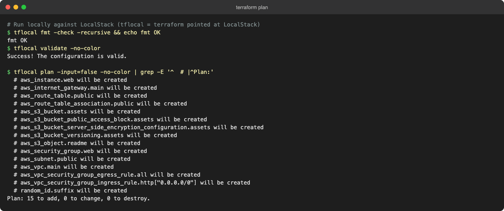
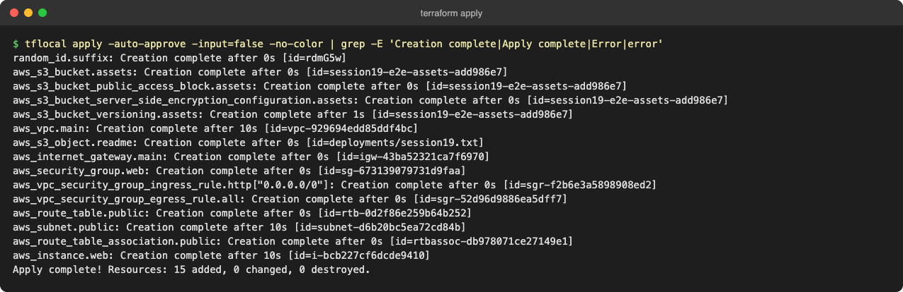
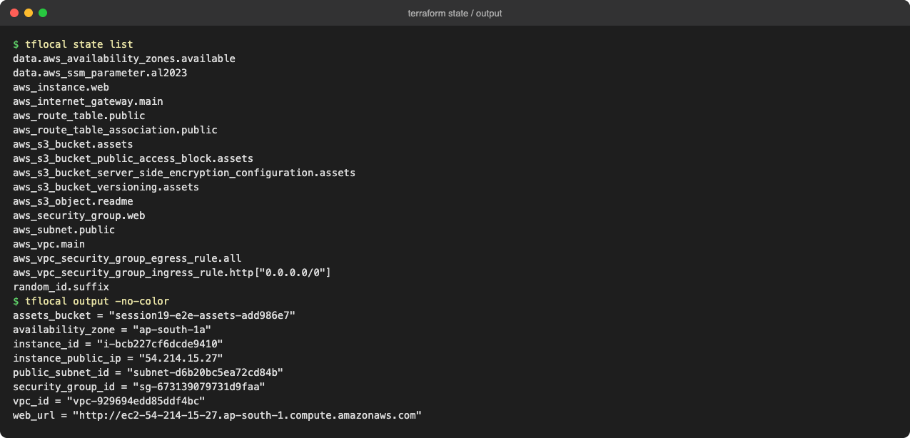
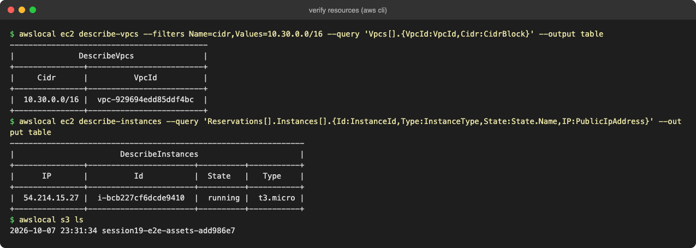
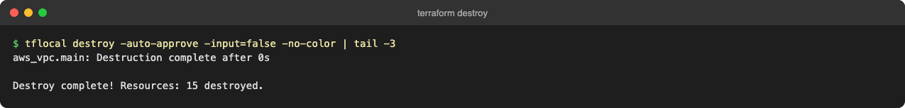

# Session 19 – Cloud Fundamentals with Terraform

Concept folders `01`–`08` cover cloud service models, regions and availability zones, VPCs and subnets, route tables and internet gateways, security groups, and the Terraform workflow.

## Hands-on: `09-end-to-end-project`

Terraform builds a complete public web tier on AWS:

```
                 Internet
                    │
            Internet Gateway
                    │
┌──────────── VPC 10.30.0.0/16 ─────────────┐
│  Public subnet ── route table (0.0.0.0/0 → IGW)
│     └── EC2 t3.micro (Amazon Linux 2023, nginx via user_data)
│           Security group: HTTP 80 in, all out
└────────────────────────────────────────────┘
S3 bucket (random suffix): versioning + SSE-AES256 + public access block
```

| File | Purpose |
|---|---|
| `versions.tf` | Provider versions and `default_tags` |
| `variables.tf` / `terraform.tfvars` | Region, CIDRs, instance type, project name |
| `network.tf` | VPC, public subnet, IGW, route table, security group and rules |
| `compute.tf` | EC2 instance (AMI from SSM, IMDSv2, encrypted gp3, `user_data`) |
| `user-data.sh.tftpl` | nginx bootstrap template |
| `storage.tf` | S3 bucket and an uploaded object |
| `outputs.tf` | VPC, subnet, SG, instance ID, IP and URL, bucket |

### Workflow

```bash
cd 09-end-to-end-project
terraform init
terraform fmt -check && terraform validate
terraform plan
terraform apply
terraform state list && terraform output
terraform destroy
```

The commands were run locally against **LocalStack**, an AWS emulator (`tflocal`/`awslocal` point Terraform and the AWS CLI at LocalStack), so no real AWS account or cost was involved. EC2 is simulated in LocalStack community edition. For the local run only, a temporary uncommitted `*_override.tf` pinned the AWS provider to `~> 5.0`.

### 1. `fmt`, `validate`, `plan` (15 resources)


### 2. `apply`


### 3. State and outputs


### 4. Verify with the AWS CLI (VPC, EC2, S3)


### 5. `destroy`

