# Session 20: Monitoring, Observability & GitOps

**Author:** Pranay Reddy
**Course:** SST DevOps & Cloud [SWE]
**Session:** 20
**Environment:** macOS (arm64), minikube v1.39.0 / Kubernetes v1.37.0, Helm 4.3, kube-prometheus-stack 92.1.0 (Prometheus v3.15, Alertmanager v0.34, Grafana 13.2), Argo CD v3.5.4, Gitea 1.24

Terminal screenshots are rendered from captured command output; **browser screenshots (Grafana, Prometheus, Alertmanager, Argo CD, Gitea) are real screenshots of the running UIs** taken with headless Chrome.

| Task | What | Where |
| :--- | :--- | :--- |
| 1 | Monitoring demo: metrics, logs, alerts, CPU, memory, application health | [Task 1](#task-1-monitoring), files in [09-monitoring-demo/](09-monitoring-demo/) |
| 2 | Observability: metrics / logs / traces, why, tools, Kubernetes observability | [observability/README.md](observability/README.md) |
| 3 | GitOps: Git as source of truth, declarative config, continuous reconciliation, workflow, Kubernetes + GitOps | [gitops/README.md](gitops/README.md) (concepts) + [Task 3](#task-3-gitops) (demo), files in [10-gitops-demo/](10-gitops-demo/) |

---

## Task 1: Monitoring

### Architecture

```text
            ┌──────────────── namespace demo ────────────────┐
 traffic ──►│ podinfo x2  /metrics  /healthz  JSON logs       │
 (busybox)  └──────┬───────────────────────────┬────────────┘
                   │ ServiceMonitor (15s)       │ stdout
                   ▼                            ▼
 ┌──────────── namespace monitoring (kube-prometheus-stack) ─────────────┐
 │ Prometheus ◄── node-exporter (node CPU/mem), kube-state-metrics,       │
 │     │          kubelet/cAdvisor (container CPU/mem)                     │
 │     ├── PrometheusRule podinfo-alerts ──► Alertmanager                  │
 │     └──────────────────────────────────► Grafana (dashboards)          │
 └────────────────────────────────────────────────────────────────────────┘
```

Files: [kps-values.yaml](09-monitoring-demo/kps-values.yaml) (Helm values), [podinfo.yaml](09-monitoring-demo/podinfo.yaml) (app + Service + ServiceMonitor), [traffic.yaml](09-monitoring-demo/traffic.yaml), [alerts.yaml](09-monitoring-demo/alerts.yaml) (PrometheusRule), [podinfo-dashboard.json](09-monitoring-demo/podinfo-dashboard.json) / [grafana-dashboard.yaml](09-monitoring-demo/grafana-dashboard.yaml) (dashboard as code).

```bash
helm upgrade --install kps prometheus-community/kube-prometheus-stack --version 92.1.0 \
  -n monitoring --create-namespace -f 09-monitoring-demo/kps-values.yaml --wait
kubectl apply -f 09-monitoring-demo/podinfo.yaml -f 09-monitoring-demo/alerts.yaml \
              -f 09-monitoring-demo/traffic.yaml -f 09-monitoring-demo/grafana-dashboard.yaml
kubectl -n monitoring port-forward svc/kps-grafana 3000:80          # admin / admin (lab)
kubectl -n monitoring port-forward svc/kps-kube-prometheus-stack-prometheus 9090:9090
kubectl -n monitoring port-forward svc/kps-kube-prometheus-stack-alertmanager 9093:9093
```

```text
$ helm list -n monitoring
NAME	NAMESPACE 	REVISION	UPDATED                             	STATUS  	CHART                       	APP VERSION
kps 	monitoring	1       	2026-10-07 22:19:18.375813 +0530 IST	deployed	kube-prometheus-stack-92.1.0	v0.94.1    
$ kubectl get pods -n monitoring
NAME                                                    READY   STATUS    RESTARTS   AGE
alertmanager-kps-kube-prometheus-stack-alertmanager-0   2/2     Running   0          61s
kps-grafana-77c7786b54-psrfv                            3/3     Running   0          114s
kps-kube-prometheus-stack-operator-66d869554d-hncjz     1/1     Running   0          114s
kps-kube-state-metrics-747b7b996-g6k9x                  1/1     Running   0          114s
kps-prometheus-node-exporter-gfhs7                      1/1     Running   0          114s
prometheus-kps-kube-prometheus-stack-prometheus-0       2/2     Running   0          61s
$ kubectl get svc -n monitoring
NAME                                     TYPE        CLUSTER-IP       EXTERNAL-IP   PORT(S)                      AGE
alertmanager-operated                    ClusterIP   None             <none>        9093/TCP,9094/TCP,9094/UDP   61s
kps-grafana                              ClusterIP   10.107.77.173    <none>        80/TCP                       114s
kps-kube-prometheus-stack-alertmanager   ClusterIP   10.100.173.2     <none>        9093/TCP,8080/TCP            114s
kps-kube-prometheus-stack-operator       ClusterIP   10.99.162.201    <none>        443/TCP                      114s
kps-kube-prometheus-stack-prometheus     ClusterIP   10.99.122.61     <none>        9090/TCP,8080/TCP            114s
kps-kube-state-metrics                   ClusterIP   10.104.134.207   <none>        8080/TCP                     114s
kps-prometheus-node-exporter             ClusterIP   10.101.171.134   <none>        9100/TCP                     114s
prometheus-operated                      ClusterIP   None             <none>        9090/TCP                     61s
$ kubectl apply -f podinfo.yaml -f alerts.yaml
namespace/demo created
deployment.apps/podinfo created
service/podinfo created
servicemonitor.monitoring.coreos.com/podinfo created
prometheusrule.monitoring.coreos.com/podinfo-alerts created
$ kubectl get deploy,pods,svc,servicemonitor,prometheusrule -n demo
NAME                      READY   UP-TO-DATE   AVAILABLE   AGE
deployment.apps/podinfo   2/2     2            2           17s

NAME                           READY   STATUS    RESTARTS   AGE
pod/podinfo-6547b8f795-vl4sg   1/1     Running   0          17s
pod/podinfo-6547b8f795-wbnbp   1/1     Running   0          17s

NAME              TYPE        CLUSTER-IP      EXTERNAL-IP   PORT(S)    AGE
service/podinfo   ClusterIP   10.108.144.45   <none>        9898/TCP   17s

NAME                                           AGE
servicemonitor.monitoring.coreos.com/podinfo   17s

NAME                                                  AGE
prometheusrule.monitoring.coreos.com/podinfo-alerts   17s
```

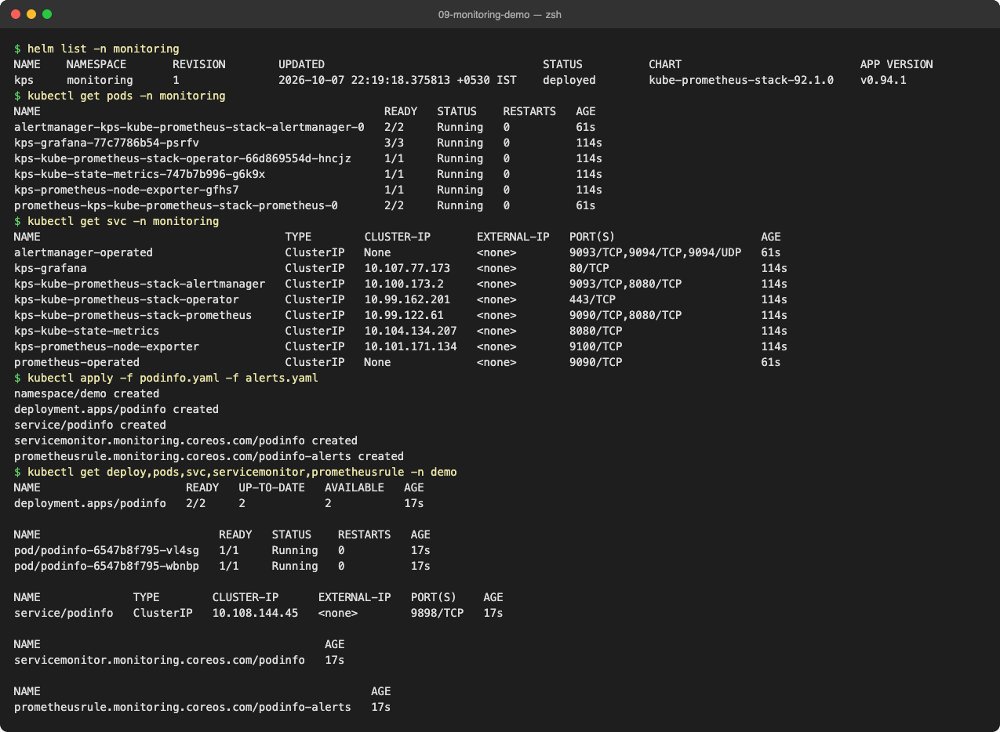

### Metrics, CPU utilization, memory utilization, application health

```text
# METRICS - raw Prometheus exposition format from the app
$ kubectl -n demo exec deploy/traffic -- wget -qO- http://podinfo.demo:9898/metrics | grep -E '^http_requests_total|^process_resident_memory_bytes'
http_requests_total{status="200"} 390
http_requests_total{status="500"} 356
process_resident_memory_bytes 4.6891008e+07
# METRICS - PromQL (promq = tiny wrapper around Prometheus /api/v1/query)
$ promq 'sum by (status) (rate(http_requests_total{namespace="demo"}[1m]))'
{status="200"}  10.16
{status="500"}  9.889
$ promq 'histogram_quantile(0.95, sum by (le) (rate(http_request_duration_seconds_bucket{namespace="demo"}[2m])))'
{}  0.00475
# CPU UTILIZATION (cores) and MEMORY UTILIZATION (MiB) per pod, from cAdvisor
$ promq 'sum by (pod) (rate(container_cpu_usage_seconds_total{namespace="demo",container!=""}[2m]))'
{pod="podinfo-6547b8f795-vl4sg"}  0.00151
{pod="podinfo-6547b8f795-wbnbp"}  0.001151
{pod="traffic-7ccfc67b48-xhbx8"}  0.01723
{pod="traffic-7ccfc67b48-m52gc"}  0.01765
{pod="podinfo-5f85df8bb6-7qc8l"}  0.003345
{pod="podinfo-5f85df8bb6-w4pvz"}  0.003319
$ promq 'sum by (pod) (container_memory_working_set_bytes{namespace="demo",container!=""}) / 1024 / 1024'
{pod="traffic-7ccfc67b48-xhbx8"}  1.023
{pod="traffic-7ccfc67b48-m52gc"}  1.445
{pod="podinfo-5f85df8bb6-7qc8l"}  19.99
{pod="podinfo-5f85df8bb6-w4pvz"}  20.7
$ promq '100 * (1 - avg(rate(node_cpu_seconds_total{mode="idle"}[2m])))'
{}  4.23
$ kubectl top pods -n demo
NAME                       CPU(cores)   MEMORY(bytes)   
podinfo-5f85df8bb6-7qc8l   5m           19Mi            
podinfo-5f85df8bb6-w4pvz   6m           20Mi            
traffic-7ccfc67b48-m52gc   18m          1Mi             
traffic-7ccfc67b48-xhbx8   18m          1Mi             
# APPLICATION HEALTH - probe endpoints + the up metric
$ kubectl -n demo exec deploy/traffic -- wget -qO- http://podinfo.demo:9898/healthz; echo
{
  "status": "OK"
}
$ promq 'up{namespace="demo"}'
{container="podinfo",job="podinfo",namespace="demo",pod="podinfo-5f85df8bb6-w4pvz"}  1
{container="podinfo",job="podinfo",namespace="demo",pod="podinfo-5f85df8bb6-7qc8l"}  1
```

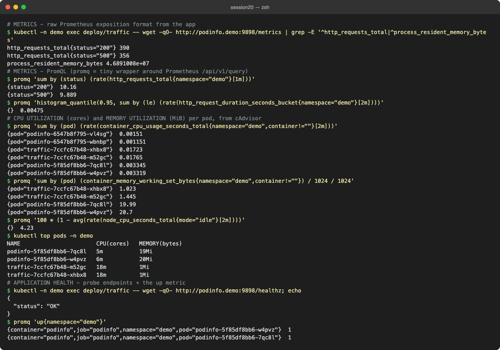

The traffic generator calls `/` and `/status/500` alternately, so the ~50% 5xx ratio is intentional: it gives the error-rate panel and queries something real to show.

**Prometheus scraping the app** (both pods UP via the ServiceMonitor) and a PromQL graph:

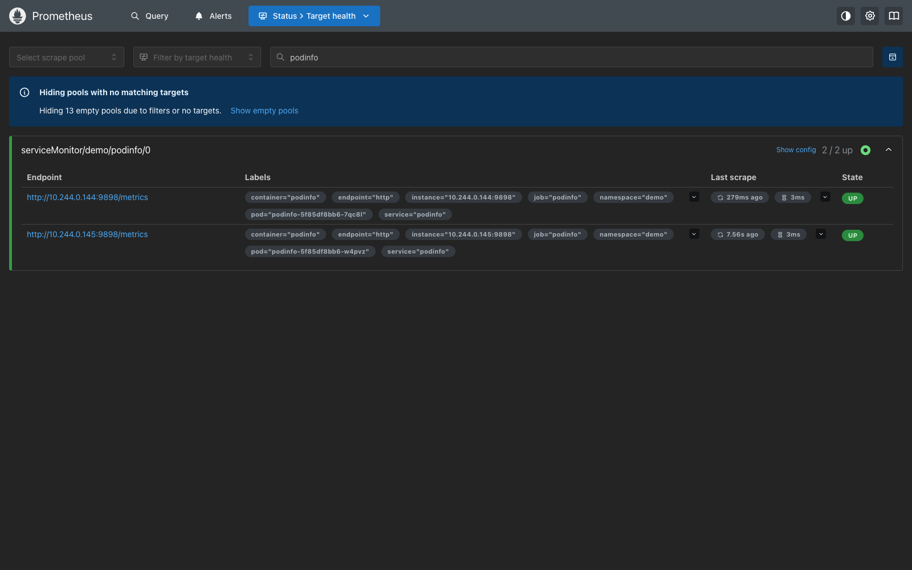

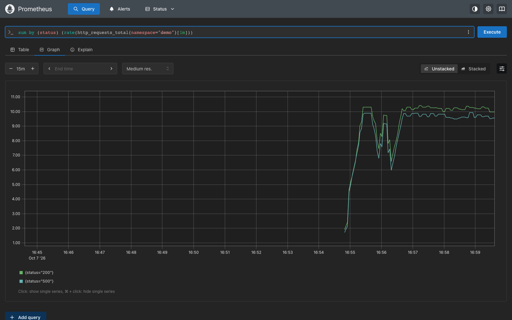

**Grafana: my dashboard** (RED: rate, errors, duration + CPU and memory per pod):

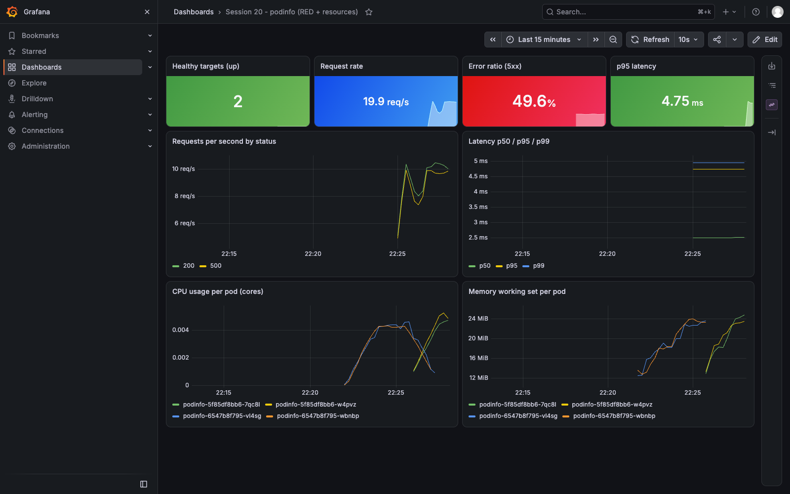

**Grafana: built-in "Kubernetes / Compute Resources / Namespace (Pods)"** for `demo` (CPU/memory vs requests and limits):

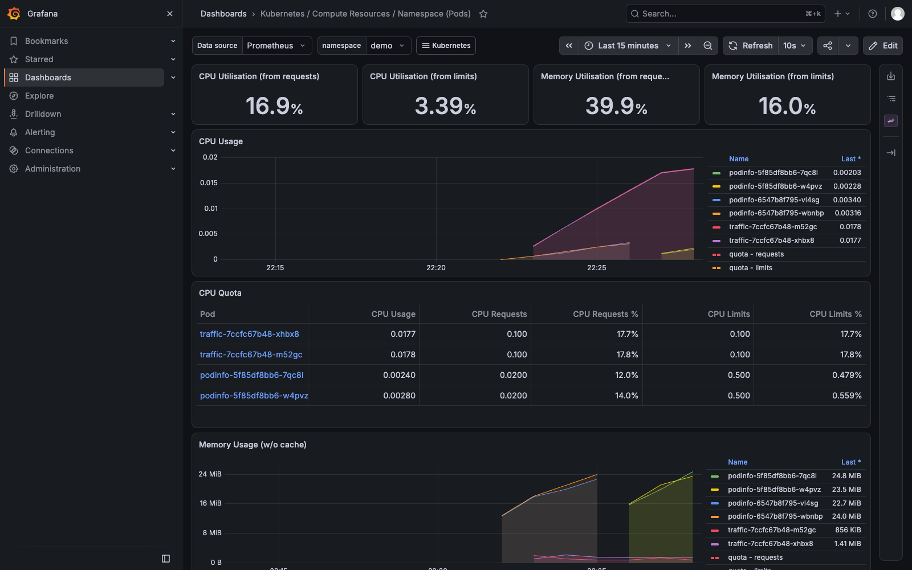

**Grafana: "Node Exporter / Nodes"** (node CPU, load, memory, disk, network):

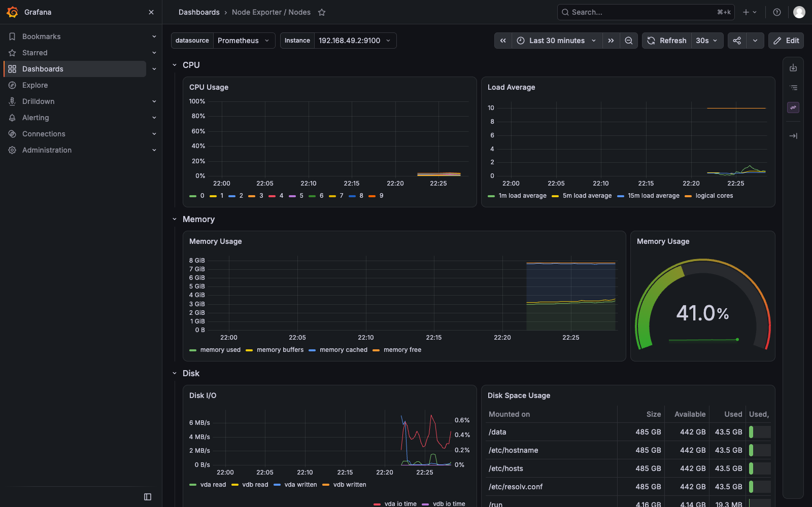

### Logs

```text
# LOGS - structured JSON request logs from podinfo
$ kubectl logs -n demo deploy/podinfo --tail=3
Found 2 pods, using pod/podinfo-5f85df8bb6-7qc8l
{"level":"debug","ts":"2026-10-07T16:57:01.988Z","caller":"http/logging.go:35","msg":"request started","proto":"HTTP/1.1","uri":"/","method":"GET","remote":"10.244.0.141:46074","user-agent":"Wget"}
{"level":"debug","ts":"2026-10-07T16:57:01.990Z","caller":"http/logging.go:35","msg":"request started","proto":"HTTP/1.1","uri":"/status/500","method":"GET","remote":"10.244.0.141:46088","user-agent":"Wget"}
{"level":"debug","ts":"2026-10-07T16:57:02.199Z","caller":"http/logging.go:35","msg":"request started","proto":"HTTP/1.1","uri":"/status/500","method":"GET","remote":"10.244.0.142:42824","user-agent":"Wget"}
$ kubectl logs -n demo -l app=podinfo --prefix --since=1m --tail=-1 | wc -l
    1200
$ kubectl logs -n demo -l app=podinfo --since=1m --tail=-1 | grep -c '"uri":"/status/500"'
582
# LOGS - the instructor's 02-metrics-logs-traces k8s-demo
$ kubectl logs deploy/session20-demo --tail=4 --timestamps
2026-10-07T16:56:49.105006125Z Request received
2026-10-07T16:56:49.105105333Z Health check OK
2026-10-07T16:56:59.105286797Z Request received
2026-10-07T16:56:59.105333672Z Health check OK
```

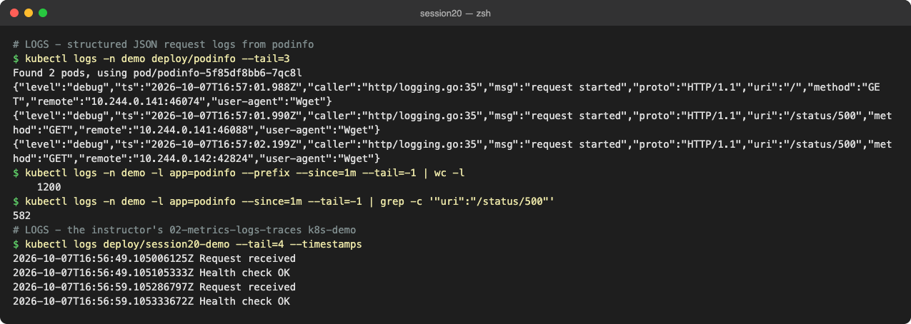

### Alerts

Three rules in [alerts.yaml](09-monitoring-demo/alerts.yaml): `PodinfoDown` (critical, `absent(up == 1)` for 30s), `PodinfoHighCPU` (> 200m for 1m), `PodinfoHighMemory` (> 100Mi for 1m). To prove the alert path end to end I scaled podinfo to 0:

```text
# ALERTS - rules loaded from 09-monitoring-demo/alerts.yaml
$ kubectl get prometheusrule -n demo podinfo-alerts -o jsonpath='{range .spec.groups[0].rules[*]}{.alert}: {.expr}{"\n"}{end}'
PodinfoDown: absent(up{job="podinfo", namespace="demo"} == 1)
PodinfoHighCPU: sum(rate(container_cpu_usage_seconds_total{namespace="demo", container="podinfo"}[2m])) by (pod) > 0.2
PodinfoHighMemory: max(container_memory_working_set_bytes{namespace="demo", container="podinfo"}) by (pod) > 100 * 1024 * 1024
$ kubectl scale deployment podinfo -n demo --replicas=0
deployment.apps/podinfo scaled
$ watch alert state (Prometheus /api/v1/alerts), every 15s
--- t+15s
Watchdog         firing   severity=none  since=2026-10-07T16:51:40
--- t+30s
Watchdog         firing   severity=none  since=2026-10-07T16:51:40
--- t+45s
PodinfoDown      pending  severity=critical  since=2026-10-07T17:01:32
Watchdog         firing   severity=none  since=2026-10-07T16:51:40
--- t+60s
Watchdog         firing   severity=none  since=2026-10-07T16:51:40
PodinfoDown      pending  severity=critical  since=2026-10-07T17:01:32
--- t+75s
Watchdog         firing   severity=none  since=2026-10-07T16:51:40
PodinfoDown      firing   severity=critical  since=2026-10-07T17:01:32
$ curl -s localhost:9093/api/v2/alerts | jq -r '.[] | "\(.labels.alertname)  \(.status.state)  \(.annotations.summary // "")"'
PodinfoDown  active  podinfo has no healthy scrape targets
NodeClockNotSynchronising  active  Clock not synchronising.
Watchdog  active  An alert that should always be firing to certify that Alertmanager is working properly.
```

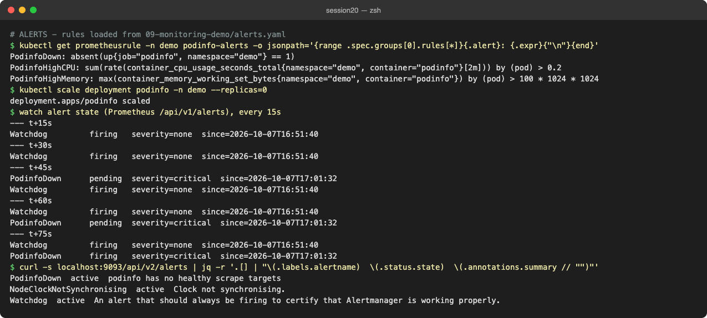

Prometheus: rule `PodinfoDown` firing.

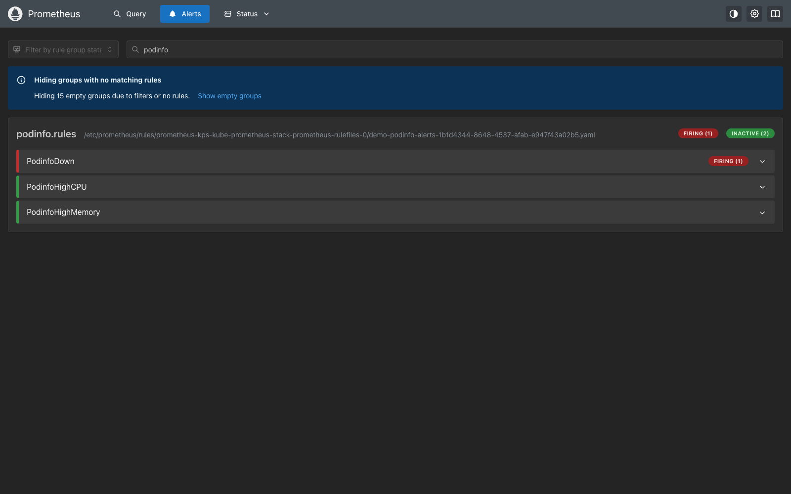

Alertmanager received it (with the always-on `Watchdog` heartbeat and a `NodeClockNotSynchronising` warning from the minikube VM clock):

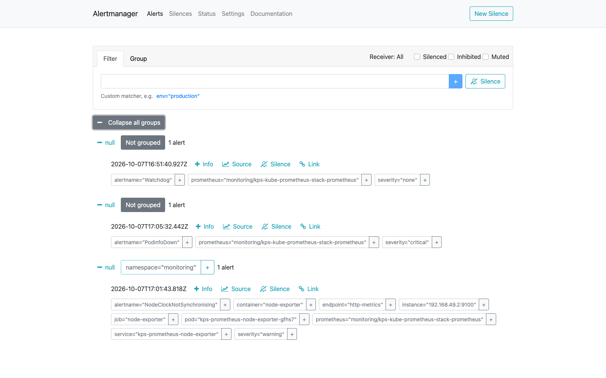

The dashboard during the outage: healthy targets 0, request and CPU graphs drop away:

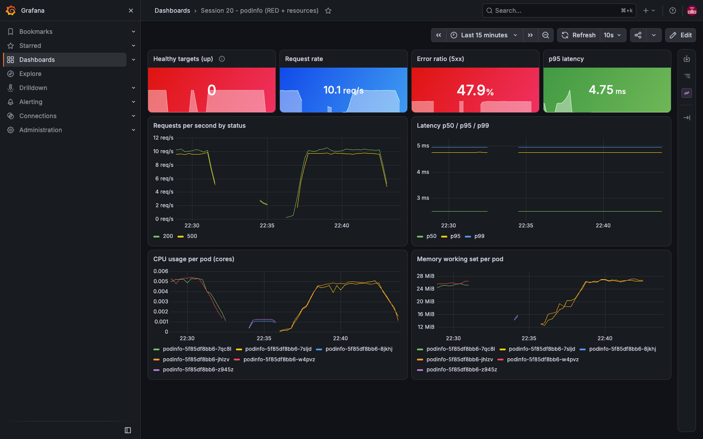

Recovery: scaled back to 2, alert resolved by itself.

```text
$ kubectl scale deployment podinfo -n demo --replicas=2 && kubectl rollout status deployment/podinfo -n demo
deployment.apps/podinfo scaled
Waiting for deployment "podinfo" rollout to finish: 0 of 2 updated replicas are available...
Waiting for deployment "podinfo" rollout to finish: 1 of 2 updated replicas are available...
deployment "podinfo" successfully rolled out
$ alert state after recovery
Watchdog         firing   severity=none  since=2026-10-07T16:51:40
$ promq 'up{namespace="demo"}'
{container="podinfo",job="podinfo",namespace="demo",pod="podinfo-5f85df8bb6-8jkhj"}  1
{container="podinfo",job="podinfo",namespace="demo",pod="podinfo-5f85df8bb6-z945z"}  1
```

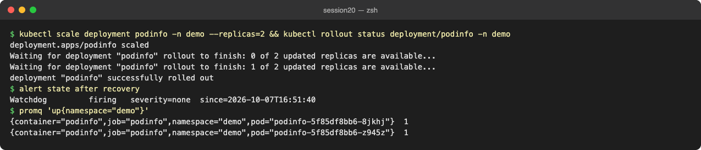

**Lesson from this run:** my first version of the "Healthy targets" stat used `sum(up{...})`. When all pods are gone the `up` series disappears, and Grafana's *last not null* kept showing **2** during the outage. Fixed with `sum(up{...}) or vector(0)` and the *last* reducer. The request-rate and error-ratio stats show the same stale-value effect in the outage screenshot. An absent series is not a zero, and dashboards and alerts both have to handle it (that is why the alert uses `absent()`).

---

## Task 2: Observability

**→ [observability/README.md](observability/README.md)**: the three pillars (metrics, logs, traces) with examples, how they correlate, why observability is needed, a tools table, Kubernetes observability (metrics-server vs Prometheus, kube-state-metrics, node-exporter, cAdvisor, log collection, OpenTelemetry), RED/USE/golden signals and a PromQL cheat sheet, plus a section mapping each pillar to what I collected above.

---

## Task 3: GitOps

Concepts (what GitOps is, Git as source of truth, declarative vs imperative, continuous reconciliation, the workflow, Argo CD vs Flux, best practices): **[gitops/README.md](gitops/README.md)**.

### Demo setup

Argo CD needs a Git remote it can pull from. Since this repository is not pushed yet, I ran **Gitea** inside the cluster ([10-gitops-demo/gitea.yaml](10-gitops-demo/gitea.yaml)) as the Git server, pushed the mini project's manifests to it, and pointed an Argo CD Application at it.

```text
 me ── git commit / push ──► Gitea repo  pranay/session20-gitops  (app/namespace, deployment, service)
                                   ▲
                                   │ pull (poll ~3 min, or refresh/webhook)
                              Argo CD (argocd ns) ── compares desired (Git) vs live ──► sync / self-heal / prune
                                   │
                                   ▼
                            namespace session20: Deployment session20-mini (2 replicas) + Service
```

| File | Purpose |
| :--- | :--- |
| [10-gitops-demo/gitops-repo/app/](10-gitops-demo/gitops-repo/app/) | the desired state (copied from [08-mini-project/app/](08-mini-project/app/)); final state after the demo = initial state |
| [10-gitops-demo/argocd/application-local.yaml](10-gitops-demo/argocd/application-local.yaml) | Application → in-cluster Gitea, `automated: {prune: true, selfHeal: true}` |
| [10-gitops-demo/argocd/application-github.yaml](10-gitops-demo/argocd/application-github.yaml) | the same Application pointed at this repo on GitHub, for after the push |

The Application file sits outside the watched `app/` path, as the mini-project README asks. (The instructor's `08-mini-project/app/` folder itself contains `argocd-application.yaml`, which would make Argo CD try to manage its own Application if that folder were used as the source path.)

### 1. Git → cluster (initial sync)

```text
# Git is the source of truth: commit the desired state and push it to the Git server
$ git add . && git commit -q -m 'session20-mini: namespace, deployment (2 replicas), service' && git log --oneline
24f37d6 session20-mini: namespace, deployment (2 replicas), service
$ git push -q origin main 2>&1 | grep -v '^remote:' ; git ls-remote origin main | cut -c1-12
24f37d65cb66
# Register the Application with Argo CD (applied from the admin side, outside the watched app/ path)
$ kubectl apply -f /Users/pranayreddyn/devops-heros/session20-monitoring-observability-gitops/10-gitops-demo/argocd/application-local.yaml
application.argoproj.io/session20-mini created
$ kubectl -n argocd get applications
NAME             SYNC STATUS   HEALTH STATUS
session20-mini   Synced        Healthy
$ argocd app get session20-mini --grpc-web | sed -n '1,4p;/^Sync Policy/,$p'
Name:               argocd/session20-mini
Project:            default
Server:             https://kubernetes.default.svc
Namespace:          session20
Sync Policy:        Automated (Prune)
Sync Status:        Synced to main (24f37d6)
Health Status:      Healthy

GROUP  KIND        NAMESPACE  NAME            STATUS  HEALTH   HOOK  MESSAGE
       Service     session20  session20-mini  Synced  Healthy        service/session20-mini unchanged
apps   Deployment  session20  session20-mini  Synced  Healthy        deployment.apps/session20-mini unchanged
       Namespace              session20       Synced                 
$ kubectl get all -n session20
NAME                                  READY   STATUS    RESTARTS   AGE
pod/session20-mini-68946db7dd-cb2lb   1/1     Running   0          17s
pod/session20-mini-68946db7dd-jt7tm   1/1     Running   0          17s

NAME                     TYPE        CLUSTER-IP      EXTERNAL-IP   PORT(S)   AGE
service/session20-mini   ClusterIP   10.108.65.111   <none>        80/TCP    17s

NAME                             READY   UP-TO-DATE   AVAILABLE   AGE
deployment.apps/session20-mini   2/2     2            2           17s

NAME                                        DESIRED   CURRENT   READY   AGE
replicaset.apps/session20-mini-68946db7dd   2         2         2       17s
```

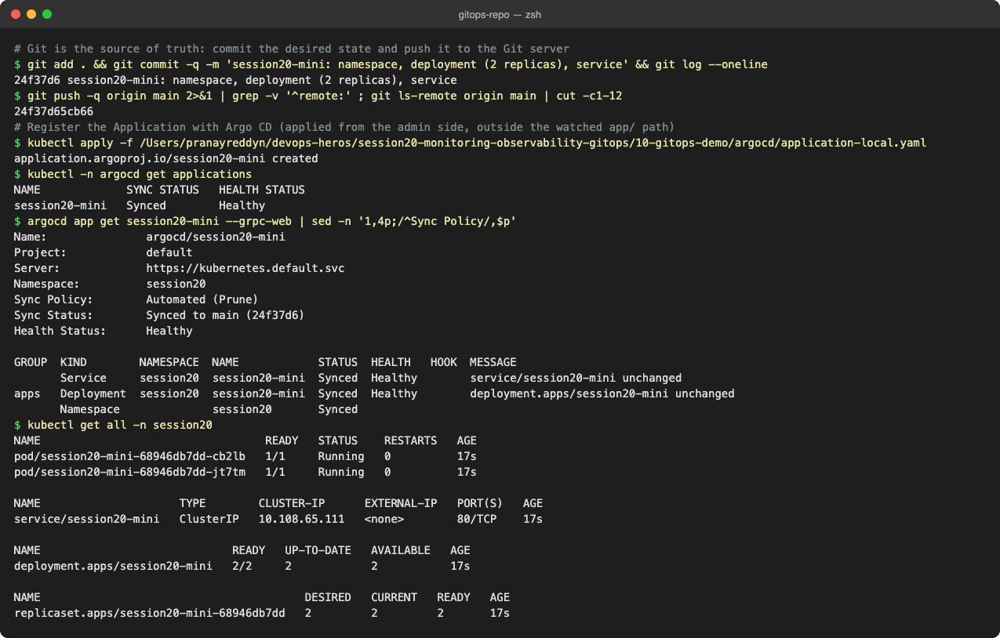

### 2. Continuous reconciliation: self-heal

```text
# DRIFT 1: someone scales the Deployment by hand (Git says replicas: 2)
$ kubectl scale deployment session20-mini -n session20 --replicas=5
deployment.apps/session20-mini scaled
$ while true; do kubectl get deploy session20-mini -n session20 -o jsonpath='{.spec.replicas}'; sleep 0.3; done
 0.0s  spec.replicas=5
 0.4s  spec.replicas=2
 0.8s  spec.replicas=2
 1.1s  spec.replicas=2
 1.5s  spec.replicas=2
 1.9s  spec.replicas=2
 2.3s  spec.replicas=2
 2.6s  spec.replicas=2
 3.0s  spec.replicas=2
 3.4s  spec.replicas=2
 3.8s  spec.replicas=2
 4.2s  spec.replicas=2
# DRIFT 2: someone deletes the Service
$ kubectl delete service session20-mini -n session20
service "session20-mini" deleted from session20 namespace
$ kubectl get service session20-mini -n session20
Error from server (NotFound): services "session20-mini" not found
$ kubectl -n argocd get application session20-mini -o jsonpath='{.spec.syncPolicy}{"\n"}'
{"automated":{"prune":true,"selfHeal":true},"syncOptions":["CreateNamespace=true"]}
$ kubectl get events -n argocd --field-selector involvedObject.name=session20-mini --sort-by=.lastTimestamp | tail -6 | cut -c1-200
11s         Normal   ResourceUpdated      application/session20-mini   Updated sync status: Synced -> OutOfSync
11s         Normal   ResourceUpdated      application/session20-mini   Updated health status: Healthy -> Progressing
11s         Normal   OperationCompleted   application/session20-mini   Partial sync operation to 24f37d65cb66401152751e85da0694e18903f617 succeeded
11s         Normal   ResourceUpdated      application/session20-mini   Updated sync status: OutOfSync -> Synced
10s         Normal   ResourceUpdated      application/session20-mini   Updated health status: Progressing -> Healthy
6s          Normal   ResourceUpdated      application/session20-mini   Updated sync status: Synced -> OutOfSync
# not back yet at +6s: Argo CD waits between consecutive self-heals (self-heal back-off). Re-checking:
$ kubectl get service session20-mini -n session20
NAME             TYPE        CLUSTER-IP      EXTERNAL-IP   PORT(S)   AGE
session20-mini   ClusterIP   10.106.18.178   <none>        80/TCP    1s
# Service recreated from Git ~40s after it was deleted
$ kubectl -n argocd get application session20-mini
NAME             SYNC STATUS   HEALTH STATUS
session20-mini   Synced        Healthy
```

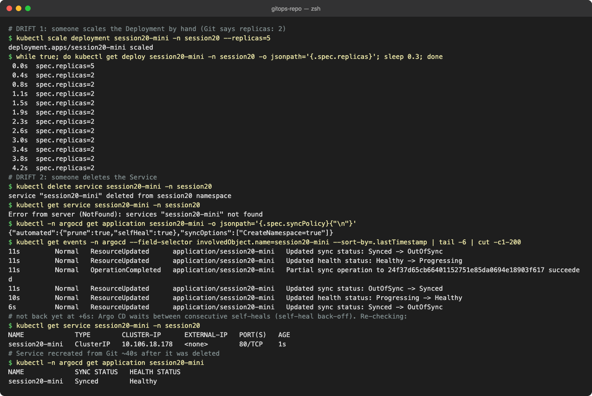

### 3. Change through Git

```text
# CHANGE THROUGH GIT: scale to 3 replicas by editing the manifest, not with kubectl
$ sed -i '' 's/replicas: 2/replicas: 3/' app/deployment.yaml && git diff --stat && git diff | grep '^[-+] '
 app/deployment.yaml | 2 +-
 1 file changed, 1 insertion(+), 1 deletion(-)
-  replicas: 2
+  replicas: 3
$ git commit -qam 'scale session20-mini to 3 replicas' && git push -q origin main 2>&1 | grep -v '^remote:'; git log --oneline -2
bdddd5d scale session20-mini to 3 replicas
24f37d6 session20-mini: namespace, deployment (2 replicas), service
# Argo CD polls Git every ~3 min; a webhook or a refresh makes it look now:
$ argocd app get session20-mini --refresh --grpc-web | grep -E 'Sync Status|Health Status'
Sync Status:        OutOfSync from main (bdddd5d)
Health Status:      Healthy
$ kubectl -n argocd get application session20-mini -o jsonpath='{.status.sync.status} {.status.health.status} revision={.status.sync.revision}{"\n"}' | cut -c1-60
Synced Healthy revision=bdddd5d1e65e400e1b2102962c32522900d5
$ kubectl get deploy,pods -n session20
NAME                             READY   UP-TO-DATE   AVAILABLE   AGE
deployment.apps/session20-mini   3/3     3            3           2m17s

NAME                                  READY   STATUS    RESTARTS   AGE
pod/session20-mini-68946db7dd-cb2lb   1/1     Running   0          2m17s
pod/session20-mini-68946db7dd-dr7b5   1/1     Running   0          2s
pod/session20-mini-68946db7dd-jt7tm   1/1     Running   0          2m17s
```

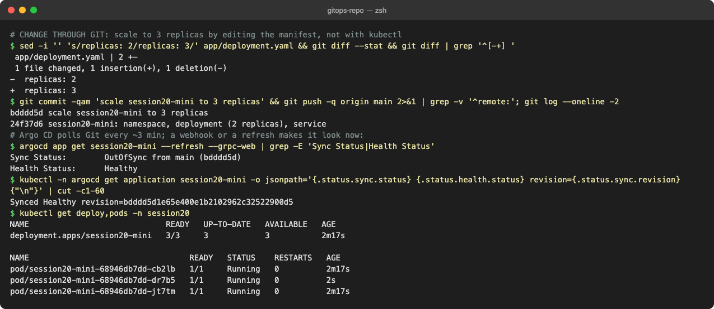

### 4. Prune and rollback with `git revert`

```text
# PRUNE: app/service.yaml was deleted in Git (commit a93f2c4) -> Argo CD deleted the Service
$ git log --oneline -3 && git show --stat --format=%s HEAD | tail -2
a93f2c4 remove service
bdddd5d scale session20-mini to 3 replicas
24f37d6 session20-mini: namespace, deployment (2 replicas), service
 app/service.yaml | 11 -----------
 1 file changed, 11 deletions(-)
$ kubectl get deploy,svc -n session20
NAME                             READY   UP-TO-DATE   AVAILABLE   AGE
deployment.apps/session20-mini   3/3     3            3           2m36s
# ROLLBACK = git revert (history is kept; Argo CD syncs the reverted state)
$ git revert --no-edit HEAD >/dev/null && git push -q origin main 2>&1 | grep -v '^remote:'; git log --oneline -1
d500930 Revert "remove service"
$ kubectl get svc -n session20
NAME             TYPE        CLUSTER-IP       EXTERNAL-IP   PORT(S)   AGE
session20-mini   ClusterIP   10.100.149.244   <none>        80/TCP    2s
$ git revert --no-edit bdddd5d >/dev/null && git push -q origin main 2>&1 | grep -v '^remote:'; git log --oneline
4b6d048 Revert "scale session20-mini to 3 replicas"
d500930 Revert "remove service"
a93f2c4 remove service
bdddd5d scale session20-mini to 3 replicas
24f37d6 session20-mini: namespace, deployment (2 replicas), service
$ grep replicas app/deployment.yaml; kubectl get deploy session20-mini -n session20
  replicas: 2
NAME             READY   UP-TO-DATE   AVAILABLE   AGE
session20-mini   2/2     2            2           2m41s
$ argocd app history session20-mini --grpc-web
SOURCE  http://gitea-http.gitea.svc:3000/pranay/session20-gitops.git
ID      DATE                           REVISION
0       2026-10-07 22:38:29 +0530 IST  main (24f37d6)
1       2026-10-07 22:40:44 +0530 IST  main (bdddd5d)
2       2026-10-07 22:40:48 +0530 IST  main (a93f2c4)
3       2026-10-07 22:41:06 +0530 IST  main (d500930)
4       2026-10-07 22:41:08 +0530 IST  main (4b6d048)
$ kubectl -n argocd get application session20-mini
NAME             SYNC STATUS   HEALTH STATUS
session20-mini   Synced        Healthy
```

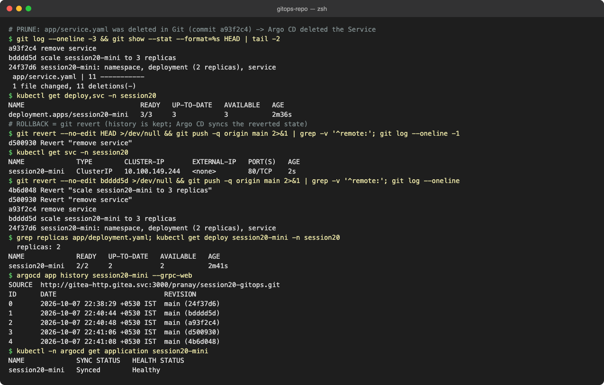

### Argo CD and Gitea UIs

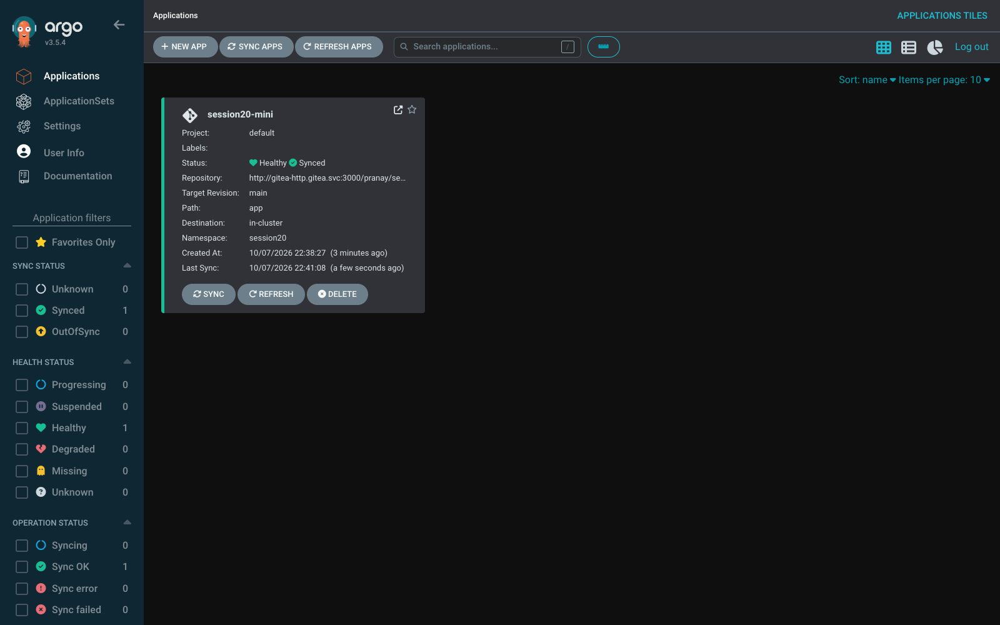

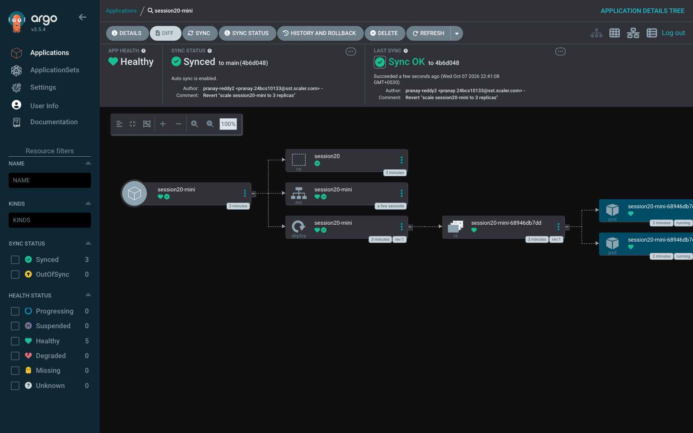

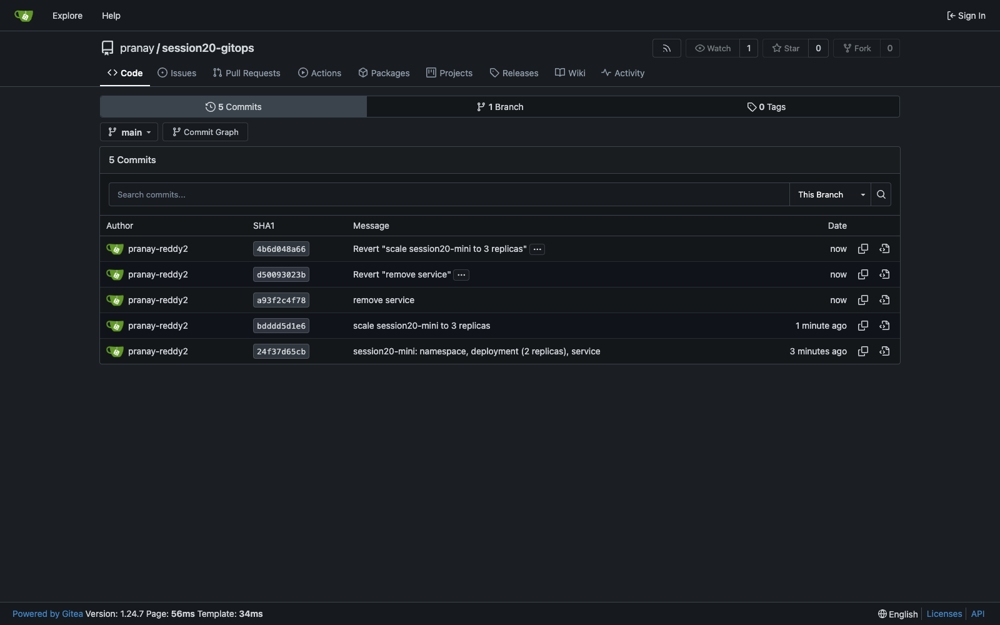

Every cluster change in this demo is a commit with an author and a message, and the Argo CD history maps each sync to a commit SHA. That audit trail is the main argument for GitOps.

### Observations

- **Self-heal is fast for edits but backs off for repeats:** the manual scale was reverted in under 0.4 s, but the deleted Service came back after ~40 s because Argo CD throttles consecutive self-heal syncs.
- **Polling vs push:** Argo CD polls Git every ~3 minutes by default; I used `argocd app get --refresh` (what a Git webhook does) to make it look immediately.
- **Rollback is a commit:** `git revert` keeps history and Argo CD treats it like any other change; `argocd app rollback` also exists but is disabled while auto-sync is on, because Git is the source of truth.

## Cleanup

```bash
kubectl delete -f 10-gitops-demo/argocd/application-local.yaml   # prune removes the app
kubectl delete ns session20 gitea argocd demo
helm uninstall kps -n monitoring && kubectl delete ns monitoring
```
