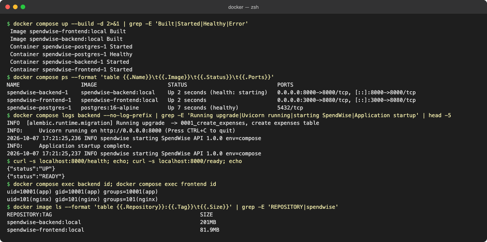
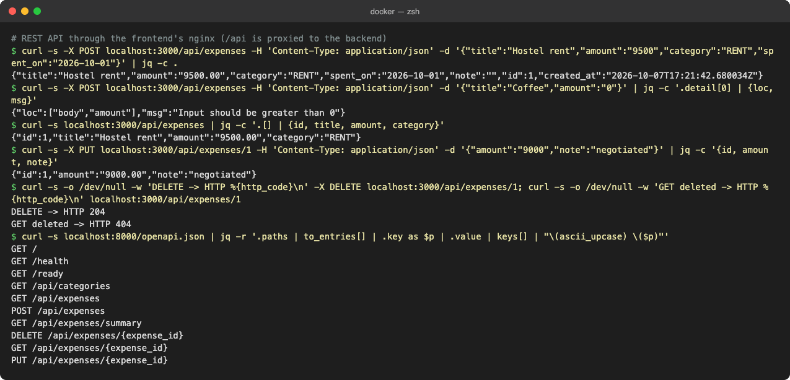
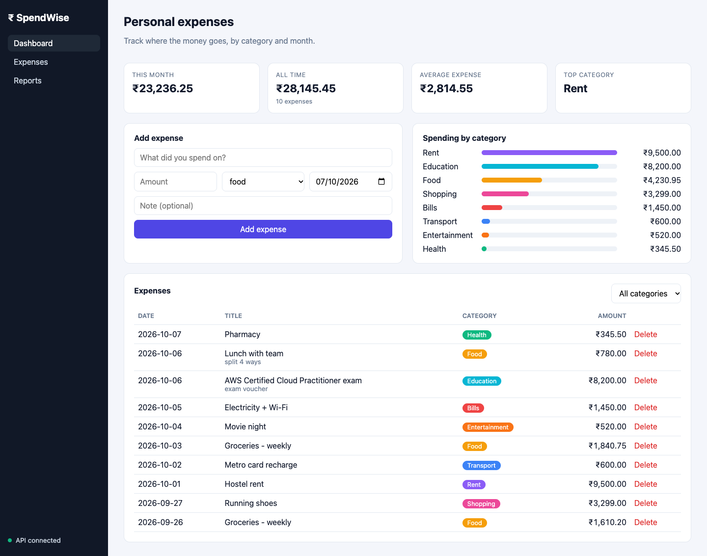
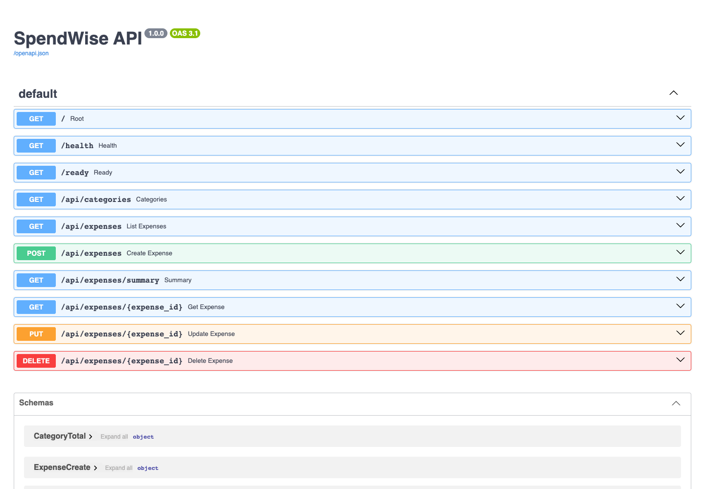
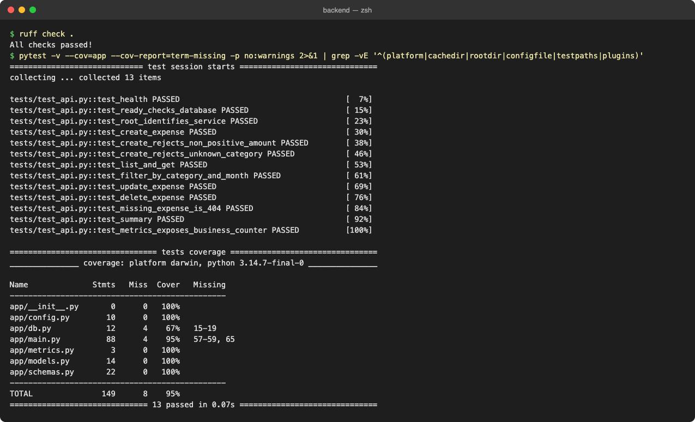

# Session 21 – SpendWise: Full-Stack App with Docker Compose

SpendWise is an expense tracker made of three containers:

| Service | Tech | Port |
|---|---|---|
| `frontend` | React 19 + Vite, served by nginx (non-root) | `3000 -> 8080` |
| `backend` | FastAPI + SQLAlchemy + Alembic | `8000` |
| `postgres` | PostgreSQL 16 (healthcheck, named volume) | `5432` (internal) |

```
Browser -> frontend (nginx :8080) --/api--> backend (FastAPI :8000) --> postgres (:5432)
```

## Project structure

```
final-devops-project/
├── application/
│   ├── backend/      # FastAPI app, Dockerfile, alembic migrations, pytest tests
│   └── frontend/     # React app, multi-stage Dockerfile, nginx.conf.template
├── docker/
│   ├── docker-compose.yml
│   └── .env.example
└── screenshots/
```

## Run it

```bash
cd docker
cp .env.example .env          # set POSTGRES_PASSWORD
docker compose up -d --build
docker compose ps
```

- Frontend: http://localhost:3000
- Backend API docs: http://localhost:8000/docs

## 1. `docker compose up -d --build`

All three containers are built and started. Postgres becomes healthy before the backend starts.



## 2. Backend API tests (CRUD with curl)

Testing `/health` and creating, listing, updating and deleting expenses through the API:

```bash
curl -s localhost:8000/health
curl -s -X POST localhost:8000/api/expenses -H 'Content-Type: application/json' \
  -d '{"title":"Lunch","amount":250,"category":"FOOD"}'
curl -s localhost:8000/api/expenses
curl -s localhost:8000/api/expenses/summary
```



## 3. Application in the browser

The frontend talks to the backend through nginx and shows data stored in PostgreSQL.



## 4. API documentation (Swagger)



## 5. Unit tests (pytest)

```bash
cd application/backend
pip install -r requirements-dev.txt
pytest -v
```



## Cleanup

```bash
cd docker
docker compose down        # add -v to also delete the database volume
```
