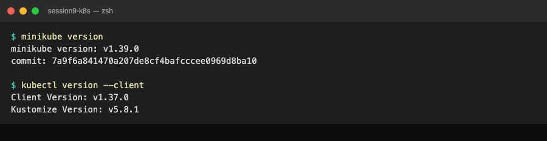
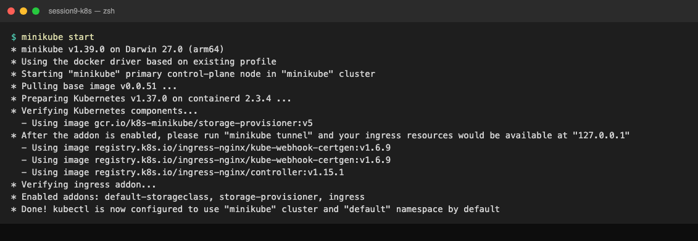
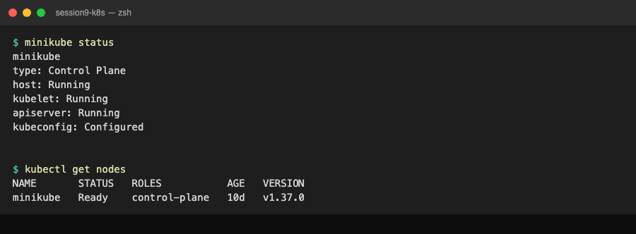
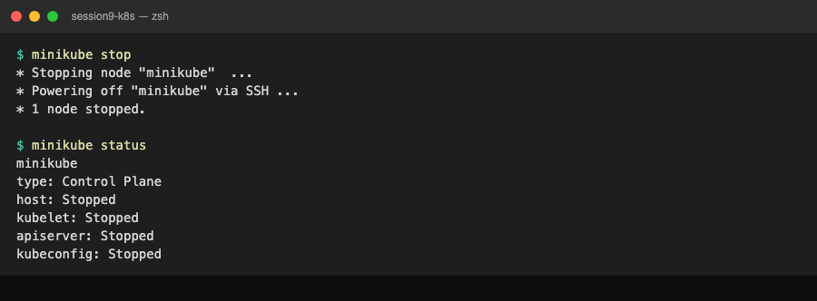

# Session 9: Kubernetes Fundamentals & Cluster Architecture

**Author:** Pranay Reddy
**Course:** SST DevOps & Cloud [SWE]
**Session:** 09 - Kubernetes Fundamentals
**Repository:** devops-heros / session9-k8s
**Environment:** macOS (Apple Silicon, arm64), Docker Desktop, minikube v1.39.0, Kubernetes v1.37.0

## Resources
- https://kubernetes.io/docs/tutorials/kubernetes-basics/
- https://minikube.sigs.k8s.io/docs/start/?arch=%2Fmacos%2Farm64%2Fstable%2Fbinary+download
- https://kubernetes.io/docs/concepts/architecture/
- https://github.com/Nency-Ravaliya/Kubernetes

---

## Task 1: Minikube & CLI Installation Verification

Verify that Minikube and the Kubernetes CLI (`kubectl`) are installed on the local system.

**Install (Homebrew):**
```bash
brew install minikube kubectl
```

**Commands:**
```bash
minikube version
kubectl version --client
```

**Output:**
```text
$ minikube version
minikube version: v1.39.0
commit: 7a9f6a841470a207de8cf4bafcccee0969d8ba10

$ kubectl version --client
Client Version: v1.37.0
Kustomize Version: v5.8.1
```

**Screenshot:**



---

## Task 2: Starting the Minikube Kubernetes Cluster

Start the local single-node Kubernetes cluster. Docker Desktop must be running first, because minikube uses the docker driver and runs the whole node as one container.

**Command:**
```bash
minikube start
```

**Output:**
```text
$ minikube start
* minikube v1.39.0 on Darwin 27.0 (arm64)
* Using the docker driver based on existing profile
* Starting "minikube" primary control-plane node in "minikube" cluster
* Pulling base image v0.0.51 ...
* Preparing Kubernetes v1.37.0 on containerd 2.3.4 ...
* Verifying Kubernetes components...
  - Using image gcr.io/k8s-minikube/storage-provisioner:v5
* After the addon is enabled, please run "minikube tunnel" and your ingress resources would be available at "127.0.0.1"
  - Using image registry.k8s.io/ingress-nginx/kube-webhook-certgen:v1.6.9
  - Using image registry.k8s.io/ingress-nginx/kube-webhook-certgen:v1.6.9
  - Using image registry.k8s.io/ingress-nginx/controller:v1.15.1
* Verifying ingress addon...
* Enabled addons: default-storageclass, storage-provisioner, ingress
* Done! kubectl is now configured to use "minikube" cluster and "default" namespace by default
```

Notes: `Using the docker driver based on existing profile` means the cluster already existed and was resumed, so no certificates or control plane were regenerated. The `ingress` addon is listed because a later session enabled it; a fresh cluster only shows `default-storageclass, storage-provisioner`.

**Screenshot:**



---

## Task 3: Verifying Cluster Status & Node Health

Check that the host, kubelet and API server are running and that the node is `Ready`.

**Commands:**
```bash
minikube status
kubectl get nodes
kubectl get nodes -o wide
```

**Output:**
```text
$ minikube status
minikube
type: Control Plane
host: Running
kubelet: Running
apiserver: Running
kubeconfig: Configured


$ kubectl get nodes
NAME       STATUS   ROLES           AGE   VERSION
minikube   Ready    control-plane   10d   v1.37.0

$ kubectl get nodes -o wide
NAME       STATUS   ROLES           AGE   VERSION   INTERNAL-IP    EXTERNAL-IP   OS-IMAGE                         KERNEL-VERSION            CONTAINER-RUNTIME
minikube   Ready    control-plane   10d   v1.37.0   192.168.49.2   <none>        Debian GNU/Linux 12 (bookworm)   7.0.12-linuxkit (arm64)   containerd://2.3.4
```

Notes: one node plays both control-plane and worker. `INTERNAL-IP 192.168.49.2` sits on a Docker bridge network that macOS cannot route to; this matters in sessions 10 and 11 when reaching NodePorts.

**Screenshot:**



---

## Task 4: Stopping the Minikube Cluster

Power down the cluster to release CPU and memory. State is kept on disk, so the next `minikube start` resumes it.

**Command:**
```bash
minikube stop
minikube status
```

**Output:**
```text
$ minikube stop
* Stopping node "minikube"  ...
* Powering off "minikube" via SSH ...
* 1 node stopped.

$ minikube status
minikube
type: Control Plane
host: Stopped
kubelet: Stopped
apiserver: Stopped
kubeconfig: Stopped
```

**Screenshot:**



---

## Bonus: First Pod and Service (kubernetes-basics tutorial)

Run a pod with `kubectl run`, expose it as a NodePort, and hit it from inside the node.

```text
$ kubectl run hello-minikube --image=kicbase/echo-server:1.0
pod/hello-minikube created

$ kubectl expose pod hello-minikube --type=NodePort --port=8080
service/hello-minikube exposed

$ kubectl get pod,svc hello-minikube
NAME                 READY   STATUS    RESTARTS   AGE
pod/hello-minikube   1/1     Running   0          15s

NAME                     TYPE       CLUSTER-IP       EXTERNAL-IP   PORT(S)          AGE
service/hello-minikube   NodePort   10.104.178.169   <none>        8080:30270/TCP   15s

$ kubectl describe pod hello-minikube | grep -E 'Node:|IP:|Image:|Status:'
Node:             minikube/192.168.49.2
Status:           Running
IP:               10.244.0.113
  IP:  10.244.0.113
    Image:          kicbase/echo-server:1.0

$ kubectl logs hello-minikube
Echo server listening on port 8080.

$ minikube ssh -- curl -s http://localhost:$(kubectl get svc hello-minikube -o jsonpath='{.spec.ports[0].nodePort}')/hello | head -8
Request served by hello-minikube

HTTP/1.1 GET /hello

Host: localhost:30270
Accept: */*
User-Agent: curl/7.88.1

$ kubectl delete pod,svc hello-minikube
pod "hello-minikube" deleted from default namespace
service "hello-minikube" deleted from default namespace
```

Notes: `8080:30270/TCP` reads `port:nodePort`. The pod IP (`10.244.x.x`) and the Service ClusterIP (`10.104.x.x`) are different internal ranges. On macOS with the docker driver, reach the NodePort with `minikube service hello-minikube --url` or from inside the node with `minikube ssh`.

---

## Task 5: Kubernetes Cluster Architecture & Component Analysis

Source: https://kubernetes.io/docs/concepts/architecture/

```text
+-------------------------------------------------------------------------------+
|                               CONTROL PLANE (MASTER)                          |
|   +-------------------+       +--------------------+       +--------------+   |
|   |       etcd        |<----->|  kube-apiserver    |<----->|kube-scheduler|   |
|   | (State Database)  |       |    (Front Door)    |       +--------------+   |
|   +-------------------+       +---------+----------+                          |
|                                         |                                     |
|                             +-----------v------------+                        |
|                             | kube-controller-manager|                        |
|                             +------------------------+                        |
+-----------------------------------------+-------------------------------------+
                                          |
                        +-----------------+-----------------+
                        v                                   v
+------------------------------------+ +------------------------------------+
|          WORKER NODE 1             | |          WORKER NODE 2             |
|   +------------+  +------------+   | |   +------------+  +------------+   |
|   |  kubelet   |  | kube-proxy |   | |   |  kubelet   |  | kube-proxy |   |
|   +-----+------+  +-----+------+   | |   +-----+------+  +-----+------+   |
|         v               v          | |         v               v          |
|   +----------------------------+   | |   +----------------------------+   |
|   | CRI (containerd runtime)   |   | |   | CRI (containerd runtime)   |   |
|   +----------------------------+   | |   +----------------------------+   |
|   +------------+  +------------+   | |   +------------+  +------------+   |
|   |   Pod 1    |  |   Pod 2    |   | |   |   Pod 3    |  |   Pod 4    |   |
|   +------------+  +------------+   | |   +------------+  +------------+   |
+------------------------------------+ +------------------------------------+
```

In minikube all of these run as pods on the single node:
```bash
kubectl get pods -n kube-system
```
```text
NAME                               READY   STATUS    RESTARTS       AGE
coredns-559f6c778d-npzsb           1/1     Running   6 (11h ago)    10d
etcd-minikube                      1/1     Running   6 (11h ago)    10d
kindnet-96t2j                      1/1     Running   6 (11h ago)    10d
kube-apiserver-minikube            1/1     Running   6 (11h ago)    10d
kube-controller-manager-minikube   1/1     Running   6 (11h ago)    10d
kube-proxy-5ljz8                   1/1     Running   6 (11h ago)    10d
kube-scheduler-minikube            1/1     Running   6 (11h ago)    10d
storage-provisioner                1/1     Running   13 (11h ago)   10d
```

### Control Plane components

| Component | What it does | How it interacts |
| :--- | :--- | :--- |
| **kube-apiserver** | The front door. Exposes the REST API; validates and persists every object. | Everything (`kubectl`, controllers, kubelets) talks only to the API server. It is the only component that reads/writes etcd. |
| **etcd** | Distributed key-value store holding the entire cluster state (desired and observed). | Written to and read from by the API server only. Losing etcd = losing the cluster state, so it is backed up and run with 3 or 5 members in production. |
| **kube-scheduler** | Watches for pods with no `nodeName` and picks a node for each. | Reads pod resource requests, node capacity, affinity, taints/tolerations via the API server, then writes the chosen node back. It never starts containers itself. |
| **kube-controller-manager** | Runs the reconciliation loops: node, ReplicaSet, Deployment, EndpointSlice, Job controllers, etc. | Each controller watches the API server, compares desired vs actual state, and creates/deletes objects to close the gap (a ReplicaSet with 3 desired and 2 running creates 1 pod). |
| cloud-controller-manager | Cloud-specific loops (LoadBalancer provisioning, node lifecycle, routes). | Absent in minikube, which is why `type: LoadBalancer` stays `<pending>` without `minikube tunnel`. |

### Worker Node components

| Component | What it does | How it interacts |
| :--- | :--- | :--- |
| **kubelet** | Node agent. Makes sure the containers described in each PodSpec assigned to its node are running and healthy. | Watches the API server for pods bound to its node, tells the container runtime (via CRI) to pull images and start containers, runs liveness/readiness/startup probes, and reports pod and node status back. |
| **kube-proxy** | Implements Services on each node with iptables/IPVS rules. | Watches Services and EndpointSlices and rewrites packets sent to a ClusterIP or NodePort so they land on a backend pod IP. In minikube it is a DaemonSet pod (`kube-proxy-5ljz8`). |
| **Container runtime (CRI)** | Actually runs containers. minikube here uses `containerd 2.3.4`. | kubelet calls it over the CRI gRPC API. Docker Engine is no longer used directly by Kubernetes (dockershim was removed in 1.24). |
| **CNI plugin** (`kindnet` in minikube) | Gives every pod an IP and wires pod-to-pod networking across nodes. | Called by the runtime when a pod's network namespace is created. |
| **Pod** | Smallest deployable unit: one or more containers sharing a network namespace (one IP) and volumes. | Created by controllers (or directly), scheduled by the scheduler, run by the kubelet. |

### How `kubectl apply -f deployment.yaml` flows through the cluster
1. `kubectl` POSTs the Deployment to the **API server**, which validates it and stores it in **etcd**.
2. The Deployment controller (in **kube-controller-manager**) creates a ReplicaSet; the ReplicaSet controller creates 3 Pod objects with no node assigned.
3. The **scheduler** sees 3 unscheduled pods, picks a node for each, and writes `nodeName`.
4. The **kubelet** on that node asks **containerd** to pull the image and start containers, then reports `Running`.
5. If a Service selects those pods, the EndpointSlice controller records their IPs and **kube-proxy** on every node programs the routing rules.

---

## Submission
1. Screenshots are in `session9-k8s/screenshots/`.
2. Commit:
```bash
git add session9-k8s/
git commit -m "Submit Session 9 Kubernetes fundamentals and Minikube setup"
git push origin main
```
3. Raw link of this file submitted in the Google Form.
