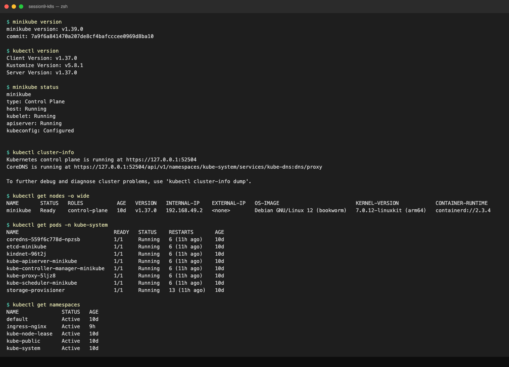
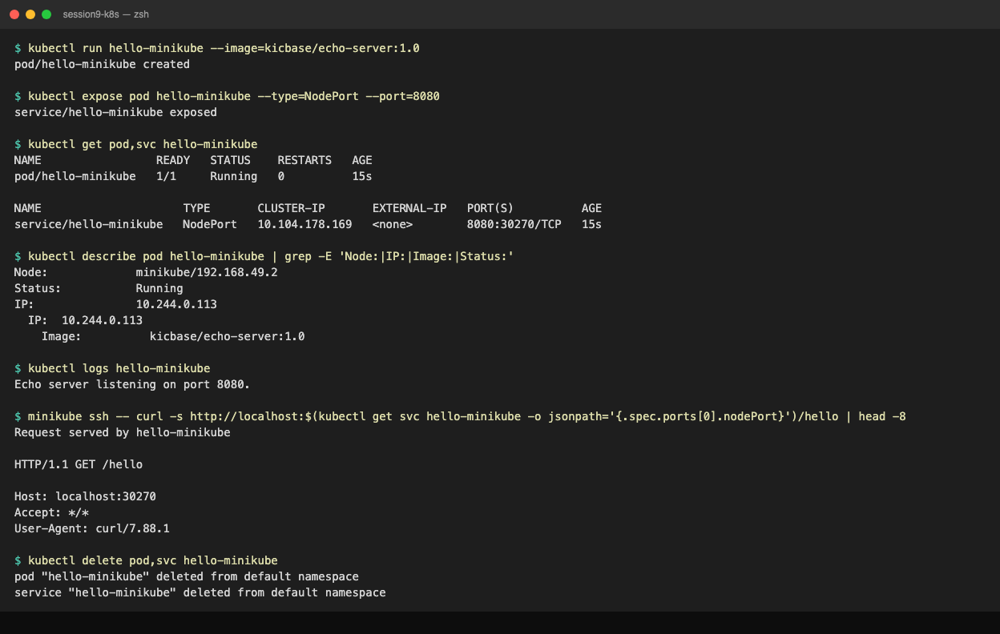

# Session 9: Kubernetes Intro and Minikube Setup

## Resources

- https://kubernetes.io/docs/tutorials/kubernetes-basics/
- https://minikube.sigs.k8s.io/docs/start/?arch=%2Fmacos%2Farm64%2Fstable%2Fbinary+download
- https://kubernetes.io/docs/concepts/architecture/
- https://github.com/Nency-Ravaliya/Kubernetes

---

## Install (macOS arm64)

```bash
brew install minikube kubectl
minikube start --driver=docker      # needs Docker Desktop running
```

---

## Lab 1: Inspect the cluster



```text
$ minikube version
minikube version: v1.39.0
commit: 7a9f6a841470a207de8cf4bafcccee0969d8ba10

$ kubectl version
Client Version: v1.37.0
Kustomize Version: v5.8.1
Server Version: v1.37.0

$ minikube status
minikube
type: Control Plane
host: Running
kubelet: Running
apiserver: Running
kubeconfig: Configured


$ kubectl cluster-info
Kubernetes control plane is running at https://127.0.0.1:52504
CoreDNS is running at https://127.0.0.1:52504/api/v1/namespaces/kube-system/services/kube-dns:dns/proxy

To further debug and diagnose cluster problems, use 'kubectl cluster-info dump'.

$ kubectl get nodes -o wide
NAME       STATUS   ROLES           AGE   VERSION   INTERNAL-IP    EXTERNAL-IP   OS-IMAGE                         KERNEL-VERSION            CONTAINER-RUNTIME
minikube   Ready    control-plane   10d   v1.37.0   192.168.49.2   <none>        Debian GNU/Linux 12 (bookworm)   7.0.12-linuxkit (arm64)   containerd://2.3.4

$ kubectl get pods -n kube-system
NAME                               READY   STATUS    RESTARTS       AGE
coredns-559f6c778d-npzsb           1/1     Running   6 (11h ago)    10d
etcd-minikube                      1/1     Running   6 (11h ago)    10d
kindnet-96t2j                      1/1     Running   6 (11h ago)    10d
kube-apiserver-minikube            1/1     Running   6 (11h ago)    10d
kube-controller-manager-minikube   1/1     Running   6 (11h ago)    10d
kube-proxy-5ljz8                   1/1     Running   6 (11h ago)    10d
kube-scheduler-minikube            1/1     Running   6 (11h ago)    10d
storage-provisioner                1/1     Running   13 (11h ago)   10d

$ kubectl get namespaces
NAME              STATUS   AGE
default           Active   10d
ingress-nginx     Active   9h
kube-node-lease   Active   10d
kube-public       Active   10d
kube-system       Active   10d
```

What to notice:
* `kubectl version` shows two versions. Client is the `kubectl` binary on your Mac, Server is the API server inside minikube. Keep them within one minor version of each other.
* `minikube status` lists the four things that must all be `Running`/`Configured` before any `kubectl` command works. If `host: Stopped`, run `minikube start`.
* `kubectl cluster-info` gives the API server URL. On the docker driver it is `127.0.0.1:<random port>`, forwarded into the minikube container.
* `kubectl get nodes -o wide` shows one node that is both control plane and worker. `INTERNAL-IP 192.168.49.2` is on a Docker bridge and is not reachable from macOS; this matters in sessions 10 and 11.
* `kubectl get pods -n kube-system` is the control plane itself running as pods: `etcd`, `kube-apiserver`, `kube-controller-manager`, `kube-scheduler`, plus `coredns` (cluster DNS), `kube-proxy` (Service routing), `kindnet` (pod networking, CNI) and `storage-provisioner` (minikube's default StorageClass).
* Every one of those pods has `RESTARTS 6`: minikube was stopped and started 6 times over 10 days, and the whole control plane restarts with it.

---

## Lab 2: First pod and service (kubernetes-basics tutorial)



```text
$ kubectl run hello-minikube --image=kicbase/echo-server:1.0
pod/hello-minikube created

$ kubectl expose pod hello-minikube --type=NodePort --port=8080
service/hello-minikube exposed

$ kubectl get pod,svc hello-minikube
NAME                 READY   STATUS    RESTARTS   AGE
pod/hello-minikube   1/1     Running   0          15s

NAME                     TYPE       CLUSTER-IP       EXTERNAL-IP   PORT(S)          AGE
service/hello-minikube   NodePort   10.104.178.169   <none>        8080:30270/TCP   15s

$ kubectl describe pod hello-minikube | grep -E 'Node:|IP:|Image:|Status:'
Node:             minikube/192.168.49.2
Status:           Running
IP:               10.244.0.113
  IP:  10.244.0.113
    Image:          kicbase/echo-server:1.0

$ kubectl logs hello-minikube
Echo server listening on port 8080.

$ minikube ssh -- curl -s http://localhost:$(kubectl get svc hello-minikube -o jsonpath='{.spec.ports[0].nodePort}')/hello | head -8
Request served by hello-minikube

HTTP/1.1 GET /hello

Host: localhost:30270
Accept: */*
User-Agent: curl/7.88.1

$ kubectl delete pod,svc hello-minikube
pod "hello-minikube" deleted from default namespace
service "hello-minikube" deleted from default namespace
```

What to notice:
* `kubectl run` creates a bare Pod (no Deployment). Fine for a test, never for a real workload.
* `kubectl expose` created a NodePort Service. `8080:30270/TCP` means port 8080 inside the cluster, port 30270 on the node.
* The pod IP `10.244.0.113` is the pod network; the Service ClusterIP `10.104.178.169` is the service network. Different ranges, both internal.
* The echo server prints the request it received, which proves the path Mac -> `minikube ssh` -> node port 30270 -> Service -> pod 8080 works end to end. On macOS with the docker driver use `minikube service hello-minikube --url` to reach it from a browser.
* `kubectl delete pod,svc hello-minikube` deletes both objects by name in one command.

---

## Lab 3: Addons

```text
$ minikube addons list | grep -E 'enabled|STATUS'
│         ADDON NAME          │ PROFILE  │   STATUS   │               MAINTAINER               │
│ default-storageclass        │ minikube │ enabled ✅ │ Kubernetes                             │
│ ingress                     │ minikube │ enabled ✅ │ Kubernetes                             │
│ storage-provisioner         │ minikube │ enabled ✅ │ minikube                               │
```
`ingress` is enabled because session 12 turned it on. A fresh minikube only has the two storage addons.

---

## Cheat sheet

```bash
minikube start / stop / delete       # lifecycle
minikube status                      # is it up?
minikube ip                          # node IP (not routable from macOS docker driver)
minikube ssh -- <cmd>                # run a command inside the node
minikube service <svc> --url         # tunnel a NodePort/LoadBalancer to localhost
minikube dashboard                   # web UI
minikube addons list / enable <name>

kubectl get nodes | pods | svc | all -A
kubectl describe <kind> <name>       # events at the bottom, read them first
kubectl logs <pod> [-c container] [-f] [--previous]
kubectl exec <pod> -- <cmd>
kubectl apply -f <file> / kubectl delete -f <file>
```
